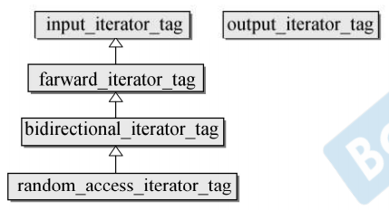
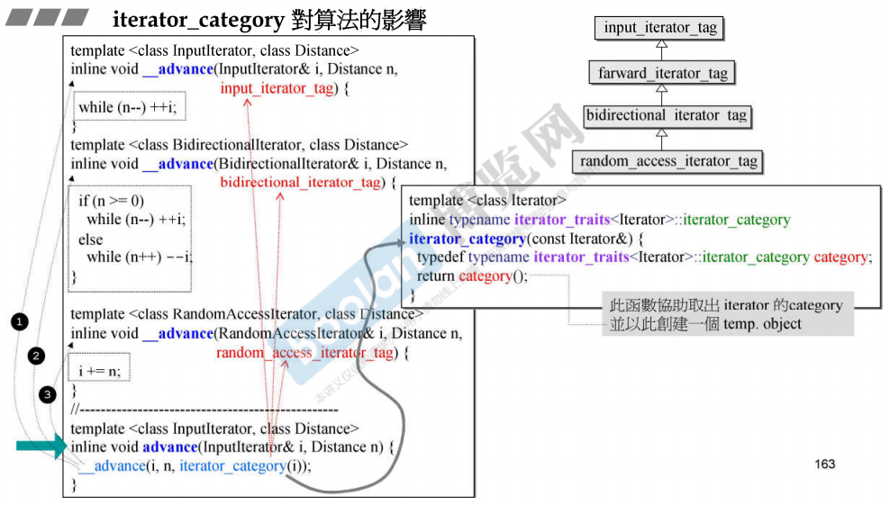
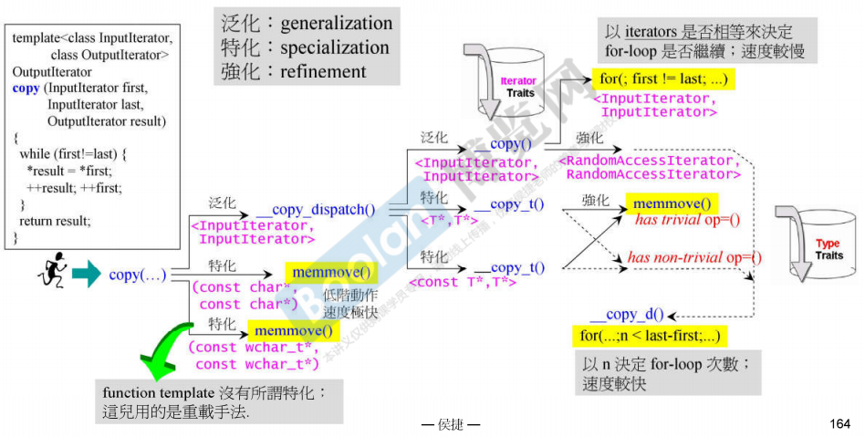
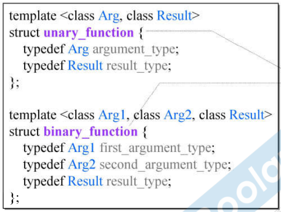
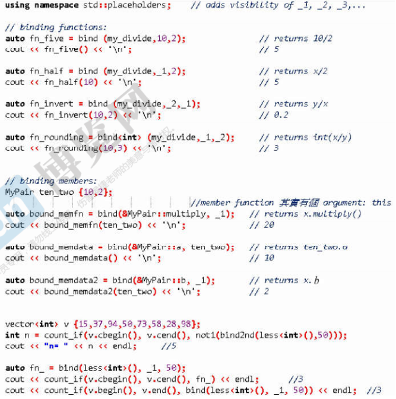

# Ch3 C++标准库的算法

- [Ch3 C++标准库的算法](#ch3-c标准库的算法)
  - [迭代器的种类](#迭代器的种类)
  - [仿函数](#仿函数)
  - [STL经典算法](#stl经典算法)
  - [适配器](#适配器)
  - [C++11的bind()](#c11的bind)

## 迭代器的种类

STL的算法是经由迭代器操作数据的, 算法对目标数据的一切信息都从迭代器取得, 因此迭代器需要回答算法所需的各种问题. 首先就是迭代器的数据访问类型, 暗示了迭代器底层容器的组织结构. 迭代器分为以下五种, 它们并非并列而是有继承关系的一组类, 左侧的输入迭代器从底往上限制条件逐渐放宽:

  

当我们自己写的迭代器属于某个类型时, 我们就让自己的迭代器继承其中某一个类. 之所以这么写是为了能利用模板参数自动重载所需的函数, 从而在编译期解决判断的问题:

```C++
// 先让模板函数自己推导迭代器类型
template <typename I>
void do_something(I iter){
    // 由于迭代器继承了某个迭代器类型, 因此萃取器可以询问迭代器类型
    typename iterator_traits<I>::iterator_category cagy;
    // 然后这个迭代器类型可以用来调用重载函数
    _do_sth(cagy);
}
```

```C++
...
// 通过给函数加入"特化"了迭代器类型的匿名参数, 程序就可以利用重载进行跳转
// 且由于迭代器类型是继承关系的类, 失配的时候还能借助上转型进行泛化的匹配
void _do_sth(input_iterator_tag){}
void _do_sth(random_access_iterator_tag){}
...
```

之所以要对迭代器进行分类, 是因为标准库算法会用上述的重载技术来按照不同的迭代器种类进行效率优化. 尽管迭代器表现出来的行为模式都大差不差, 但不同分类的迭代器实际计算的时候效率会有很大区别. 下图的`advance()`函数的代码很好表现了STL对于迭代器种类的效率适配:

  

对于`advance()`, 需要对迭代器进行n步的移动. 右边的萃取器先取出迭代器的种类, 然后用函数重载的方法对不同迭代器类型使用不同的移动策略, 其中随机访问类型可以直接用效率最高的地址移动方法, 而双向链表型则需要用循环的方式移动迭代器, 剩余的迭代器类型我们认为是单向链表型的, 无法反向移动, 这里的代码没有对负移动值进行检查有点奇怪.

这种函数重载的思路在STL的算法中非常常见, 各种算法都会进行复杂的迭代器判断, 这类分支很多发生在编译时所以不会对执行效率有太大影响. 下面是`copy()`函数的重载分支逻辑:

1. 借助模板函数的自动推导技巧和萃取器询问的`value_type`, 当发现目标迭代器元素是最简单的C风格字符串风格时, 直接调用底层的内存复制来进行字符串拷贝.
2. 当目标不是字符指针而是泛用元素的迭代器时, 再判断这个迭代器是原生指针还是真正的迭代器类. 如果是原生指针, 使用萃取器判断指针指向的元素是否有特殊的拷贝构造函数, 如果只有默认拷贝的话我们就也可以用内存复制来处理
3. 如果有特殊的拷贝构造, 我们就必须用循环逐个拷贝构造. 之前提到原生指针在萃取器中默认返回`random_access_iterator_tag`, 因此这里还可以进行优化直接计算所需的循环次数, 减少迭代器头尾求相等的比较开销.
4. 而对于更通用的迭代器类, 继续用萃取器询问`iterator_category`, `random_access_iterator_tag`则和原生指针进行一样的循环, 否则只能使用效率最低的迭代器首尾比较循环拷贝赋值的方法了.

  

## 仿函数

使用STL算法首先知道C++标准库的算法大多都以指示目标容器范围的两个迭代器开始, C标准库的算法则比较混乱. 其中C++算法有些会接受一个额外的函数操作作为参数, 这个函数操作是用来改变算法关键行为的, 例如原版的`accumulate()`中是将容器内容累加到初值上, 第二个版本变为将容器内容使用传入的操作与当前累计值进行叠加计算.

在STL算法中传入的操作除了原生的函数外, 我们可以传入所谓的仿函数(Functor; 函数对象), 也就是一个行为上类似函数的类, 这种类都重载了自己调用运算符`operator()`. 仿函数比起函数有多个好处, 一方面仿函数由于本质是一个对象, 因此可以有自己额外的状态, 数据成员, 可以进行更加复杂的操作. 另一方面仿函数可以进行继承从而可以进行模板函数重载等操作.

## STL经典算法

这些算法都在头文件`<algorithm>`内

|名称  |默认行为  |附加行为  |
|---------|---------|---------|
|accumulate     |  将容器内容累加到初值init上       |  累加操作变为函数累赋值       |
|for_each     |    无     |    对容器中每个元素执行函数     |
|replace     |    额外传入old_value和new_value, 将容器等于old_value的值替换为new_value     |    在replace_if()中    |
|count     |   传入value, 返回容器中等于value的数量      |    在count_if()中     |
|find     |    传入value, 返回容器中第一个等于value的迭代器     |    在find_if()中     |
|sort     |    要求迭代器随机访问, 将用小于号将容器元素从小到大排序     |    两个元素类似比较操作进入函数, 返回bool, true在前     |
|binary_search     |    用小于号找到第一个等于value的元素     |   改为返回bool的函数进行比较      |
|..._if     |    部分算法有     |    将等号运算符转为函数调用     |
|..._copy     |     部分算法有    |    不修改原容器, 而是复制到新的容器中并返回, 需要传入指向新保存结果的容器的迭代器     |

## 适配器

适配器是为了给STL的各个组件额外的改造, 实际上就是一种包装, 适配器的思想是来自适配器设计模式的, 通过包含而非继承目标部件, 模仿目标部件的行为对部件进行包装.

平时常用的适配器是容器适配器(stack和quene就属于对deque之类的容器的适配器), 迭代器适配器(通过操作符重载改变迭代器的行为例如重载加减改变迭代器方向的reverse_iterator和重载赋值改变迭代器拷贝操作的inserter), 还有重载取值操作符的X适配器(用ostream_iterator和istream_iterator将输入输出流与容器操作连接起来).

但STL最强大的适配器是函数适配器, 名为绑定. 核心是旧版本的`bind2nd()`和C++11的`bind()`适配器, 目的是让我们能利用适配器提前指定仿函数的一些参数的数值, 简化自动化的函数调用效果. 理解起来比较简单的`bind2nd()`是为了实现这个功能首先设计了下面这个辅助的模板函数作为接口:

```C++
// 使用模板函数作为入口是因为只有模板函数能进行模板实参推导, 核心依然是函数里的模板类
template <class Operation, class T>
inline binder2nd<Operation> bind2nd(const Operation& op, const T& x){
    // 询问仿函数其参数的类型, 这需要仿函数继承可适配接口
    // 这里额外标注typename是为了告知编译器此时不用检查Operation是否有这个成员
    typedef typename Operation::second_argument_type arg2_type;
    // 利用推导出来的类型进行模板类构造, binder2nd才是真正发生适配的地方
    // 这里用arg2_type(x)来将实际传入的参数转为适合仿函数的类型, 也算一种编译时类型检查
    return binder2nd<Operation>(op, arg2_type(x));
}
```

```C++
// 实际进行适配的模板类, 目的是让自己表现得像是绑定了第二实参后的仿函数自己
template <class Operation>
// 这里继承仿函数可适配接口unary_function是为了让适配后的自己又成为一个仿函数
// 从而可以给其它适配器进行嵌套适配, 这里选择了单个参数的unary_function
class binder2nd: public unary_function<
    typename Operation::first_argument_type, 
    typename Operation::result_type>
{
protected:
    // 适配器接收到的仿函数的本体
    Operation op;
    // 适配器接收到的要输入仿函数的额外参数
    typename Operation::second_argument_type value;
public:
    // 在构造的时候进行仿函数和参数的初始化
    binder2nd(const Operation& x, 
              const typename Operation::second_argument_type& y):
              op(x), value(y){}
    // 重载调用运算符让自己也变为一个仿函数, 返回值的类型与原先相同
    typename Operation::result_type 
        // 此时只需要接受一个实参了, 实参类型与之前相同
        operator()(const typename Operation::first_argument_type& x) const{
        // 将准备好的参数和当前接收到的参数放入准备好的仿函数中包装调用并返回
        return op(x, value);
    }
};
```

在上面这一段代码中, 可以看到适配器一直在询问仿函数的属性, 因此如果自己写的仿函数想被适配器使用, 需要继承仿函数可适配类. 所谓的可适配类是如下图的两个只有typedef而没有成员的结构体. 我们自己的仿函数在构造的时候就需要从模板类给出继承的接口的问题答案, 这样适配器才能正确处理. 显然unary_function是指行为只有一个参数的仿函数, binary_function是有两个参数的函数. 在这里有个小称呼, 没有继承可适配接口的仿函数我们称其"没有融入STL", 这是因为只有继承了可适配接口才能完整地与STL协同使用.

  

## C++11的bind()

C++11以后, 标准库推出了更好用的bind适配器. 其实现原理更复杂, 但是将原先多个适配器(例如bind1st, bind2nd)整合到一起了, 一个适配器可以实现下面四种功能, 且可以选择要绑定哪些参数, 参数顺序, 参数数量, 返回类型...非常自由.

1. 绑定原生函数
2. 绑定仿函数
3. 绑定对象的函数成员
4. 绑定对象的数据成员

下面是新版绑定的典型使用效果, 核心改进是引入了占位符(std::placeholder), 现在我们只需要在bind里将需要动态改变的参数用占位符占用, 然后可以固定的参数直接写上即可. 由于bind的机制比较复杂, 实际的类型可能写出来会很长, 所以通常与C++11引入的自动类型代号auto一同使用.

  

上图中绑定成员函数和成员数据的部分可能比较乱, 实际上就是让目标类对象本身成为了一个可变的参数(借助取地址), bind将对象的某个成员提取出来变成了接口而已.