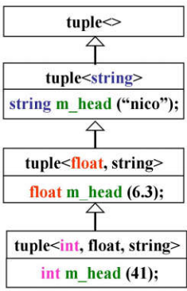
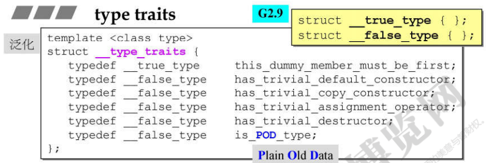
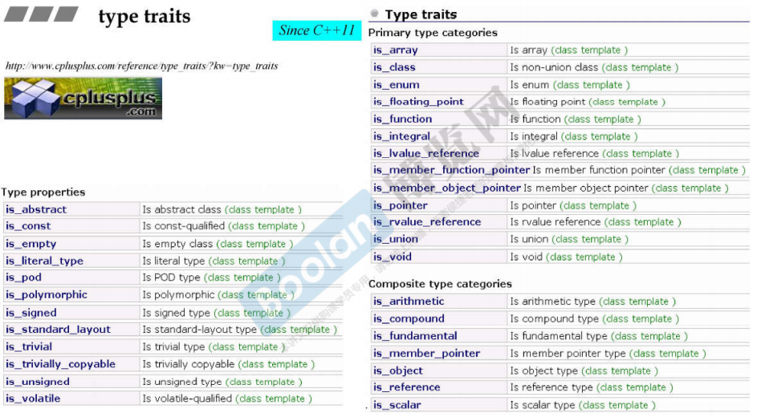
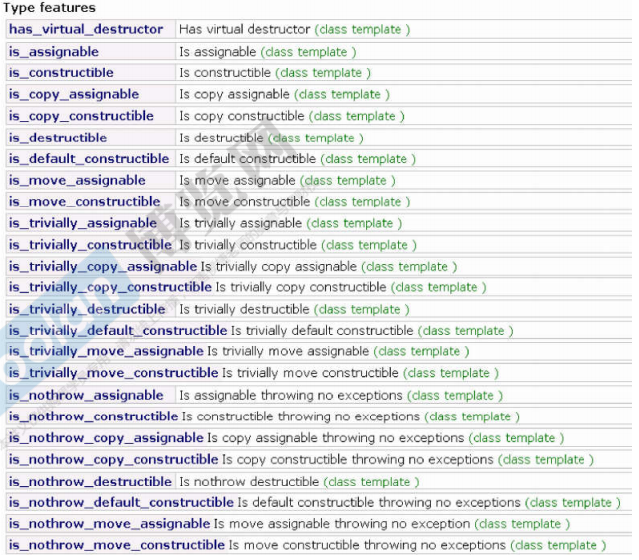
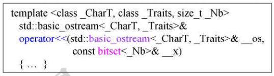
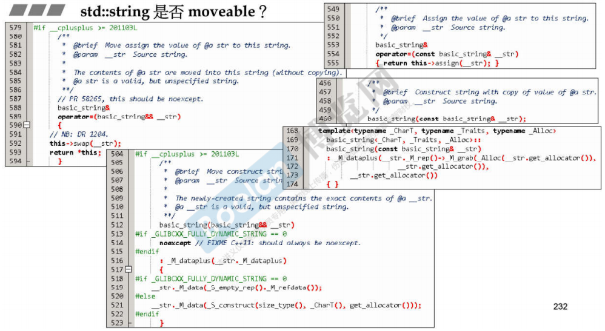

# Ch4 C++标准库的周边设施

- [Ch4 C++标准库的周边设施](#ch4-c标准库的周边设施)
  - [泛用hashfunction](#泛用hashfunction)
  - [tuple](#tuple)
  - [type traits](#type-traits)
  - [cout](#cout)
  - [moveable](#moveable)

## 泛用hashfunction

利用C++11推出的可变模板和模板特化的设计, 下面是这门课给出的一个比较泛用的hash函数的实现, 这个函数是递归模板函数的一种典型情况, 值得学习.

```C++
// 首先是模板函数的入口, 这一系列函数都是模板重载的范例
// 这里用到了可变模板参数, 通过三个点(...)的标识, 可以传入任意数量的参数
template <typename... Types>
// 最泛化的版本, 接收所有参数作为入口
inline size_t hash_val(const Types&... args){
    // 通过传引用来修改返回值seed
    size_t seed = 0;
    // 由于是模板函数, 所以根据实参推导转到下面的函数
    hash_val(seed, args...);
    return seed;
}
```

```C++
// 接受seed和可变数量的参数, 这是递归的主要部分
template <typename T, typename... Types>
// 通常传到这里的时候seed之后的参数数量都是不定的, 由于可变模板参数的设计
// 这里编译器会自动进行切分, 将可变参数的第一个区分出来, 然后剩余的继续传递
// 这种写法在C++11之后的STL中出现得很多, 一定要注意
inline size_t hash_val(size_t& seed, const T& val, const Types&... args){
    // 此时的val就是当前列表里的第一个参数, 用来刷新现在的hashcode
    hash_combine(seed, val);
    // 更新后的seed继续传递
    // 这里不再传递val了, 因此参数列表就减少了一个项, 继续递归下去直到只剩一个参数
    hash_val(seed, args...);
}
```

```C++
// 至此为止是模板递归的最后一层, 只剩下一个参数时进入
template <typename T>
inline size_t hash_val(size_t& seed, const T& val){
    // 仅仅是刷新最后的seed然后开始返回
    hash_combine(seed, val);
}
```

```C++
// 这里是计算hashcode的函数, 将其理解为黑盒就行
#include <functional>
template <typename T>
// 只接受两个参数, 分别是当前hashcode和新出现的需要附加到hashcode中的参数
inline void hash_combine(size_t& seed, const T& val){
    // 主要是调用了std的hash仿函数来对基本类型进行散列
    // 其它部分就是一些打乱操作, 没什么特别的原理, 下面的魔数是黄金分割数
    seed^=std::hash<T>()(val) + 0x9e3779b9 + ((seed<<6) + (seed>>2));
}
```

有了这个hash函数, 对于我们自己的类型, 只要传递所需的一些可被`std::hash<T>()`处理成员进去就可以得到一个合适的hashcode, 打乱得比较彻底因此不容易碰撞. 而为了让自己的类型可以被`std::hash<T>()`处理, 可以在std内追加一个适合自己类型的偏特化模板函数:

```C++
// 追加在std内方便处理
namespace std{
    // 给自己的类型偏特化一份
    template<>
    struct hash<MyClass>{
        // 关键是重载调用运算符, 因为hash属于仿函数
        size_t operator()(const MyClass& inp) const noexcept{
            // 自己想办法返回自定义的hashcode即可
            return inp._do_something();
        }
    }
}
```

## tuple

tuple也是C++11的新特性, 可以暂称为"数据组合", 可以以模板参数的形式接受任意类型任意数量的元素, 组合为一个tuple对象. 下面是使用的范例:

```C++
// 空构造
tuple<string, int, float> t0;
// 带元素构造
tuple<string, int, float> t("something", 42, 42.0);
// 用辅助模板函数推断构造
t = make_tuple("something", 42, 42.0);
// 读取tuple的元素, 注意不要越界
string s = get<0>(t);
int i = get<1>(t);
float f = get<2>(t);
// 对某一项赋值, 注意类型问题
get<1>(t) = get<2>(t);
// tuple间的比较, 整体赋值之类的自然也是可以的
bool b = t0 < t;
t0 = t;
// 用tie()函数将tuple赋值给离散的元素
tie(s, i, f) = t;
// 询问tuple的成员数量
typedef tuple<string, int, float> t_type;
size_t num = tuple_size<t_type>::value;
// 询问tuple某个成员的类型
typedef tuple_element<0, t_type>::type v_type;
```

之所以介绍tuple, 是因为tuple是很好的利用了可变模板参数列表来实现的模板递归继承类. 下面是简化的tuple实现:

```C++
// 最泛化版本的tuple
template<typename... Values> class tuple;
// 最特化版本的tuple, 作为递归继承的最后一层存在
template<> class tuple<> {};
// 递归继承的主要部分, 充分利用了可变模板参数列表会被自动切分的特性
template<typename Head, typename... Tail>
// 参数更多的tuple递归继承自参数少的tuple
class tuple<Head, Tail...>: private tuple<Tail...>{
    // 改个名字
    typedef tuple<Tail...> inherited;
public:
    tuple(){}
    // 构造的时候初始化一个属于当前层次的元素head, 其它部分都用来初始化父类
    tuple(Head vhead, Tail... vtail): m_head(vhead), inherited(vtail...){}
    // 返回当前层次的元素
    typename Head::type head(){
        return m_head;
    }
    // 借助上转型变为自己的父类, 由于继承关系在内存中呈线性排列, 因此放心转型
    inherited& tail(){
        // 返回父类的指针从而可以继续递归
        return *this;
    }
protected:
    // 每一层继承有一个这样的元素, 是这一层真正保存的元素
    Head m_head;
}
```

经过这样设计的结构后, 我们可以不断调用tail来取出排在前列的tuple元素, 用head取出自己想要的那一层的元素, 这整个继承树如下图所示.

  

## type traits

在C++11之前, 如果想要询问一个类的性质, 需要自己对萃取器进行特化来方便算法询问. 当时算法能询问的问题很少, 且需要类的编写者对自己的类都去特化一份如下的空结构, 非常繁琐.

  

这里默认最泛化的类所有成员都是重要的(trivial项都是false), POD是指无函数的结构体. 由于这种写法非常繁琐且能力有限, C++11给出了更强的类型萃取器, 分为以下如此多的种类, 可以自动返回几乎任何我们常会想到的类的特性. 这些萃取器一部分使用特化模板函数实现, 还有一部分是靠编译器内部实现, 不用深究原理, 像普通的萃取器一样使用即可. 例如`is_void<myClass>::value`会回答当前询问的类是否为空, 值是0或1.

  

  

## cout

cout是我们非常常用的STL对象, 其本质是一个与屏幕输出流默认绑定在一起的对象, 是`_IO_ostream_withassign`类型. cout以类似下面的形式进行了大量的流运算符的重载, 从而实现了对各种类型的输出处理. 下图是对bitset的一种重载.

  

## moveable

moveable也是C++11的新特性, 利用右值引用语义给类新增了搬移构造相关函数. 在STL的容器普遍实现了这种新的构造函数, 能大大提高拷贝构造的性能. 搬移构造和搬移赋值函数的特征是参数带有右值引用符`&&`而非普通的引用符`&`, 然后需要调用搬移函数的时候要使用std::move()函数如下:

```C++
string s1(s2);  // 普通拷贝构造
string s1(std::move(s2));   // 调用搬移构造
```

下图string类的代码很好地标识出了传统拷贝构造拷贝赋值和搬移构造搬移赋值的区别:

  

从上图中可以看到右边的传统拷贝函数会真正调用内存分配, 字符串拷贝等操作, 称为深拷贝. 传统拷贝的好处是逻辑上符合拷贝的常见语义, 拷贝后的对象与拷贝前的对象都是独立的.

相比之下能看到左边的搬移函数仅仅是swap了对象的指针, 并没有发生内存的分配, 且为了保证指针的唯一性swap后原对象的指针将为空. 因此搬移函数实际上是浅拷贝, 能告诉完成内存指向的转移, 但是会破坏原先的对象. 这也就是搬移函数使用右值引用作为参数的原因, 因为搬移语义下, 被拷贝的原对象应该是临时的, 可被马上抛弃的对象, 也就是右值对象.