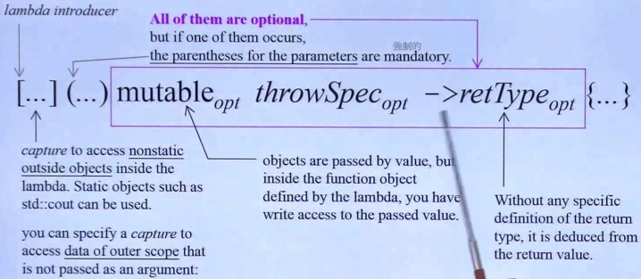

# C++2.0 新特性

- [C++2.0 新特性](#c20-新特性)
  - [Variadic Templates & tuple](#variadic-templates--tuple)
  - [Initializer List](#initializer-list)
  - [delete, default, noexcept, override, final](#delete-default-noexcept-override-final)
  - [Alias Template & Type Alias](#alias-template--type-alias)
  - [decltype](#decltype)
  - [Lambda](#lambda)
  - [Rvalue & Rvalue Reference](#rvalue--rvalue-reference)
  - [杂项](#杂项)

## Variadic Templates & tuple

1. 形如下面, 这里的...部分可以承载任意数量类型也任意的模板参数, 称为包(pack)
   ```C++
   template <typename T, typename... Q>
   void Foo(T itemA, Q... items){ Foo(items...); }
   ```
2. 这样的模板函数在调用的时候编译器回自动进行划分, 然后一般按照上式的方法进行分割递归调用, 注意一定要写省略号`...`
3. 样例代码里面模板类型名后面的`...`称为模板参数包(template parameters pack), 函数参数部分类型名后面的`...`称为函数模板类型包(function template types pack), 函数调用的时候出现在参数的`...`称为函数参数包(function parameters pack)
4. 可以用`sizeof...(args)`来获取所需包的参数个数
5. Variadic Templates的拆分形式和普通形式相比, 拆分形式更加特化, 所以对于下面的两个函数调用中, 拆分形式优先级更高, 普通形式永远不会被调用:
    ```cpp
    // 这个版本较泛化
    template <typename... Types>
    void Foo(const Types&... args);
    // 这个版本才是特化版本, 这两个函数可以共存, 但是调用的时候只会调用到下面的那个
    template <typename T, typename... Types>
    void Foo(const T& arg0, const Types&... args);
    ```
4. `std::tuple`就是借助Variadic Templates实现的, `tuple`的模板参数是不断递归进行了继承从而初始化的, 要注意基类是元素最少的情况, 也就是从头到尾是反过来的, 最后一个参数反而是最基类, 也因此内存中就是从tail往下排到head. 也多亏了这个继承关系, `.head()`调用的才是最外层类也就是第一个元素, 然后使用`t.tail().tail().head()`这样的结构来获取更深层的元素.
5. 也可用模板函数`get<index>(t)`来直接取得`tuple`的元素, 这里index是所需的序号, t是目标`tuple`
6. 在Variadic Templates还没有的时候, `tuple`是由大量嵌套的define定义出来的, 不但有元素个数限制而且实现非常暴力

## Initializer List

1. 编译器见到`{}`时会自动构造一个`initializer_list<T>`, 然后尝试调用对象的`initializer_list<T>`版本的构造函数, 然后分为以下情况:
   1. 目标对象有定义`initializer_list`版本的函数, 调用
   2. 目标对象没有定义`initializer_list`版本的函数, 查看当前的`initializer_list`与现有的普通函数是否匹配, 如果匹配(也就是和`()`一致时)则调用, 否则编译失败
   3. 两个版本的函数同时存在, 优先调用`initializer_list`版本的函数
   4. 当使用`()`进行调用时, 则只能使用普通版本的函数调用
   5. 当在构造函数中使用, 代替`()`但没有指明参数时, 会进行默认构造, 即使是基本类型也会被默认构造为0
2. `initializer_list<T>`的本质是一个数组, 其类中的成员是指向数组的迭代器和记录`initializer_list<T>`长度的size_type. 其只暴露出了`.begin()`, '.end()'和`.size()`. 可以方便其它算法有限使用
3. 新版本的STL容器全部实现了`initializer_list<T>`的接口, 因此可以自动接受任意个数的初始化参数了. 具体的接口通常是使用了range-for进行转交
4. 标准的`{}`和`()`不同, `()`允许参数自动窄化, 但是`{}`不允许
5. min和max和其它一些STL算法现在也有了对应的`initializer_list`版本了

## delete, default, noexcept, override, final

1. 函数后面加上`=default`然后不给出实现, 可以令编译器强制生成一个默认的对应函数, 但是不要对普通函数使用, 因为普通函数没有默认形式. 且要注意如果自己已经声明了对应的函数的话, 就不能再default
2. 函数后面加上`=delete`, 令编译器将这个函数标记为不可实现, 会在编译阶段制止对这个函数的调用行为, 比写为private更加强硬
3. 如果`=delete`了析构函数的话会导致只能用new构造出对象, 然后无法进行析构. 这在某些设计中会出现
4. 这些默认函数C++本来也会自动为空类(构造函数, 拷贝构造函数, 析构函数, 拷贝赋值函数). 只有当这些函数被调用的时候才会真正出现. 所有这些自动生成的函数都是public且inline的, 且无法处理指针(只对指针浅拷贝), 所以当类中有指针时要记得自己定义函数
5. `noexcept`也是新关键字, 标明了目标函数是不会抛出异常的. 接受一个默认为true的bool参数, 当参数为true时会关闭编译器对这个函数生成时关于异常的栈准备工作, 从而提高函数的执行效率. 当异常在`noexcept`抛出时会调用`std::terminate()`
6. `override`用于虚函数, 在派生类中写出, 标明了派生类目前是要覆写基类的同名虚函数, 当派生类没有这个接口覆写的时候会编译失败
7. `final`用于虚函数或类, 用于函数名后标明这个函数阻断后续派生类的覆写, 用于类名后标明这个类阻断继承行为

## Alias Template & Type Alias

1. 模板别名, 可以将模板简写为形如下面的形式:
   ```C++
   // 用using给模板起别名
   template<typename T>
   using Foo = std::vector<T, FooAlloc<T>>;
   // 随后的调用形如
   Foo<int> foo;
   // 等价于
   std::vector<int, FooAlloc<int>> foo;
   ```
2. 模板别名能在特定情境下发挥作用, 核心就是它可以在编译阶段将模板参数数量整合缩减. 由于编译器无法在模板中推导模板参数的正确形式, 也就是模板参数的默认值在编译阶段是无法展现的. 因此如果目标模板有多个参数但是我们只想传递一个参数的话, 可以利用模板别名将默认值进行包装, 从而减少需要传递的模板参数数量. 
3. 类型也可用using起别名, 写法和上面一致, 视觉上比typedef清晰一些

## decltype

1. 类似`auto`, 能对对象进行静态推导, 然后将类型转为一个可用的类型名应用出来, 主要用在返回值, TMP和Lambda中, 替代了旧版本中不好用的`typeof`
2. 返回值: 在模板编程中, 我们不仅希望能自动推导参数类型, 还希望按照得到的类型来推导返回值, 如今可以借助尾置返回将模板函数写为下面的形式. 尾置返回也是C++11新加入的特性, 其目的是让参数列表中的符号也可以在返回值推导中使用.(注意: 这里的尾置返回在C++14后已经不再必要, auto可以自动推断返回类型, 而且还能写出decltype(auto)了)
   ```cpp
   template<typename T1, typename T2>
   auto Foo(T1 x, T2 y)->decltype(x+y)
   {dosomething;}
   ```
3. TMP: 在模板元编程中, `decltype`主要用来自动推导参数的类型, 从而利用这个类型进行其它的变量使用, 例如现在可以用这种写法获取输入的容器的迭代器:
   ```cpp
   template<typename T>
   void Foo(T obj){
     typename decltype(obj)::iterator iter;
     decltype(obj) obj2;
   }
   ```
4. Lambda: lambda是C++11新加入的闭包语法, 一个lambda对象的实际类型我们一般写不出来, 如果想要在后面使用lambda对象的话常常需要用到`decltype`, 且lambda本身也常常用到`decltype`作尾置返回
   ```cpp
   auto foo_lambda = []{};
   use_this_lambda(decltype(foo_lambda));
   ```

## Lambda

1. lambda的语法很奇怪, 之前也介绍过好几次了, 下面是其完整形态的图. 这里来从比较底层的角度解释这个问题
2.   
3. lambda可以视作一个匿名的函数对象, 其默认是内联的因此会在调用点自动展开, 减少上下文切换的开销. 而且lambda允许嵌套在其他表达式中定义, 使用起来很方便.
4. 最基础的lambda展开后形如下面的样子:
   ```C++
   // 如果我们写出下面的lambda, 会被展开为下面的形式
   [x](int k){ std::cout<<k; };

   // 展开的函数对象是匿名的, 其名称由编译器生成, 保证独一性, 
   class unnamedFunction1
   {
     // 这里是中括号中的内容, 也就是从外部捕获的变量
     // 以private形式成为这个函数对象的成员变量
     int x;
   public:
     // 外部捕获的变量是在自动生成的构造函数中被使用的, 默认是传值捕获
     unnamed1(int X) : x(X) {}
     // 自动生成的调用运算符重载是const的, 这就是为什么我们不允许改变捕获的变量的值
     void operator()(int k) const { std::cout<<k; }
   };
   ```
5. 复杂点的lambda展开后是下面的样子:
   ```C++
   // 这里对z进行了传引用捕获, 然后对其它局部可见域的变量都进行传值捕获
   [=, &z](){ ++z; }

   class unnamedFunction2
   {
     int x;
     int y;
     int& z;
   public:
     // 注意这里对Z是传引用捕获的, 并默认传值捕获了其它可见变量
     unnamed1(int X, int Y, int& Z) : x(X), y(Y), z(Z) {}
     // 由于是传引用, 我们可以透过引用改变z的值.
     // 但是注意由于lambda的语义是闭包, 在lambda中改变外部变量的值并不被推荐
     void operator()() const { ++z; }
   };
   ```
6. 回顾mutable的语义, mutable可以让const函数对某些变量的限制失效, 发展到lambda中形如下面:
   ```cpp
   // 写下mutable后我们就可以改变捕获的变量的值了, 同样是语义上不推荐的行为
   [x]() mutable { return ++x; }

   class unnamedFunction3
   {
     int x;
   public:
     unnamed1(int X) : x(X) {}
     // 相当于调用符的const消失了
     // 要注意由于lambda是一个函数对象, 因此假如我们给lambda命名(用auto)后重复调用的话
     // 这里对变量的修改会像一个真正的函数对象一样被保留下来, 可能会造成不必要的麻烦
     // lambda的返回值是根据return自动推导的
     int operator()() { return ++x; }
   };
   ```
7. lambda由于inline的特性与简短的语法, 很适合用来作为标准库函数的函数对象参数, 加上在后续的C++版本中又对lambda进行了很多优化和语法的简化, 现在可以放心大胆地使用lambda了
8. 关于mutable的讨论: https://stackoverflow.com/questions/5501959/why-does-c11s-lambda-require-mutable-keyword-for-capture-by-value-by-defau

## Rvalue & Rvalue Reference

1. 左值(Lvalue)和右值(Rvalue)是C++语言上的一个概念. 原本定义上左值右值指的允许被放在赋值运算符左右的值. 左值在赋值运算符左右都可以放置, 右值只能放在右侧, 如下代码:
    ```C++
    // 有名称的变量都属于左值
    int x=0, y=0;
    // x是左值, 可以被赋值, 右边是立即数1, 是右值
    x=1;
    // x和y都是左值, 左值可以被作为右值使用
    x=y;
    // x+1是临时变量, 属于右值, 不应放于左边, 所以这句话编译不能通过
    x+1=2;  // ERROR
    // x+1是临时存在的, 属于右值, y是左值, 所以这里可以通过
    y=x+1;
    ```
2. 但是由于类设计机制的复杂性, 传统的左值和右值定义只对于基础类型成立, 对自定义类并不成立. 因此更实际来说应该理解为: 那些内容无关紧要后续也不再利用的临时对象是右值
3. 右值进一步分为纯右值(例如字面量)和将亡值, 但是用起来差不多所以不用过多区分
4. 右值依然有自己占用的内存, 只是马上就会被丢弃而已, 如果不加以利用的话相当于我们在赋值语句中需要对对象进行两次构造. 因此C++11提出了右值引用让我们可以利用这些临时变量的内存, 从而降低构造对象的开销
5. 临时变量默认是右值, 但是如果我们需要指定一个左值为右值, 最好的方法是调用`<utility>`中的`std::move()`函数, 其可将一个左值强制转型为右值
6. 现在的编译器会自动将函数的返回值以右值形式返回, 因此我们无须手动写出move, 显式写出move反而可能适得其反.
7. 当我们对类型声明写`&&`符号时, 例如`int&& rvalue=foo();`, 代表这是一个右值引用的声明, 表现为左值. 这条非常重要, 右值属性只在返回值等赋值号右边的特殊情况下会表现出来, 右值引用的声明是等号的左边因此实际上是左值. 右值引用依然是一种引用, 其并不会改变对象的声明周期, 真正改变声明周期的还是我们自己的操作.
8. 将函数参数写为右值引用类型`&&`属于一种重载, 此时如果传递的变量是一个右值便会进入这个重载函数, 这种函数在构造函数中称为移动构造. 在这个重载函数中, 我们应该利用指针(例如pimpl设计)进行对象的处理, 根据右值的协议我们可以随意处理这个参数, 因此一半直接偷走传入对象的指针. 使用右值传递我们可以大大加快容器和算法的效率, 减少无用的对象构造, 属于是C++11最重要的新特性之一. 这里要注意如上一点, 函数此时的形参类型是右值引用的声明, 是一个左值
9. 平时我们写普通函数由于参数版本都需要提前设置好所以不用担心引用属性改变的问题, 但是在模板函数中有不同的情况: 对于模板函数的实参推导来说, 右值引用形式的模板函数实际上可以接受任何形式的实参, 被称为万能引用, 此时前面提到的"右值引用的声明是一个左值"会造成下面的麻烦
10. 我们以右值引用传入模板函数的值会变为由于变为了右值引用声明而成为左值, 如果函数内部又有需要右值引用的函数调用时就会失败. 这就是转发问题, 我们希望右值引用在函数的参数传递中仍然保持右值:
   ```C++
   // 若此时有ref(T& v);和ref(T&& v);
   template<typename T>
   void pass(T&& v){  // 这里的&&可以接受任何版本, 称为万能引用
     // 传入之后的右值引用被视作左值了
     // 因此无论main函数中输入什么, 都只会调用左值版本的函数ref(T& v)
     ref(v); 
   }
   int main(){
     pass(1);
     int a=9;
     pass(a);
   }
   ```
11. C++为了右值引用在模板中引入了如下的引用折叠规则, 目的是针对上面的模板代码的情况, 如果推断的模板参数本身就带有引用, 叠加后需要消除多余的引用:
    1. T& & -> T&
    2. T&& & -> T&
    3. T& && -> T&
    4. T&& && -> T&&
12. 在折叠规则中可以看到不管实参是什么类型, 除非形参是右值引用, 否则得到的都是左值. 因此我们此时知道上面代码段中`pass(1)`后, v的类型是`int&&`, `pass(x)`后, v的类型是`int&`. 尽管这里都是左值, 但是它们的声明类型依然是正确的, 我们想到可以利用转型来恢复它的引用属性
13. 为了适配模板, 我们可以写出如下的模板函数. pass传入ref的参数只有`int&`和`int&&`两种类型, 且都是左值, 所以如果我们现在在上面的pass函数中使用调用`ref(foo_forward<T>(v));`包装:
    1. 如果此时是`int&&`的话, `T`将会是`int&&`类型, 然后由于引用折叠的原因, arg此时是`int&& &`也就是`int&`型, 然后经过static_cast变为`int&& &&`也就是`int&&`返回, 成功变为了一个右值引用的返回值. 
    2. 如果此时是`int&`的话, `T`将会是`int&`类型, 由于引用折叠, arg此时是`int& &`也就是`int&`型, 然后经过static_cast变为`int& &&`也就是`int&`返回, 可以看到依然保持着一个左值返回. 这就是完美转发.
    ```C++
    template< typename T >
    T&& foo_forward(T& arg) {
        return static_cast<T&&>(arg);
    }
    ```
14. 这个forward的STL源码中就是完美转发`std::forward`, 其真正样子如下. 考虑了更多的要素但是基础思路是一样的, 本质就是利用模板多态的引用折叠来进行转型并返回
    ```C++
    // forward an lvalue as either an lvalue or an rvalue
    /// 位于<type_traits> 1440行
    // _NODISCARD是C++17后引入的标识符的宏函数版本, 原型是 [[nodiscard]]
    // [[nodiscard]]意思是不应舍弃返回值, 也就是如果不处理这个函数的返回值就会警告
    // 然后使用constexpr转为常量表达式提高效率, 反正整个转发过程都是静态的
    // remove_reference_t内部是using, 就是单纯地忽略掉引用符
    // noexcept保证这个函数是异常安全的
    template <class _Ty>
    _NODISCARD constexpr _Ty&& forward(
        remove_reference_t<_Ty>& _Arg) noexcept {
        return static_cast<_Ty&&>(_Arg);
    }

    // forward an rvalue as an rvalue
    // 这个是右值版本的重载, 我们平时比较少用到, 因为通常我们都是对左值转发
    // 其余部分与左值版本相同
    template <class _Ty>
    _NODISCARD constexpr _Ty&& forward(
        remove_reference_t<_Ty>&& _Arg) noexcept { 
        // 利用traits进行二次检验, 确保类型无误
        static_assert(!is_lvalue_reference_v<_Ty>, "bad forward call");
        return static_cast<_Ty&&>(_Arg);
    }
    ```
15. 了解了完美转发的这种转型方法后, 顺便看看`std::move`的STL源码实现也能理解了:
    ```C++
    // forward _Arg as movable
    // 使用万能引用作为参数来接受任何类型的输入
    // 然后区别在返回值, 无论此时输入的类型是什么, 都去除引用后添上右值引用符并返回
    // 这样就实现了将任何类型的输入都强制转为右值返回的效果
    template <class _Ty>
    _NODISCARD constexpr remove_reference_t<_Ty>&& move(
      _Ty&& _Arg) noexcept {
        return static_cast<remove_reference_t<_Ty>&&>(_Arg);
    }
    ```
16. `forward`和`move`语义差别的讨论: https://stackoverflow.com/questions/9671749/whats-the-difference-between-stdmove-and-stdforward

## 杂项

1. range-for是迭代器遍历形式for的简写, 因此要记住其中内含了`elem=*iter`的操作, 所以需要隐式转换的支持
2. auto是自动静态类型推导, 发生在编译期. 在后续的C++版本中auto的推导能力越来越强大
3. STL的容器全部支持了右值操作. STL的相关介绍在另一篇
4. 编译器都有定义一个宏`__cplusplus`, 这个值如果是`201103`或者更大的数就代表支持C++11的特性. 但是要注意VS的编译器尽管早就支持了新版本的C++但是由于设计上的问题, 直到今日这个值的定义默认依然是`199711`, 不过新版本的VS允许用户自己改变这个值了.