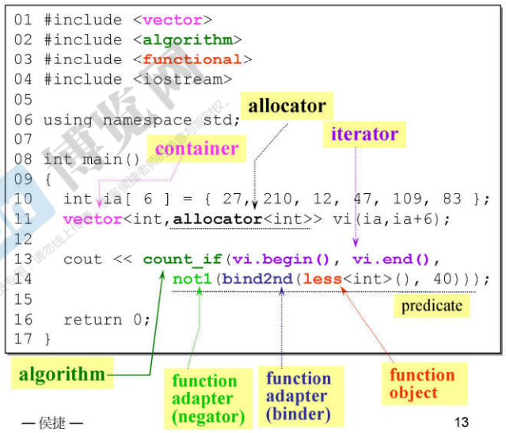

# Ch1 浅尝C++标准库

- [Ch1 浅尝C++标准库](#ch1-浅尝c标准库)
  - [STL简介](#stl简介)
  - [容器简介](#容器简介)
  - [使用容器](#使用容器)
  - [分配器简介](#分配器简介)

## STL简介

标准库的概念大于标准模板库(STL), 以头文件的形式呈现. C++的新标准库头文件没有后缀名, 继承C的标准库文件则变为c开头不带后缀名, 还有一部分旧式的保留.h后缀. 新式标准库内的组件都在namespace std里, 旧式则没有

STL由六大部件组成:

 

1. 容器(container): 核心, 也就是数据结构
2. 分配器(allocator): 进行对内存的分配, 一般不用自己手动调用
3. 算法(algorithm): 核心, 封装各种算法
4. 迭代器(iterator): 泛化的指针, 用来操控容器内的数据
5. 仿函式(functor): 类似函数但又不是函数, 用来作为参数给其它算法调用
6. 适配器(adapter): 对上述基础元素的包装

本课程的核心样例代码, 用到了所有组件

  

## 容器简介

所有STL容器都是前闭后开的, 也就是起始迭代器指向第一个元素, 尾迭代器指向最后一个元素的后一个位置. 这是为了方便循环的编写, 但也因此不能直接取尾迭代器的值. 使用C11新增的区间循环配合auto让容器迭代写起来更方便:

  

STL的容器可以分为三大类, 定义在同名头文件:
1. 序列型容器: 数组或链表实现的列表, 数据组织紧凑
2. 关联型容器: 红黑树实现的set和map, 着重优化元素查找效率
3. 无序型容器: 哈希表实现的set和map, 采用闭合式列表, 操作和关联型容器一样

 

## 使用容器

|类型  |名称  |底层结构  |特性  |
|---------|---------|---------|---------|
|序列型     |  array       |    数组     |    1. 构造时必须指定数组大小, 无法动态改变      |
|     |         |         |    2. x.data()返回数组起点指针     |
|序列型     |   vector      |   数组      |    1. 可以动态扩充, 每次扩充数组大小会翻倍, 然后进行一次数组复制转移     |
|     |         |         |   2. 只朝尾部单向扩充, 不能添加元素在头部, 通常用push_back()压入数据      |
|序列型     |    list     |    双向链表     |   1. 每次增长只扩充一个节点      |
|     |         |         |    2. 自带sort函数能提到排序效率, 只要STL有提供的特殊版本的函数, 都优于通用函数     |
|序列型     |    forward_list     |    单向链表     |    1. C11新增     |
|     |         |         |    2. 比list省空间     |
|     |         |         |    3. 只能从一端push_front()添加元素, 没有提供push_back()函数     |
|序列型     |    slist     |    单向链表     |    1. 是Gnu-C的非标准容器, 操作和forward_list相同     |
|序列型     |    deque     |    数组     |    1. 可以双向动态扩充的数组, 原理是池分配固定大小的数组buffer, 然后用map串联起来, 每次扩充只扩充一个buffer     |
|序列型     |   stack      |   deque      |    1. 属于容器适配器, 只支持先进后出, 用push()添加元素     |
|序列型     |    quene     |    deque     |    1. 属于容器适配器, 只支持先进先出, 也是push()     |
|关联型     |    multimap     |    红黑树     |    1. key可重复的映射表     |
|     |         |         |    2. 用insert插入元素, 内部自动安排位置, 不支持map的下标插入法     |
|     |         |         |    3. 有特殊实现的find函数     |
|     |         |         |     4. 构造的时候需要指定key和value的元素类型    |
|     |         |         |    5. 插入的元素是pair<KEY, VALUE>类型的, 可以用first()和second()得到pair元素的key和value     |
|关联型     |   multiset      |    红黑树     |    1. 可重复的集合, 理解为value与key相同的map     |
|关联型     |    map     |     红黑树    |    1. 不允许重复, 插入重复数据会报错, 可以使用下标插入法x[key]=value     |
|关联型     |    set     |    红黑树     |    1. 不允许重复的multiset     |
|无序型     |    unordered_multimap     |    哈希表     |    1. 除了底层结构不同外操作和multimap相同     |
|     |         |         |    2. 有x.bucket_count()函数返回当前哈希表的篮子个数     |
|     |         |         |    3. 当元素个数>=篮子时, 哈希表自动扩充两倍并重新哈希填充     |
|无序型     |    unordered_multiset     |    哈希表     |     1. 类比    |
|无序型     |    unordered_map     |    哈希表     |    1. 类比     |
|无序型     |     unordered_set    |    哈希表     |     1. 类比    |
|无序型     |   hash_set, hash_map, hash_multiset, hash_multimap      |    哈希表     |    旧版本, 非标准库容器, 但是在大多数编译器中都有实现     |

## 分配器简介

1. 分配器的目的是为容器按照某种策略分配内存, STL的所有容器都有自己的默认分配器
2. 分配器例如有池分配器, 位图分配器等不同的内存分配策略
3. 尽管我们可以单独调用分配器来分配内存, 但是这意味着我们就要自己管理申请和释放的字节数, 不方便, 不如new或malloc