# Ch2 C++标准库的容器

- [Ch2 C++标准库的容器](#ch2-c标准库的容器)
  - [模板与泛型编程](#模板与泛型编程)
  - [模板](#模板)
  - [分配器](#分配器)
  - [迭代器](#迭代器)
  - [萃取器Traits](#萃取器traits)
  - [容器: list](#容器-list)
  - [容器: vector](#容器-vector)
  - [容器: array](#容器-array)
  - [容器: forward_list](#容器-forward_list)
  - [容器: deque](#容器-deque)
  - [容器: quene和stack](#容器-quene和stack)
  - [容器: rb_tree](#容器-rb_tree)
  - [容器: set, multiset, map, multimap](#容器-set-multiset-map-multimap)
  - [容器: unordered](#容器-unordered)

## 模板与泛型编程

STL有不同的实现, 但是接口和行为是规定好的相同状态. 常见的实现版本有VC++, GNU C++.

与常见的面向对象编程模式(Object-Oriented Programming; OOP)不同, STL主要以泛型编程(Generic Programming; GP)实现. 核心区别是OOP将数据与算法封装在一起, 而GP追求将数据与算法分离开来, 让算法通过相同的接口操作不同的数据. GP的好处是能让算法团队和数据团队各自独立运作, 只要确定好沟通的接口即可.

阅读GP的代码, 核心是理解操作符重载和模板操作. 操作符重载相当于与内置类型的接口相统一, 而模板则是为了能应对各种各样的类型.如果我们有自己的数据, 只要我们也实现算法所需的操作符和用于操作数据的迭代器, 我们就也能调用STL的算法来操作我们自己的数据.

进行操作符重载的时候, 主要要注意尽量不要重载`&&`, `||`和`,`, 因为它们重载之后将失去短路求值和顺序求值的特性, 退化回不定序求值的函数操作. 重载操作符的时候要尽量使其效果与int类型操作看齐, 不要乱改导致语义混乱加大理解难度, 且操作符重载无法改变操作符的优先级, 组合, 参数个数等.

## 模板

模板编程主要分为: 

1. 模板类: 最简单的模板, 在声明类的上一行加上`template<class T>`, 用T表示当前未定的类型名, 可以有多个. 实例化模板类时必须知名模板参数的类型, 因为实例化模板类对于编译器来说没有任何可供推理的线索
2. 模板函数: 和模板类相近, 在函数定义之前加`template<class T>`, 区别在于由于函数参数的独一性, 使用模板参数时并不必要知名模板参数类型, 因为编译器能自动进行实参推导.
3. 模板成员: 也就是在类内的模板函数. 此时对于普通类的类内模板成员函数, 其实参可以由编译器自动推导. 但对于模板类中的模板函数, 使用时则需要提供对应模板类的模板参数, 然后函数自己的模板实参由编译器自动推导. 在类外定义的时候需要提供两个模板标识符.

对于模板编程, 有一个很实用的设计在STL中非常常见: 特化(Specialization), 相对普通的模板编程叫做泛化, 特化又可以细分为全特化和偏特化, 这种写法使得我们能保留泛化函数的通用性的情况下, 给特定的类型特殊的设计提高计算效率.

1. 全特化是在定义了普通的泛化模板类之后, 额外写一个相同模板定义但是指明所有模板参数的类型, 只保留空的`template<>`. 这样的写法当编译器处理这个函数时, 会自动对特化函数先进行匹配, 当匹配特化函数时就会调用定义的特化函数版本, 直到所有失配才最后调用泛化版本.
2. 偏特化是介于泛化和全特化之间的状态, 其只指明了模板参数列表中的某几个类型或者缩小类型本身的数据范围(任何类型(T), 仅限指针类型(T*), 仅限指向常量的指针类型(const T*)), 例如`template<class T> class className<const T*>{...};`, 未指明的类型等待调用者处理.

## 分配器

首先需要知道, C++中所有的内存操作归根到底都是对malloc和free的调用, 包括new和delete. 分配器allocator是对malloc和free更深层次的包装, 目的是对内存能有更好的分配机制, 尽量减少分配内存时的额外消耗(overhead). allocator的核心函数是包装了malloc的allocate和包装了free的deallocate. VC6的STL实现中, allocator只是对new和delete的简单包装, BC++也是, 只有2.9版的GNU-C用了比较复杂的内存分配策略:

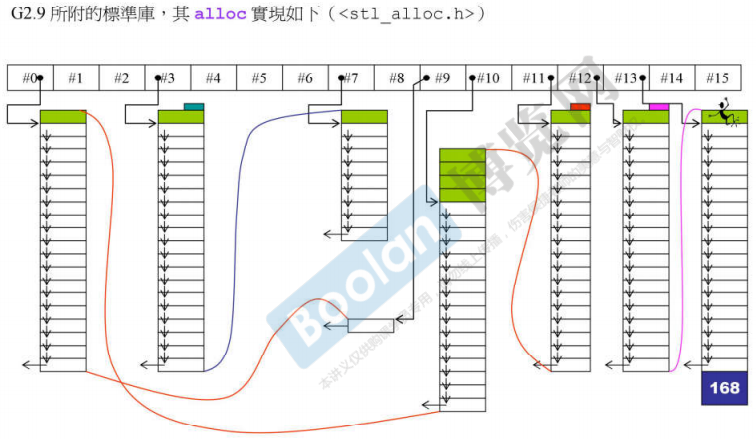  

GNU-C在2.9版本的allocator中采用了池分配的机制, 如上图维护一串由多个大小不同的内存块组成的链表, 以池分配器的思路对申请的空间进行分配. 上图中#0的块大小是8字节, #1是16字节, #2是24字节, 以此类推. 到了后来GNU-C的4.9版本中allocator又变回了对new和delete的简单封装, 而这种策略被包装到了单独的池分配器pool_alloc中.

## 迭代器

迭代器是算法操作容器内的数据的重要手段, 其行为目的是在模拟原生指针操作的同时附加上额外的处理. 对于任何一个要被STL算法对接的迭代器都需要实现四个运算符重载: `operator*()`, `operator->()`, 前自增`operator++()`, 后自增`operator++(int)`. 下面是list的迭代器对这四个运算符的经典实现和注意事项:

```C++
...
// 取值运算符通常直接返回数据的引用
reference operator*() const { return (*node).data; }
// 指针运算符不是直接返回数据而是通过取地址来包装取值运算符, 这是因为C++编译器的特性
// 当对指针调用->()时, 编译器会不断执行->()直到触碰底层指针才进行存取, 因此需要返回地址以供额外的->()操作
pointer operator->() const { return &(operator*()); }
// 前自增运算符允许返回引用从而可以实现多次自增叠加, 实现方法是先修改自身指向然后返回自身
self& operator++() { node={link_type}((*node).next); return *this; }
// 为了遵循int的自增行为特性, 后自增不返回引用所以无法叠加后自增, 实现的时候返回自增前的副本
self operator++(int) { self tmp=*this; ++*this; return tmp; }
...
```

除了四个操作符重载外, 迭代器还需要实现5个性质访问符, 因为STL算法会询问迭代器的一些性质来进行偏特化的计算. 它们分别是:

1. value_type: 迭代器所指向的数据的实际类型, 通常是`T`
2. difference_type: 迭代器做差得到的类型(索引距离), 通常是 `ptrdiff_t`
3. pointer: 迭代器所指向的数据的指针类型, 通常是`T*`, STL规定了要有但是没用过
4. reference: 迭代器所指向的数据的引用类型, 通常是`T&`, STL规定了要有但是没用过
5. iterator_category: 迭代器的类型, 例如sort()需要`random_access_iterator_tag`型的迭代器

## 萃取器Traits

算法本来可以直接访问迭代器等类来得知所需的额外信息, 但是为了泛用性, 我们也希望算法可以直接应用在原生指针上. 尽管原生指针本身就具有正确的运算符, 但是原生指针没有办法返回上面的5个性质. 为了解决这个问题, STL提出了萃取器Traits结构作为中间层. STL有多种Traits, 对于迭代器使用的是`iterator_traits`.

Traits是典型的偏特化模板类, 其经由偏特化来处理类类型的迭代器, 原生指针类型的迭代器和常量指针类型的迭代器. 对于类类型的迭代器, traits只是进行简单的接口包装, 而对于原生指针类型的则是进行了额外转换. 这里注意对于`const T*`, 尽管指针是常量指针, 但是由于大多数时候使用迭代器就是对数据有修改的需求, 因此在萃取包装的时候返回是元素类型value_type去掉了const限制符, 否则这个返回类型就意义不大了.

  

## 容器: list

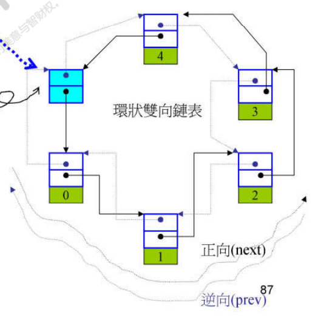  

list的基础结构就是循环保存的双向链表如上图. 尽管在具体实现上list是循环链表, 但是在逻辑上仍然是普通的直链, 因此额外插入了没有数据的空白节点以符合STL标准对list区间"前闭后开"的要求.

## 容器: vector

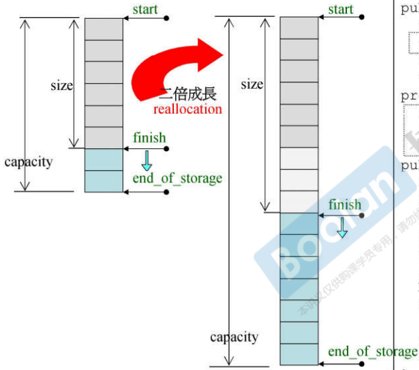  

vector的基础结构是双倍扩充的数组, 通过如图的三个迭代器来进行尺寸控制. 当需要插入数据但finish==end_of_storage时, 代表当前数组已经存满, 需要进行扩充. 此时会重新申请一段两倍大小的数组, 然后将当前数组的全部数据拷贝过去, 再插入新数据, 然后释放老数组, 并最后刷新迭代器指向新申请的这个数组.

在早期实现中vector的迭代器只是一个原生指针, 但是后续实现给迭代器加入了状态机制, 将vector的迭代器正式扩展为一个类.

## 容器: array

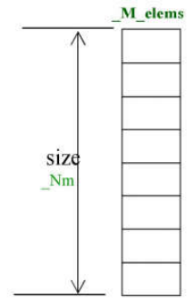  

array是STL对原生数组的包装, 目的是在尽量保持原生数组效率的情况下赋予其更多的功能, 主要是新增了边界检查, 元素数量记录, 数组大小记录等功能. array的空间不会像vector一样自动增长, 在初始化的时候必须在模板参数列表中指明数组大小, 当申请大小为0时, 默认会申请长度为1的数组.

## 容器: forward_list

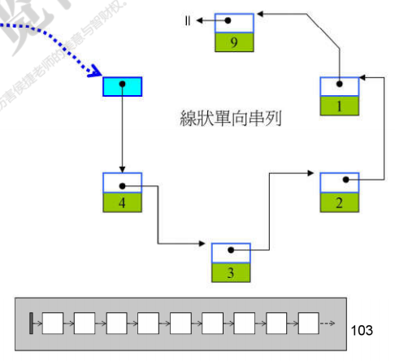  

forward_list比较简单, 就是list的单向链表模式, 去除了反向指针和循环结构.

## 容器: deque

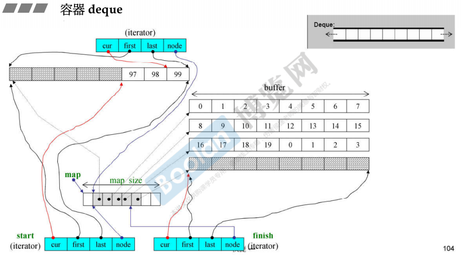  

deque是双端列表, 由一段段array组成, 其既想追求数组的随机访问行为又追求灵活的双向空间扩充, 目的是实现和vector一样的行为, 是实现比较复杂的容器.

如上图, deque的核心是一个缓冲区映射表结构, 首先deque维护一个底层是vector的索引映射表map, map中以迭代器的形式储存着当前拼接起来的缓冲区的起点地址, 因此利用map我们可以快速跳转到一定距离外的其它缓冲区上. 为了方便deque双端扩充的特性, map是从中间而非某一端填充起的.

deque实现随机访问行为的核心是比较复杂的迭代器设计. deque和vector一样设计了三个迭代器, 但是略有不同. 如图是指示空间起点的start, 指示空间终点的finish, 指示当前处理的位置的cur(而非vector的end_of_storage). 每个迭代器都由四个项组成, 分别是cur, first, last, node, 其中node是指向map中对应项的指针, first是指向当前实际缓冲区块内部项的指针, 表示当前块中元素的起点, last也指向区块内部项表示此块中元素的终点, cur则是指出具体的项. 显然当某个区块被元素填满时, 其first就是区块起点, last就是区块终点.

为了模拟vector的行为, deque首先需要重载`insert()`函数, 执行逻辑是首先看当前需要insert的位置(cur指针)处于整个列表的前半段还是后半段, 对需要移动的数据比较少的方向处理, 以移动前半段为例, 先申请足够移动的空间, 进行上述的map映射操作, 然后将前半段的元素复制到新的位置, 再在安插点处放入新的数据, 最后更新指针.

而为了模拟连续空间, deque随后需要重载迭代器的操作符函数, 以最通用的迭代器地址加某个偏移值`operator+=()`为例, 移动逻辑如下面的代码. 其它的操作符都对这个操作符包装即可.

```C++
self& operator+=(difference_type n){
  // 先计算出偏移后的地址相对于当前区块的偏移量
  difference_type offset = n + (cur - first);
  // 如果这个偏移量是正的(不用反向跳转区块)也没有大于区块大小(不用正向跳转区块)
  if(offset >= 0 && offset < difference_type(buffer_size)){
    // 直接移动指针即可
    cur += n;
  }
  else{
    // 否则需要跳转区块, 先计算出需要跳转几个区块
    difference_type node_offset = offset > 0 ? 
      // 计算正向移动需要跳转的区块数量
      offset / difference_offset(buffer_size())
      // 如果是反向移动需要跳转的区块数量
      : -difference_type((-offset - 1) / buffer_size()) - 1;
    // 用map中储存的迭代器刷新当前的first和last和node迭代器
    set_node(node + node_offset);
    // 然后将cur指针在块内移动到正确的位置
    cur = first + (offset - node_offset * difference_type(buffer_size()));
  }
  return *this
}
```

在早期版本的deque中, 缓冲区块的大小是512字节, 然后模板参数允许指派要将区块切分为多少部分buffer_size, 后来的版本将这个接口去除了, 默认的行为是当要放入的元素小于512字节时, 切分为512/size_of(value)个部分, 而如果元素大于512字节则不切分.

## 容器: quene和stack

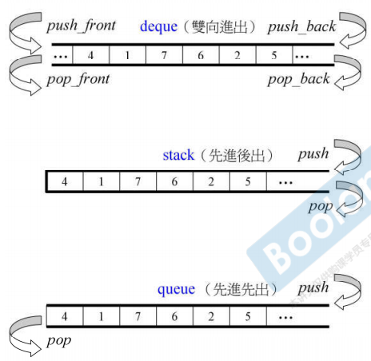  

队列quene和栈stack的默认底层结构都是deque, 因为他们都只需要对某一端附近的几个元素进行操作, 并不需要真正全局访问特性, deque的缓冲区结构就能提供足够的效率还能节省内存占用. quene和stack都有一个特点就是不允许进行遍历也不提供迭代器, 这与这两个数据结构特性有关.

尽管它们默认的底层容器是deque, 我们也可以指定改用list作为底层容器, 对于stack还可以使用vector作为底层容器. 但是vector不能作为quene的底层, 这是因为quene的代码中需要调用容器的`back()`操作得到尾端的元素, 但是vector单向扩充的特性让其没有提供这个函数. 自然的由于这两个容器都对随机访问有需求, 所以不允许使用set或map作为底层

## 容器: rb_tree

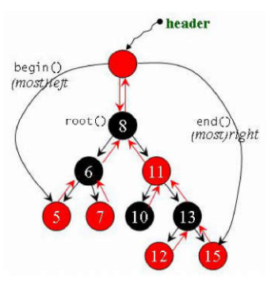  

红黑树是STL里使用的树状容器, 算法比较复杂, 结构则是一个双向二叉树链表. 由于rb_tree属于一种排序二叉树, 所以按照正确规则进行遍历的话树中的节点将以排序顺序得到. rb_tree结构只有一个指向header节点的指针和记录节点数量的值. 如上图header指针除了指向根节点外, 也指向树最大和最小的节点, 迭代器从最小节点开始, 利用双向链表的特性以中序遍历的顺序遍历就能输出排序后的结果, 从最大节点也相似. 但要注意尽管rb_tree提供了迭代器, 我们仍不应该使用迭代器来改变rb_tree的元素值(key元素), 否则会破坏排序状态.

rb_tree提供了两个不同的插入函数`insert_unique()`和`insert_equal()`. 前者保证key的独一无二, 当搜索中遇到相同key时直接返回不会有其它反应, 后者则表示key可重复会继续正常插入. 红黑树的模板参数中给出了一个仿函数KeyOfValue是用来让在下面的set中可以放心使用value作为key, 让我们从value中取出key. 通常来说KeyOfValue是用仿函数`identity()`实现的, 这个是所谓的证同函数, 就是一个单纯返回输入的值的特殊设计, 与此同时还有类似只返回第一参数, 只返回第二参数等其它仿函数以供不同使用.

## 容器: set, multiset, map, multimap

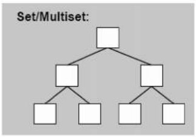  

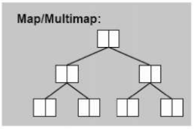  

set和map的底层结构都是rb_tree, 区别在于map的排序依据是key, 而set的排序依据是value, 然后内部通过不同的insert来实现可重复和不可重复插入的区分特性. STL禁止我们使用set的迭代器来改变元素的值, 因为set的value和key是一体的. 但是允许我们用迭代器改变map的value, 因为map排序基于key.

## 容器: unordered

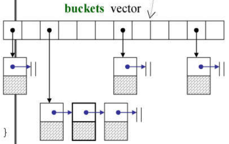  

unordered类是在C11的时候从hash类改名过来的, 这一组容器都使用散列表实现, C++中使用了如上图的非开放式散列表来处理. 散列表的底层实现是元素是list的vector, 每个项称为篮子(basket), 长度为一个质数. 输入的元素首先会经过传入的hash仿函数将元素转换为一串数字, 称为hashcode, 随后这串数字会在类内按照表长进行常见的哈希取余操作转换为索引, 将其pushback到对应项的list上. 尽管list是线性搜索时间, 但是只要hash函数比较合理, 每个项的元素就不会太多从而搜索时间也不会太长. 而一旦当前表中元素数量大于篮子数, 表就会扩充为大约两倍于当前大小的质数长度, 然后将表内元素全部重新散列.

对于hash函数的实现, STL有给出一些基本类型的实现, 其中对于字符串char*类型散列方法如下代码:

```C++
inline size_t __stl_hash_string(const char* s){
  unsigned long h = 0;
  // 乘5累加法
  for ( ; *s; ++s){
    h = 5 * h + *s;
  }
  return size_t(h);
}
```