# C++面向对象高级编程(上)

- [C++面向对象高级编程(上)](#c面向对象高级编程上)
  - [C和C++的核心区别](#c和c的核心区别)
  - [类相关](#类相关)
  - [关键的构造和析构](#关键的构造和析构)
  - [系统堆栈](#系统堆栈)
  - [继承, 复合, 委托](#继承-复合-委托)
  - [设计模式](#设计模式)

基本都是C++拾遗

## C和C++的核心区别

1. C++以面向对象设计为主, 面向对象是将数据与函数封装在一起, C是面向过程的, 将数据和函数分离实现, 数据通常是全局的.
1. 而且还有面向对象和基于对象的区别, 面向对象面对多重classes的交互设计, 基于对象之面对单一class的设计
2. C++才有重载

## 类相关

1. 函数如果在类体中定义, 那么就会自动成为inline候选
2. 构造函数后面的变量构造部分称为初始化列, 这部分处于函数体内的赋值阶段之前, 称为初始化阶段, 对元素的构造效率更高
3. const函数, 在函数声明后面加上const后, 无法修改当前对象的成员, 且只能调用const成员函数. mutable类型可以例外.
4. 传参尽量传引用, 且传引用的时候尽量写为const引用, 速度接近指针. 内置类型无须传引用, 但也可以. 对于会被改动的参数要小心
5. 返回也尽量返回引用, 千万记得不能返回局部变量. 返回引用是为了方便接收者按照任意喜欢的形式处理返回值.
6. friend是private的所有者声明的, 声明允许访问private的另一个类/函数. 也正是如此, 需要在文件前部分进行前置声明
7. 构造函数没有返回值, 但其隐含了返回值, 就是当前的类型, 实际上返回的是this指针
8. 相同class的各个对象互为friend
9. 所有成员函数都隐含了第一个参数: this指针
10. typename()是临时对象, 切记不可返引用
11. 反引用还为了重载运算符的时候方便进行嵌套写法
12. C++的操作符都作用于左侧, 因此重载必须针对左侧的类型.

## 关键的构造和析构

1. 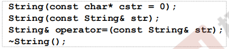  
2. 普通构造函数, 拷贝构造函数, 拷贝赋值函数
3. 普通构造和拷贝构造没什么好说的, 主要是拷贝赋值. 首先要判断是否会出现自我赋值, 然后先delete自己的指针, 再深拷贝对方的指针:
4. 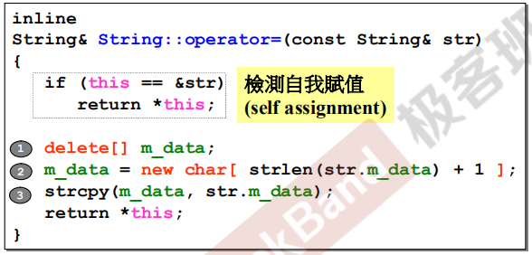  
5. 如果不检测自我赋值的话, delete自己指针的时候有可能把对方指针内容也删掉, 很危险

## 系统堆栈

1. 直接初始化的都是栈对象, 作用域结束的时候就会被清理, 也称为自动对象
2. 函数中定义的静态对象在函数作用域结束后依然存在, 直到程序结束
3. 全局域定义的称为全局对象, 也属于一种静态对象, 同样到程序结束才结束
4. 静态成员必须再类外定义, 不赋初值时静态成员为0
4. 借助new(malloc)初始化的是堆对象, 生命直到delete才会结束, 如果指针作用域时还没有被delete, 那么就会发生内存泄漏. 堆上的分配称为动态分配.
5. new的原理是先计算目标大小, 然后申请空间返回void*, 再强制转型为目标类型, 最后调用构造函数
6. 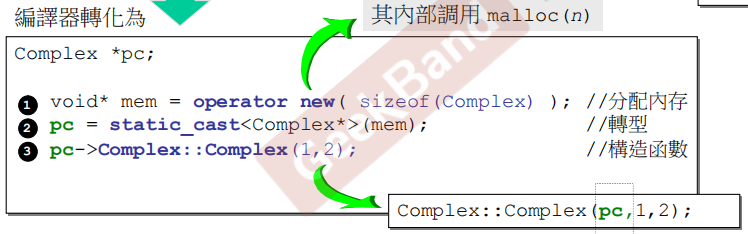  
7. delete的原理是先调用析构函数, 然后再回收内存. 只写delete的话只会调用一次析构函数, 如果指针是数组的话一定要写delete[]才会进行多次析构. 同样的new[]才会进行多次构造.
8. 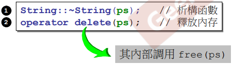  
9. 动态分配普通内存, 灰色部分是debug模式才有的调试信息, 青色部分是padding, 因为VC每块分配的内存都是16字节对齐的, 红色是标记了这段内存块整体大小的cookie, 其中cookie最后一位是1代表这块内存被分配了, 0代表可用.
10. 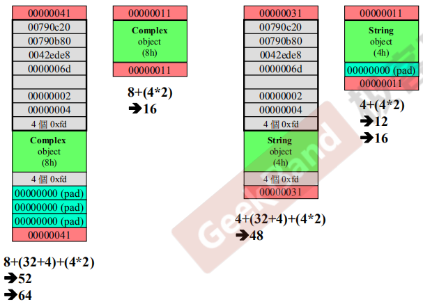  
11. 动态分配数组内存, 布局和上面差不多, 但是数组部分前面多了一个白色的整数标识了数组元素的数量
12. 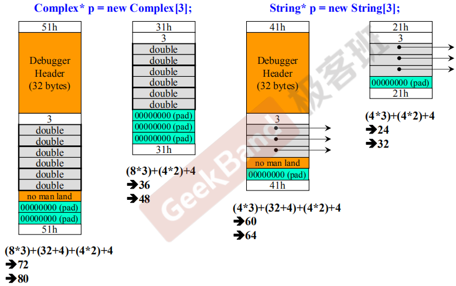  

## 继承, 复合, 委托

1. 继承代表is-a的关系, 功能来自父类
2. 复合代表has-a的关系, 功能来自类内包装的另一个对象
3. 委托, 利用指针实现, 功能来自类内一个指向另一个类的指针
4. 构造的时候都是从小到大(从父类到子类), 析构则相反, 内存分配也是大套小的

## 设计模式

1. 普通单例: 静态成员在类内, 只要一写出这个类就会构造
2. 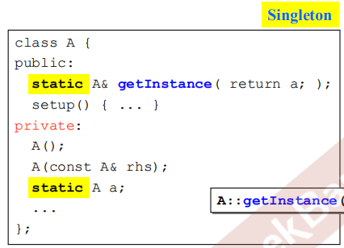  
2. Meyers单例: 核心的静态成员放在函数体内, 这样在主动调用这个类之前都不会进行构造
3. 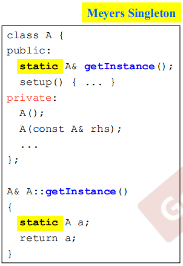  
3. 模板方法: 是继承和虚函数的一种典型应用. 父类写好一套算法流程, 但是其中调用的都是虚函数, 子类实现父类的函数后, 调用父类的算法流程, 父类由于本质上使用的是子类this指针, 因此会自动在流程中调用子类的实现.
4. 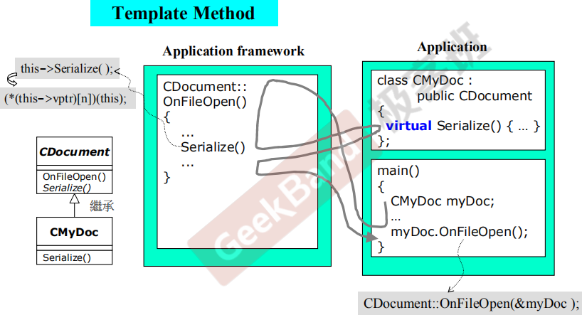  
2. 观察者: 委托和继承的结合. 主体委托了多个观察者, 观察者是派生关系因此可以用基类来委托. 主体发生改变的时候, 调用某个函数将自己传给所需的观察者, 观察者被唤醒于时开始处理.
3. 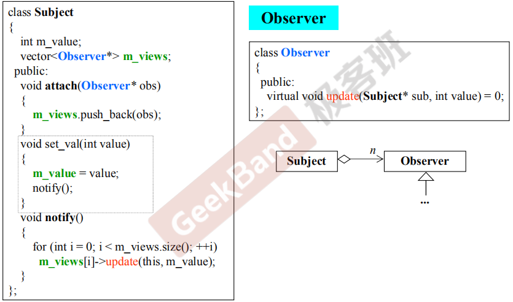  
3. 组件: 整个结构以多个不同派生但是基类相同的对象组成, 由于大家基类都相同所以可以互相嵌套
4. 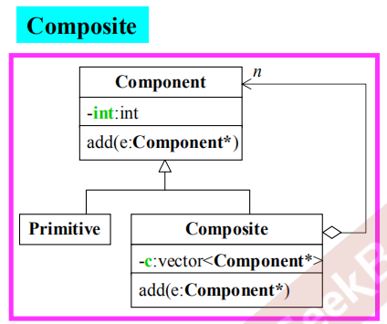  
4. 原型: 构造函数私有, 对外接口是clone, 通过clone某个委托了的原型对象来复制创建其它继承后的类. 主要用于从头构造代价大于拷贝构造的情况下.
5. 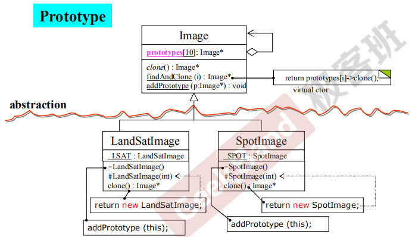  