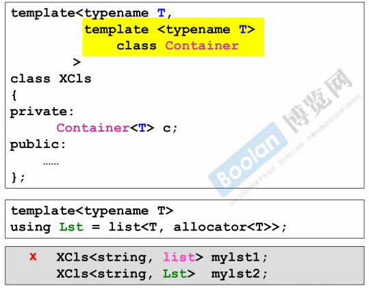
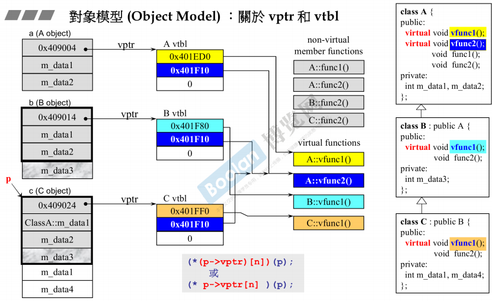
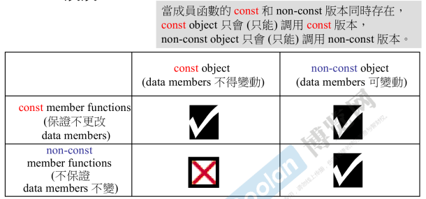

# C++面向对象高级编程(下)

- [C++面向对象高级编程(下)](#c面向对象高级编程下)
  - [转型函数](#转型函数)
  - [指针与引用](#指针与引用)
  - [模板](#模板)
  - [C++对象模型](#c对象模型)
  - [const](#const)
  - [new和delete](#new和delete)

## 转型函数

1. 转型函数一般写作 `operator TYPE() const {...}.` 没有返回类型因为函数名就是返回类型, 而且一般会加const因为一般转型不会改变对象内容.
2. 有一种特殊的转型就是隐式构造, 指构造函数参数只有一个且恰好就是当前需要被转型的类型. 此时只要处理后的返回值能符合需求就会发生隐式构造.
3. 可以通过在构造函数前面加上`explict`使得这个构造函数只能进行显式构造. 这个关键字比较少见, 几乎只会出现在构造函数的前面

## 指针与引用

1. 类中重载用于指针的运算符->时, 注意应该返回一个指针, 因为这个运算符比较特别, 编译器会将其重复展开直到获得实际内容为止
2. 引用是一种别名, 本质是指针但是被完全包装为了原本对象的样子
3. 引用必须在声明的时候初始化
4. 引用不允许后期改变值, 一旦定义就无法修改指向
5. 引用和range-for很搭, 可用来轻松修改容器的元素
6. 引用最常用于函数参数上, 作为一种漂亮的指针.

## 模板

1. 全特化的模板记得要去掉所有模板参数, 改写为template<>
2. 模板模板参数: 指模板参数里面是一个模板, 在这种情况下可以让另一个模板类作为参数导入, 只要保证可控的其它模板参数都能正确填满即可.
3.   
4. 模板参数的标注类型可以用class也可以用typename, 建议使用typename防止歧义

## C++对象模型

1. 不管是复合类还是继承类, 都是从内到外构造, 从外到内析构的.
2. 编译器默认在构造函数初始化阶段调用父类的默认构造函数, 然后在析构函数的最后一行调用父类的析构函数. 我们也可以自定义需要调用的构造和析构
3. 两者兼得的时候, 一般先构造继承, 然后构造复合, 最后构造子类本身. 析构反之. 但是要注意这个特性是编译器自己决定的, 不一定是这个安排
4. 只要某个对象有虚函数, 那么其内存中就有一个虚指针在结构的顶端, 但是指向的虚函数表是一个类一份的.
5. 因此我们说多态继承的时候是继承了函数的调用权而不是函数本身的空间
6.   
7. 虚指针指向虚函数表, 虚函数表按照目标类中函数的声明顺序对函数地址指针进行排列, 函数指针指向代码段中的函数代码位置
8. 对象的函数调用分为静态绑定和动态绑定两种, 静态绑定是指非虚函数和不满足多态条件的虚函数调用, 在静态绑定中的情况下, 编译后的代码实际上直接调用call跳转到真正函数的地址进行执行
9. 动态函数绑定需要满足三个条件: 通过指针进行调用, 指针是从子类上转型到父类的, 调用目标是虚函数. 当满足动态绑定的条件时, 编译后的代码会自动用对象顶部的虚函数指针转到虚函数表查询, 计算出符合条件的虚函数的地址后再`call`. 这个过程需要多出好多步的寄存器计算, 因此动态绑定运行起来比静态绑定慢
10. 之所以要用指针来进行多态本质是因为我们无法管理大小不一的容器, 但是管理指针很方便
11. 每当调用一个对象的函数时, 编译器会隐式传入一个`this`指针. this指针本质上是指向当前调用函数的这个对象地址的指针
12. 因为隐式传入的是指针, 因此可以通过让指针调用虚函数来实现模板设计模式

## const

1. const默认是作用在左边目标上的, 但是当左边没有元素时const也会作用到右边目标. 这本质上是受到C编译器从左开始扫描处理的实现原理影响.
2.   
3. const具体分为const函数和const对象. const对象不能被修改, 而const函数保证不修改函数内的值. 我们应该将其理解为一种程序内的协议来看上面的图, 保证了元素不被改变的对象不能调用non-const函数
4. 因此为了最大化使用范围, 我们应该尽可能编写const型函数, 防止看似无伤大雅的const对象无法调用所需函数
4. 函数是否const是可以区分语义的, 也就是属于一种override. 程序区分的方法是当两个版本同时存在的时候, 对象只会调用与自己对应的版本.
5. 由于const这个分类调用的特性, 我们可以对一些共享数据型的对象(例如string底层对字符串本身是共享储存的)进行优化, 当对象是const时, 无须考虑底层是否是共享的问题, 直接返回一个底层的拷贝值即可. 但是当对象不是const时, 访问数据的时候就需要拷贝一份然后返回引用以供外部安全修改了.

## new和delete

1. new和delete本身是表达式, 其本身的行为是无法修改的:
   1. new: 先调用operator new函数, 其内部通常包装了malloc函数申请内存, 返回void*. 然后调用构造函数在内存上填写所需的信息, 最后返回强制转型的目标类型指针
   2. delete: 先在目标内存上调用析构函数, 然后调用operator delete函数, 内部一般封装了free函数将指针内存进行释放
2. 我们可以重载的是operator new和operator delete函数, 且不但可以重载类成员的, 还可以重载全局的. 对这两个函数进行重载一般都是为了自己维护内存, 进行例如内存池的特殊设计
3. new的签名是`void* operator new(size_t)`, 参数是需要申请的内存的大小, 这个参数的值是由编译器自动填入的. delete的签名是`void operator delete(void* ptr)`, 自然就是对应内存的指针
4. 还有一类是数组型分配new[\]和delete[\], 其行为有些许变化:
   1. new[]: 先调用operator new[]函数, 此时参数是符合数组的`sizeof(TYPE)*N+4`, 这里的4是为了标识数组内对象的数量, 否则以后就无法正确析构了. 申请完空间后会自动调用多次构造函数最后返回所需的指针
   2. delete[]: 自动多次析构最后, 最后调用operator delete[]函数
5. 虽然没什么必要但是我们可以使用::new或::delete来强制调用全局版本的函数
6. operator new和operator delete也可以重载, 其重载称为placement arguments版本, 也就是给他们加上额外的参数列, 参数在使用new的时候传入, 可以进行不太一样的自定义操作
7. 但是这里要注意placement new可以自由使用, 但是placement delete无法主动调用, 它只在new产生异常的时候, 编译器自动进行对应版本的调用(没有匹配版本则使用默认版本), 且从placement new中提取输入的参数交给placement delete, 其目的仅仅是让程序员可以在异常发生的时候也正确归还那些构造到一半的内存.