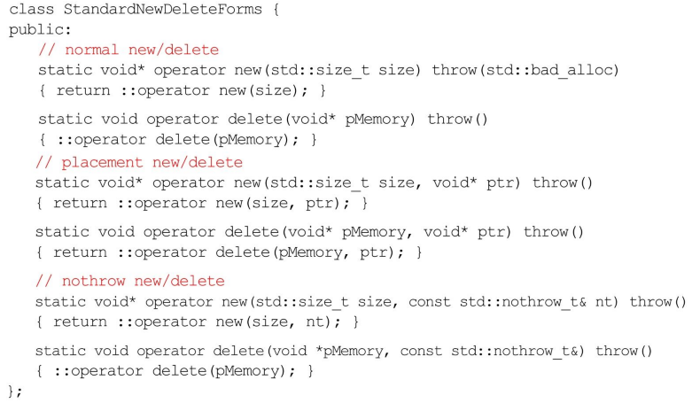

# Effective C++ 笔记

- [Effective C++ 笔记](#effective-c-笔记)
  - [0 导读](#0-导读)
  - [1 让自己习惯C++](#1-让自己习惯c)
    - [1 视C++为一个语言联邦](#1-视c为一个语言联邦)
    - [2 尽量以const, enum, inline 替换 #define](#2-尽量以const-enum-inline-替换-define)
    - [3 尽可能使用const](#3-尽可能使用const)
    - [4 确认对象被使用前已先被初始化](#4-确认对象被使用前已先被初始化)
  - [2 构造/析构/赋值运算](#2-构造析构赋值运算)
    - [5 了解C++默默编写并调用哪些函数](#5-了解c默默编写并调用哪些函数)
    - [6 若不想使用编译器自动生成的函数, 就该明确拒绝](#6-若不想使用编译器自动生成的函数-就该明确拒绝)
    - [7 为多态基类声明virtual析构函数](#7-为多态基类声明virtual析构函数)
    - [8 别让异常逃离析构函数](#8-别让异常逃离析构函数)
    - [9 绝不在构造和析构过程中调用virtual函数](#9-绝不在构造和析构过程中调用virtual函数)
    - [10 令operator=返回一个reference to *this](#10-令operator返回一个reference-to-this)
    - [11 在operator=中处理"自我赋值"](#11-在operator中处理自我赋值)
    - [12 复制对象时勿忘其每一个成分](#12-复制对象时勿忘其每一个成分)
  - [3 资源管理](#3-资源管理)
    - [13 以对象管理资源](#13-以对象管理资源)
    - [14 在资源类中小心Copying行为](#14-在资源类中小心copying行为)
    - [15 在资源管理器中提供对原始资源的访问](#15-在资源管理器中提供对原始资源的访问)
    - [16 成对使用的new和delete时要采取相同的形式](#16-成对使用的new和delete时要采取相同的形式)
    - [17 以独立语句将newed对象置入智能指针](#17-以独立语句将newed对象置入智能指针)
  - [4 设计与声明](#4-设计与声明)
    - [18 让接口容易被正确使用, 不易被误用](#18-让接口容易被正确使用-不易被误用)
    - [19 设计class犹如设计type](#19-设计class犹如设计type)
    - [20 宁以pass-by-reference-to-const替换pass-by-value](#20-宁以pass-by-reference-to-const替换pass-by-value)
    - [21 必须返回对象时, 别妄想返回其reference](#21-必须返回对象时-别妄想返回其reference)
    - [22 将成员变量声明为private](#22-将成员变量声明为private)
    - [23 宁以no-member, non-friend替换member函数](#23-宁以no-member-non-friend替换member函数)
    - [24 若所有参数皆需类型转换, 请为此采用non-member函数](#24-若所有参数皆需类型转换-请为此采用non-member函数)
    - [25 考虑写出一个不抛异常的swap函数](#25-考虑写出一个不抛异常的swap函数)
  - [5 实现](#5-实现)
    - [26 尽可能延后变量定义式的出现时间](#26-尽可能延后变量定义式的出现时间)
    - [27 尽量少做转型动作](#27-尽量少做转型动作)
    - [28 避免返回handles指向对象内部成分](#28-避免返回handles指向对象内部成分)
    - [29 为"异常安全"而努力是值得的](#29-为异常安全而努力是值得的)
    - [30 透彻了解inlining的里里外外](#30-透彻了解inlining的里里外外)
    - [31 将文件间的编译依存关系降至最低](#31-将文件间的编译依存关系降至最低)
  - [6 继承与面向对象设计](#6-继承与面向对象设计)
    - [32 确定你的public继承塑模出is-a关系](#32-确定你的public继承塑模出is-a关系)
    - [33 避免遮掩继承而来的名称](#33-避免遮掩继承而来的名称)
    - [34 区分接口继承和实现继承](#34-区分接口继承和实现继承)
    - [35 考虑virtual函数的其他选择](#35-考虑virtual函数的其他选择)
    - [36 绝不重新定义继承而来的non-virtual函数](#36-绝不重新定义继承而来的non-virtual函数)
    - [37 绝不重新定义继承而来的缺省参数值](#37-绝不重新定义继承而来的缺省参数值)
    - [38 通过复合塑模出has-a关系或"根据某物实现出"特性](#38-通过复合塑模出has-a关系或根据某物实现出特性)
    - [39 明智而审慎地使用private继承](#39-明智而审慎地使用private继承)
    - [40 明智而审慎地使用多重继承](#40-明智而审慎地使用多重继承)
  - [7 模板与泛型编程](#7-模板与泛型编程)
    - [41 了解隐式接口和编译期多态](#41-了解隐式接口和编译期多态)
    - [42 了解typename的双重意义](#42-了解typename的双重意义)
    - [43 学习处理模板化基类内的名称](#43-学习处理模板化基类内的名称)
    - [44 将与参数无关的代码抽离](#44-将与参数无关的代码抽离)
    - [45 运用成员函数模板接受所有兼容类型](#45-运用成员函数模板接受所有兼容类型)
    - [46 需要类型转换的时候请为模板定义非成员函数](#46-需要类型转换的时候请为模板定义非成员函数)
    - [47 请使用traits classes 表示类型信息](#47-请使用traits-classes-表示类型信息)
    - [48 认识template元编程](#48-认识template元编程)
  - [8 定制new和delete](#8-定制new和delete)
    - [49 了解new-handler的行为](#49-了解new-handler的行为)
    - [50 了解new和delete的合理替换时机](#50-了解new和delete的合理替换时机)
    - [51 编写new和delete时需固守常规](#51-编写new和delete时需固守常规)
    - [52 写了placement new也要写placement delete](#52-写了placement-new也要写placement-delete)
  - [9 杂项讨论](#9-杂项讨论)
    - [53 不要轻忽编译器的警告](#53-不要轻忽编译器的警告)
    - [54 让自己熟悉包括TR1在内的标准程序库](#54-让自己熟悉包括tr1在内的标准程序库)
    - [55 让自己熟悉Boost](#55-让自己熟悉boost)

## 0 导读

1. `size_t`是一个typedef, 一般指无符号整型unsigned
2. 除非有一个好理由令构造函数用于隐式类型转换, 否则声明为explict
3. C++有大量未定义(undefined)的行为, 一定要小心. 这些行为结果并非报错, 而是与编译器和执行环境相关的无法估计的结果
4. "接口"通常指函数的签名

## 1 让自己习惯C++

### 1 视C++为一个语言联邦

1. 将C++看作是以多个相关语言组成的结合体而不是一个关系紧密的单一语言:
   1. C语言: C++的基础结构
   2. 面向对象部分: C++创造时的目标
   3. 模板C++: 为了支持泛型编程而创建的语法, 并实现了模板元编程(TMP)这种奇技淫巧
   4. 标准模板库: 充分运用了模板C++编写的程序库, 每个开发者都应该学习STL
2. C++各个部分功能上有很大的重叠, 使用的时候要视乎自己使用目标来选用合适的分部

### 2 尽量以const, enum, inline 替换 #define

1. `#define`并不被视作语言的一部分, 因为它属于预处理器, 是运行在编译阶段之前的
2. 现代C++不建议使用预处理器, 因为它无法进行复杂的计算, 只能机械地对代码进行预处理, 且在处理后就与编译器断开了联系, 无法debug
3. 尽量别用`#define`, 因为你这里define的变量/函数仅仅是机械地进行了替换, 不会进入编译器的记号表因此编译器无法看到define的变量名, 会出现很多难以追踪的常量
5. 需要define常数时, 改用const变量可以解决绝大多数问题
6. 对于需要在编译期使用的常量, 可以用如下的enum hack来实现. 这样声明出来的元素可以在编译期使用, 且不会消耗额外的内存. 由于是编译期技术, 这个技巧在TMP中也很常用
7.   
8. 宏函数由于避免了函数调用开销因此可以带来很高的执行效率, 但是要记得宏函数中每个变量最好都加上小括号, 保证生成出的代码不会那么容易遇到优先级问题
9. 对于宏函数我们还应该用inline模板函数来代替, 通过模板操作我们可以让函数接收任何类型的值, 且获得各种提前检测和访问控制. 通过inline的特性模板函数能够达到和宏一样的效率

### 3 尽可能使用const

1. 只要某个对象事实上是不变的, 那么就应该标记const, 这样能获得更大的使用范围
2. const的特性: 默认作用于左边的对象, 如果左边没有对象, 那么作用于右边. 因此`const T * const Foo() const;`第一个const由于左边没有对象, 作用于右边的T上, 表示函数返回的指针指向的值不能改变. 第二个const左边有对象, 是指针符, 因此表示这个指针本身的值(地址)也是不能改变的. 第三个const左边是函数名, 表示这个函数也是const, 不会改变其内部对象的值.
3. const迭代器: 直接给STL迭代器标记const代表这个迭代器自身地址不能改变, 也就是不能++iter之类的, 但指向的对象依然可以改变. 如果要封锁指向的对象应该使用const_iterator.
4. 除非需要改变函数的参数, 否则保持一个好习惯就是让函数参数都是const的, 这样能获得更大的使用范围.
5. 改善C++效率的一大方法就是以`const引用`方式传递参数
6. C++的const函数不可以更改对象内的非static变量, 但是依然可以从指针修改内容, 要小心
7. 有些时候我们希望写一个const函数但是令其在某些特殊时候能修改某些变量, 那么我们可以将那些变量声明为mutable使其脱离const的掌控
8. 一个函数如果只有常量性不同, 依然可以被重载, 那么为了我们代码的清洁高效, 最好先实现其const版本, 然后对其用`常量性转除`包装出非const版本, 要注意这里的写法比较特别(傻): 由于我们需要明确调用const版本的自己的重载函数, 因此需要先将自己用`static_cast`转型为const, 从而令编译器调用const版本的函数, 随后再用`const_cast`去掉返回值上的const标记.
9.   
10. 除了这种特殊情况外, 尽量不要使用`const_cast`, 去除const标记可能造成危险的后果

### 4 确认对象被使用前已先被初始化

1. 对于内置类型, 一定要在使用前对其初始化, 最好放在很近的地方才不会忘记
2. 对于自定类型, 则应该在构造函数完善地初始化
3. 对于类的成员, 尽可能不要在构造函数内再初始化自己的元素, 因为在进入构造函数之前自定类型就会被调用默认初始化了, 构造函数内进行的实际上是拷贝构造, 但又要注意内置类型并不会调用默认初始化, 所以内置类型应该用类内初始化优化.
4. 如果希望自定成员不要默认初始化, 那么应该在初值列中进行初始化, 这会覆盖掉编译器的设置, 即便是默认初始化我们也可以不传递参数从而显式进行默认初始化
5. 因此为了防止遗漏, 我们可以对每个类成员都在初值列中进行初始化.
6. 使用初值列初始化的时候还要注意成员依赖的问题, 时刻记得: 成员在初值列中初始化的顺序至于其在类内的声明顺序相同, 为了防止混乱我们应该也按照声明顺序在初值列进行排列
6. 以上可能导致初值列本身产生重复, 那么对于那些赋值和直接初始化效果一样好(例如那些需要借助数据库进行真正的初始化的成员)则应该移进一个统一的特殊函数中(Setup函数), 然后在构造函数中调用这个函数
7. 对于static成员又要注意, C++对于全局的static对象的初始化并没有顺序约束, 因此类初始化的时候有可能static成员还未初始化, 为了解决这个问题, 更好的方式是将static成员写在专属的函数内(单例模式), 等到调用那个函数的时候再进行懒初始化.
8. 但是在多线程环境中又有问题, 所有static成员之间可能会产生竞速关系. 为了解决这个问题, 最好在程序最开始还是单线程启动的时候在一个函数中有顺序地集中初始化所需的所有static成员, 然后再启动多线程

## 2 构造/析构/赋值运算

### 5 了解C++默默编写并调用哪些函数

1. 编译器会在类的构造函数被调用但是我们没有自己声明时自动创建, 所有自动创建的函数都是public, non-virtual且inline的, 只会简单地将非static成员拷贝到目标对象中.
2. 只有当编译器能够确认自己可以合法进行操作时编译器才会自动生成默认函数, 否则编译器拒绝生成相关的函数. 例如包含了引用成员的类和包含const成员的类都不会生成默认的拷贝构造函数

### 6 若不想使用编译器自动生成的函数, 就该明确拒绝

1. 拒绝编译器自动生成函数的传统方法是自己声明一个private的对应函数然后固定不去实现它.
2. C++11后加入了`=delete`操作, 让我们可以明确删除某些函数的生成

### 7 为多态基类声明virtual析构函数

1. 对所有多态基类来说, 声明虚析构函数非常重要, 这是因为派生类如果被基类指针指着, 然后被delete, 此时基类没有虚析构函数, 那么此时这个对象实际上会调用基类的析构函数(因为没有多态), 于是整个内存的回收是不完全的, 会导致一个局部销毁的对象从而引发内存泄漏
2. 最好的解决方法就是对于任何一个将要用来继承的类都实现虚析构函数
3. 判断的方法: 如果一个类没有虚函数, 那就代表它本身不愿意被用作一个基类. STL的所有容器都没有虚函数
4. C++11后引入了final关键字可以用来中断类后续的继承行为
5. 当程序在析构的时候, 会从最深处开始析构, 逐步调用析构函数, 因此基类的虚析构需要一个定义, 可以是空定义

### 8 别让异常逃离析构函数

1. 由于在C++中两个异常同时存在会导致未定义行为, 因此我们不应该让析构函数上报异常, 这是因为析构函数是会被自动调用的, 当一个对象析构而抛出异常时, 同个作用域的其它对象的析构也会被自动执行, 此时有可能继续抛出异常导致多异常未定义
2. 因此我们应该将所有析构函数用try-catch包裹起来, 可以选择吞掉异常然后继续执行, 也可选择记录后结束程序
3. 更合理的方法是额外写一个close函数, 用户可以主动调用close函数来执行和析构同样的行为, 这样用户就能自己处理可能发生的析构的异常, 同时依然要给真正的析构用try-catch包裹起到双保险的作用
  
### 9 绝不在构造和析构过程中调用virtual函数

1. 派生类构造期间, 是先构造基类, 然后逐级向上构造的, 底层构造完成前, 派生类的相关变量都是未定义的.
2. 因此如果在构造函数中调用了虚函数, 那么会根据当前正在构造的类型来调用相应的虚函数版本, 而非派生类的版本. 析构函数尽管调用顺序相反但是思路一致
3. 所以不要在析构/构造过程中调用虚函数
4. 补偿方法是将需要让派生类执行的函数以非虚函数的形式写好, 然后将其所需的变量通过构造函数在构造初值列中进行传递. 传递变量时如果需要进行计算的话最好使用static函数, 这样能够保证不会使用到派生类中还未初始化的变量

### 10 令operator=返回一个reference to *this

1. 为了实现连锁赋值的惯例操作, 最好令重载的赋值运算符以引用的形式返回*this
2. 这只是个协议, 但最好遵守

### 11 在operator=中处理"自我赋值"

1. 当对象中存在指针申请的空间时, 在赋值运算符中我们一般都会释放旧空间, 然后创建一份和待复制内存相同的内存, 再指向新内存. 但是这里的问题是如果目标和当前对象是相同的(也就是别名), 则会提前将目标内存释放.
2. 处理自我赋值问题有几个方式:
   1. 证同测试: 在拷贝构造函数的最前面用if判断目标对象与当前对象地址是否相同, 相同则直接返回*this. 这种方法的缺点是如果new的时候发生异常, 此时当前对象的指针已经被释放, 那么这个对象就会留下一个错误的指针
   2.   
   2. 备份指针: 在一开始对指针进行备份, 然后new一个复制的内存, 当没有异常发生时才去释放原先的内存, 否则这里指针不会被修改. 这个方法顺便解决了证同问题
   3.   
   3. 证同+备份: 如果对效率要求很高的话可以在备份指针的方法最前面再引入证同测试, 但是要衡量引入额外的if语句是否值得
   4. 复制构造并交换: 用赋值构造的方法构造一个当前类型的副本, 然后将自己的数据与副本交换. 如果拷贝构造是以值形式传入参数的话, 还可以直接将当前对象数据与传值进入的对象进行交换
   5.   

### 12 复制对象时勿忘其每一个成分

1. 当你选择实现自己的拷贝构造函数时, 一定要手动复制所有的局部变量, 同时调用所有基类合适的拷贝函数
2. 如果有一些成员变量没有在初值列中进行拷贝, 那么此时对象将会进入局部拷贝状态
3. 如果只拷贝了成员变量而没有调用基类的拷贝函数, 那么此时基类部分将会被默认初始化, 也属于一种局部拷贝
4. 很多时候基类的拷贝函数与派生类的拷贝函数会有很多代码的重叠部分, 但是千万不能用拷贝函数调用拷贝函数, 这相当于试图构造一个已经存在的对象, 很容易导致对象被破坏. 正确的做法是额外写一个init函数包含通用代码, 然后让两个拷贝函数都调用它来初始化

## 3 资源管理

### 13 以对象管理资源

1. 资源获取时机便是初始化管理对象的时机(Resource Acquisition Is Initialization; RAII)
2. 在堆上分配内存后就要记得在控制流离开的时候回收它. 但是手动回收很不方便, 很容易忘记释放, 例如一个提早的return, 或者跳出的异常
3. 最好的方法是通过在栈上分配的智能指针来管理对象, 因为智能指针是栈上分配的模板类, 所以会在控制流离开的时候自动调用析构里的delete
4. 养成习惯: 获得堆资源后立刻放入管理对象中(构造与new写于同一语句), 这样最大程度确保自己不会遗漏释放
5. 智能指针的思路类似其它语言的垃圾回收机制, 区别是垃圾回收器是在后台运行的另一套系统, 而智能指针是语言范围内的一种结构而已
6. 智能指针在内存上与原始指针几乎相同(顶多多一个引用计数器), 速度上也相差无几
7. 三种标准库智能指针, 都在memory里:
   1. `unique_ptr`: 独占指针, 相当于以前的`auto_ptr`, 只能移动而不可复制(复制操作默认是移动语义的), 没有其它成员变量, 可以用`make_unique`来初始化数组
   2. `shared_ptr`: 有引用计数的指针, 因此可以复制
   3. `weak_ptr`: 不参与引用计数, 与`shared_ptr`一起使用

### 14 在资源类中小心Copying行为

1. 这一条是当你不得不自己建立资源管理类的时候要注意的
2. 如果对RAII进行复制是不合理的, 那么就应该禁止它, 参考`unique_ptr`
3. 对于需要保留资源在多个对象手上的情况, 参考`shared_ptr`设置底层的引用计数器, 额外写一个删除器(deleter)在引用计数为0时调用
4. 复制资源管理对象的时候要确保是深拷贝的, 同时需要维护好各自的引用计数和析构
5. copy函数会被编译器自动创建, 记得注意

### 15 在资源管理器中提供对原始资源的访问

1. 很多函数API要求访问原始指针, 因此自己写的资源管理器一定要写好访问原始指针的接口方法, 同时在日常中通过重载调用运算来模拟指针方便开发
2. 隐式类型转换可以写, 比较自然, 但是有时有危险
3. 更常见的情景是写一个显式的get函数来获取原始指针
4. 牢记RAII类不是为了封装数据存在的, 而是为了给原始指针加上资源回收的功能, 所以不必给RAII类加太多功能

### 16 成对使用的new和delete时要采取相同的形式

1. 由于下图的内存排列特性, 不要混淆不同的new和delete, 否则容易引发未定义行为. delete[]会对内存最前面进行大小读取, 从而确认析构的次数并进行多次析构
2.   
3. 因此new和delete一定要成对使用
4. 尽量不要对数组形式使用typedef, 容易让自己忘掉delete[]

### 17 以独立语句将newed对象置入智能指针

1.   
2. 写出上面那种在一个语句(尤其是函数参数列)中执行new, 构造智能指针, 和其它操作的代码很危险. 因为编译器会自由安排函数不同参数的求值顺序, 有可能顺序变为new->调用函数->构造智能指针. 一旦这里调用函数的时候跳出异常, 那么new的返回值无法交给构造函数, 就无法delete从而产生很奇怪的内存泄露
3. 由于编译器对跨语句调用顺序没有排列的自由, 因此一定要记得在独立语句中将new置入智能指针, 然后再进行别的

## 4 设计与声明

### 18 让接口容易被正确使用, 不易被误用

1. 理想上通过了定义的代码都应该能得到正确的结果, 出现问题应该属于我们的接口没有足够方便客户使用的原因
2. 为了限制客户输入的元素类型, 可以额外建立一些专门用于输入处理的外覆类型, 然后限制客户对于那些类型可以进行的操作
3. 设计接口和行为的时候应该最大程度与内置类型一致
4. 接口应该尽力提供一致的接口, 一致性比其它的很多属性都要重要
5. 不要假设你的用户能记得一些使用规范
6. 需要返回指针时, 不如返回智能指针, 这样能避免内存回收的难题, 并通过自定义删除器来解决跨DLL销毁问题

### 19 设计class犹如设计type

1. 应该像"语言设计者设计基本类型时"一样审慎地研究class的设计
2. 有以下几点一定要在创立前进行思考:
   1. 如何创建和销毁
   2. 初始化和赋值的区别
   3. 如果被按值传递的话会有什么区别
   4. 有哪些是"合法值"
   5. 需要继承/被继承么
   6. 需要哪些类型转换
   7. 需要哪些操作符
   8. 哪些编译器函数需要拒绝
   9. 成员的访问性
   10. 哪些接口需要实现
   11. 设计有多么一般化
   12. 真的需要这个type么

### 20 宁以pass-by-reference-to-const替换pass-by-value

1. 缺省情况下C++默认传值方式将对象传到函数, 也就是由拷贝构造函数生成
2. 因此如果只是简单地传入对象会浪费很多的构造/析构操作, 最好的做法是传const引用
3. 传const是为了让调用的人放心传入, 同时传入引用还能避免对象切割问题(派生类传入声明为基类的参数时派生类会退化为基类), 起到多态的效果
4. 传引用的底层实现是指针, 因此对于内置类型和STL迭代器与STL函数对象, 传值的效率会高于传引用, 这是底层决定的.
5. 其它情况尽量都使用传引用, 因为大多数时候copy的代价都大于指针, 且难以被编译器优化

### 21 必须返回对象时, 别妄想返回其reference

1. 返回对象引用时, 一定要记住引用只是别名, 底层是指针, 所以返回局部对象的引用的行为绝对是致命的
2. 看到static变量的时候要注意多线程中可能遇到的问题和求值顺序可能带来的问题
3. 当用拷贝来返回局部变量是最简单最安全的实现方法时, 那就直接用, 让编译器去处理效率问题

### 22 将成员变量声明为private

1. 将成员变量声明为private然后用public接口来控制可以为系统带来约束, 并保留日后变更具体实现的空间, 降低维护代价
2. 使用protected在实际项目中同样会影响大量调用了这个protected的衍生类, 因此封装效果本质上和public接近

### 23 宁以no-member, non-friend替换member函数

1. 有点反直觉的条目, 编写非成员也非友元的工具函数来操作一个类比编写这个类的成员函数能带来更大的封装性. 这是因为工具函数只能访问目标的公有部分, 因此与目标只有很低的依赖关系, 而成员函数可以访问目标的所有内容, 反而获得了最大的依赖
2. 因此当这个工具函数可以完全依赖目标类的公有方法来实现时, 那么这个函数就不需要是一个成员函数
3. 而为了整合这样的工具函数, 最好将它们放到同个"工具"命名空间中(标准库std就是这样的设计思路), 这样用户也方便扩展出自己的工具函数放到命名空间中整理, 同时我们也可也将不同的工具写在不同的头文件中只要它们处于同一个命名空间即可

### 24 若所有参数皆需类型转换, 请为此采用non-member函数

1. 只有当参数被列于参数列中时, 这个参数才能参与隐式类型转换(*this不算在内)
2. 当一个函数的所有参数都需要进行类型转换时(时常发生在运算符重载函数上, 因为大多数运算符都需要符合交换律, 而此时如果是成员函数, 调用函数的对象本身并不处于参数列中, 这会导致调用错误), 应该使用非成员函数然后写入所有所需的参数
3. member的反面是non-member而不是friend, friend时常带来麻烦最好还是谨慎使用

### 25 考虑写出一个不抛异常的swap函数

1. swap函数非常重要, 在编程中很常使用, 因此一定要适当地实现它. 然而泛用实现的std::swap函数仅仅是用temp和copy来交换两个引用对象, 除非效率可以接受否则还是应该自定义
2. 好的swap函数的核心是借助pimpl(指针指向实现)手法, 利用交换双方的实现指针来完成交换, 所以当自己的类型符合pimpl可以进行以下设计:
   1. 首先在类中定义一个公有的swap函数, 它负责交换指针的实现, 被其它函数调用. 这个成员swap千万不能抛出异常, 这是条款29的基石协议.
   2. 然后在我们自己的命名空间中提供一个非成员的swap函数调用类内的成员swap. 这个版本的swap可以有复杂的偏特化
   3. 再在std命名空间中提供一个只关于类本身(不允许是模板类)的swap特化, 同样调用我们的成员swap. 不允许是模板类是因为std的设计协议就是不要为std添加任何额外的模板, 函数, 类等等, 我们只允许添加新的模板特化版本
   4. 最后在我们需要调用swap的时候, 先`using std::swap;`暴露出std的swap, 这样编译器进行函数搜索的时候会优先查找当前命名空间的swap, 找不到时会再去找std的swap

## 5 实现

### 26 尽可能延后变量定义式的出现时间

1. 只要定义了一个变量, 当控制流到达这个变量时, 就不得不承担其构造成本和后续的析构成本
2. 这个析构成本有时候由于提前返回, 异常, 分支等等原因, 我们需要无端背负它们, 无谓的构造, 然后无谓地析构
3. 因此我们应该尽量延后变量的定义, 甚至直到我们能给它们初始化实参, 将其写在其它函数的构造序列中为止
4. 循环中的变量是特殊情况, 如果目标的赋值成本低于构造+析构成本, 那么就应该在循环外定义, 否则在循环里面. 在循环外面定义变量有时候会造成误解

### 27 尽量少做转型动作

1. 和其它很多语言不同, C++的显式转型在很多时候是可以避免的. 为了减少副作用尽量应该少转型
2. C++有四大类新式转型, 处于方便后续查找和窄化转型的使用范围, 最好始终都用新式转型:
   1. `const_cast`: 将对象的const, volatile, __unaligned属性去除. 是唯一能做到这一点的新式转型符
   2. `dynamic_cast`: 安全下转型(动态转型). 是运行时类型识别(RTTI)的一大工具, 可以将引用, 指针, 右值引用从基类转到派生类. 使用场景和`static_cast`类似, 在下转型的时候会进行动态类型检查, 能提早排查出`static_cast`找不出的错误. 指针转型失败的时候会抛出空指针, 引用失败则抛出异常.
   3. `reinterpret_cast`: 低级转型. 对内存区域进行位级别的重新解释, 可以处理所有类型的指针. 很少使用. 其结果与编译器有关, 所以不可移植. 
   4. `static_cast`: 静态转型. 相当于传统的强制类型转换, 是最常用的转换. 只要目标类型不包含const, 就都可以用这个转换, 例如从void*中恢复原来的类型. 这个转换不会经过运行时检测, 所以使用的时候要小心.
3. 使用转型的时候要注意转型往往会编译出运行时不同的代码, 例如int转double必然导致底层安排发生改变.
4. `static_cast`将基类进行下转型后, 并不代表其就一定能调用派生类的函数了, 它仍然调用着基类自己的函数, 因为它是编译期实现的, 无法动态得知当前对象的继承关系
5. `dynamic_cast`适用于需要为一个认定为派生类的基类动态调用非虚派生类函数, 这是`static_cast`做不到的. 由于会改变函数表的指向且需要进行大量继承分析, 因此这个转型很危险且很多时候执行得很慢. 最好还是尽量用虚函数多态来解决这个问题
6. 尤其要用多态来代替if语句完成的一连串`dynamic_cast`, 大量的`dynamic_cast`得到的代码又大又慢

### 28 避免返回handles指向对象内部成分

1. 在设计成员函数的时候要小心不要创建了一些低封装性的接口暴露了内部高封装的成员, 例如一个public函数返回了一个private成员的引用就完全破坏了封装
2. 解决方法是遇到这类需求的时候, 给返回值加上const
3. 但是即便如此返回诸如指针和引用的handles仍然危险, 用户可能会因为返回了一个右值的handle从而得到了一个空悬指针

### 29 为"异常安全"而努力是值得的

1. 声称自己是异常安全的函数需要向外提供以下三个保证之一:
   1. 基本承诺: 如果异常被抛出, 程序的所有事务仍然保持在有效的状态下, 不会有类似互斥锁没有释放的情况, 但有可能改变部分程序状态, 例如流的读取记号改变
   2. 强烈保证: 如果异常被抛出, 程序状态不改变, 这种函数的执行只有完全成功和回滚两种可能
   3. 不抛出: 承诺在内部处理并吞掉异常, 外部一切都能正常继续运行. 所有的内置类型都是不抛出的, 是最强烈的保证
2. 我们应该尽可能编写异常安全的代码
3. 不抛出保证实际上很难达成, 大部分时候我们只能妥协于其它两个保证
4. copy and swap是能产生强烈保证的一大技巧: 首先将需要修改的对象创建出一个副本, 然后修改那个副本, 一切正常的时候才用swap进行交换.
5. copy and swap技巧通常借助pimpl, 也就是在类内部用智能指针指向实际运作的对象, 然后交换指针来实现.
6. copy and swap并不总有强烈保证, 这是因为函数内部常常存在连带影响, 几个异常安全的函数由于可能修改了外部数据而导致它们的结合体不再安全
7. 强烈保证许多时候需要巨大的开销来实现, 因此基本保证最终才是最常用的
8. 一个软件要么就具备异常安全性, 要么就不要具备. 局部异常安全没有意义.

### 30 透彻了解inlining的里里外外

1. 标记函数为inline后, 编译器就有能力进行优化了. 但inline优化通常策略是对每个函数调用都进行函数展开, 这可能导致生成的目标码太大, 产生额外的内存换页问题
2. 编译器会权衡inline替换的函数和直接调用函数两者产生的目标码的代价差异, 自己决定是否优化
3. inline和template一样, 通常被定义在头文件中, 这是因为编译器进行替换的时候需要能够直接明白它们的形式. 但不要将template和inline混淆, 没有理由要求template的所有函数都是inline的
4. inline通常都是编译期行为, 很少环境能在连接期甚至运行期进行inline
5. 几乎所有虚函数调用都不会inline
6. 编译器拒绝inline的时候通常会提出一个警告
7. 如果程序需要获取函数的地址, 那么那个函数会被编译器生成出outlined的版本
8. 构造函数和析构函数往往很不适合inline, 因为它们常常会自动生成大量隐藏的代码, 例如对基类的构造, 大量的异常处理等. 如果它们被inline, 代码将会高速膨胀.
9. inline的函数无法随着程序库的升级而升级. 当一个inline函数被改变时, 其它所有用到这个函数的文件都需要重新编译
10. 通常我们无法对inline函数进行断点调试
11. 建议一开始不要inline任何函数, 或者最多inline那些非常简单的函数上, 直到后期优化的时候再来用inline精细优化高消耗的代码.

### 31 将文件间的编译依存关系降至最低

1. C++文件间相互依赖的本质原因是编译依存关系: 编译器必须在编译期间直到函数内定义的对象的大小, 这导致了编译器必须看见目标对象的定义
2. 采用指针指向实现(pointer to implementation; pimpl)的设计思路可以解决这个问题, 因为此时编译器就了解对象大小只是一个指针. 为此需要为类编写两个头文件:
   1. 接口类头文件: 同时包含若干声明. 接口类有两种形式, 一种是一个在头文件中inline完整实现的委托类, 其成员只有一个指向实现对象的指针, 通过同步所有的接口并利用指针间接调用来实现. 令一种是写为一个纯虚基类, 所有接口都是纯虚函数用来多态调用实现类的具体函数.
   2. 实现类头文件: 以工厂模式扮演具现化对象的目标, 都有一个static的初始化函数以供接口类获得指向自己的指针. 这个初始化函数一般在接口类的构造函数或初始化列表中被调用. 别忘了虚析构函数
3. 采用这种方法将实现和接口解耦的代价是运行期需要额外增加很多间接访问, 且对象增加一个实现指针或一个虚表指针的内存. 但是同样, 等到代价成为瓶颈时再去更新
4. 减少编译依存关系还有以下两个老操作:
   1. 如果使用引用或指针就可以表述好一个对象的方法, 那么函数中不要用真正的对象.
   2. 如果可以, 尽量用class声明式来替换class定义式

## 6 继承与面向对象设计

### 32 确定你的public继承塑模出is-a关系

1. 公有继承意味着派生类"is-a"是一种基类, 正如鸽子是一种鸟
2. 所以公有继承需要主张: 所有基类可以使用的地方, D也可以派上用场, 尽管具体行为可能有所不同
3. 不同的行为应该用虚函数来实现, 这非常重要
4. 应该尽可能阻断那些派生类与基类的不同的接口, 运行期的方法是在派生类的对应函数中用error报错, 编译期的方法是额外分出细化的基类, 然后让特定的方法只在特定的基类中有对应的虚函数可重写(覆盖)

### 33 避免遮掩继承而来的名称

1. 当一个名称同时在小作用域和大作用域中存在时, C++会进行遮掩(name-hiding), 至于这两个名称类型是否相同并不被考虑
2. 这是非常危险的特性, 如下图派生类中的mf3函数会将基类的两个mf3一起进行遮掩, 无论基类那两个函数类型和形式是什么样的
3.   
4. 因此对于公有继承来说, 如果进行了重写, 合理方法就是重写基类所有同名对应函数, 否则可以如下图通过在public域中用using将基类的名称重新提出才能得到想要的部分重写效果:
5.   
6. 如果遮掩本身即是程序需要达到的效果, 那么应该转用private继承防止误导用户

### 34 区分接口继承和实现继承

1. 这部分是为了从语义上来理解C++的继承设计
2. 成员函数的接口总是会被继承
3. 纯虚函数: 仅接口, 意味着希望派生类自己进行实现
4. 非纯虚函数: 接口与默认实现, 也就是类内=0但类外单独实现的纯虚函数, 允许派生类按照Base::interface来使用基类提供的默认实现
5. 非虚函数: 接口与强制实现, 不希望派生类对这个接口进行改变

### 35 考虑virtual函数的其他选择

1. 非虚拟接口(non-virtual interface; NVI)手法: 令用户通过非虚公有函数来间接调用私有虚函数, 是模板方法设计模式的一种表现
2. NVI手法的目的是在核心虚函数外面完成一些特定的外带行为, 令用户只修改核心部分, 但利用总的接口来使用
3. NVI手法需要允许用户修改私有的虚函数, 这恰好是C++中"派生类可以重新定义继承来的私有虚函数, 因为继承而来的虚函数与基类无关"这个特性的应用
4. 当派生类需要使用基类的一些内容时虚函数也会被写为protected
5. NVI手法还可以进一步扩展为实现策略设计模式的函数指针方法, 使用函数指针来替代虚函数, 这让我们可以动态改变每个对象的某个行为
6. 但是仅用函数指针还是太笨拙了, 使用标准库的模板类`std::function`可以将任何兼容于所需类型的可调用对象(函数, 函数对象, 成员函数...)作为参数接受
7. 我们还可以对这个函数对象设置默认参数令奇用用默认行为

### 36 绝不重新定义继承而来的non-virtual函数

1. 非虚函数的继承是静态绑定的, 因此如果我们用基类指针指向派生类对象, 然后调用这个非虚函数, 或者反之操作, 都只会调用指针本身声明的那个类型下的函数, 无关其实际对象的类型
2. 相类似的, 函数中的参数和引用在这类场景下也会产生相似的效果
3. 这也是前面[条款7](#7-为多态基类声明virtual析构函数)和[条款34](#34-区分接口继承和实现继承)的一种解释

### 37 绝不重新定义继承而来的缺省参数值

1. 虚函数是动态绑定的, 但是函数的缺省参数值却是静态绑定的, 只与你填写这个缺省参数值时的类型有关, 与指针指向的实际类型无关
2. 这种特性会在你试图使用多态的缺省参数值时产生非常奇怪的效果, 因此千万不要重新定义
3. 这种需求可以用NVI手法进行一定程度的解决, 因为协议中我们永远不应该重写非虚函数, 所以在非虚函数中设置缺省参数是安全的

### 38 通过复合塑模出has-a关系或"根据某物实现出"特性

1. 复合(composition): 指某种类型内含它种类型的对象(作为变量之类), 这主要是语义上的意义, 用来指导我们应该基于怎样的目的使用复合
2. 当我们表示A有一个B时, 可以采用复合结构
3. 当我们表示A由B实现(is-implemented-in-terms-of), 但是A并非B的派生类(例如stack默认由deque实现, 但是stack并不属于deque, 只是依据在deque上而已)

### 39 明智而审慎地使用private继承

1. 由于访问限制的原因, 编译器无法自动将private继承的派生类转型为基类, 且派生类无法使用基类的成员
2. 因此private继承实际上同样表示has-a/is-implemented-in-terms-of关系, 意味着我们只需要继承基类的实现而无需对应的接口, 只能通过重新定义基类的虚函数来使用对应的实现
3. 但是private继承都可以用复合取代, 且复合能做得更好. 所以尽可能使用复合
4. private继承的唯一好处是空间最优化, 当我们需要让自己的类拥有一个空类(连虚函数都没有的类)时, 如果用复合会占用至少1个字节(多数情况下由于对齐会是一个int的大小), 但是用继承则由于空白基类类最优化(empty base optimization)的原因不会占用额外的字节

### 40 明智而审慎地使用多重继承

1. 多重继承可能会导致很多歧义, 例如要调用两个基类都有的同名函数时, 需要进行匹配性计算, 这个匹配计算与函数的访问性无关, 只和重载一样和名称与参数有关, 所以很容易二义
2. 更复杂的情况是下图的"菱形继承":
3.   
4. 菱形继承中, 对于不同基类都拥有的同名成员, C++默认会复制多份以供使用, 如果不希望复制就应该使用虚继承, 令我们想要承载数据的那个基类成为虚基类
5. 虚基类让编译器动态计算成员所需的位置从而匹配, 但是使用了虚继承的类产生的对象会比非虚继承的对象又大又慢
6. 所以非必要不要使用虚继承, 如果一定要用, 那么别在虚基类中防止成员数据. 这个规矩也就是Java等语言中对接口这种多重继承性质的类有特殊设计的原因
7. 当用到这种虚基类作为接口时, 一般都采用公有继承, 因为其没有实际变量, 那么各种接口函数都应该是设计给用户使用的

## 7 模板与泛型编程

### 41 了解隐式接口和编译期多态

1. 普通编程的时候一个类所需的都是显式接口(类头文件声明的接口)和运行期多态(继承而来的接口), 多数都是我们可控的
2. 模板编程的时候我们看不到模板参数具体的头文件声明(因为模板参数本身是未定的, 在编译期才被具现化出来), 需要的是隐式接口(参数被传入模板后受到模板中的调用)和编译期多态(不同模板参数具象化出不同的模板导致了调用不同的接口), 很难把握
3. 隐式接口并不基于函数签名式决定, 而是按照模板内的表达式决定, 我们提前进行的设计需要尽量满足表达式的输入和返回的类型
4. 不管是显式接口还是隐式接口, 都在编译期完成检查, 因此我们都要好好检查, 可能被传入模板的类型到底能不能满足模板的隐式接口

### 42 了解typename的双重意义

1. typename一般出现在模板参数中作为参数前缀, 在这种情况下typename和class是等价的(但是typename较晚推出, 建议使用语义更清晰的typename)
2. 当一个模板中某个名称依赖于模板参数时, 这个名称称为从属名称(dependent names). 当这个名称还处于模板类中时, 称为嵌套从属名称(nested dependent names). 如下:
   ```C++
   template<typename T>
   void foo(T& t){
      // 这就是嵌套从属名称, 编译器拒绝这里的解析
      T::const_iterator iter;
   }
   ```
3. 编译器无法在语法检查阶段判断T到底是不是一个类, 因此怀疑这个域作用符是无效的, 于是拒绝编译这一段代码
4. 为了让这段代码通过, 我们需要将这一行改为`typename T::const_iterator iter;`, 通过显式保证这个模板参数是一个类型, 编译器才会开始编译
5. 当然如果传入参数有误编译器依然会报错
6. 任何时候想要在模板中使用一个嵌套从属名称时都需要以上处理, 包括参数列中. 只有一种例外, 不允许在成员初值列和基类列中使用typename
7. 部分编译器接受没有typename的代码的编译, 但这是不规范的, 我们还是应该手动写好

### 43 学习处理模板化基类内的名称

1. 编译器无法知道模板类实际上继承了模板基类的什么内容, 因此我们无法直接在模板类中调用模板化的基类的成员
2. 有三种方法处理这个问题:
   1. 在调用基类函数前加上this指针`this->foo();`, 用指针进行多态调用
   2. 用using声明式`using Base<Tmp>::foo;`将名字人工指定(这里并非暴露名称, 而是类似提前声明)
   3. 直接指定基类来调用函数`Base<Tmp>::foo();`, 这是最不被推荐的做法, 因为这种做法完全关闭了虚函数的绑定行为

### 44 将与参数无关的代码抽离

1. 模板在编写的时候非常方便, 但是一旦使用不当, 模板被编译器具现化的时候可能会产生非常多的重复二进制代码
2. 和普通的函数编写不同, 模板的重复无法直观看出来, 需要想象目标模板被多个不同类型具现化的时候可能发生的重复
3. 核心手法和简化普通函数相同, 就是将模板操作中不变的部分抽离出来, 独立成尽可能与模板无关代码, 通过指针之类的方法进行连接使用
4. 但是简化的时候也要注意有些时候抽离得越复杂, 副作用就越多, 所以要形成效率与安全性之间的取舍

### 45 运用成员函数模板接受所有兼容类型

1. 模板之间并没有什么类似继承关系的固有关系, 无法自动在继承类之间进行隐式转换, 智能指针类通过底层的转型来模拟这种关系
2. 方法是编写用于指针间类型转换的构造模板, 称为成员函数模板(member function template)
3. 智能指针类编写了非explicit的构造函数, 在自身底层是T类型的指针时, 接受一个U类型的指针作为构造函数的参数, 然后通过原始指针本身的转换和继承形式将T类型转为了U类型, 从而实现了模板类的隐式类型转换
4. 这类的转换的接口形如下图:
5.   

### 46 需要类型转换的时候请为模板定义非成员函数

1. 模板函数进行实参推导的过程中不会自动考虑模板函数的隐式类型转换, 因为从一开始编译器就看不见这个目标转换函数
2. 如果想要写一个可以隐式处理模板类的函数(例如运算符), 需要用friend在目标模板类中指明需要的模板函数, 遮掩能将自身的构造函数暴露给编译器, 然后将这个函数inline放到模板类内, 从而编译器又能看到转型函数的声明, 且也一起提供了定义式供给连接器
3. 如果想要减少这种奇怪的语法的影响, 可以选择让inline的函数去调用真正计算的函数, 起到跳板的作用.

### 47 请使用traits classes 表示类型信息

1. traits是用来弥补C++缺少反射机制的模板库, 目的是对使用的类型进行一些基本信息的提取. 其本质是一种协议, 且运行在编译期
2. traits的标准版本由一个由非常多偏特化版本的模板类经过复杂的重载形成, 我们通过对需要被traits提取信息的类自己声明出对应的typedef, 将自己类所属的类型
3. 例如属于`random_access_iterator`的类typedef一个```typedef random_access_iterator_tag iterator_category;```, 然后traits类会非常泛化地从类型中这个去取出对应的属性, 操作一般是:```typename std::iterator_traits<T>::iterator_category();```
4. 借助重载我们可以在模板编程中进行一些编译期的if判断, 因为编译器只会选择最匹配重载件的实参来处理. 因此我们可以使用类似下面的代码在编译期根据traits的属性来对不同类型的类具现化不同的函数来运行
5.   
6. 实际使用的时候我们再在每个可用这个与类型相关的函数上包装一个公有的控制函数, 从而将接口转为通用形式. 
7. C++标准库提供了多个适用于不同属性的traits和一组用来我们自己标注类属性的对应的struct. 但是到了C++11性能更加强大的type traits系列模板将我们从人工设定属性上进一步解放, 值得深入使用

### 48 认识template元编程

1. 所谓模板元编程(template metaprogramming; TMP)就是编写运行在编译期的程序的技巧, 程序的计算结果将在编译结束的时候就得到, 无须经过运行阶段.
2. TMP的优势是用好这个高阶技巧可以让我们获得更小的可执行文件, 更短的运行期, 更小的内存需求等等优势, 性能相当强大. 
3. TMP的缺点是需要付出长得多的编译时间
4. TMP已经被证明是图灵完备的, 因此可以用来实现一切可计算的任务
5. TMP的语法非常怪异, 核心三点写法如下:
   1. 变量: 使用前面[条款2](#2-尽量以const-enum-inline-替换-define)提到的使用enum来实现编译期常数定义的方法得到
   2. 循环: 没有真正的循环, 通过具现化模板递归来实现
   3. 条件: 没有if语句, 依靠模板重载来实现编译期判断
6. 下面是TMP的入门例子, 在编译期进行阶乘计算, 使用struct是为了简化public声明. 主函数只要直接使用具现化的类中enumhack得到的常量即可```std::cout<<Factorial<10>::value;```, 这个值在编译期已经计算完了:
7.   
8. 借助TMP我们可以在程序运行前完成很多工作, 实现早期的错误侦测, 实现按照客户要求生成代码, 还能优化很多算法, 还是有学习的意义的

## 8 定制new和delete

### 49 了解new-handler的行为

1. new由于例如内存不足的原因抛出异常前, 其会尝试不断调用错误处理函数new-handler. 这个函数有全局默认的版本, 也可由我们自己指定
2. 通过使用`set_new_handler(new_handler p)`函数可以以函数指针的形式将我们自己的函数设置为new-handler, 并返回之前绑定在global的new-handler
3. 一个设计良好的new-handler函数应该做到:
   1. 让更多内存可用: 不管是预留的或者是从其它位置分配
   2. 切换下一个new-handler: 如果当前的new-handler无法取得更多内存, 应该尝试另一个, 或者改变自己的行为
   3. 卸除new-handler: 将null传给set_new_handler的话就会退出这个查找循环
   4. 抛出bad_alloc: 当new-handler申请内存失败的时候抛出, 这个异常不会被new捕获
   5. 不返回: 无计可施时调用abort()或exit()结束
4. 如果想让自己的类支持自定义new-handler, 应该在类内设定static的new-handler, 然后实现属于自己的set_new_handler函数, 当new调用的时候就会调用自定义版本的, 并将原本的new-handler保存下来, 将自己的new-handler设置到global并继续, 如果这个handle过程能够正常结束的话再将原先的new-handler恢复到global.
5. 这个获取并恢复的过程通常利用如下的模板类来实现. 这个类核心部分就是常用的RAII操作, 获取-保持-析构时还原. 主要是模板部分比较奇怪, 其使用了模板参数但却没有用到它, 这是为了利用模板具现化来为每个不同的类具现化出实体互异的复件. 这种写法称为"怪异的循环模板模式"(CRTP):
6.   
7. 有些旧版本的new函数会使用`std::nothrow`版本的, 分配失败的时候会返回null指针. 尽管new本身不会抛出异常, 但是这个null指针可能导致上层抛出异常, 见仁见智吧

### 50 了解new和delete的合理替换时机

1. 重载自己的new函数主要是为了给标准的new操作加上额外操作, 最常见的就是特殊的内存分配器(例如池分配)和对内存分配的志记操作
2. 如果要写自己的内存分配器的话, 要注意令返回的指针有正确的字节对齐, 建议还是用现有的其他人写的可靠的分配器

### 51 编写new和delete时需固守常规

1. 编写new的时候有几个需要遵守的惯例:
   1. 必须返回正确的值, 如果有能力供给内存就返回指向内存的指针, 否则抛出bad_alloc
   2. 即便客户要求0 bytes, 也得返回一个合法的指针, 一般返回1 bytes
   3. new内部有一个无限循环反复询问下一个new-handler, 因此要设置到new-handler的退出行为
   4. new作为成员函数时一样会被继承, 所以要小心new被继承后行为是否还能正常使用
   5. new[]唯一需要做的就是返回一块长度正确的未加工的内存, 不要做任何额外的操作
2. 编写delete比较简单, 保证delete nullptr的安全即可, 例如遇到nullptr时什么都不做
3. 建议底层的操作都通过调用::new和::delete来完成, 自定义的版本做一些附加操作即可

### 52 写了placement new也要写placement delete

1. new除了接受隐式传入的size_t外, 还可以接受其它的参数, 此时称为placement new, 最常用的是接受一个指针指向需要构造对象的内存位置
2. 同样也有接受多个参数的placement delete
3. 但是系统尽管一定会调用placement new, 却只会在new异常发生的时候才会查找那个参数个数和类型都与当前placement new相同的那个placement delete进行调用. 且如果找得到对应的placement delete, 那么调用, 如果找不到会调用默认的无参数delete
4. 因此为了防止placement new导致额外的内存泄露, 一定要记得写好所有对应placement delete
5. 一种简单的方法是用一个类似下图的基类写好常用的new和delete, 然后继承即可. 这下面写到的placement版本已经纳入标准库
6.   

## 9 杂项讨论

### 53 不要轻忽编译器的警告

1. 草率编程然后倚赖编译器为你指出错误并不可取, 编译器团队比你强

### 54 让自己熟悉包括TR1在内的标准程序库

1. TR1已经过时了, 但是目前的标准库更大了, 为了写好C++一定要了解

### 55 让自己熟悉Boost

1. Boost是一个与C++标准委员会关系深厚的社群, 其接纳的程序库质量都很高很实用, 且很多设计有望进入未来的C++, 值得了解