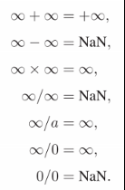
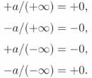
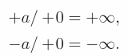

# Chapter1 Introduction 导言

- [Chapter1 Introduction 导言](#chapter1-introduction-导言)
  - [1.1 图形学的领域](#11-图形学的领域)
  - [1.2 主要应用](#12-主要应用)
  - [1.3 图形API](#13-图形api)
  - [1.4 图形管线](#14-图形管线)
  - [1.5 数据](#15-数据)
  - [1.6 效率](#16-效率)
  - [1.7 图形程序的设计与编程](#17-图形程序的设计与编程)

这本书主要是关于用来生成三维物体和三维场景的合成图像的基本算法和数学知识的

## 1.1 图形学的领域

主要分为三个大领域：

1. 建模
2. 渲染
3. 动画

而最常会涉及到计算机图形学的交叉领域则有：

1. 用户交互UI
2. 虚拟现实
3. 可视化
4. 图像处理
5. 三维扫描
6. 图像计算

## 1.2 主要应用

1. 电子游戏
2. 动画
3. 特效
4. 电影
5. CAD/CAM
6. 拟真软件
7. 医学图像
8. 信息可视化

## 1.3 图形API

图形API指一系列提供了例如将图形和三维表面绘制到屏幕的窗口中的基本操作的函数

主要有两大类图形和UI的API：

1. 以Java为代表的，完全标准化并作为编程语言的一部分被提供出来的API组件，有很强的可移植性
2. 以Direct3D和OpenGL为代表的，大多作为C++的软件库出现，一般在不同的系统间都是不同的，不方便移植

但无论使用哪一类API，其基础的图形调用都是相同的，书中的概念都可以应用到上面

## 1.4 图形管线

图形管线是一个特殊的软件/硬件子系统，可以高效的有透视地绘制原始三维信息

图形管线中曾经有一个疑难问题就是z值缓冲透视问题，如今通过一个四维齐次空间结构几乎完美地解决了

管线处理图像的速度很大程度上依赖于需要绘制的三角形数量，因此提出了按照与目标模型距离为核心的细节层级技术(LOD)

## 1.5 数据

大多数计算机都是用IEEE的浮点数标准进行数据的计算的

关于IEEE的浮点数标准关键要记住几个特殊情况：

1. 所有的有限数都小于+∞
2. 所有的有限数都大于-∞
3. －∞小于+∞
4. 任何包含了NaN的表达式结果也是NaN
5. 任何得到NaN的表达式转为bool为false

浮点数的计算法则和高等数学中的计算差不多，想清楚再用即可，尽量不要让函数的返回值是特殊数字防止加大后续判断的开销

  

  

  

## 1.6 效率

随着时代的进步，如今制约程序设计最大的问题是内存占用而非处理速度了，当程序要在内存占用和运行速度之间折中时，最好偏向内存优化那边

尽量编写直截了当的代码，这会让后续的维护舒服很多，把时间花在优化性能上要比花在处理bug和加新特性上有意义得多

## 1.7 图形程序的设计与编程

对于图形程序来说，有一系列优质高效的关于向量和矩阵处理的函数和类是非常关键的，这是图形元素的关键。这些数据结构主要包括：

1. 二维向量vector2
2. 三维向量vector3
3. 四维向量hvector
4. 颜色值rgb
5. 变换矩阵transform
6. 图像数组image
7. 整数类intervals
8. 正交基orthonormal bases
9. 坐标系框架coordinate frames
	
图形程序常常需要用浮点数计算，推荐使用double进行几何变换，用float进行颜色变换，用float存储数据到硬盘中，用double处理内存数据，如果可以的话尽量用float处理数据除非有充分证据标明某个地方必须要用到double的高精度

有几个很好用的处理图形程序问题的debug技巧：

1. 输出有问题的部分的图像，观察问题部分的特点，猜测问题可能的原因并进行相应的测试。这样可以不直接检查错误可能出现的地方而是通过结果猜测错误缩小目标范围，速度会快很多
2. 暂时创建一个调试用的项目副本，将测试正常的额外部分代码关闭，然后输出可能出问题的代码生成的画面来缩小错误代码的范围
3. 使用调试器在可能出问题的代码附近设置条件断点，因为图形学的代码一般都有大量嵌套的循环，需要条件断点来确定暂停的位置

将运行中的一些数据格式化输出出来查看，花些时间在优化内部数据的输出上能大幅提高后续debug的效率，磨刀不误砍柴功