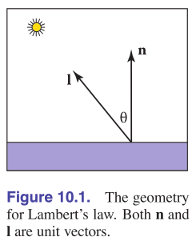
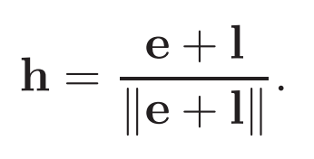

# Chapter10 Surface Shading 表面着色

## 10.1 散射着色

朗伯(Lambertian)物体是当光源状态不变而视点变化时关注点的颜色不会发生改变的物体，例如现实中的未抛光的石头，木制品，石膏像之类的不光滑物体。朗伯物体的表面着色是漫反射或者说散射，我们使用朗伯着色模型来表示处理这个情况

**朗伯着色模型**

朗伯模型的着色遵循朗伯余弦法则，也就是表面的颜色是与光照方向和法线夹角的余弦值相关的，夹角类似下图的效果：

  

通常我们用法线单位向量与光照方向的单位向量相乘来得到夹角的余弦值。然后我们可以再给这个关系附加上常数系数cr和cl，分别代表表面对光的反射率和光线本身的强度，于是会得到下面的式子：

  

这个式子有一个值得注意的问题，就是当光线在平面背面照入时，这个式子会得到负的颜色值，这并不符合我们的直觉。所以我们有两种方法来改进这个式子，一个是用max函数将余弦值与0相比，让光照在背面时显示出黑色；另一个是将余弦值取绝对值，这样光照在背面时也会产生和正面一样的颜色，这个做法称为双面光照，尽管和现实情况不同但是有时这个特性也会发生作用

**环境着色**

环境着色也就是要模拟我们常常说的环境光，环境光发生的本质是光线在场景中发生的大量反射产生的间接光照效果。真实的环境光可以由光线追踪算法来模拟，但是在传统上由于光线追踪过高的计算代价，通常粗暴地用一个常数值来代表环境光。这种做法的漏洞很多但由于计算简单而广被使用，后来也有人对这个方法进行改进例如对场景中的环境光进行预渲染等，本质都是离线完成环境光的模拟。结合前面说的max函数优化c的计算后，加入环境光项就能得到下面的式子。在下面的式子中我们为了保证渲染出来的亮度值不要超过1我们常常限制ca+cl<=1，但是有时候也可以设置不同的值来达到特别的效果

  

**基于顶点的散射着色**

基于向量的散射着色是更接近一种编程技巧，也就是在顶点而不是面片上进行着色的光照计算。之所以这样做是因为当着色是对应物体面片时，明暗在面片上不变因此会显得很粗糙，解决方法就是先计算出三角形顶点上的法线，然后三角形的内部的颜色由三个顶点的着色来进行重心插值得到

而若模型没有给出三角形顶点的法线，可以使用顶点周围的多个三角形面片的法线求平均得到，求平均后的法线记得要进行单位化。经过这样的处理我们可以用较小的性能代价在低面数的表面上绘制出比较真实的光照效果

## 10.2 Phong着色

对于非郎伯物体，例如台球之类的光滑物体，光线找到表面会产生高光。高光的特性是：

1. 会根据视角改变而改变
2. 有一定的角度扩散而非完全的镜面反射，但是角度越大亮度越低
3. 由于反射是发生在物体表面的，所以反射颜色主要由光源颜色决定

**Phong光照模型**

为了模拟现实中非郎伯物体的高光特性，这里用下面的公式来逼近。首先高光位置和亮度会根据视角而改变，又由于镜面反射的物理规则，高光的中心点应该被绘制在视线于光照法线相交的点。然后由于高光有一定的角度扩散，也就是为了让光有一定的可视范围，再加入可视角度σ，就得到下图的样子：

  

为了实现随着可视角度亮度会发生衰减的特性，一种方法是我们可以类似散射着色一样用上图的视角e与光线镜面反射后的向量r产生的夹角的余弦值来作为权重加权，又由于反射发生在物体表面上，所以加权在光源值上来得到着色值。很多时候直接使用这个值得到的高光可视范围过大，直观上看就是反射得到的光斑过大，所以我们利用余弦值属于0~1的特性，用一个指数p来削减它。这样得到的下面的式子就是1975年Phong提出的Phong着色，这个控制着高光可视范围的指数p称为Phong指数：

  

由于余弦值小于1，指数处理必然是指数越大值越小，直观上看就是下面的对比图。实际使用中我们常选择2的指数次的p值，这样就可以用移位来加速运算，也可以采用指数查找表的方式来加速计算

  

上面的式子有个小问题就是求出的e和r的夹角余弦值可能是负的，所以上面的式子中才有max函数保证指数底不小于0，这会带来不必要的麻烦。另一种常用的计算方法是首先用简单的三角几何关系求出反射光r如下：

  

然后求出视线与光源夹角的平分向量h，算法是e与l相加然后单位化：

  

然后使用转而求平分向量与表面法向量之间的余弦，然后继续之后的计算。这样计算的效果与之前一致，优点是不用使用max来约束余弦值，缺点是在计算h时需要进行绝对值计算，得到新的高光项如下，在现实使用中这种方法更加常用：

  

最后我们合并Lambert散射与Phong高光的式子，顺便给Phong再加一个反射强度控制参数cp得到完整的着色公式，这称为Blinn-Phong着色

  

**表面法向量插值**

前面在散射着色的时候我们试过了用重心坐标系插值来得到顶点的法线。由于拥有高光的物体在高光区域颜色变化比只有朗伯着色的情况更剧烈，因此除非采用非常复杂的多边形否则需要进行法线插值来让高光自然（不插值的方法称为Gouraud着色法）。在也就是想8.2中提到的在面片着色器中让面片每个像素都插值得到自己的法线方向然后进行一次Phong着色，这样可以得到非常平滑的高光效果

  

## 10.3 艺术化着色

艺术化着色有时也称为非真实感渲染，近年来随着平面动画主题的三维游戏的兴起越来越常见到，这两个词的主要差别在于艺术化着色一般表示一种着色风格，而非真实感渲染常常表示出对性能的妥协。艺术着色是需要大量的美术人员参与并进行大量微调才能达到好的效果的，这一节简单介绍了最常见的两种艺术效果

线条绘制

像漫画效果一样在物体的轮廓和褶皱的地方绘制出线条是很多艺术化着色都要达到的特性，这个特性的达成并没有那么复杂，其实就是通过计算相邻两个面片之间的法线角度差异，当差异达到一定程度就认为是表面的转折区域于是绘制出线条。伪代码就是下面的样子：

  

冷暖色调着色

有些艺术风格希望根据物体表面的朝向来绘制上额外的不同的颜色，其实这也是很简单的思路就可以解决，也就是计算出面片法线与视线之间的夹角，通过加权后在基础的着色上再附加上想要的颜色即可。简单的式子就是下面的两条：

  

  

上面的参数cw和cc就是想要按照方向额外附加的颜色值，例如冷色蓝色和暖色红色，将本章用到的各种效果综合运用起来可以得到下面的几张图，分别是：直接着色，无线条的冷暖着色，有线条的冷暖着色

  