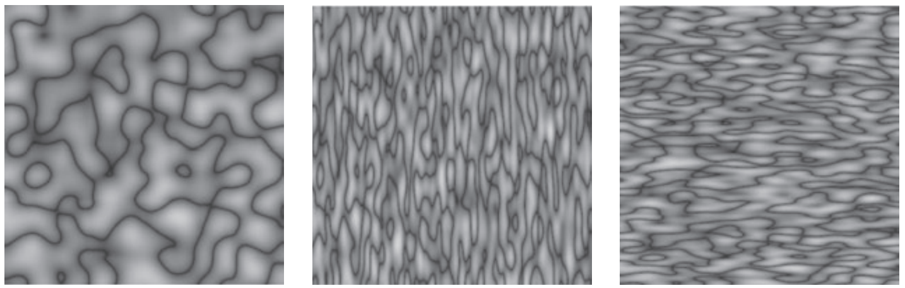

# Chapter11 Texture Mapping 纹理映射

- [Chapter11 Texture Mapping 纹理映射](#chapter11-texture-mapping-纹理映射)
  - [11.0 总览](#110-总览)
  - [11.1 查找纹理值](#111-查找纹理值)
  - [11.2 纹理映射函数](#112-纹理映射函数)
  - [11.3 纹理反走样](#113-纹理反走样)
  - [11.4 纹理映射的应用](#114-纹理映射的应用)
  - [11.5 程序性三维纹理](#115-程序性三维纹理)

## 11.0 总览

节省算力欺骗人的眼睛本来就是图形学中最迷人的部分, 为了表现出真实世界丰富的表面细节, 单单有光影效果显然是不够的, 为了在表现效果和整体性能间做出平衡, 于是用图片对表面的顶点进行纹理映射

纹理映射并不会真正改变表面的形状, 也就是它不会增减多边形, 而是在片元着色的时候从图片中找到对应的颜色值应用到表面的顶点上, 这张图片就称为纹理或材质(texture)

纹理也不单单用来提高表面颜色丰富度, 广义用法的纹理映射有时还用来调整表面形状, 反射, 阴影等等信息

而在纹理映射的时候有很多可能发生的问题, 主要是纹理映射时可能会发生失真的变形和纹理映射后可能由于采样的关系产生走样失真的问题

## 11.1 查找纹理值

纹理映射的目标是对着色器中的顶点选择一个合适的颜色使用, 那么第一步就是按照顶点在三维世界空间中的点的坐标来查找其对应的纹理图片中的值(这个值也就是纹理图片对应像素的值, 称为纹素texel), 也就是核心是一个三维xyz到二维纹理空间中uv坐标(纹理空间中通常用uv来表示横轴和)的映射

这个从三维到二维的映射过程称为UV映射(UV mapping)或表面参数化(surface parameterization), 其实早在图形学出现之前就已经是人类研究的一大问题了, 与我们生活最接近的参数化问题就是如何绘制三维地球表面到二维地图上, 也就是地图投影问题, 下图是最常见的墨卡托投影.

  

墨卡托投影就是按照纬度将地球投影到包裹的一个圆柱体上, 然后将圆柱体展开, 这就是后面要讲到的柱面投影. 我们可以看到在墨卡托投影中维度越高的区域形变得越厉害, 例如格林兰岛几乎与澳大利亚大小相当, 这就是纹理映射中需要解决的首要问题: 找到合适的映射函数减少形变失真. 还有一个问题在地图上看不到, 主要与渲染的分辨率有关, 是纹理映射带来的走样问题

## 11.2 纹理映射函数

纹理映射函数也就是用来决定这个三维到二维映射的函数, 关系到映射后的表面效果的好坏. 世界上没有十全十美的函数, 选择映射函数要基于目标表面本身形状并综合考虑能够下面四个映射目标的哪一些从而决定:

1. 双射性: 纹理映射函数需要尽量满足双射, 这是为了减少映射途中不可避免的上采样/下采样所带来的走样失真
2. 尺度变形: 纹理在映射前后最好能保持相同的大小
3. 形状变形: 纹理在映射前后不应有太大的形状改变
4. 连续性: 纹理映射不该有太多的接缝, 也就是映射函数最好是连续函数
	
对于纹理映射函数, 需要提到有一种情况可以得到很好的纹理映射函数, 就是当目标表面符合某个参数表面(由参数方程决定的三维表面)或者本身就是参数表面时, 通过将那个参数方程取反映射即可得到很好的映射

但是现实中我们遇到的表面常常不是参数表面, 例如是隐式表面或者三角面片组成的表面, 对于这种情况我们通常用几何坐标系, 按照一定的变换将其映射到比较接近的参数表面上然后再取这个表面的反映射

**几何坐标系**

用一些简单的形状来代表复杂的表面是最方便最直接的纹理映射方法, 这个从表面到简单形状的过程称为投影. 首先是这里面最简单的平面投影. 平面投影分为两类, 一类是正交平面投影, 一类是透视平面投影. 这种投影方式和将三维空间物体投影到视平面上没有太大区别, 运用投影矩阵将z轴的值抹去, 剩下的xy就是uv, 区别是一个用了透视投影矩阵一个用了正交投影矩阵.

  

  

  

  

这种投影对于那些接近平面的表面效果很好, 但是当表面不仅仅是个平面, 也就是与投影面又很大夹角时就会产生很大的扭曲, 纹理会被严重拉伸如下图

  

为了解决这种扭曲问题, 使用一个能包裹表面各个方向的投影方法至关重要. 首先就是最适合映射近似球体表面的球坐标系. 球坐标系使用的就是固定主半径R的球坐标, 转换方法在以前中学课程中就教过了, 这里为了计算更方便使用下面的函数来处理, 此处的atan2可以计算出向量与正x轴的角度, 且避免y/x的除零问题

  

球坐标投影的缺点是对于那些距离中心与对应球的半径变化不稳定的部分会产生较严重的扭曲, 而且在球的两极处的映射函数不能保证双射性因此常常在那里产生聚集形的失真. 下图是对立方体进行球坐标映射, 这里极点的失真不太看得出来但是在立方体的转角处的扭曲比较容易看到, 主要就是在平面映射缩小, 转角映射放大导致

  

球坐标投影在转角处容易产生放大效果, 在平面又会缩小, 为了解决这个问题需要对目标表面有更深的理解, 例如我们可以选择圆柱体投影, 也就是前面说到的墨卡托投影. 这个投影的关键在于使用柱坐标系, 特点是对y值的计算比较简单如下式

  

圆柱体投影的效果表现在下面对一个近似圆柱的物体进行投影, 左边是球面投影的效果, 可以看到由于圆柱体y值计算的特殊性, 圆柱体投影在表面的主要部分不会带来那么大的失真, 又能够满足对弧面的需求. 但是如果我们对一个立方体进行投影圆柱体仍然会在平面上产生拉伸(于x方向)

  

为了解决对立方体的投影问题, 引入了立方体投影, 这种投影的本质就是对目标表面的每个方向进行一次平面投影然后再组合为一个立方体, 其映射函数比较复杂因为需要对三个轴对应的六个方向都进行一次处理.

  

立方体投影常常用来生成立方体贴图, 其优点是转角只有一条线所以当投影合适例如左图对球体进行投影时, 得到的自带扭曲拉伸的效果会以假乱真, 尤其是用于后面会提到的环境贴图中效果非常好. 在使用立方体投影时, 要注意是通过当前需要查找的值的xyz值来确定所要从中查找的面, 取当前xyz中值最大的面来计算 

  

**插值坐标系**

为了应对更加复杂的表面, 针对于三角形进行的插值坐标系被提出. 插值坐标系的特点是其映射是通过对每个顶点提前指定其位于纹理空间中的坐标, 然后利用重心坐标系插值的方法插值出三角形内每个位置所对应的UV纹理坐标. 如下图可以看到模型的三角面都被提前展开对应在纹理空间中, 渲染的时候就利用三角形的三个顶点使用前面2.7介绍的重心插值法得到所需的坐标.

  

插值坐标系是一种看起来很完美的映射方法, 因为它可以很好地控制映射后的形变问题, 而且可以保证映射区域的连续性因为顶点之间都相互连接. 但是插值坐标系仍然有几个缺点. 首先直到今日, 工业上常见的生成点到模型坐标映射的方法是简单粗暴地展开模型表面并映射, 自动UV展开的效果并不好很多时候需要人工的介入因此生成效率不高. 另一方面是这个方法不能很好地保证双射性, 因为纹理表面的精度是有上限的, 对于下图的人脸纹理来说, 尽管在大多数区域可以得到正确的映射, 但是在诸如眼周, 鼻周的位置的三角面非常密集, 很可能发生多个顶点对应同一个纹理像素的情况.

  

**瓦片, 卷回模式和纹理变换**

很多时候允许纹理坐标索引纹理图片以外的区域是很有用的, 这可以节省纹理图片空间, 称为卷回操作. 对于纹理图片意外的区域, 我们通常在计算的时候对其动态进行一些可能的处理

1. 固定返回某一种颜色
2. 缩放纹理图片来匹配这个区域
3. 复制图片边缘的某个颜色(按照一定规律插值)
4. 动态计算纹理重复的效果, 将纹理扩展到图片范围以外. 而对于范围外所需要返回的颜色, 我们通过对纹理实施仿射变换, 将其像砖瓦一样动态叠加起来, 称为瓦片.可视化的效果如下图
	
  

**透视正确的插值**

了解如何对模型表面进行纹理插值后, 一旦我们在透视投影中渲染出来, 就会发现发现下图右侧例子这样的大问题, 尽管模型有近大远小的效果, 但是纹理却没有近大远小. 这根本上是因为在渲染管线中, 我们先进行了对顶点的透视投影后才在光栅化和片元着色器中对顶点进行着色, 也就是说在着色的时候目标顶点已经在屏幕空间(标准视体)中了. 假如我们对这样的顶点进行纹理的线性插值, 得到的纹理的自然看不太出来透视效果. 为了解决这个问题, 我们需要进行插值的透视矫正.

  

回想我们透视顶点的步骤, 顶点在世界坐标中经过透视除法将深度归还到了标准视体中, 这个过程是纹理所缺少的, 这就是纹理没有透视感的原因. 假如我们让纹理坐标也一起参与顶点的透视除法, 那么就可以得到标准视体中的纹理坐标. 

如下图, 我们让需要用于插值的uv配合一个单独的1, 组装成一个假的三维向量参与透视除法中, 我们就会得到除法后的uv. 这个uv处于标准视体中, 接下来我们正常按照现在透视除法后的xyz进行相应的插值, 这个插值就是标准视体中的插值. 这样子我们得到标准视体中的插值uv后, 前面参与除法的1的作用就出来了, 这是用于保存透视除法因子的, 将这个新的uv除1/wr就可以将标准视体中的uv转回到正常的纹理空间中. 在编程中要注意这个除法后的1也需要参与纹理的插值, 这本质上是因为这个1还代表了二维纹理的深度信息.

  

在这个步骤中, 之所以我们可以保证uv经过透视除法后还能进行插值, 而且插值后还原的结果是正确的, 是因为书中可以证明uv和xyz的变形之间是相同的线性关系, 所以我们可以自由进行操作而只会影响比例的变换.

**连续性与接缝问题**

纹理映射中, 映射中的不连续现象最终是不可避免的, 这个不连续就会产生接缝. 具体到纹理接缝问题, 有些不可避免的接缝的解决方法是通过美术人员手工调整让接缝尽量出现在不容易看到的区域. 而有些接缝问题本质上是因为顶点关系设置地不好导致. 下图中是两种不同的顶点连接方法, 我们可以看到左边图的一大特色就是最左端的顶点与最右端的顶点发生了连接, 两极的顶点也都连接到了同个顶点上, 这是因为在球表面上, 最左边的顶点确实需要和最右边的顶点发生连接以使得表面完整.

但是在纹理映射中, 这样的效果会导致两端顶点三角形进行插值, 从而在中间空隙处压缩了一整个纹理图上去, 也就是那一条绿色部分, 这就是最明显的接缝问题. 这种处理方法使得映射连续性得到保证但是却产生了更严重的接缝, 为了处理这个问题我们应该和右图一样, 将两端和两极本应连接的顶点断开, 而且各自复制一份, 然后进行映射. 此时由于连接性被断开, 因此两端都会对三角形进行正确的插值, 又因为端点的顶点被复制到了同个位置, 所以被复制出来的这部分重复纹理正好看起来连接在了一起, 从而解决了这里的解封问题. 为了视觉效果, 映射函数的某些要求是可以被忽略的.

  

## 11.3 纹理反走样

11.1中我们提到纹理的另一大问题就是走样问题, 走样问题的效果就是下图中原本在高分辨渲染下的远处图像在低分辨率的点采样中纹理变得支离破碎. 为了解决走样问题, 我们回想前面第9节信号处理部分中会提到的, 方法是提高采样频率和进行滤波. 但是要知道为什么映射纹理会产生走样, 我们首先要了解像素足迹的概念.

  

**像素足迹**

我们直到由于透视投影的原因, 世界被渲染到图像空间后图像上每个像素所对应的纹理大小都会有所差异, 具体来说就是下图的效果, 左上角的像素由于处于远处且夹角较小所以包括到了纹理空间中的多个像素, 而近处的像素由于本身都不够大所以甚至多个都无法包裹整个纹理像素. 这里像素们包含的不同大小的区域被称为像素足迹. 这样我们就可以理解一开始的走样示例图, 假如我们用点采样的思路来处理这种情况, 只用这些区域中的某一个值来简单返回到像素上的话, 远处的纹理就会因为采样到不稳定的区域而产生破碎的情况, 而近处的纹理会因为可能多个像素采样同一个纹理像素导致出现块状分隔. 

  

先来处理远处的纹理, 为了防止点采样的碎片效果, 我们需要为渲染的纹理进行平滑化表示, 为了确认需要平滑化的像素都是哪部分像素, 做的第一件事就是计算出像素所包含的纹理空间有多大. 首先我们在前面知道可以有一个函数Π将三维点映射到屏幕图像空间中, 而且如果我们有一个三维点, 可以有函数Φ将三维点转到二维纹理空间中. 如果此时我们对屏幕图像上的一个像素点, 可以用下面的式子将像素点转回三维空间中然后再将这个三维点转到纹理空间中.

  

这样我们有能力找到二维画面中一个像素所对应到纹理空间中的位置. 但是此时有一个问题, 我们只是能计算出像素本身点的映射, 但不知道这个像素转换到纹理空间中到底占有多少空间, 也就无从谈起这个像素占用了多少个纹理像素了. 这里假如我们想做的是从像素的四个顶点来得到所映射的纹理空间的框架的话, 我们要知道这是很难实现的, 因为如下图中在经过逆向变换后, 原先平直的图像像素网格很可能在映射中已经变得扭曲从而无法很好地组成形状框选区域, 我们希望可以尽量逼近这个弯曲区域.

  

因此这里算法采用了一个折中方法来更好地逼近这个弯曲区域. 关键在于我们知道ψ函数是弯曲变形的元凶, 我们在高数中知道泰勒展开可以用来逼近任意符合条件的函数形状的, 由于像素本身尺度就很小, 所以我们可以用下面式子中一阶的泰勒展开来逼近点x0附近的值, 在式子中J就是泰勒公式中的求导项, 为了提升精度我们也可以采用更高阶的泰勒展开.

  

经过泰勒展开的逼近后, 我们可以得到x0周围的点的估计取值, x0通常取像素重心. 然后此时我们如示意图作图总选取当前像素对应的中心x轴顶端和y轴顶端两个向量, 带入上面的泰勒展开式得到其在纹理空间中近似的位置, 这可以组成一个新的小坐标系. 但是此时得到的两个新坐标轴经常是不垂直的, 因此我们再按照变形前的xy向量对这个两个坐标轴进行求导. 这个求导得以让我们得到相互垂直且尺度比例得到保持的新的uv轴, 效果如示意图的右边. 这个求导常常使用下面的公式来代替执行.

  

对于映射后的两个轴向量, 我们可以开始一个个比对纹理空间中的像素是否在像素透视投影后的区域内, 也就是上面的橘黄色区域, 这个区域是由上面求得的新uv轴所组成的矩形来决定. 对于橘黄色区域内的目标像素, 我们会进行下面的相应操作来返回合理的颜色值, 这个过程称为重建.

**重建**

下图中表示了橘黄色区域可能包含的几种像素情况, 首先我们是依据纹理空间中的一个像素的像素中心是否在矩形区域内来决定这个像素是否包含在区域内. 然后这个包含情况显然就可以分为三种, 完全没有包含像素, 包含了一个像素, 包含了多个像素.

  

对于包含了一个像素的情况, 我们自然直接返回这个像素本身的值就可以. 而对于没有包含像素的情况, 我们可以简单返回其最近的像素的值, 也可以对这个位置, 依据周边相邻的像素进行双线性插值甚至双三次插值来进行上采样插值, 然后再返回一个更加平滑精细的颜色值. 对于包含了多个像素的情况, 我们则是需要对区域内的像素进行下采样操作, 最常见的操作就是直接平均滤波.

这些重建操作在实现上都是简单的, 但是会遇到一个很实际的问题. 纹理的渲染是一个非常频繁发生的步骤, 也就是其对执行时间的要求很高. 但是像上面的示意图中获取相邻像素的值明显是很不适合利用缓存的局部性原理的, 因为元素经常处于不同行不同列. 为了优化这个纹理查找步骤, 有的厂商生产了专用的硬件来加速查找, 但是更常见的解决方案则是mipmap技术.

**mipmap图**

关于mipmap图(也称MIP图)我没有找到好的翻译, 这个单词中map表示的是映射mapping, 而mip则是从拉丁短句multim in parvo而来, 表示多个物体处于一个小空间中. 之所以叫这个名字是因为mipmap用于优化纹理查找步骤. Mipmap的思路是放弃对重建时纹理查找精度的追求, 不再去纠结到底具体命中了哪些像素, 而是首先采用像素足迹uv坐标中的较长轴的长度, 用那个轴构成一个正方形, 然后计数在当前中心x0处, 这个正方形能够命中的像素的数量. 得到像素的数量后, 去预计算的mipmap中查找符合数量的滤波结果.

mipmap在纹理刚处理好后就以2为底数k为指数作为滤波器大小D用高斯滤波或盒式滤波等方法对图像进行不同大小的滤波, 然后将这些提前滤波完成的图像像金字塔一样排列到纹理图中如下图. 在得到命中的像素数量k后, 只要找到与这个数量最接近的滤波大小k = log_2(D), 就可以去滤波图中找到对应的滤波像素值返回, 把这个结果当作进行了真正的下采样操作结果返回即可.

  

**各向异性过滤**

mipmap操作的误差在于选区的不精确和滤波大小的不稳定, 这个误差在目标像素处于透视的远处时尤为明显, 即远处区域会因为过度滤波而变得模糊. 对于滤波大小的不稳定情况有两种解决方法, 一种是选取最接近的一层mipmap, 另一种是选取上下两层的mipmap结果, 然后对这个结果像素进行线性插值. 而对于选区的不精确问题, 可以取新uv轴中的最短轴也生成一个正方形, 然后再在最短轴到最长轴区间内的各种mipmap结果都进行一次采样和计算, 最终结果平均起来. 对于后面的这个长短轴平均法就是我们常听到的各向异性过滤, 也称各向异性滤波(Anisotropic Filtering).

各向异性过滤可以调整mipmap的平均级别, 参与平均的mipmap数量越多远处区域的纹理就会越清晰, 但是相应的也会带来较大的性能损失. 关于这一系列的纹理反走样效果从下图可以一起对比.

  

## 11.4 纹理映射的应用

在最开始的时候我们说到纹理映射不单单可以用来提高物体表面的颜色细节, 还可以用来控制其它的一些着色效果. 具体来说这一节就要介绍纹理映射的几种额外的应用.

**控制着色的参数**

从控制着色参数的角度来说, 我们通常意义上的纹理贴图其实就是在控制顶点的漫反射颜色, 所以同样的我们也可以使用一张灰度图来指示每一个表面顶点的其它着色参数, 最常见的就是用于控制表面的镜面反射强度的粗糙度贴图. 通过和纹理映射相似的步骤就可以动态修改着色器大大增加表面的真实度.

**法线图和凹凸图**

法线图(normal map)和凹凸图(bump map)是对图形学稍有研究的游戏玩家都绕不开的一个技术, 在近10年得到广泛应用的法线图技术大大增强了物体表面的细节丰富度. 按照历史的发展轨迹来说是先有凹凸图然后才有了法线图, 但是为了思路的流畅这里选择反着介绍.

前面第10章介绍表面着色的时候我们知道物体表面的光照效果是依赖于表面法线的方向的, 默认情况下表面法线和当前三角面片的方向相同, 但是其实并没有规定说表面法线一定要与面片方向相同, 我们其实可以随意改变着色器中参与光照计算的表面法线的方向.因此我们用一张RGB图片称为法线图, 用纹理映射的方法在运行中查找当前需要渲染的顶点的法线, 然后用图中RGB代表的xyz的法线来参与光照计算. 由于人眼对物体表面明暗的感知能力远远强于对表面凹凸度的感知能力, 因此仅仅是对表面法线进行这样的扰动形成的假光影效果就可以形成表面纹理十分丰富的错觉.

对于法线图有两种方法进行储存, 一种称为模型空间(object space)中的法线图, 这种情况下的法线图储存的法线是和模型正面渲染的平面一致的, 因此模型空间中的法线图一般是色彩丰富的. 这种储存方法比较直接, 渲染时需要对物体表面的法线直接替换成法线图中的法线, 优点是当从和法线图生成时一样的视角渲染时, 可以直接有看到立体模型的错觉效果, 缺点是很多时候我们需要的是能够应用到其它表面上的法线, 也就是我们观察角度经常会变换, 这种情况下模型空间下的法线效果就很不好了. 

另一种储存是存于切线空间(tangent space)中的法线图, 切线空间顾名思义就是这里要记录的法线是基于一个模型表面切面片的, 也就是默认情况下发现是与下面的面片垂直的. 切线空间使得我们应用法线时要通过法线图的法线来叠加改变当前要渲染的物体表面的法线, 计算光照着色. 在切线空间中，未经扰动的法线都是基于那个平面(低模物体的面)指向竖直上方的, 所以z都是1, 仅仅改变了xy, 对应到RGB中就是偏蓝色的图片,这是我们最常见到的法线图. 缺点是当要表达一个完整模型例如一个正方体时解决方法只能是将此贴图复用在六个面上或者为每个面制作一个法线图, 因为无法像模型空间中那样用一张图表示整个正方体. 

下图中左图时模型空间中的法线图, 右图是切线空间中的法线图

  

而法线图说到底是怎么生成的呢, 传统上的生成方法是先要有一个高精细度的模型, 然后对这个模型进行下采样得到一个低模, 在低模的法线方向上我们计算高模与低模的深度值差异, 这个差异可以保存为一个灰度图称为凹凸贴图. 凹凸贴图的特点是可以利用里面的深度信息还原出物体表面法线方向上的深度值, 但是其在传统上用来对每个像素与xy方向进行差分求导, 得到的离散梯度值就是法线图的值. 在过去的时候扰动法线是需要着色器动态对凹凸图进行求导得到法线的, 现在通常直接保存法线图来使用更为方便.

下图是应用了刚才提到的三种技术综合起来对地板的渲染效果. 可以看到最右扰动表面法线后本来是平面的地板显现出了凹凸的假象.

  

**置换贴图**

置换贴图(也称位移贴图, displacement map)是对凹凸贴图的一种应用, 为了解决法线图只能改变物体的光影效果而不能改变实际的多边形状况的缺点. 我们知道凹凸图中保存了物体的深度信息, 置换贴图就首先对模型进行了曲面细分, 然后在纹理查找的时候, 凹凸图动态改变目标表面的顶点位置, 让顶点按照法线方向进行深度改变, 这个过程由于是在着色的时候才进行所以相对来说不会消耗太大的性能.

下图应用了置换贴图, 从网格标识上可以看到顶点发生了实际的位置改变

  

**阴影贴图**

阴影效果是非常重要的渲染效果, 它直接决定了物体与整个场景能不能表现出立体感, 不论伪阴影效果的话, 最常见的动态阴影效果是由阴影体技术或者阴影贴图技术实现了. 阴影体技术在这里不介绍, 主要要介绍的是最最常见的阴影贴图技术.

对于阴影贴图技术, 动态阴影是由下面的流程来实现的:

1. 对于每一帧, 除了渲染真实画面外还从各个需要产生阴影效果的光源位置渲染一张深度图dmap, 这里为了效率考虑渲染深度图的分辨率可以不用那么高, 这个分辨率就是我们常见的"阴影等级". 而对于点光源我们采用广角的透视投影处理, 对于平行光源我们采用正交投影处理
2. 然后在顶点着色的时候, 我们将当前需要着色的顶点的空间坐标都通过透视矩阵变换到刚才光源渲染深度图的视体中, 得到此时这个顶点在光源看来的xy值和深度d
3. 在刚才的深度图中利用xy用纹理查找的方法得到对应的深度dmap, 由于之前渲染深度图的特性, 我们知道如果d>dmap代表此时的顶点处于光源视角的表面后面, 也就是说此时这个顶点是处于遮挡中的, 我们就将它判断为阴影来处理. 这就是阴影贴图的原理

在阴影贴图处理中有两个问题需要考虑, 一个是由于渲染阴影贴图的分辨率常常不如实际渲染画面时的分辨率, 因此阴影贴图粒度较大的像素的投影就会导致阴影不连续的情况产生. 如下图中我们看到尽管像素中心对准的区域可以正确计算出深度值dmap, 但是像素所覆盖的一部分区域经过投影变换后得到的深度值d却常常无法和dmap完全匹配, 这会导致同样被光照到的区域一部分被识别为阴影一部分被识别为照明.

  

为了解决这个问题, 很明显我们需要的是阴影而不是照明, 宁可产生偏大的阴影也不应该出现碎片情况, 因此我们人为指定一个较小的值ε, 对所有参与阴影检测的深度d都加上这个ε, 从而解决阴影碎片的问题. 这个ε就称为阴影偏置(shadow bias), 恰当的设置它非常重要, 但是也有很明显的缺点, 如果这个偏置设置太小则容易发生阴影碎片, 部分陷入地下的情况, 如果偏置设置太大则会有阴影浮在表面的效果. 对于后一种情况我们常常能在各种游戏中见到, 也就是人物脚下的阴影无法和人物模型很好地贴合.

阴影贴图还有另一个问题就是阴影精细度的问题. 渲染分辨率不够的阴影贴图会使得投影出来的阴影充满锯齿走样, 提高阴影等级自然是最简单的方法但是如果性能不足以支撑这个渲染的话有两个代价较小的方法, 一个是对阴影贴图进行平滑上采样处理, 这种方法无法预处理因此性能表现也不好, 另一种则是称为百分比渐近过滤(PCF, percentage
closer filtering), 在进行阴影深度检测的时候我们不单单计算目标顶点的深度, 还额外采样附近几个顶点的深度, 然后都进行阴影检测后计算处于阴影中的点的比例, 根据这个比例对阴影颜色进行加权, 这个方法需要增大采样的运算量但是能实现更加平滑的阴影效果.

  

对于动态阴影有很多的性能优化方法, 例如为了执行效率可以只渲染部分物体的深度, 可以减少渲染的频次, 可以通过裁剪减少渲染的物体数量, 设置根据距离发生改变的阴影等级等等, 是个图形学中很大很大的课题, 以后可以更加仔细地进行学习

**环境贴图**

环境贴图是对现实世界光照效果一个更加粗暴的hack行为, 本质上是一张会随着视角改变的贴图. 环境贴图有两个最大的应用, 一个是用来表示环境的天空盒, 另一个是用来代替反射/折射效果的反射贴图, 这两个应用最大的区别其实是在视角的计算和应用的物体上. 

首先天空盒贴图实际上就是前面11.2中有出现的立方体投影, 之所以使用立方体投影是因为球面投影在两极会产生较严重的失真现象. 我们提前对立方体的六个面用光线追踪的方法来渲染场景, 在这个渲染中我们不渲染任何近处的物体, 只渲染处于近似无限远处的物体, 得到的结果映射到立方体六个面上, 然后将我们的视点放在立方体中心, 让立方体六个面渲染为视野的最外壁, 进一步将场景的光源保持和贴图渲染时一致, 这个步骤让我们能够得到非常精细的场景背景. 这个方法的缺点是得到的背景无法随意进行改变, 但是由于极小的性能消耗所以常常被使用.

  

而反射贴图是相反的思路, 由于真实的反射效果必须要光线追踪算法的介入, 因此使用预渲染的反射贴图来得到反射的错觉. 反射贴图同样对一个立方体的六个面进行了对周围环境的渲染, 但是这个立方体上的纹理作为立方体映射映射到我们想要生成反射的表面上. 在实际映射的时候我们不能简单映射表面颜色, 而是要计算顶点法向量与当前视线向量的夹角, 然后根据镜面反射原理返回镜面入射方向所能在立方体贴图中看到的景象, 根据这样的方法我们可以用较小的性能代价得到非常逼真的镜面反射效果

相应的折射贴图就是修改了镜面反射的角度, 按照简单的折射定律返回立方体能看到的预渲染后的场景, 常常用来做水体效果.

## 11.5 程序性三维纹理

所谓的程序纹理(procedural textures)就是纹理值本身而非查找算法会随着程序运行而改变的纹理. 之所以称为程序三维纹理, 是因为这里的纹理值实际上与当前计算的顶点的坐标或者说某个输入的三维参数有关, 而且这个值并不是提前渲染后再进行查找的, 而是通过一定的表达式计算出来的, 之所以要做这种事情是为了能在物体表面上附着动态的可变化的纹理

**三维条纹纹理**

这是最简单的一类三维纹理, 本质上就是一个调整过的正弦函数, 这个正弦函数的值可以作为颜色来进行使用, 下面的伪代码是比较完整的条纹纹理函数, 包含了条纹宽度参数w和条纹模糊插值的效果

  

  

**实体噪声**

实体噪声(Soild Noise), 或者称为柏林噪声(Perlin Noise)是图形学一大伟大的发明, 其用来模拟处无规律但纹理包含一定连续性的随机图像, 非常适合用来模拟木头, 石头的纹理或者火焰, 云雾的纹理.

实体噪声的生成比较复杂, 比较具体的程序在网上都比较容易找到, 书中只给出了基本的几道公式. 其基本思想是先将当前区域进行分块, 分出的小块称为晶格(lattice), 然后随机初始化三维向量给各个小块的顶点. 对于这些初始化的三维向量称为梯度, 通过利用这些向量和各个晶格中心进行高次插值来得到变化但有一定连续性的颜色. 效果如下图.

  

对于实体纹理生成的条纹我们还可以通过修改其归一化函数来调整黑色与白色的强度, 得到总体更加平滑的纹理.

**振荡**

振荡是很好地提高同一纹理纹理复杂性的方法, 其基本思路就是利用这些纹理有周期函数的特性, 通过调整纹理生成的频率和振幅, 然后将多个纹理进行叠加得到更复杂的纹理效果. 以条纹纹理为例, 通过给sin函数增加振荡项turbulence来扰乱纹理生成时的相位得到不同的纹理.

  

振荡能用来生成很华丽的纹理效果, 下图是用振荡叠加多个实体纹理得到的云雾效果和叠加多个条纹纹理得到的大理石纹效果

  

  