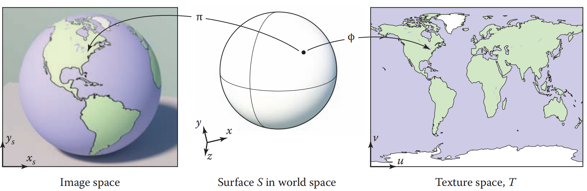

# Chapter11 Texture Mapping

## 11.0 总览

节省算力欺骗人的眼睛本来就是图形学中最迷人的部分, 为了表现出真实世界丰富的表面细节, 单单有光影效果显然是不够的, 为了在表现效果和整体性能间做出平衡, 于是用图片对表面的顶点进行纹理映射

纹理映射并不会真正改变表面的形状, 也就是它不会增减多边形, 而是在片元着色的时候从图片中找到对应的颜色值应用到表面的顶点上, 这张图片就称为纹理或材质(texture)

纹理也不单单用来提高表面颜色丰富度, 广义用法的纹理映射有时还用来调整表面形状, 反射, 阴影等等信息

而在纹理映射的时候有很多可能发生的问题, 主要是纹理映射时可能会发生失真的变形和纹理映射后可能由于采样的关系产生走样失真的问题

## 11.1 查找纹理值

纹理映射的目标是对着色器中的顶点选择一个合适的颜色使用, 那么第一步就是按照顶点在三维世界空间中的点的坐标来查找其对应的纹理图片中的值(这个值也就是纹理图片对应像素的值, 称为纹素texel), 也就是核心是一个三维xyz到二维纹理空间中uv坐标(纹理空间中通常用uv来表示横轴和)的映射

这个从三维到二维的映射过程称为UV映射(UV mapping)或表面参数化(surface parameterization), 其实早在图形学出现之前就已经是人类研究的一大问题了, 与我们生活最接近的参数化问题就是如何绘制三维地球表面到二维地图上, 也就是地图投影问题, 下图是最常见的墨卡托投影.

  

墨卡托投影就是按照纬度将地球投影到包裹的一个圆柱体上, 然后将圆柱体展开, 这就是后面要讲到的柱面投影. 我们可以看到在墨卡托投影中维度越高的区域形变得越厉害, 例如格林兰岛几乎与澳大利亚大小相当, 这就是纹理映射中需要解决的首要问题: 找到合适的映射函数减少形变失真. 还有一个问题在地图上看不到, 主要与渲染的分辨率有关, 是纹理映射带来的走样问题

## 11.2 纹理映射函数

纹理映射函数也就是用来决定这个三维到二维映射的函数, 关系到映射后的表面效果的好坏. 世界上没有十全十美的函数, 选择映射函数要基于目标表面本身形状并综合考虑能够下面四个映射目标的哪一些从而决定:
	1. 双射性: 纹理映射函数需要尽量满足双射, 这是为了减少映射途中不可避免的上采样/下采样所带来的走样失真
	2. 尺度变形: 纹理在映射前后最好能保持相同的大小
	3. 形状变形: 纹理在映射前后不应有太大的形状改变
	4. 连续性: 纹理映射不该有太多的接缝, 也就是映射函数最好是连续函数
	
对于纹理映射函数, 需要提到有一种情况可以得到很好的纹理映射函数, 就是当目标表面符合某个参数表面(由参数方程决定的三维表面)或者本身就是参数表面时, 通过将那个参数方程取反映射即可得到很好的映射

但是现实中我们遇到的表面常常不是参数表面, 例如是隐式表面或者三角面片组成的表面, 对于这种情况我们通常用几何坐标系, 按照一定的变换将其映射到比较接近的参数表面上然后再取这个表面的反映射

几何坐标系

用一些简单的形状来代表复杂的表面是最方便最直接的纹理映射方法, 这个从表面到简单形状的过程称为投影. 首先是这里面最简单的平面投影. 平面投影分为两类, 一类是正交平面投影, 一类是透视平面投影. 这种投影方式和将三维空间物体投影到视平面上没有太大区别, 运用投影矩阵将z轴的值抹去, 剩下的xy就是uv, 区别是一个用了透视投影矩阵一个用了正交投影矩阵.

这种投影对于那些接近平面的表面效果很好, 但是当表面不仅仅是个平面, 也就是与投影面又很大夹角时就会产生很大的扭曲, 纹理会被严重拉伸如下图

为了解决这种扭曲问题, 使用一个能包裹表面各个方向的投影方法至关重要. 首先就是最适合映射近似球体表面的球坐标系. 球坐标系使用的就是固定主半径R的球坐标, 转换方法在以前中学课程中就教过了, 这里为了计算更方便使用下面的函数来处理, 此处的atan2可以计算出向量与正x轴的角度, 且避免y/x的除零问题

球坐标投影的缺点是对于那些距离中心与对应球的半径变化不稳定的部分会产生较严重的扭曲, 而且在球的两极处的映射函数不能保证双射性因此常常在那里产生聚集形的失真. 下图是对立方体进行球坐标映射, 这里极点的失真不太看得出来但是在立方体的转角处的扭曲比较容易看到, 主要就是在平面映射缩小, 转角映射放大导致

球坐标投影在转角处容易产生放大效果, 在平面又会缩小, 为了解决这个问题需要对目标表面有更深的理解, 例如我们可以选择圆柱体投影, 也就是前面说到的墨卡托投影. 这个投影的关键在于使用柱坐标系, 特点是对y值的计算比较简单如下式

圆柱体投影的效果表现在下面对一个近似圆柱的物体进行投影, 左边是球面投影的效果, 可以看到由于圆柱体y值计算的特殊性, 圆柱体投影在表面的主要部分不会带来那么大的失真, 又能够满足对弧面的需求. 但是如果我们对一个立方体进行投影圆柱体仍然会在平面上产生拉伸(于x方向)

为了解决对立方体的投影问题, 引入了立方体投影, 这种投影的本质就是对目标表面的每个方向进行一次平面投影然后再组合为一个立方体, 其映射函数比较复杂因为需要对三个轴对应的六个方向都进行一次处理.

立方体投影常常用来生成立方体贴图, 其优点是转角只有一条线所以当投影合适例如左图对球体进行投影时, 得到的自带扭曲拉伸的效果会以假乱真, 尤其是用于后面会提到的环境贴图中效果非常好. 在使用立方体投影时, 要注意是通过当前需要查找的值的xyz值来确定所要从中查找的面, 取当前xyz中值最大的面来计算 

插值坐标系

为了应对更加复杂的表面, 针对于三角形进行的插值坐标系被提出. 插值坐标系的特点是其映射是通过对每个顶点提前指定其位于纹理空间中的坐标, 然后利用重心坐标系插值的方法插值出三角形内每个位置所对应的UV纹理坐标. 如下图可以看到模型的三角面都被提前展开对应在纹理空间中, 渲染的时候就利用三角形的三个顶点使用前面2.7介绍的重心插值法得到所需的坐标.

插值坐标系是一种看起来很完美的映射方法, 因为它可以很好地控制映射后的形变问题, 而且可以保证映射区域的连续性因为顶点之间都相互连接. 但是插值坐标系仍然有几个缺点. 首先直到今日, 工业上常见的生成点到模型坐标映射的方法是简单粗暴地展开模型表面并映射, 自动UV展开的效果并不好很多时候需要人工的介入因此生成效率不高. 另一方面是这个方法不能很好地保证双射性, 因为纹理表面的精度是有上限的, 对于下图的人脸纹理来说, 尽管在大多数区域可以得到正确的映射, 但是在诸如眼周, 鼻周的位置的三角面非常密集, 很可能发生多个顶点对应同一个纹理像素的情况.

瓦片, 卷回模式和纹理变换

很多时候允许纹理坐标索引纹理图片以外的区域是很有用的, 这可以节省纹理图片空间, 称为卷回操作. 对于纹理图片意外的区域, 我们通常在计算的时候对其动态进行一些可能的处理
	1. 固定返回某一种颜色
	2. 缩放纹理图片来匹配这个区域
	3. 复制图片边缘的某个颜色(按照一定规律插值)
	4. 动态计算纹理重复的效果, 将纹理扩展到图片范围以外. 而对于范围外所需要返回的颜色, 我们通过对纹理实施仿射变换, 将其像砖瓦一样动态叠加起来, 称为瓦片.可视化的效果如下图
	

透视正确的插值

了解如何对模型表面进行纹理插值后, 一旦我们在透视投影中渲染出来, 就会发现发现下图右侧例子这样的大问题, 尽管模型有近大远小的效果, 但是纹理却没有近大远小. 这根本上是因为在渲染管线中, 我们先进行了对顶点的透视投影后才在光栅化和片元着色器中对顶点进行着色, 也就是说在着色的时候目标顶点已经在屏幕空间(标准视体)中了. 假如我们对这样的顶点进行纹理的线性插值, 得到的纹理的自然看不太出来透视效果. 为了解决这个问题, 我们需要进行插值的透视矫正.

回想我们透视顶点的步骤, 顶点在世界坐标中经过透视除法将深度归还到了标准视体中, 这个过程是纹理所缺少的, 这就是纹理没有透视感的原因. 假如我们让纹理坐标也一起参与顶点的透视除法, 那么就可以得到标准视体中的纹理坐标. 

如下图, 我们让需要用于插值的uv配合一个单独的1, 组装成一个假的三维向量参与透视除法中, 我们就会得到除法后的uv. 这个uv处于标准视体中, 接下来我们正常按照现在透视除法后的xyz进行相应的插值, 这个插值就是标准视体中的插值. 这样子我们得到标准视体中的插值uv后, 前面参与除法的1的作用就出来了, 这是用于保存透视除法因子的, 将这个新的uv除1/wr就可以将标准视体中的uv转回到正常的纹理空间中. 在编程中要注意这个除法后的1也需要参与纹理的插值, 这本质上是因为这个1还代表了二维纹理的深度信息.

在这个步骤中, 之所以我们可以保证uv经过透视除法后还能进行插值, 而且插值后还原的结果是正确的, 是因为书中可以证明uv和xyz的变形之间是相同的线性关系, 所以我们可以自由进行操作而只会影响比例的变换.

连续性与接缝问题

纹理映射中, 映射中的不连续现象最终是不可避免的, 这个不连续就会产生接缝. 具体到纹理接缝问题, 有些不可避免的接缝的解决方法是通过美术人员手工调整让接缝尽量出现在不容易看到的区域. 而有些接缝问题本质上是因为顶点关系设置地不好导致. 下图中是两种不同的顶点连接方法, 我们可以看到左边图的一大特色就是最左端的顶点与最右端的顶点发生了连接, 两极的顶点也都连接到了同个顶点上, 这是因为在球表面上, 最左边的顶点确实需要和最右边的顶点发生连接以使得表面完整.

但是在纹理映射中, 这样的效果会导致两端顶点三角形进行插值, 从而在中间空隙处压缩了一整个纹理图上去, 也就是那一条绿色部分, 这就是最明显的接缝问题. 这种处理方法使得映射连续性得到保证但是却产生了更严重的接缝, 为了处理这个问题我们应该和右图一样, 将两端和两极本应连接的顶点断开, 而且各自复制一份, 然后进行映射. 此时由于连接性被断开, 因此两端都会对三角形进行正确的插值, 又因为端点的顶点被复制到了同个位置, 所以被复制出来的这部分重复纹理正好看起来连接在了一起, 从而解决了这里的解封问题. 为了视觉效果, 映射函数的某些要求是可以被忽略的.

