# 《Fundamentals of Computer Graphics, Fourth Edition》笔记——Chapter12 Data Structures for Graphics 图形学数据结构

本章主要介绍了图形学中常用到的数据结构，内容比较长。重点分别介绍了四个大类：网格结构(mesh structures)，空间数据结构(spatial data structures)，场景图(scene graphs)和多维镶嵌数组(tiled multidimensional arrays)。不要觉得数据结构这种运行在图形学底层的东西不重要，这本书是图形学的基础，其中所有内容都是必须非常熟悉的基础内容，每一个内容都可能在某个时候被用上。

- [《Fundamentals of Computer Graphics, Fourth Edition》笔记——Chapter12 Data Structures for Graphics 图形学数据结构](#fundamentals-of-computer-graphics-fourth-edition笔记chapter12-data-structures-for-graphics-图形学数据结构)
  - [12.1 Triangle Meshes 三角网格](#121-triangle-meshes-三角网格)
    - [12.1.1  Mesh Topology 网状拓扑](#1211--mesh-topology-网状拓扑)
    - [12.1.2  Indexed Mesh Storage 索引网格存储](#1212--indexed-mesh-storage-索引网格存储)
    - [12.1.3  Triangle Strips and Fans 三角条带和扇形](#1213--triangle-strips-and-fans-三角条带和扇形)
    - [12.1.4 Data Structures for Mesh Connectivity 为处理网格连接性的数据结构](#1214-data-structures-for-mesh-connectivity-为处理网格连接性的数据结构)
      - [The Triangle-Neighbor Structure 三角邻居结构](#the-triangle-neighbor-structure-三角邻居结构)
      - [The Winged-Edge Structure 翼边结构](#the-winged-edge-structure-翼边结构)
      - [The Half-Edge Structure 半边结构](#the-half-edge-structure-半边结构)
  - [12.2 Scene Graphs 场景图](#122-scene-graphs-场景图)
  - [12.3 Spatial Data Structures 空间数据结构](#123-spatial-data-structures-空间数据结构)
    - [12.3.1 Bounding Boxes 包围盒](#1231-bounding-boxes-包围盒)
    - [12.3.2 Hierarchical Bounding Boxes 层次包围盒](#1232-hierarchical-bounding-boxes-层次包围盒)
    - [12.3.3 Uniform Spatial Subdivision 均匀空间划分](#1233-uniform-spatial-subdivision-均匀空间划分)
    - [12.3.4 Axis-Aligned Binary Space Partitioning 轴向二叉空间划分(BSP)](#1234-axis-aligned-binary-space-partitioning-轴向二叉空间划分bsp)
  - [12.4 BSP Trees for Visibility 为优化可见性问题建立的BSP](#124-bsp-trees-for-visibility-为优化可见性问题建立的bsp)
    - [12.4.1 Overview of BSP Tree Algorithm BSP算法总览](#1241-overview-of-bsp-tree-algorithm-bsp算法总览)
    - [12.4.2 Building the Tree 建树](#1242-building-the-tree-建树)
    - [12.4.3 Cutting Triangles 切分三角形](#1243-cutting-triangles-切分三角形)
    - [12.4.4 Optimizing the Tree 优化树](#1244-optimizing-the-tree-优化树)
  - [12.5 Tiling Multidimensional Arrays 瓦片多维数组](#125-tiling-multidimensional-arrays-瓦片多维数组)

## 12.1 Triangle Meshes 三角网格

三角网格是图形学中的基础数据结构，这部分在本书的中文版也就是第二版中着墨很少，本章介绍了很多细分的内容。之所以要有各种关于三角网格的数据结构是因为我们在处理三角网格时很多时候并不止需要顶点位置和点面关系这样的基础内容，还需要得到例如点边邻接关系，连通关系等等属性，在这种情况下如果我们仅仅使用最基础的数据结构会使得运行效率极其低下。

### 12.1.1  Mesh Topology 网状拓扑

首先要介绍在拓扑学中有一个很简单很基本的概念：流形(manifold)。流形是对表面网格的一个最基本最宽泛的要求。所谓流形，意思是"流动的形状"，整体形状如同液体一样可以流畅改变，但是微小的局部上却是不流畅但性质相同的小平面组成。之所以要有流形这个定义是因为图形学中很多关于几何处理的代码都是基于流形性质的，非流形的处理会很麻烦。对于流形，书中给出了下面两个形象的正例和反例来说明：

下图中12.1中，左边的表面存在三个三角形共用一条边的情况，这会导致在那个边上的顶点拥有和三角面内的顶点不同的拓扑关系，因此左边的并不是流形。

  

下图12.2中，左图中有一个顶点被两个无法平铺的表面共享了，同样这也是干扰了边上拓扑要和三角形内相同这个条件，导致左边并不是流形。

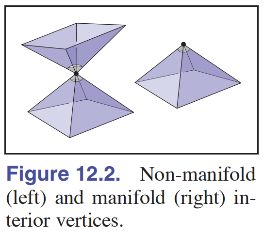  

总结一下这两个例子，一个表面是流形需要满足以下两个条件：

- 每个边都被正好两个三角形共用
- 每个顶点都被一个单独且完整的三角形循环包围

但是在实际使用中，这两个流形条件常常无法满足，主要就是各种边缘情况。原始的流形定义要求了表面是封闭的，但是现实中很多表面不是封闭而是有边界的。为了处理这种情况，我们发现放宽松这个条件也不影响计算，称为有边界的流形(manifold with boundary)。同样书中举出了两个反例和正例来对比：

下图12.3中，"每个顶点都被一个单独且完整的三角形循环包围"这一条件放宽松味不需要完整循环就得到左边和中间的形式，但是如果还要进一步放松的话就是最右图的顶点连接着两个不连通的三角集合，这种情况很难被算法处理了，不再被归类在流形中。

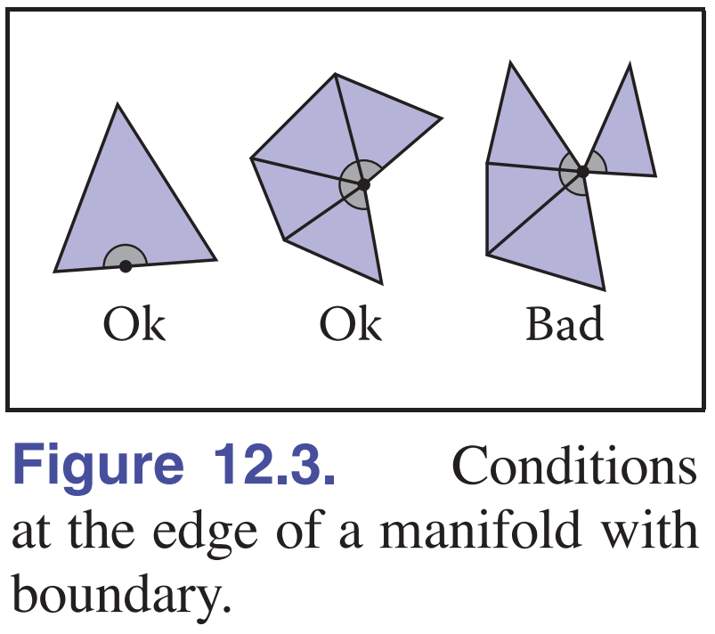  

这就总结出了新的流形条件，一个表面要当有边界的流形需要满足：

- 每个边都被一个或两个三角形使用
- 每个顶点都被一个单独的边互相连通的三角形集连接(不需要包围了)

除了流形定义外，图形学中还对三角网格定义了额外的属性：

- 三角面顶点按照逆时针顺序定义的那面被认为是三角形的正面(少数标准中是反过来的)
- 一个所有网格三角面的顶点都是相同顺序的时候称为一致朝向(consistently oriented)

其中第二个属性比较特别，它表示了表面上每一对邻接三角形都是一致朝向的。而且引申出一个属性：所有非流形的网格都不是一致朝向的。而之所以我们要定义一致朝向，是因为在计算或渲染的时候我们需要按照整个表面的一致朝向属性来进行着色，渲染之类，包括计算法线方向，进行背面剔除等等。下图中左图是一致朝向的，右图不是：

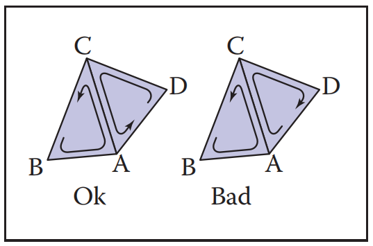  

但是一致朝向属性在一个很出名的情况下会被严重干扰：莫比乌斯环(Mobius band)。莫比乌斯环成功在保持所有三角形顶点排序顺序一致的情况下却让人无法决定其朝向，如下图：这个连续的表面没法分辨正面和反面。这会给算法带来很大的困扰但是幸运的是实际应用中我们几乎不会碰到这么极端的情况。

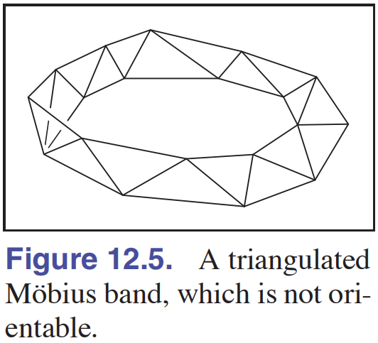  

### 12.1.2  Indexed Mesh Storage 索引网格存储

如果我们要保存一个三角网格的信息，我们知道对于三角网格我们最少需要保存其顶点坐标和其面片的顶点组成，因此最容易想到的一种数据结构就是如下图的左图将三角形的顶点全部分开保存。但是很显然，这种做法会浪费大量空间因为在三角网格中很多顶点是重复出现的，并没有必要储存那么多次内容。

因此一种更实际的数据结构是索引网格存储，将顶点的共享性利用起来，一口气储存所有顶点的坐标后再对每个三角面片储存对应的索引，通过面片的索引来得到确切的三维网格。这样得到的网格称为索引三角网格(indexed triangle mesh)，结构如下图右图，对于这一系列结构建议将其理解为图或者复杂的链表。

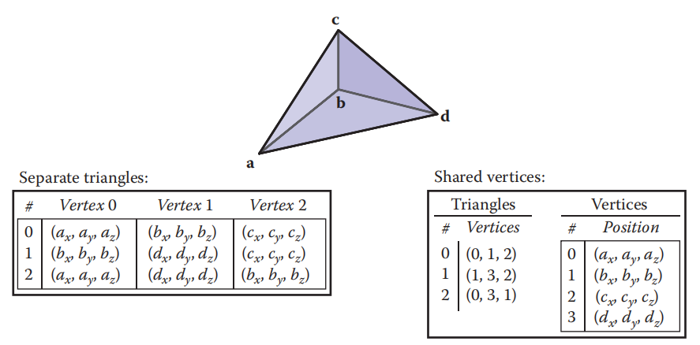  

当然这两种方法也是有权衡的，就和我们选择任何算法一样，这两个数据结构有不同的空间复杂度，我们应该通过面数和点数的占比来选择。实际使用中一般顶点数都远远大于面数(因为一个面是三个顶点组成)，因此索引方法更加常见：

- 直接保存三角形顶点信息：9*顶点数
- 索引保存：3*面数+3\*顶点数

### 12.1.3  Triangle Strips and Fans 三角条带和扇形

有些时候我们需要更加极致的空间利用，这时候就有了对特殊情况下的三角网格存储的优化，主要就是三角扇形和三角条带。

三角扇形是指优化下图形式中，所有三角形都共享一个顶点的特殊三角网格的储存。方法非常简单，所有顶点按照\[共享顶点，起点，第二个点，第三个点...\]的顺序存储即可，在使用的时候才将这种组织解开读入。这种方法不但节省了大量储存同一顶点的空间，还省去了储存面片顶点关系的索引表，为储存带来很大优势。

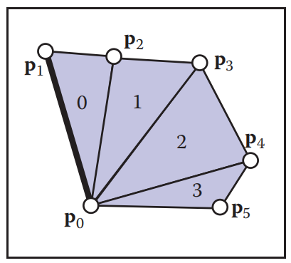  

三角条带则是处理下图这种面片按照顺序连为一个条带的形式，这种形式的好处是我们可以找到一个序列不重复地将所有顶点串联起来，因此同样我们可以按照\[起点，第二个点，第三个点...\]的顺序存储即可，在使用的时候才将这种组织解开读入。

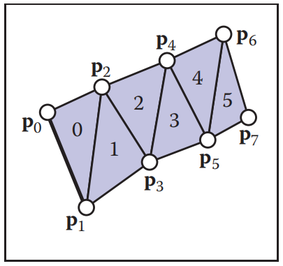  

在实际使用中这两种形式的出现机会不会太多，因此比较常见的压缩方法是按照某种算法将面片拆分为这样的三角扇的条带的形式，拆分后再按照索引表的方法储存网格，不过此时我们不用再储存各个面片的分别顶点索引而是可以以条带或扇形的顺序来储存，也能节省很多空间。还有一点就是实际使用中发现没有追求整体一个长条带的必要，很多时候能够得到由十个面片组成的条带就可以发挥出很强的储存空间优势了，长度越长优势反而提升有限，徒增麻烦。条带拆分的效果如下图：

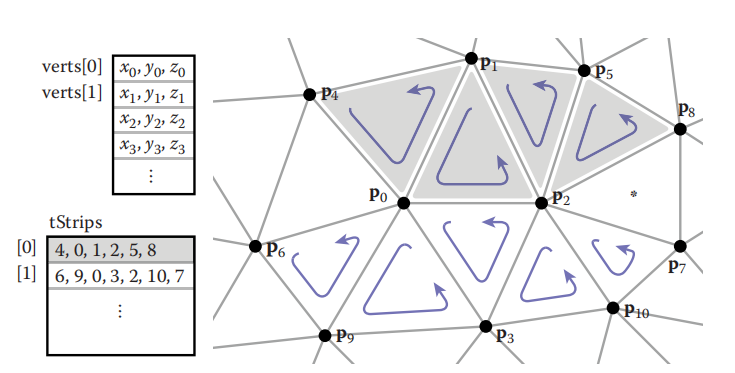  

### 12.1.4 Data Structures for Mesh Connectivity 为处理网格连接性的数据结构

很多时候为了更好地处理网格，我们需要为网格保存一些额外的信息，其中最主要的就是点-边-面之间的拓扑关系。虽然这种拓扑关系再上面的通用格式中也可以实时计算出来，但是计算代价很大，为了得到更好的计算效率最好的方法就是用额外的数据结构来储存计算好的拓扑关系。其中最最直观的方法就是用三个结构来储存其各自的索引，然后用数组分组这些结构：

- 对每个面，储存三角形对应的三条边索引和三个顶点索引
- 对每个边，储存边对应的两个顶点索引和两个三角形
- 对每个点，储存数量不定的边索引和面片索引

但是很显然这种方法空间代价很大，而且由于我们不能提前知道某顶点所对应的面和边的数量，所以如果我们想要由顶点在与顶点相关的边和面中进行搜索或处理的话，我们会发现这个过程的时间复杂度是不确定的。

#### The Triangle-Neighbor Structure 三角邻居结构

为了得到这个过程更好的查找时间复杂度，最好是常数时间的复杂度，一个好的方案是将这个结构进行改良，用间接索引的方式来储存拓扑信息：

- 对每个面，储存由边邻接的三个面索引和三个顶点索引
- 不单独储存边
- 对每个点，储存其所属的其中一个面的索引(程序决定)

这种结构称为三角邻居结构(triangle-neighbor structure)，下图可以更好地理解这种结构的构成。这种结构除了能很方便进行点到邻接结构的搜索外，还有一个好处就是可以很方便地实现对围绕一个点的邻接三角面的检索，检索的伪代码如下，主要对照下图中的绿色线，从$T_3$开始进行搜索，手动操作一次就能理解这个查找算法。

```Shell
TrianglesOfVertex(v) {  # 对于围绕的顶点v
  t = v.t # 先从顶点得到所属的面片索引
  do {
    find i such that (t.v[i] == v)  # 找到这个顶点在面片中的索引下标i
    t = t.nbr[i]  # 这个下标i代表下一个邻接的面片, 从对应的nbr数组中跳转到下一个面片
  } while (t != v.t)  # 循环直到回到起点
}
```

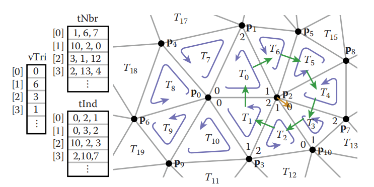  

这个数据结构和搜索算法保证了查找下一个面片的过程是常数时间的，但是却需要在循环中引入find操作。我们知道代码中的分支判断会比较大地影响性能，因此这个数据结构有了下面的这种优化方案：

- 对每个面，储存由边邻接的三个边索引和三个顶点索引
- 对每条边，储存其所属的其中一个面片索引和其在面片中的下标i
- 对每个点，储存其所属的其中一条边的索引

之前的结构的分支是因为我们需要查找这个顶点在面片中的索引下标i，之所以要查找下标是因为这个下标表示了这个顶点所处的边应该导向哪一个邻接的三角形。通过在新的结构中增加边的信息，现在我们可以直接从边知道下一个该搜索的面片是什么面片，在这里每个面显然只被一条边所属，所以搜索的伪代码变为下面这样：

```Shell
TrianglesOfVertex(v) {  # 对于围绕的顶点v
  {t, i} = v.e; # 从这个点得到其所属的边，边会告诉所属的三角形t和所在的下标i
  do {
    {t, i} = t.nbr[i];  # 对于现在的三角形，利用下标i我们可以检索这个边，这个边提供了该跳转的下个三角形和新的下标
    i = (i+1) mod 3;  # 为了达到围绕顶点v旋转的效果，需要对遍历的边下标进行改变
  } while (t != v.e.t); # 循环直到当前面与起点所属的面相同，也就是回到起点
}
```

这种储存方法非常紧凑，尽管多出了这么多信息但是只花费了4*顶点+6\*面片数的代价。但是使用这种结构有一个限制，需要所在的表面是流形网格，或者至少是有边界的流形网格，然后通过增加哨兵位的方式进行特殊处理。

#### The Winged-Edge Structure 翼边结构

还有一种常见的数据结构就是翼边结构(The Winged-Edge Structure)，其特点是将邻接关系都储存在网格的边上，翼边结构最大的优点在于其不仅能用在三角网格上还能用在任意形状的网格上，数据结构如下：

- 对每个面，储存其中的一个边索引
- 对每条边，储存其两个顶点，左右两个面，左边面与之连接的两条边，右边面与之连接的两条边
- 对每个点，储存其对应的一个边索引

单靠文字描述可能还不够完整，下面的图表述了翼边结构那复杂的边是如何描述一个三棱锥的

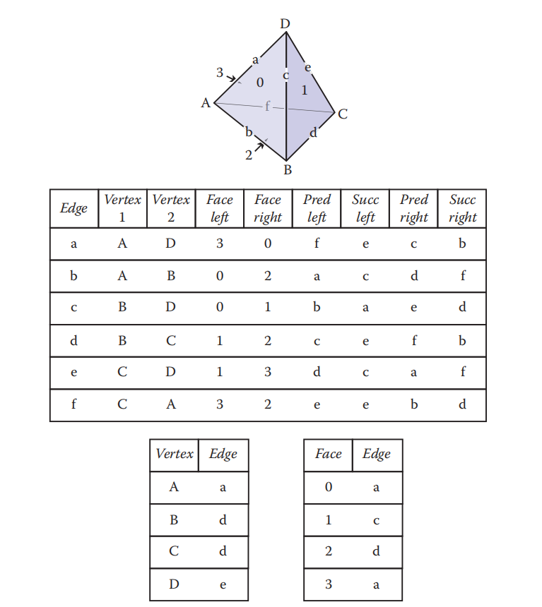  

翼边结构的另一大优点就是在索引邻接关系的时候非常方便，因为边储存了足够多的信息，利用这个结构我们可以在网格中自由检索。而之前的绕点检索方法伪代码如下，注意配合上图一起实践：

```Shell
EdgesOfVertex(v) {
  e = v.e;
  do {
    if (e.tail == v)  # 当于边的尾部检索时，左转
      e = e.lprev;
    else
      e = e.rprev;  # 否则右转
  } while (e != v.e);
}
```

翼边结构中显然存在很多为了加速计算而保留的信息冗余，也可以将其理解为一个多合一的双向链表。那么最简单的优化空间方法就是取出所有前向指针让翼边变为单向的，但是这样处理又会让搜索过程变得困难。而且翼边结构还有一个我们前面邻居三角结构中就遇到的问题，循环中有额外的判断存在。

#### The Half-Edge Structure 半边结构

因此又提出了半边结构(The Half-Edge Structure)来优化翼边结构。半边结构将一条边拆成了两个半边，每个半边储存用于单向检索的辅助信息和指向另一方向半边的指针，结构如下：

- 对每个面，储存其中的一个半边索引
- 对每条边，储存指向另一半边的指针和指向下一半边的指针，还有半边自己所属的那个顶点和所属的面
- 对每个点，储存其对应的一个半边索引

半边结构通过利用边的双向性在减少空间消耗的同时还达到了较好的检索效果，反向搜索的时候只要跳转到反向半边链即可，下图可以看到半边结构的邻接关系。

  

半边结构除了空间消耗上优于翼边结构，在搜索部分也优于翼边结构，半边结构无需判断当前的朝向，可以直接一连串地进行遍历。搜索的伪代码如下：

```Shell
EdgesOfVertex(v) {
  h = v.h;
  do {
    h = h.pair.next;  # 像单向链表一样不断跳转即可
  } while (h != v.h);
}
```

其中，为了区分半边的方向，很多时候我们通过将特定朝向的半边存在对应的数组下标中来隐式表示。由于半边结构性质优良，因此在需要使用网格邻接关系时，半边结构是最常用的结构。

## 12.2 Scene Graphs 场景图

图形学中我们常需要表示和储存由多个不同的三维表面按照层次组成的复杂场景，很多时候我们计算计算机动画的时候也需要用到层次结构。对于这种层次结构我们使用场景图(Scene Graphs)来保存。

场景图不难理解，其本质上是一个多叉树和一个栈的组合，场景的根结点作为树根，然后不断往树的深层扩展，每个节点除了保存了各自的属性信息外还保存了代表这个层级的仿射变换矩阵，仿射变换矩阵是因为我们常常需要对场景中的对象分层进行变换，我们知道变换矩阵链乘不能交换，因此需要用树和栈辅助。例如下图的例子，一辆放在船上的车子，车子有两个轮子：

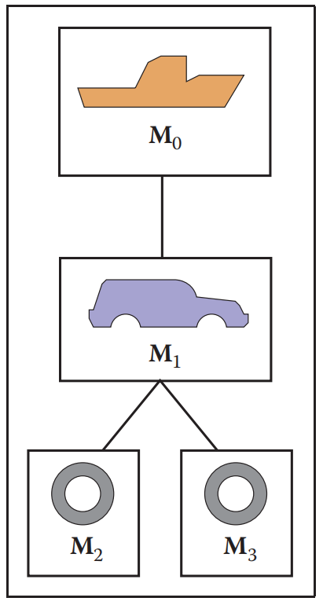  

我们将这个树状结构储存到文件中，每次需要渲染这个场景的时候用下面的伪代码进行。这个伪代码其实就是一个基本的深度优先搜索，核心就是用栈作为当前的保留区，利用栈中保存的矩阵链乘来渲染，使得从树顶到树底的时候顶点的变换有序且有效：

```Shell
function traverse(node)
  push(M_local) # 压入当前的变换矩阵
  draw object using composite matrix from stack # 绘制当前结点并用栈内的从顶到底矩阵链乘进行变换
  traverse(left child)  # 递归左子树
  traverse(right child) # 递归右子树
  pop() # 出栈当前结点的矩阵
```

## 12.3 Spatial Data Structures 空间数据结构

很多时候我们需要能够方便地在空间中定位和查找的数据结构来处理物体，这称为空间数据结构。空间结构大多通过将空间化为多个层次多个分组来方便查找空间中的元素，被广泛用在图形学渲染中用来加快运算。

### 12.3.1 Bounding Boxes 包围盒

包围盒是最简单的一种空间数据结构，其常被用来加速物理碰撞检测和光线追踪中的光线求交过程。包围盒的核心思想是使用一个能够完整包下需要用来计算的几何体的盒子来替代简化盒中几何体的复杂运算。虽然说是包围盒，但是包围盒并不一定是立方体，也可能是球体等形状，只要能够在尽量紧的情况下包裹住目标表面并且能够以很高的效率完成求交计算即可。

我们知道光线追踪中我们本来需要遍历场景中的所有物体来检测是否和发出的光线相交，但是这个过程中在光线前进时实际上有大量的物体是不可能发生碰撞的，因此我们可以把场景中的一组组物体用包围盒包裹起来，光线前进的时候先检查与场景中的哪些包围盒可能相交，当相交的时候再判断对应包围盒中的几何体是否和射线相交。由于我们可以很方便地判断射线与包围盒是否相交，因此这种归类方法可以大大加速求交过程。

以二维中的光线追踪和最简单的轴对齐包围盒为例，包围盒通常由描述了四个边范围的参数表示：$x_{min}, x_{max}, y_{min}, y_{max}$，如果射线的交点处于这四个参数范围内我们就知道发生了相交。前面说过二维中我们是用 $e+td=q$ 来描述一根射线的，e是射线的起点，d是射线的在空间中对应轴上变化的速率，t是射线与目标相交时的向量长度(或者说时间)，q是相交的点，那么我们可以通过令q为某个边界值求解出射线与那个边界相交时的长度t，以 $x_{min}$ 为例，式子如下：

$$
t_{xmin}=\frac{x_{min}-x_e}{x_d}
$$

通过将$x_{min}, x_{max}, y_{min}, y_{max}$都代入一遍，我们可以得到射线与包围盒四个边缘的截取长度，配合min和max的区分我们可以得到t的两种截取范围。此时有一个比较不直观的点，当x和y上的截取范围有重叠部分时，射线与包围盒有相交，其实就是因为在包围盒内的点的坐标必然都在范围中因此范围必然有重叠部分的意思。下面的图我看不太懂上面两张图为什么标注的x和y与我想象相反，但是整体的意思是可以表达出来的，而且这个反向也不会影响编码。

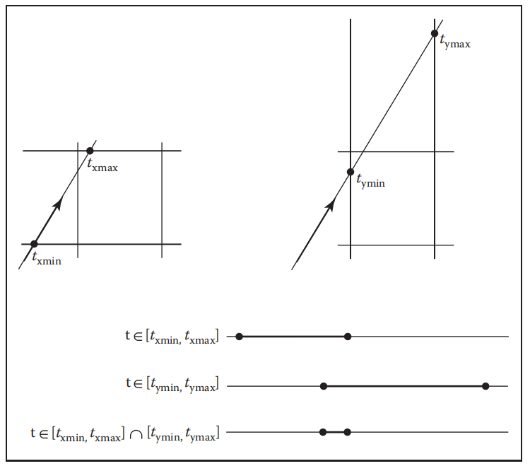  

把求重叠部分写成伪代码如下：

```Shell
if (t_xmin > t_ymax) or (t_ymin > t_xmax) then  # 没有重叠的时候，返回不相交
  return false
else
  return true
```

上面求解$t_{xmin}$的公式中有个问题，就是其需要除$x_d$，但是很明显$x_d$有可能为0。多亏了IEEE的浮点数标准，除零的时候我们可以得到有正负号的无穷值继续运算，手动尝试一下会发现除零问题仍然能够正常进行求交，唯一的问题就是符号：浮点数中不但有正0，还有负0。当$x_d$是负0的时候这一切的计算都会变成相反的，为了处理这个问题我们只能对这个符号进行额外的判断。由于负0没法简单地和0进行比较，下面的伪代码通过提出除法的方法将其变为有符号的无限值来进行比较：

```Shell
a = 1/xd
if (a ≥ 0) then
  tmin = a(xmin − xe) tmax = a(xmax − xe)
else
  tmin = a(xmax − xe) tmax = a(xmin − xe)
```

### 12.3.2 Hierarchical Bounding Boxes 层次包围盒

知道了包围盒加速计算的原理后，问题就在于我们如何有效地组合出空间中的包围盒结构，一种简单的方法称为层次包围盒(Hierarchical Bounding Boxes)，简称BVH。BVH是一种二叉树结构，从包围了整个场景的二叉树根开始，逐步将整个场景细分直到每个叶节点上都是一个面片或者自己设定的最小表面单位为止。BVH的特点是在良好组织的情况下，如果尽量保证二叉树平衡，那么对场景空间的搜索将会非常快速。缺点是BVH并不能保证包围盒与包围盒之间不会重叠，因此射线必须判断所有发生了相交的包围盒，而且如果二叉树很平衡的话搜索时的分支就会非常多，是个两难抉择。在BVH中查找是否命中的伪代码如下，实际上就是对每个相交的包围盒都进行深入细分，最后返回距离最近的相交表面：

```Shell
function bool bvh-node::hit(ray a + tb, real t0, real t1, hit-record rec)
  if (bbox.hitbox(a + tb, t0, t1)) then
    hit-record lrec, rrec
    left-hit = (left = NULL) and (left → hit(a + tb, t0, t1, lrec)) # 查找左子树
    right-hit = (right = NULL) and (right → hit(a+tb, t0, t1, rrec))  # 查找右子树
    if (left-hit and right-hit) then  # 两边都有相交时，返回距离近的
      if (lrec.t < rrec.t) then
        rec = lrec
      else
        rec = rrec
      return true
    else if (left-hit) then # 否则有什么就返回什么
      rec = lrec
      return true
    else if (right-hit) then
      rec = rrec
      return true
    else
      return false
  else
    return false
```

BVH的建立有多种不同的方法，其中最容易想到的有两种创建方法：

- 对场景中物体按照轴向距离进行排序，每次都将物体划分为数量相同的两个子树
- 按照轴向距离将物体以轴向距离的中点进行划分，不保证数量相同

这两种方法的实现都比较简单，各有各的优缺点。场景排序的方法能够让BVH树尽量平衡，但是排序过程消耗的代价比较大不太适合实时计算；而直接按照距离划分不能保证子树的平衡加大搜索深度，但是相对的建树速度会快很多尤其对于复杂的场景更是如此。两者的伪代码书中都有，并不复杂，在此不表。

### 12.3.3 Uniform Spatial Subdivision 均匀空间划分

层次包围盒的特点是底层包围盒是一对一的，一个包围盒对应一个可供射线检测的物体，这个物体即使会被别的包围盒覆盖也不会参与其它包围盒的相交检测，而且一旦我们和某个包围盒相交，按照二叉树查询到底时我们必然命中某个具体表面。这样的方法命中率虽然很高但是却有个问题，每次我们要判断求交的时候，我们需要与当前包围盒中的所有包围盒进行一次求交计算，这种盲目的搜索会带来很大的开销。因此出现了基于空间的划分方法(Spatial Subdivision)，这类方法将整个场景空间按照某种规律划分为不同的小块包围盒，由于这些小块包围盒的空间位置是有规律的，因此我们可以直接利用射线得知当前需要进行计算的小块。这类方法的缺点是目标表面可能同时被多个小块包括，这加大了求交部分的难度，而且由于现在会出现不命中的小块，因此如何对空间进行合理划分增大命中率成了一个问题。

空间划分方法中最容易想到的就是均匀空间划分，通过将整个空间均匀分为小块，如下图我们可以在三维空间中按照类似光栅化画线的迭代方法直接得知该与哪些小块进行具体的求交计算从而大大加快求交速度。但是这种方法也有一个缺点，当场景中大多数区域例如下图是稀疏的时，将场景划分为这么多小块会使得射线的命中率低下。

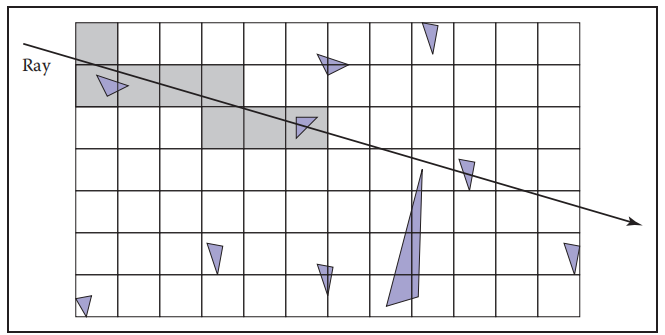  

而且前面说到表面可能同时被多个小块包括，这使得我们在判断射线求交时还需要判断当前射线是否会超出小块的范围，例如在下图中如果我们不检查射线范围的话会先命中三角面b而导致错误的结果。

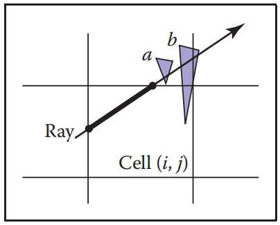  

### 12.3.4 Axis-Aligned Binary Space Partitioning 轴向二叉空间划分(BSP)

由于均匀分割空间会导致命中率低下，那么能不能对空间进行不均匀的划分呢？将空间进行不均匀划分然后使用树结构将空间组合起来就是二叉空间划分的想法。这里的二叉显然是指二叉树，除了二叉树还有在三维中使用八叉树对空间进行自适应划分的方法，在此不提。

二叉空间划分的基本思想就是判断当前包围盒中表面的分布情况，使用某个平面将当前整个场景分为两块，然后继续在子包围盒中进行进一步的判断。这种方法划分出来的包围盒大小和分布都是不均匀的，可以很大增大命中率，但是缺点就是由于包围盒树的生成需要不断判断当前场景中的表面分布情况，往表面集中的区域进行细分，因此这种方法几乎无法实时进行，通常都是离线建立划分树BSP，然后在运行中调用之前生成的划分，也因为这个缺点，这种方法难以应对有大量可活动物体的场景。

而常见的BSP有两种划分方法：轴向划分和面片划分。面片划分方法在下一节中介绍，而轴向划分方法的变体常称为K-D树(K-Dimension Tree)。轴向方法首先分析场景物体然后选择一个分割位置，按照某个轴所垂直的表面进行一个平面分割，然后分出来的左右子树中循环按照下一条轴的垂直表面进行分割。这种方法由于分割出来的表面还比较规则因此也比较方便决定查找的方向。

以二维场景为例，对于每个进入包围盒的射线，判断此时射线的起点和射线的相对表面的方向，用下面的伪代码配合示意图决定接下来要继续往哪个子树进行查找。代码中的xp得到了射线起点与分割表面的左右关系，xb得到了射线的前进方向，因此可以分为四种情况然后轻松决定接下来要遍历的子树。

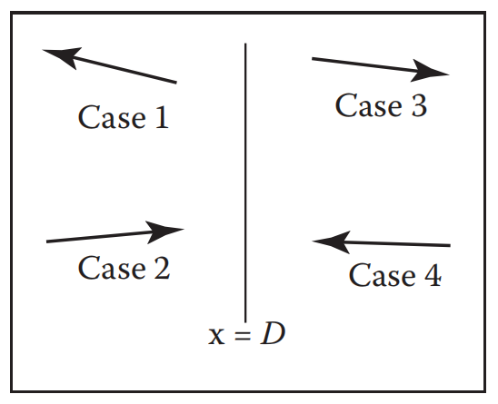  

```Shell
function bool bsp-node::hit(ray a + tb, real t0, real t1, hit-record rec) 
  xp = xa + t0xb
  if (xp < D) then  
    if (xb < 0) then  # Case1 射线在表面左边且射线往左，遍历左子树
      return (left = NULL) and (left→hit(a + tb, t0, t1, rec))
    t = (D − xa)/xb # 判断是否真的会进入右边的包围盒
    if (t>t1) then
      return (left = NULL) and (left→hit(a + tb, t0, t1, rec))  # 不进入，同Case1
    # Case2 会进入，那么会穿过左右两个包围盒，都要遍历，但是左边比较近，一旦命中就停止
    if (left = NULL) and (left→hit(a + tb, t0, t, rec)) then 
      return true
    return (right = NULL) and (right→hit(a + tb, t, t1, rec))
  else
    analogous code for cases 3 and 4  # 对称的Case3和Case4
```

## 12.4 BSP Trees for Visibility 为优化可见性问题建立的BSP

### 12.4.1 Overview of BSP Tree Algorithm BSP算法总览

### 12.4.2 Building the Tree 建树

### 12.4.3 Cutting Triangles 切分三角形

### 12.4.4 Optimizing the Tree 优化树

## 12.5 Tiling Multidimensional Arrays 瓦片多维数组