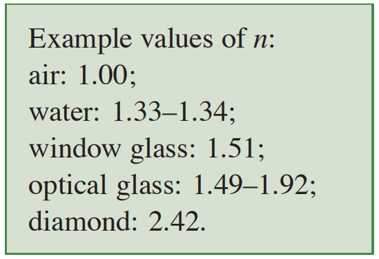
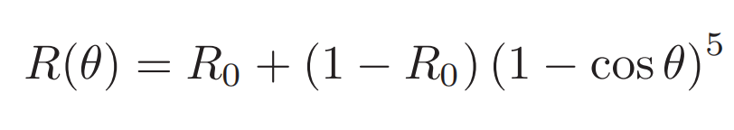
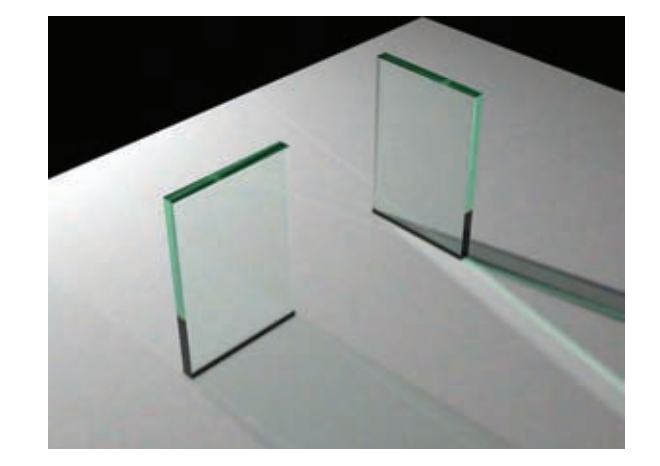

# 《Fundamentals of Computer Graphics, Fourth Edition》笔记——Chapter13 More Ray Tracing 光线追踪扩展

本章是前面第四章光线追踪内容的扩展，补充了一些实现光线追踪中常用的更进一步的技术，包括对透明物体的渲染，实例化技术在光线追踪中的应用，如何在光线追踪中渲染构造实体几何(CSG)和利用分布式光线追踪可以达到的很多华丽的效果。

- [《Fundamentals of Computer Graphics, Fourth Edition》笔记——Chapter13 More Ray Tracing 光线追踪扩展](#fundamentals-of-computer-graphics-fourth-edition笔记chapter13-more-ray-tracing-光线追踪扩展)
  - [13.1 Transparency and Refraction 透明与折射](#131-transparency-and-refraction-透明与折射)
  - [13.2  Instancing 实例化](#132--instancing-实例化)
  - [13.3 Constructive Solid Geometry 构造实体几何](#133-constructive-solid-geometry-构造实体几何)
  - [13.4 Distribution Ray Tracing 分布式光线追踪](#134-distribution-ray-tracing-分布式光线追踪)
    - [13.4.1 Antialiasing 反走样](#1341-antialiasing-反走样)
    - [13.4.2 Soft Shadows 软阴影](#1342-soft-shadows-软阴影)
    - [13.4.3 Depth of Field 景深](#1343-depth-of-field-景深)
    - [13.4.4 Glossy Reflection 光泽反射](#1344-glossy-reflection-光泽反射)
    - [13.4.5 Motion Blur 动态模糊](#1345-motion-blur-动态模糊)

## 13.1 Transparency and Refraction 透明与折射

第四章里头我们已经了解如何渲染镜面反射材质和漫反射材质的物体了，那么现实中的材质实际上就只剩下透明材质例如水和玻璃我们还不知道怎么渲染。光线追踪算法的好处就是大多数情况下我们都可以优雅地用现实世界中的物理规则来进行编码，而不需要像光栅化方法一样用大量的技巧来逼近。

在现实中，透明材质是同时有两个属性的材质：反射和折射。反射效果我们在第四章已经介绍了，剩下的就是折射效果。在光线追踪算法中，我们常常使用折射定律（斯涅尔定律）来计算折射效果，斯涅尔定律就是下面的形式：

  

在上面的式子中，我们可以看到两个$n$，这两个$n$就是入射和出射两种介质的折射率，下面列出了几个常见介质的折射率

  


经典的透明物体的光线传播路径是下面示意图的形式

  

对于上面的入射光线$d$第一次折射产生的射线$t$，我们可以根据斯涅尔定律和一些三角函数变换得到下面的式子(书中有具体的推导)，用这个式子可以求出折射后的光线向量$t$：

  

在上面的式子中，我们注意到有一个大大的开平方操作。对于这个开方操作，开方号内的数为负数时（这种情况常常出现在折射率较大的介质中光线射入折射率较小的介质时），光线将无法产生朝向另一表面的折射，而是全部转化为反射，这种现象称为全内反射（total internal reflection）。我们在实现渲染器的时候可以先计算这个开方号内部的值，判断是否小于0来觉得要应用哪一种计算方法。

计算出折射和反射光的方向向量后，还有一个问题，就是反射强度和透视强度的计算。我们知道生活中并不只有理想镜面反射的物体，我们还有像有色玻璃这样同时发生着反射和折射，且自身会呈现出颜色的物体。还有一个生活现象就是当我们以接近切线方向观察桌子的时候，桌子这样的漫反射物体也可能在表面产生足够清楚观察的镜面反射现象。这实际上就是菲涅尔方程（Fresnel equations）的效果，物体的反射强度和透射强度是与物体本身材质和观察角度等因素有关的。

在图形学中，首先我们常用如下的Schlick在1994年提出的方程来近似处理大观察角度时产生的镜面反射现象。



其中$R_0$如下，且$\theta$始终是介质朝向空气一侧的角度

  

上面式子中计算出来的$R$实际表示的是光线射入介质后，光线能量被分配到反射和折射的占比，$R$是反射光的占比，$(1-R)$是折射光的占比。

计算了能量的占比后，我们还知道光线在介质中传播时是会有损失的，这个损失与介质属性和传播距离有关。计算这个损失的方法是比尔定律（Beer's Law），图形学常用下面的式子来计算光传播后的强度：

  

在上面这个式子中，强度$I$的参数是传播的距离，我们可以用光线从出发到碰撞点经历的步长来计算。而$a$是介质对光线的吸收率，由于取$ln$的困难，在图形学中我们用预计算好的常数$a_x$负值计算。综合以上步骤可以写出下面的伪代码

```Shell
if (p is on a dielectric) then
    r = reflect(d, n )
    if (d · n < 0) then
        refract(d, n, n, t) c = −d · n kr = kg = kb = 1
    else
        kr = exp(−art) kg = exp(−agt) kb = exp(−abt)
    if refract(d, −n, 1/n, t) then
        c = t · n
else
    return k ∗ color(p + tr) R0 = (n − 1)2/(n + 1)2
R = R0 + (1 − R0)(1 − c)5
return k(R color(p + tr) + (1 − R) color(p + tt))
```

经过这样完整的折射公式后，配合之后的章节还会补充的粒子追踪内容我们可以渲染出下面这样非常接近真实的玻璃折射效果

  

## 13.2  Instancing 实例化

实例化是渲染运行中优化的一种常用方法，常用来优化那些需要渲染大量重复对象的场景。其核心就是只对源对象进行完整的计算，然后通过某种代价很低的方式将计算结果推广到其它被复制的对象上，粒子效果，地形效果等很多就是利用了实例化技术。在光线追踪中，实例化有个很有用的用法就是用来快速求解射线碰撞的问题。

我们前面知道三维物体的旋转，缩放，移动三个属性可以用仿射变换矩阵对顶点进行处理来快速完成。利用这个特性，我们用实例化我们将源对象通过仿射变换的方式得到很多略有不同的副本，然后我们对源对象进行射线碰撞检测，这是光线追踪中开销很大的一步。然后由于碰撞检测会得到碰撞点射线比率坐标和例如碰撞处法向量值等其它一些属性，我们可以将各个实例的仿射变换矩阵应用在源对象的这个射线上，就可以非常快速地得到其它所有实例的碰撞坐标。然后对其它碰撞得到的属性也可以用相似的方法，例如材质值直接复制，法线值通过前面第四章讲到的法线仿射变换处理...

实例化的图解如下图，关键就是对射线向量应用变换矩阵来省去多余的碰撞检测

  

## 13.3 Constructive Solid Geometry 构造实体几何

构造实体几何，简称CSG，是一种建模复杂模型的常用方法，其核心就是利用多个简单的形状通过交并补这样的逻辑运算符进行三维处理直到得到自己想要的模型结果, 这里的操作有点类似上一节的包围盒相交计算。特点是其使用的形状都是球，立方体，环体等可以用数学方程直接表示的曲面，都是无限可分的。

光线追踪算法可以比较方便地实现CSG的渲染，方法就是在射线检测的时候首先用列表保存下每个步长的碰撞结果，然后将不同对象得到的这些交点进行交并补处理得到顶点几何，对每个被划分出来的几何用处理后的最近元素作为真正的碰撞点进行渲染即可。示意图如下：

  

## 13.4 Distribution Ray Tracing 分布式光线追踪

所谓分布式光线追踪都利用了一定的随机算法让原本只需要发出一条射线进行渲染的场景变为发出多条射线以得到更好的效果。由于这个发出多条射线的过程可以并行分配给多个处理器分布式处理因此这也是分布式光线追踪名称的一个含义。

### 13.4.1 Antialiasing 反走样

如果只是简单调用光线追踪算法对每个像素发射一条射线的话显然得到的结果也会和光栅化中遇到的问题相似，由于采样不足在对象边缘产生很多锯齿，而且由于光线追踪算法在漫反射时的随机性，屏幕上很多射线都可能会反射到不合理的区域然后返回0值。为了优化这个问题最简单的解决方案自然就是超采样反走样。

在光线追踪中，有以下三种反走样方法，三种方法都不复杂：

- 均匀采样（regular sampling）
- 随机采样（random sampling）
- 分层采样（stratified sampling）

均匀采样就是我们在光栅化中的反走样方法，将每个像素划分为多个相同大小的网格，把网格中心作为射线发射的真正目标进行采样，得到的结果平均化就是这个像素该有的值。这种方法的缺陷就是可能会产生摩尔纹之类的采样走样。

随机采样则是光栅化没法做到的，在像素对应的那个小区域内进行随机，随机得到的点作为射线发射的目标。这种方法规避了均匀采样可能产生的摩尔纹，但是分布不均的采样可能导致结果产生很多噪声，需要大量的随机采样点来对抗这种噪声。

综合这两种方法的就是分层采样，首先像均匀采样一样将像素划分为网格，然后再对每个网格进行随机采样。这种方法使得采样点的分布均匀了很多，而且由于网格内的随机化因此大大降低了摩尔纹的产生，是最常用的采样。

### 13.4.2 Soft Shadows 软阴影

在现实中很少有阴影的边缘是完全锐利的，这本质上是因为现实中的光源并非没有自身面积，也就是并不是理想点光源：由于发光的是一个区域，光线并不能完全保证朝向，再加上光线在物体边缘可能发生的衍射，现实中的阴影会是所谓的"本影"和"半影"组合而成。本影半影的示意图如下：

  

在上图中我们可以看到，我们说传统上的阴影算法没有软阴影实际上就是缺少了左右两个$p$区域也就是缺少了半影。为了添加上这个半影光栅化渲染中进行了很多的尝试和研究，但是光线追踪并不需要那么复杂的处理。在光线追踪中我们只需要对发光面发射阴影射线这一步进行改进，首先对发光面上随机采样得到一定数量的点，然后将这些点打乱，打乱后在射线对应的目标点不变的情况下，将这些打乱的点作为射线的起点进行阴影计算。这个做法在逻辑上与现实的光源软阴影生成很类似，能够得到很好的阴影效果。

对应的伪代码如下：

```Shell
for each pixel (i, j) do
    c = 0
    generate N = n2 jittered 2D points and store in array r[ ]
    generate N = n2 jittered 2D points and store in array s[ ]
    shuffle the points in array s[ ]
    for p = 0 to N − 1 do
        c = c + ray-color(i + r[p].x(), j + r[p].y(), s[p])
    cij = c/N
```

### 13.4.3 Depth of Field 景深

景深是另一个分布式光线追踪的应用，指相机对焦点前后相对清晰的成像范围。实际上模拟的就是现实中摄像机由于光圈存在面积的原因，对焦不准的物体会发生模糊，而对焦准确的物体就会很清晰，这能给画面增加层次感。在光栅化方法中景深效果通常不能正确实现只能用深度值加模糊效果来近似。而光线追踪通过算法模拟相机的光圈可以得到和真实一致的景深效果。

首先我们要了解景深效果产生的物理原因。在现实中我们可以控制透镜的光圈大小来改变进入镜头透镜的光线角度，当光圈比较大的时候进光量会比较大角度也变大，这会导致成像平面上只能拍到近处的清晰景像，称为浅景深。相应的，如果我们放大光圈，进光量和角度就会变小，这会使得我们能拍到清晰的远处物体，称为深景深。值得注意的是浅景深的清晰成像范围要远小于深景深的，因此较小的光圈很适合拍风景照且能同时清晰拍到很大深度范围的内容。

  

在光线追踪中，我们平时的虚拟相机的光圈实际上是无限小的可以理解为每一个进入相机的光线都完美成像在我们的像素上，在细讲就是因为我们在发射射线的时候是从同一个相机中心点往像素上发射的，因此效果就是完美的成像。但是如果我们想要景深，那么成像就不能这么完美。我们想到有景深的情况下相当于成像焦点并不对应一个点，因此我们可以虚拟一个方形或圆形的采样平面，从光线反向传播的想法来看这个采样平面就相当于光圈，我们对这个平面采样到的点作为光线真正的起点，也就是产生许多起点也有一定随机性的光线进行渲染。在这样的效果下，每一个像素都采样着起点和终点都不确定的颜色，能够得到非常逼真的景深效果。

### 13.4.4 Glossy Reflection 光泽反射

同样是分布式光线追踪的随机化射线的想法，还有一个应用就是用来模拟那些不是完全镜面的反射效果。对于现实中一些磨砂材质的金属，其表面产生的反射也是模糊的，这个模糊实际上就是因为光线没有完全遵守反射定律。光线追踪可以很轻易模拟这个效果，只要在计算反射向量的时候给反射量加上一定的随机扰动即可，通过一个模糊强度参数来控制这个扰动的大小可以很好地表现出模糊的反射材质。

### 13.4.5 Motion Blur 动态模糊

本章的最后一个分布式光线追踪的应用是动态模糊效果。动态模糊效果模拟的是相机成像的时候由于曝光时间的关系运动快的物体的成像就会在胶片上划出轨迹，光线追踪通过引入时间参数也可以模拟这个效果。

具体来说，对于场景中会移动的物体，首先设置一段采样时间$(T_0,T_1)$，然后当光线追踪成像的时候对给随机射线附加一个随机的时间参数，将场景设置为那个随机时间的时候物体的状况，此时射线就会捕获到$T$时刻的物体。只要这个过程中随机足够充分，最后在有运动物体的部分物体就会表现出模糊成像的效果。如果采样过于充分的话则能达到类似于星轨的长曝光效果。

尽管动态模糊的计算量比较大，但是结果如下图右下角的物体成像效果也会很真实：

  