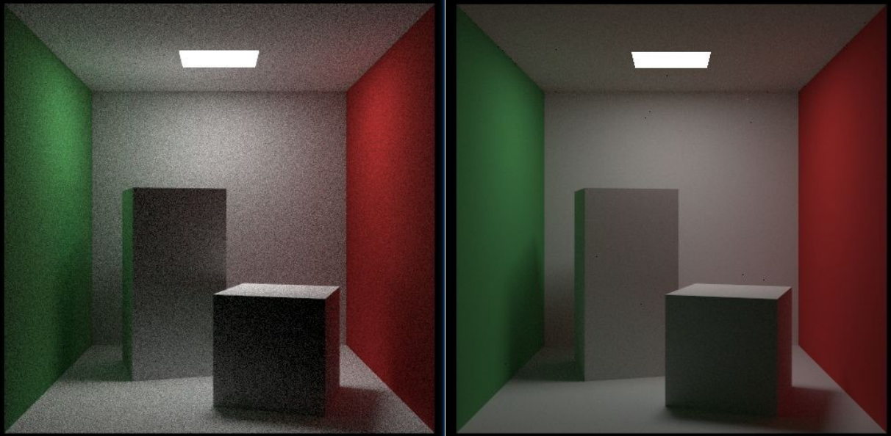
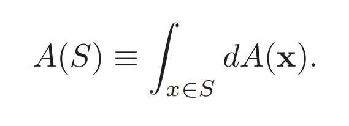
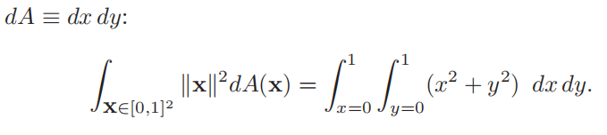
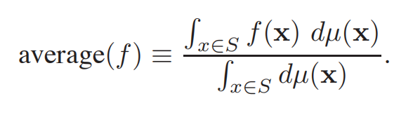
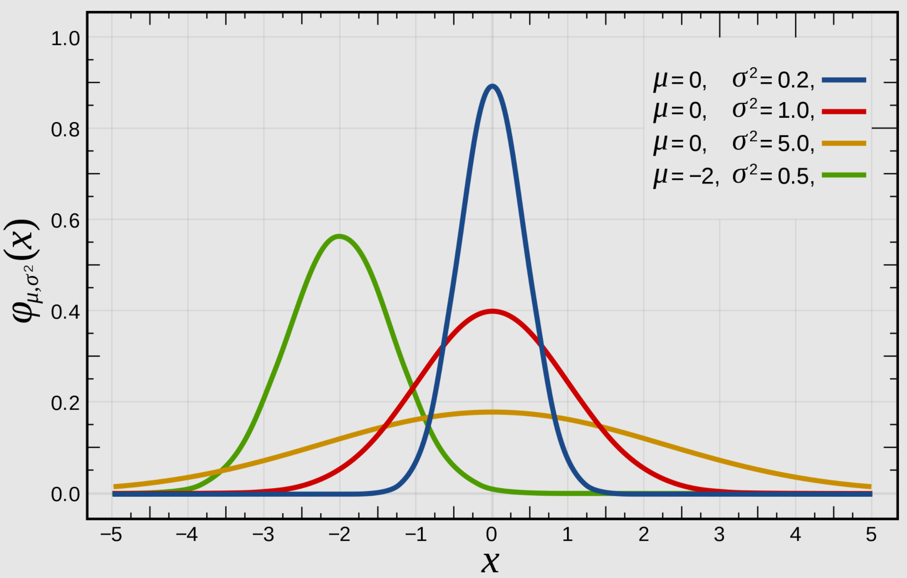
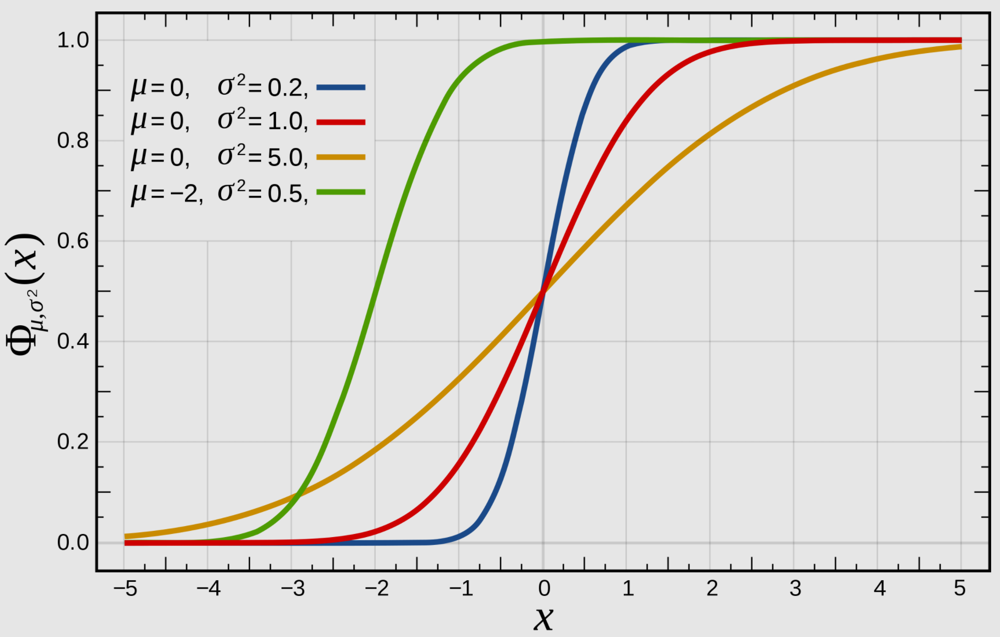
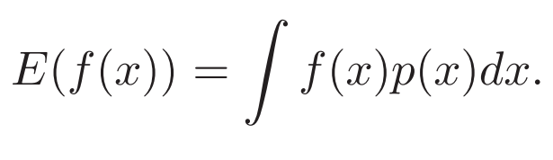
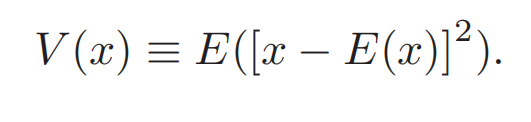
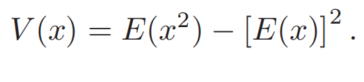
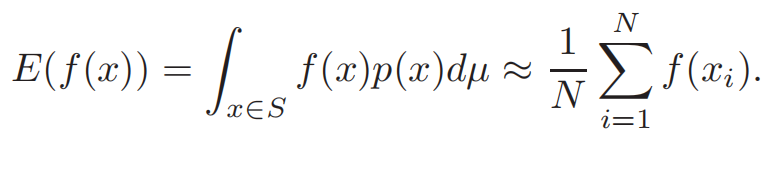

# Chapter14 Sampling 采样

- [Chapter14 Sampling 采样](#chapter14-sampling-采样)
  - [14.1 Integration 积分](#141-integration-积分)
    - [14.1.1 Measures and Averages 测度与平均](#1411-measures-and-averages-测度与平均)
  - [14.2 Continuous Probability 连续概率](#142-continuous-probability-连续概率)
    - [14.2.1 One-Dimensional Continuous Probability Density Functions 一维连续概率密度函数](#1421-one-dimensional-continuous-probability-density-functions-一维连续概率密度函数)
    - [14.2.2 One-Dimensional Expected Value 一维期望](#1422-one-dimensional-expected-value-一维期望)
    - [14.2.3 Multidimensional Random Variables 多维随机变量](#1423-multidimensional-random-variables-多维随机变量)
    - [14.2.4 Variance 方差](#1424-variance-方差)
    - [14.2.5 Estimated Means 均值估计](#1425-estimated-means-均值估计)
  - [14.3 Monte Carlo Integration 蒙特卡洛积分](#143-monte-carlo-integration-蒙特卡洛积分)
    - [14.3.1 Quasi–Monte Carlo Integration 拟蒙特卡洛积分](#1431-quasimonte-carlo-integration-拟蒙特卡洛积分)
  - [14.4 Choosing Random Points 选择随机点](#144-choosing-random-points-选择随机点)
    - [14.4.1 Function Inversion 函数求反](#1441-function-inversion-函数求反)
    - [14.4.2 Rejection 拒绝法](#1442-rejection-拒绝法)
    - [14.4.3 Metropolis 梅特罗波利斯法](#1443-metropolis-梅特罗波利斯法)

本章的用意在于为未来更深一步的光线追踪探索(第23章介绍路径追踪，第24章介绍反射模型)打下数学基础，介绍了计算机中常用的采样和积分理论，且核心是采样方法。

之所以要介绍采样方法，是因为我们都知道光线追踪的结果图多多少少会出现噪点，并不是那么干净，但是我们现实中的相机拍摄并不会产生噪点，计算机中的光线传播是出现了什么问题呢？问题就是光线追踪的渲染方程的第二项，也就是视线命中点上的半球积分，这个半球积分反映了在我们视点命中的点上接受到的其它方向传来的光线强度的和，或者说积分。现实中我们可以近似理解光线传播的每个点都得到了充分的光线反弹和采样，因此每个点上的光线强度传播回到眼睛时都代表了其真实接受到的强度。但由于计算机算力有限，只能对这个半球进行有限次数的离散化采样，试图去逼近真实接受到的光线，可想而知不同的采样算法对这个求和的逼近自然各有优劣，那些不够好的采样方法很容易对强度大的区域只进行了一点点采样，而对强度小的区域进行了过多的采样，这样不够合适的采样策略自然会使得我们对那个点上的积分近似估计产生很大的偏差，不但让我们想要得到的期望偏离真实值，方差也很大，反映到渲染中很有可能就是那个点估计出来的光线强度远偏离实际的光线强度而变为黑色或者变得过亮，形成图中的噪点。不够好的采样方法例如均匀采样会使得我们需要付出成倍的采样次数才能较好地逼近真实的光线分布，而好的采样方法大大提高了效率。

  

在阅读这一章的时侯由于一些数学词汇的不理解我翻看了几次本书第二版的中文译文版本，结果发现不知是译者水平有限或是其它原因，本章的翻译不但很多地方不通顺甚至还出现了多个名词的错译，希望读者阅读中文版本时多多留意一些数学名词并与英文版相比较以防混淆。还有一点，这一章涉及的数学概念很多，书中只是简略提及了这些概念且在我看来介绍的也不是很清晰，想要理清这些概念之间的关系还是要多阅读网络上相关的文章。

## 14.1 Integration 积分

这一节主要介绍积分与测度(measure)。测度这个词在本书的中文译文中被完全错误地翻译为度量(metric)，这两个概念看起来意思相近但实际上几乎毫无关联，如果你用度量这个词去进行中文相关搜索将很难找到关于本章的内容，会带来很多麻烦。这一节的内容比较抽象且底层，而不了解测度对后面理解概率论的内容实际上又没有太大的影响，因此不想阅读的话可以跳到[14.2](#142-continuous-probability-连续概率)。如果想要了解这方面内容的话可以阅读下面链接中的文章，这里我只是笔记下自己对这一节的理解：

> 概率论和实变函数（测度论）有什么联系？ - 知乎
> https://www.zhihu.com/question/29800166
> 
> 【测度论】概率论与测度论之间联系的通俗解释(一) - 张敬信的文章 - 知乎
> https://zhuanlan.zhihu.com/p/23629928
> 
> 如何理解测度这个概念？ - 知乎
> https://www.zhihu.com/question/24488491
> 
> 实分析: 测度与积分 - Colescu的文章 - 知乎
> https://zhuanlan.zhihu.com/p/54468555
> 
> Riemann 积分与 Lebesgue 积分的联系与差异分别是什么？ - 知乎
> https://www.zhihu.com/question/28700668


首先测度从最直观的角度上看就是能将一个集合映射为一个非负实数的广义上的函数。举个例子，测度就如同尺子一样，对于平面上的一条由点集组成的线，我们可以定义一个函数，将两个点（集合）映射为这两个点之间的某种坐标运算结果（实数），这个就是测度，然后将这个测度称为“长度”，类似地，也可以将一组点映射为另一个测度，称为面积/体积/质量等。正因为测度实际上是一个映射，所以相同的点集在不同的测度下会得到不同的结果。

并非任意的映射函数都可以用来当作测度，对于测度我们需要满足两个性质：

1. 空集的测度是0
2. 可加性：两个集合并集的测度与集合测度各自相加再减去集合交集的测度相同

这两个性质听起来和概率论里的语言很像，没错，测度论可以说就是概率论的底层逻辑。概率论就把事件看作一个个的集合，然后采用测度来衡量这些集合，我们把一个事件发生的概率看作这个事件的测度。

那么我们在语言上描述了测度的概念，该如何用数学符号来表示测度呢，比想象的更简单：积分。如果我们将空间想象为由点集组成，那么我们就可以计算这个空间中的子空间（子集）上的测度，所使用的就是积分符，此时我们的测度函数A(x)被写在微分算子中如下式，也就是空间S的测度就是这个积分：

  

到了这里我们可能会想，为什么要引入测度来重新解释我们用了很久的积分呢，以前的积分不能处理这些问题么？数学工具的发展不单是为了解决之前不能解决的问题，还为了给已经解决的问题更完备透彻的解释。回忆当年刚开始学微积分的时侯，我们会将一个函数的积分理解为很多宽度相同的小梯形的面积和吧，这种思路就是黎曼积分。但当年微积分课上大多都会提到黎曼积分是有其局限性的，例如无法求出迪利克雷函数的积分值，因此人们重新审视黎曼积分的基础，提出测度的概念重新分析我们习以为常的很多计算，结局就是对黎曼积分扩展为勒贝格积分。

勒贝格积分比黎曼积分要复杂得多，最基础的理解就是黎曼积分使用宽度无穷小的梯形的面积和来计算积分，这个相同的宽度（宽度这个词是不是能联想到测度了）如果将其理解为一个常值函数，那么勒贝格积分就是使用不同的函数来作为这个梯形的底，这些用来做底的函数称简单函数。利用多组不同简单函数而不是黎曼积分中的常值函数来做底让我们不仅可以更准确地逼近目标函数，还可以计算高维空间中那些难以用常值衡量“宽度”的函数积分。更重要的是，由于测度的定义，我们不再需要连续的积分区间才能对函数进行积分了，之前积分的空间被成了“可测集合”，从集合的角度处理让我们对概率论这样充满离散性的问题也有了处理的理论依据，甚至计算概率时我们终于无须区分离散概率和连续概率的区别。

显然，由于涉及到了测度的概念，勒贝格积分的计算会比黎曼积分困难许多，幸运的是，勒贝格积分得到的结果与黎曼积分结果是一样的，因此对于那些黎曼可积的函数，我们仍然可以用方便计算的黎曼积分处理。

再回到测度上，面对同样的一个空间和函数，我们可以通过更改其测度来赋予其不同的意义计算出不同的结果，改变测度的常见思路就是加权。为了满足前面判断测度的两个条件，我们需要让给测度加的权值是一个映射至非负实数的函数。例如，假如我们想要计算集合径向加权的测度，那么就给它附上下面的权值，然后为了计算方便我们可以将其转到二维笛卡尔坐标中进行我们熟悉的计算。

  

这里的核心在于我们不该把新加入的||x||^2看作被积函数，而是需要在脑海中将其视作一个新的测度在衡量原先的空间，这样我们才能接受把上面的积分简写为形如v(X)的形式。在以前我们可能会将这种写法作为一种简写来理解，如今我们可以认为这只是对同一个目标的不同测度而已。

### 14.1.1 Measures and Averages 测度与平均

测度的思想会将我们常见的很多认知打破，书中这里关注内容称为积分几何学integral geometry。假如我们想要求一个函数f(x)在空间S中对应某个测度的平均，那么我们应该使用下面的式子进行。这个式子一眼望过去可能不太好理解，回忆一下我们以前是怎么定义函数平均的：函数在定义域上的定积分/定义域的长度。这么说出来就能理解，新的函数平均实际上就是测度从原先的dx变为了某个不一样的函数并改变了思路，但本质还是一样的。

  

由于测度不同的时侯相同的函数相同的空间也会得到不同的结果，因此函数平均在不同测度下也是不同的。那么如何找到一个尽量“自然”的，符合我们需求的测度，让那些我们直觉上认为相同的目标能计算出相同的结果呢。原文14.1.2和14.1.3针对二维直线和三维直线不同的表达下的测度选择问题进行了一定的讨论，有兴趣可以去看原文。

## 14.2 Continuous Probability 连续概率

如开头所说，图形学中大量用到了概率论的工具来进行采样和积分等，光线追踪中所需的就是每个点半球上受到的光线强度的期望值，这就需要概率论的知识。本节简单回顾了概率论的内容，如果掌握得好的话可以跳过，我也只是简单记录一下。

### 14.2.1 One-Dimensional Continuous Probability Density Functions 一维连续概率密度函数

概率密度函数(pdf)上的每个值描述了区间中某个事件发生的概率值，其特点是我们可以很直观地看出各个事件发生的概率，其每个值都大于0且全区间积分后值为1。我们常见的正态分布函数的概率密度函数图像如下：

  

还有一个近似的概念是累积概率分布函数cumulative probability distribution function(简称cdf)，这是由概率密度函数从负无穷到x积分得到，描述了负无穷到某个位置为止的整个区间发生的概率。与pdf不同的是其必是单调递增的函数且最大值为1。我们常见的正态分布函数的概率分布函数图像如下：

  

### 14.2.2 One-Dimensional Expected Value 一维期望

期望值描述了从某个随机变量分布中取值时“期望得到的值”，其可由多次抽取后的均值来进行估计。下面的式子时我们对于一个符合概率密度p的函数f的期望，回想前面说到概率论的底层是测度，我们可以将这个式子理解为函数f的测度，这个测度p就是其概率p，也就因为这样我们可以将其写为E(f(x))的形式。

  

### 14.2.3 Multidimensional Random Variables 多维随机变量

一维期望和一维概率密度函数都可以很自然地扩展到多维中，由于前面引入了测度的思想，扩展的思路就是通过在多维空间中定义新的测度，然后就可以用一样的方法进行计算了。图形学中常常讨论的是三维空间中的概率，对于这种情况我们可以采用二维面积$d\mu=dA=dxdy$作为测度或者用单位球上的两个角度$d\mu=d\omega=sin\theta d\theta d\phi$作为测度，当我们将这两个测度引入到期望的积分式中后，我们可以对其进行一定的坐标分解来积分。

### 14.2.4 Variance 方差

方差表示了随机变量与其分布的期望的差的平方形成的随机变量的期望，也就是下面的式子，其用于描述一个随机变量分布的集中程度，方差越大变量分布偏离越大越难以估计。方差的开方称为标准差。方差有两个等价的计算公式，其中后一个公式尽管没那么直观但是计算上方便很多。

  
  

### 14.2.5 Estimated Means 均值估计

图形学中我们常常遇到的都是对未知分布的估计，光线追踪中所需的光线强度这个分布的期望值。对于独立同分布的随机变量(图形学中很常见)，我们可以用多个抽样结果的平均值来近似均值，而且随着抽样次数的增加，方差会逐步变小直到可以将这个平均值作为真实期望使用。

  

## 14.3 Monte Carlo Integration 蒙特卡洛积分

这部分推荐阅读下面的文章：

> Monte Carlo数学原理 - papalqi的文章 - 知乎
> https://zhuanlan.zhihu.com/p/61611088

上面的式子中我们的目标是估计均值，也就是用后面的离散抽样来估计左边的积分，在计算机中使用随机数协助来进行采样估计积分的方法就称为蒙特卡洛积分。注意蒙特卡洛方法并不是一种具体的算法，其只是表示用计算机随机抽样估计的策略。

如果我们现在需要用随机数来对目标未知分布进行采样估计，标准的做法就是在区间上用均匀随机点进行采样，这样采样后的均值用上面14.2.5的均值估计就可以求出。

但是均匀分布的随机点很多时候并不能很好地对目标进行估计，因为目标随机变量分布可能汇聚在某个区域，均匀分布对所有区域都平等对待的思路使得我们在目标分布概率很低的地方进行了过多的采样而目标分布集中的区域也只是相同数量的采样点而已。最直接的后果就是为了提高估计的准确性也就是降低估计的方差。我们需要找到更好的方法在不增加非常多的采样数的情况下降低估计的方差。

为了解决这个问题提出了重要性采样，经过某些先验知识或者一开始进行了一些均匀的采样后，我们对区间按照不同的概率进行采样，在目标分布值大的区域进行更多的采样，分布平缓的区间减少采样的概率，这样的采样方式称为重要性采样，能够有效降低期望估计的方差。由于重要性采样改变了对目标采样的概率，因此估计期望的时侯不能再直接取平均而应该按照当前重要性采样分布的概率进行加权平均。

另一种降低方差的方法是分层采样，这种方法在光线追踪的视线层广泛使用，我们用来降低噪声的超采样就是这个原理。简单来说就是以像素为单位将区间分成很多份(层)，然后在每一块中进行随机采样。这种方法的好处是兼顾了每个区域样本个数，避免了完全随机的策略导致的采样不均。实验中分层采样常常既不会消耗太多计算资源又很好地降低了方差，尽管分层采样很多时候无法达到最低的方差，但是却在大多数时侯能将方差快速收敛至比较低的位置。

### 14.3.1 Quasi–Monte Carlo Integration 拟蒙特卡洛积分

拟蒙特卡洛积分是比分层采样更极端的做法，其同样追求区间上样本的均匀性但是完全摒弃了随机性，改用近似随机的固定序列进行采样，这是其称为拟蒙特卡洛的原因。这些随机序列能够保证在区域中的每个块上都有接近数量的采样点分布，但是由于摒弃随机性因此有些时候会导致意想不到的走样，由于使用的是预生成的固定序列因此这种方法可以降低计算随机数的消耗。

## 14.4 Choosing Random Points 选择随机点

蒙特卡洛积分的重要性采样告诉了我们可以用一些近似目标分布的已知分布产生随机点来优化采样的效果，但是计算机的伪随机数生成器实际上只能生成出符合均匀分布的随机点，这一节则是介绍如何生成符合我们想要的分布的随机点。基本的方法有三种：逆变换法，拒绝法，Metropolis法(简称M-H法)。

### 14.4.1 Function Inversion 函数求反

中文通常称为逆变换法，核心思想就是利用概率分布函数值域是[0,1]的特性，将从定义域上随机取值转为在值域上取值来产生符合分布的随机点。首先我们需要得到生成随机点的分布的概率分布函数cdf，如前面14.2.1所说cdf可以通过对pdf进行积分得到。得到cdf后，由于我们用来生成随机点的分布一般不会太复杂，因此我们常常可以轻松对cdf求反函数，假如这里求解不出解析形式的反函数的话要么使用数值解要么就不使用这个方法了。考虑到生成数值解也需要一定的计算量且效果不佳，求解不出反函数时最好不要使用这个方法。下面是一个简单的分布的求解例子，首先是积分得到cdf，然后求反函数。

  

  

  

得到反函数后我们只需要用随机数生成器生成均匀分布的[0,1]随机数，代入得到的反函数中，得到的新值就是符合这个分布的随机点了。这个思路同样也可以拓展到二维三维空间中。

  

### 14.4.2 Rejection 拒绝法

拒绝法，有时候被称为接受-拒绝法，也是一种常用的随机数生成方法。其思路与实现相对来说都很简单：从接近目标分布的简单分布中随机得到一个数，然后判断这个结果是否属于目标分布，属于则接受，不属于则拒绝，最后被接受的那些就是这个目标分布得到的随机数。

这个方法由于实现简单而且可以很方面地模拟各种分布所以常常被使用，但是由于拒绝法需要在比目标分布更大的简单分布上均匀采样因此不能很好地和分层采样配合，执行效率会比较低，所以一般被用在debug或者某些极端的情况下。

```shell
# 用拒绝法从单位圆采样的伪代码
done = false
while (not done) do
x = −1+2r()
y = −1+2r()
if (x2 + y2 < 1) then
  done = true
```

### 14.4.3 Metropolis 梅特罗波利斯法

最后一种采样方法比较复杂，需要随机过程方面的知识，就是Metropolis法，全称梅特罗波利斯－黑斯廷斯算法Metropolis–Hastings algorithm，常常被简称为M-H法。这个方法在马尔可夫蒙特卡洛(MCMC)采样中非常常用，书中这个部分篇幅很短不太好理解，中文版的翻译也不怎么通畅，最好看下面这篇文章和视频辅助：

> MCMC(三)MCMC采样和M-H采样 -博客园
> https://www.cnblogs.com/pinard/p/6638955.html
> 
> 徐亦达机器学习：Markov Chain Monte Carlo 马尔科夫蒙特卡洛(MCMC)【2015年版-全集】 -Bilibili
> https://www.bilibili.com/video/BV1qp411R76y

Metropolis的核心思想是突变，用来从未知的复杂分布中进行合理的采样，其本质上是对重要性采样的改进。重要性采样需要我们能够得到一个分布与目标分布接近的简单分布作为权重，但光线追踪中我们对球面光线进行采样时球面光线分布往往非常复杂，很难用简单的分布去加权，导致重要性采样的效率低下。Metropolis法的采样点由马尔可夫链产生，这表示每个采样点的产生都只与其上一个采样点有关，与过去的所有采样无关。我们通过一定的突变策略从马尔可夫链中采样，可以证明当这个突变策略生成的马尔可夫链满足细致平稳条件时，我们的采样就与初始状态无关且能够收敛于目标分布。这里的细致平稳条件就是书中比较难理解的“flow in the two directions should be the same”，而就是为了让突变策略能够满足这个条件我们才需要在一个简单分布中采样然后设置一定的接受概率来对样本的生成进行干预。

Metropolis法的原理证明起来比较麻烦，这里只简单介绍流程：

1. 选择一个初始随机样本x并令t=0
2. 从一个简单分布中得到一个随机数然后按照某种转移策略改变当前样本x得到候选样本y
3. 计算接受概率$\alpha=min(1,\pi(y)/\pi(x))$，这个地方的pi指我们想要采样的那个复杂分布
4. 当概率为1时接受这个新样本，令x=y
5. 当概率小于1时，从均匀分布中再抽样一个数，对比这个数与接受概率的大小：值小于接受概率时，接受这个样本，x=y；大于接受概率时，仍然保留这个样本，但是不改变当前的x，也就是不推进马尔可夫链
6. 继续这个迭代T次，这里的T越大最终的采样越接近目标分布
6. 停止迭代后将采样得到的链的后n个数取出作为采样的随机点，越靠后的样本越符合目标分布，因此显然T和n的设置需要根据性能和精度进行取舍

关于采样的内容实在太多，书中短短20页的内容可以说连皮毛都还没涉及到，更不用说我的笔记了，想想真是任重而道远，以后有新的系统性的总结再来补充。