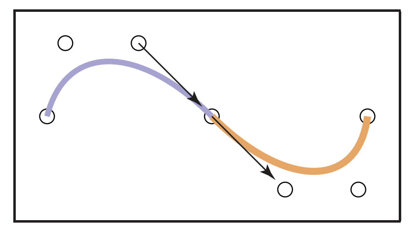

# Chapter15 Curves 曲线

- [Chapter15 Curves 曲线](#chapter15-curves-曲线)
  - [15.1 Curves 曲线](#151-curves-曲线)
    - [15.1.1 Parameterizations and Reparameterizations 参数化与重新参数化](#1511-parameterizations-and-reparameterizations-参数化与重新参数化)
    - [15.1.2 Piecewise Parametric Representations 分段参数表示](#1512-piecewise-parametric-representations-分段参数表示)
    - [15.1.3 Splines 样条](#1513-splines-样条)
  - [15.2 Curve Properties 曲线性质](#152-curve-properties-曲线性质)
  - [15.3 多项式片段](#153-多项式片段)
    - [15.3.1 Polynomial Notation 多项式表示](#1531-polynomial-notation-多项式表示)
    - [15.3.2 A Line Segment 线段](#1532-a-line-segment-线段)
    - [15.3.3 Beyond Line Segments 超线段](#1533-beyond-line-segments-超线段)
    - [15.3.4 Basis Matrices for Cubics 三次函数基矩阵](#1534-basis-matrices-for-cubics-三次函数基矩阵)
    - [15.3.5 Blending Functions 混合函数](#1535-blending-functions-混合函数)
    - [15.3.6 Interpolating Polynomials 在多项式中插值](#1536-interpolating-polynomials-在多项式中插值)
  - [15.4 Putting Pieces Together 合并片段](#154-putting-pieces-together-合并片段)
    - [15.4.1 Knots 节点](#1541-knots-节点)
    - [15.4.2 Using Independent Pieces 使用独立片段](#1542-using-independent-pieces-使用独立片段)
    - [15.4.3 Putting Segments Together 合并片段](#1543-putting-segments-together-合并片段)
  - [15.5 Cubics 三次曲线](#155-cubics-三次曲线)
    - [15.5.1 Natural Cubics 自然三次曲线](#1551-natural-cubics-自然三次曲线)
    - [15.5.2 Hermite Cubics 埃尔米特三次曲线](#1552-hermite-cubics-埃尔米特三次曲线)
    - [15.5.3 Cardinal Cubics 基数三次曲线](#1553-cardinal-cubics-基数三次曲线)
  - [15.6 Approximating Curves 拟合曲线](#156-approximating-curves-拟合曲线)
    - [15.6.1 Bezier Curves 贝塞尔曲线](#1561-bezier-curves-贝塞尔曲线)
    - [15.6.2 B-Splines B样条](#1562-b-splines-b样条)
    - [15.6.3 Nonuniform B-Splines 非均匀B样条](#1563-nonuniform-b-splines-非均匀b样条)
    - [15.6.4 NURBS 非均匀有理B样条](#1564-nurbs-非均匀有理b样条)

这一章介绍了曲线的表示, 内容毕竟偏向数学. 前半部分主要是介绍了曲线的性质和表示方式, 然后后半部分主要介绍了样条曲线. 样条曲线的内容在[样条曲线曲面](../../杂项笔记/样条曲线曲面/README.md)有过一些简单的介绍, 这一节没有介绍曲面部分, 但是在曲线部分则进行了更加详细的介绍.

## 15.1 Curves 曲线

首先曲线是什么我们应该都很熟悉了, 在数学上曲线的定义分为两种: 离散的, 连续的. 不管是哪一种曲线都是在n维空间中的一个表示, 且都可以用一个一维参数(长度/时间)来定位. 在图形学中离散曲线比较常用. 曲线在数学上有三种表示方法:

1. 隐式曲线: 用隐式方程表示, 输入点的坐标返回是否为0表示点是否在线上.
2.   
3. 参数曲线: 输入定位曲线上点的参数(索引)到一个参数函数中, 返回对应的坐标.
4.  
5. 生成式曲线:  用交并补等操作得到的曲线

图形学中常用的是参数表示的曲线, 操作起来最为自由; 隐式曲线适合表示一些固定的形状, 例如绘制圆形; 生成式曲线在表示分形的时侯比较常见. 注意参数曲线虽然常用但不代表是最简单的表示方法, 还是要具体问题具体分析. 而且显然相同的曲线也可能有多种不一样的表示, 不同的表示形式之间可以互相转化, 这一章后面着重讨论的多项式曲线就是指由多项式构成的参数曲线.

### 15.1.1 Parameterizations and Reparameterizations 参数化与重新参数化

参数曲线是指在区间上由一个参数函数映射定义的曲线, 同样的一条曲线由于参数函数设置的不同可能有不同的表示, 对应的参数区间也不同, 它们称为对一条曲线的参数化. 而将一个曲线用参数函数定义的过程称为重新参数化. 为了方便实际运算, 我们常常将曲线的参数区间重新参数化到[0,1].

参数化的好处是给了我们一种方便对比不同曲线的方法, 但是缺点是对曲线进行的参数化有时候会导致混乱, 这是因为曲线本身是不需要这个特殊参数的参与的(例如隐式曲线). 只看参数形式的话很多截然不同的曲线会有相同的参数形式, 这些曲线绘制出来的时侯形象是一样的, 但是例如在曲线内将参数写为二次幂形式, 同样参数为0.5时, 二次幂的代表的点显然与一次时代表的不同.

相同的曲线出现了不同的表达, 解决方法是给出共识让各个机器都以相同的方法选择参数, 这种为了便于定义曲线创建的参数形式称为自然参数化, 最常用的是弧长参数化, 也就是让函数沿着曲线的弧长改变, 相当于固定了函数的切线斜率.

### 15.1.2 Piecewise Parametric Representations 分段参数表示

很多曲线很难被直接用一个函数定义, 因此催生了分段参数表示, 运用分治法将曲线划分为很多阶段, 每个阶段由一个近似精确的曲线代替. 分段参数表示的曲线写出来常常就是分段函数的样子, 分段曲线最基本的要求是保持连续性, 也就是分段处需要是连接的. 然后使用分段函数的时侯需要注意分段函数是一个权衡问题, 是需要使用多密集的分段, 每一段要用多复杂的曲线来拟合, 最后需要得到怎样的结果, 一定要把握好这些权衡来得到性能和效果的平衡.

### 15.1.3 Splines 样条

样条就是以前设计师用来作为模具绘制光滑曲线的木条或金属条, 设计师用多段这种硬质又可扭曲的模具来绘制复杂的形状. 在数学上样条指的是样条函数或者说样条曲线, 它们是一系列阶数相等的分段多项式函数, 我们定义这些分段函数来表示复杂的曲线.

## 15.2 Curve Properties 曲线性质

计算机中我们很关注曲线的一些数学性质, 那些可以在曲线局部被衡量的性质, 例如导数, 称为局部性质; 那些需要全局判断的性质, 例如长度, 称为全局性质. 图形学中我们关注于下面几个局部性质, 研究这些性质的方向是微分几何:

1. 连续性
2. 位置
3. 方向
4. 曲率及其它导数

其中连续性是最常考虑的性质, 根据某点处某阶导数的不同分为不同的连续性等级, 最低的曲线相连是0阶连续, 一阶导数相同是1阶连续, 以此类推...连续性分为两种, 参数连续和几何连续: 参数连续需要曲线上各点的前后两边的对应导数相等, 用C表示, 而几何连续只需要各点两边导数相差一个固定的系数k即可, 用G表示. 图形学中几何连续性更常被考虑.

## 15.3 多项式片段

### 15.3.1 Polynomial Notation 多项式表示

分段多项式函数曲线是由很多多项式函数组成的, 多项式函数我们都很熟悉, 就形如二次方程, 三次方程等等, 将方程中的未知数项写为函数b, 分离出常数系数c, 就能写为下面的求和式子, 称为规范形式, 此时b称为基函数(base function)或混合函数(blending fuction):

  

规范形式的曲线便于计算机计算, 只要调整阶数n就能自动计算, 但是不方便人们理解也不容易导出. 所以这节的关键是找到几组常用的基函数b让我们能比较方便地用系数c来控制曲线.

### 15.3.2 A Line Segment 线段

最简单的多项式函数是一次的线性函数, 也就是线段. 利用线性插值我们可以在指定的两个端点(也就是系数)间进行插值, 这里的参数u就是曲线参数化得到的系数, 值从0到1, 相当于某点所在曲线上位置的百分比, 这里的p则称为控制点:

  

但是这样的表示形式不同于上面提到的规范形式, 不太适合用于计算. 所以可以将相同的曲线写为规范形式如下.

  

 显然规范形式下的a与前面的p并不相同, 而且为了操作方便我们还是更喜欢通过指定端点p来定义曲线, 因此通过将上面两式联立, 代入端点处的参数, 这个多项式函数就可以写为矩阵乘法**p=f(u)=Ca**的形式如下. 此时右式左边的那个系数矩阵称为约束矩阵C, 函数的结果是真实端点位置p.

  

又有时候我们需要在规范形式下的控制点a和真实情况下的p进行转换, 方法是求逆约束矩阵C, 得到的逆矩阵B称为基矩阵. 基矩阵让我们可以通过下面的式子方便地将p转为规范形式下的a. 下面的这个式子从矩阵展开就是对应上面的规范形式累加.

  

### 15.3.3 Beyond Line Segments 超线段

仅仅是一次线段很多时侯还不能满足要求, 对而二次线段, 我们需要三个控制点来描述. 一种方法是指定曲线经过的起点u=0, 中点u=0.5, 终点u=1, 三个控制点p的位置来得到约束矩阵C. 然后求逆可以得到基矩阵B, 从而我们可以很快计算出规范的参数a并写为规范形式.

  

另一种常用的定义则比较特别, 我们指定曲线的中点位置, 中点一阶导, 中点二阶导的值, 同样得到约束矩阵和基矩阵. 这种指定曲线某个位置的局部特征来表示曲线的方法有更高的自由度和更好的曲线效果, 在后面很常用.

  

### 15.3.4 Basis Matrices for Cubics 三次函数基矩阵

对于三次函数曲线, 我们常用的定义方式是Hermite形式, 也就是指定函数的起点位置, 起点一阶导, 终点位置, 终点一阶导. 此时推导出来的基矩阵如下. 这种函数也称为Hermite三次样条, 非常常用.

  

### 15.3.5 Blending Functions 混合函数

回顾应用基矩阵的函数, 会发现这个结构其实就是规范形式的矩阵定义. 这里的p就是系数c, 向量u是级数[1(u^0), u^1, u^2, ..., u^n]形式, 这里的uB就是基函数b, 也称为混合函数, 因为这个函数按照参数u将各个控制点混合起来得到了插值位置. 混合函数和对应的函数形式如下, 多亏了混合函数我们可以对任意曲线使用线性组合来拟合.

  

  

### 15.3.6 Interpolating Polynomials 在多项式中插值

通过上面求出的基矩阵, 我们可以方便插值出任何参数u所代表的曲线上的点, 但是注意到我们需要不断地进行矩阵乘法, 这个过程在高次情况下会比较慢. 下面的式子称为基函数的拉格朗日形式, 利用下面的形式我们可以用迭代的方式更快速地进行多项式曲线插值.

  

## 15.4 Putting Pieces Together 合并片段

### 15.4.1 Knots 节点

两个不同的函数相连的点称为节点, 最常见的节点就是分段函数中两个片段相连的点. 相对于分段函数, 我们使用的多项式函数则是通过对基函数进行范围控制来达到节点的效果, 通常让范围内的基函数有值而范围外无值, 形如下式. 而整个多项式函数中所有分段函数的节点组成的向量称为节点向量.

  

### 15.4.2 Using Independent Pieces 使用独立片段

之前的函数定义在(0,1)范围内, 因此当我们要将多个片段整合时需要进行映射. 通常来说我们将合并的函数定义域设置为(0,n), n是片段的数量, 然后根据片段的编号进行映射.

### 15.4.3 Putting Segments Together 合并片段

片段有多种连接方式, 至少需要保证C0连续性, 也就是两个片段的头尾值是相同的. 这里以一次函数的组合来表示不同连接方式可能造成的影响. 通常的连接方式有以下三种:

1. 所有片段都用自己的两个端点来表示, 但是片段连接点必须相等, 称为共享点模式.
2. 后一个片段的头是通过复制前一个片段的尾来得到的, 称为依赖模式.
3. 直接写出连接处点的位置的定义方程.

其中共享点模式很多时候片段由两个端点决定, 由于限定了前后片段相连端点的值需要相等, 因此修改中间一个端点只会影响到相连的两个线段, 这种只会影响局部顶点的性质称为局部性, 很多时候我们希望曲线能够拥有局部性. 而依赖模式多由起点和中间点决定片段的形态, 因此一旦修改了其中某一个片段导致了后端点的改变, 就会导致后面的所有片段的起点发生改变从而连环产生影响, 这称为缺少局部性. 具体的图示可以从下图看出:

  

## 15.5 Cubics 三次曲线

图形学中常用作分段曲线元的是三次曲线. 下面的这些曲线都是三次的, 且可以在内部和某些节处获得C2连续性, 在渲染时在视觉上有更好的效果, 有较好的对称性并兼顾了性能. 

从我们前面的规范形式三次多项式可以看出一个三次多项式我们需要四个系数的参与, 这里四个系数我们可以用四个控制点也可以用前面说到的导数等另一些属性来作为参数. 不同的参数设置可以产生性质各不相同的曲线. 

对于三次曲线, 我们希望曲线能够有下面的四个良好性质: 

1. 每个片段都是三次曲线
2. 曲线能够经过所有控制点
3. 曲线拥有局部性
4. 曲线在节点处是C2连续的

但是世上没有完美的曲线表达, 上面四个性质我们只能同时拥有其中的三个, 这就需要相应的权衡. 下面就介绍几种拥有不同性质的常用三次曲线. 

### 15.5.1 Natural Cubics 自然三次曲线

首先是能够得到性质1, 3, 4的自然三次曲线. 构造这样的曲线我们需要曲线起点和终点的位置和起点的一阶导与二阶导, 曲线的表达式和矩阵如下图: 

  

这种曲线的缺陷是由于使用依赖法进行定义, 因此缺少局部性. n个控制点可以生成有n-1个分段的曲线. 

### 15.5.2 Hermite Cubics 埃尔米特三次曲线

埃尔米特三次多项式曲线需要片段起点和终点的位置和一阶导来定义, 在节点处只能有C1连续性, n个控制点可以生成有（n-2）/2的分段. 这种曲线比较经典, 后面的曲线都是通过在埃尔米特曲线上加入一些额外控制来得到. 

### 15.5.3 Cardinal Cubics 基数三次曲线

基数三次曲线, 或称为基数三次样条, 也是只有C1连续性的曲线. 其用n个控制点可以生成n-2个片段, 是这三个简单的样条曲线中最常用的一种.

基数三次样条的特点是在埃尔米特三次曲线上又增加了称为张力(tension)的参数, 这个参数直观上控制了片段有多么接近一个直线. 张力t为0, 也就相当于埃尔米特曲线时, 这个曲线称为Catmull-Rom样条.

具体来说, 基数三次曲线的表达式如下图, 张力t起到对斜率进行加权的作用, 因此可以控制曲线的弯曲强度.

  

这一节介绍的基数曲线是为了解决前面插值曲线的一些缺点. 多项式曲线容易形成过冲并缺少样条曲线常有的局部性, 且多项式曲线无法从中间开始计算, 访问一个点必须访问所有其它的点, 相比之下样条曲线由于局部性所以可以方便在任意片段上修改.

但是基数样条曲线也不是十全十美的, 最明显的缺陷就是基数样条曲线不会对第一和最后一点插值, 这个问题可以通过设置边缘的重复点来解决这个问题.

## 15.6 Approximating Curves 拟合曲线

但是尽管插值曲线也能有不错的性质, 其仍然有节点连续性不足, 控制点间的曲线难以控制的缺点. 为了解决这个问题, 进一步扩展插值曲线后人们提出了拟合曲线, 拟合曲线的特点是它们牺牲了穿过所有控制点的性质, 换来了更好的几何性质, 所谓的拟合就是指线在拟合控制点构成的形状. 这其中常见的是下面介绍的贝塞尔曲线, B样条曲线和非均匀有理B样条NURBS, 本质是逐渐扩大的定义.

### 15.6.1 Bezier Curves 贝塞尔曲线

贝塞尔曲线是最常见的拟合曲线, Photoshop中的钢笔工具就是在操控贝塞尔曲线. d个控制点可以生成d-1次的贝塞尔曲线. 贝塞尔曲线由起点和终点位置与两端的各阶导数定义, 其中起点的导数依赖前d-2个点计算, 终点则依赖后d-2个点. 由于高阶曲线难以控制且绘制复杂, 所以例如PS中最常用的是分段的三阶贝塞尔曲线, 这就是钢笔工具每段曲线需要点击四个点的原因. 三阶贝塞尔曲线的构成如下图, 一阶导是由两个点的差值向量*3得到的:

  

而当我们需要和前面一样得到曲线的参数定义时, 同样写为矩阵形式和参数如下:

  

从上图可以看到这里的基函数形如组合数和二项展开的组合, 这便是伯恩斯坦基函数(Bernstein basis polynomials). 下图是利用了伯恩斯坦基函数得到的插值函数, 利用这个函数我们可以很方便地对任意阶的贝塞尔曲线进行插值.

  

由于伯恩斯坦基函数存在的一些优良性质, 贝塞尔曲线有以下的重要性质. 这里只简单介绍几个, 详见[样条曲线曲面](../../杂项笔记/样条曲线曲面/README.md):

1. 凸包: 曲线被控制点构成的凸包包围
2. 变差缩减: 任一直线与曲线的交点个数不多于直线与曲线的特征多边形产生的交点个数, 也就是曲线更光顺(书中例图更好理解)
3. 对称: 顶点顺序反向时, 形状不变, 曲线反向
4. 仿射不变: 对控制点进行仿射变换后形成的新曲线与直接对曲线进行仿射变换是等价的

相比之下, 贝塞尔曲线的连续性控制比较不同, 回忆PS中绘制贝塞尔曲线分段的最后一个控制点时会出现两个子结点的提示使得我们无法简单控制那两个点, 这是因为贝塞尔曲线的终点导数和起点导数都与这两个点有很大相关, 因此只有在当前段的3号节点与下一段的2号节点与连接点三点共线时才能保持G1连续性(导数方向相同/成比例), 且只有两端方向和距离都相同时才能升级为C1连续性(导数值也相同). 下图是关于这两个点共线的表达

  

**绘制贝塞尔曲线**

前面的参数代数方法自然可以用于插值绘制贝塞尔曲线, 但是在实际应用中有一种称为de Casteljau的分割方法可以更方便地用于绘制曲线. 我们知道如果想要让一个正方形逐渐变圆, 可以采用循环切角的方法, 不断切去方形的棱角直到足够圆润. 贝塞尔曲线就采用了类似的思路, 下图是de Casteljau的, 左边是t=0.5时的贝塞尔曲线, 曲线实际上是对当前段的四个控制点的连线统一按照t进行比例切分, 得到新的点又连线并按比例切分, 直到最终只剩下一个点, 这个点就是当前t代表的插值点. 右图是在多个不同情况下的t的值, 当插值t足够密集我们便能用控制点绘制出一条光滑的贝塞尔曲线.

  

不仅如此, de Casteljau算法还有一个好处, 其使得插值可以分治进行, 且当判断当前子控制点已经接近一条直线时可以直接用直线替代更深层的分割, 大大降低了计算量.

### 15.6.2 B-Splines B样条

这节的拟合曲线介绍是逐步泛化的顺序, B样条曲线就是对贝塞尔曲线的泛化, 通常我们提到B样条指的是由B样条基函数, 说B样条曲线时才表示整个曲线. B样条曲线的整体表示依然和前面多项式函数的规范形式一样, 对所有系数*基函数, 求和得到f.

不同于贝塞尔曲线, 如下一个有k个控制点的B样条曲线有几个优良性质:

1. C^(k-2)连续性
2. 曲线是k-1次的
3. 基函数有局部性, 任何一个位置仅受周围k个控制点的影响
4. 控制点构成凸包
5. 有变差缩减性

由于C^(k-2)连续性和自带的局部性特点, 我们可以大胆地通过增加控制点来得到更光滑的曲线且不用担心多项式函数牵一发动全身的问题也无需分段. 当然, 同样的, B样条曲线也不会过中间的控制点.

**均匀一次B样条**

从简单到复杂来理解B样条, 最简单的一次B样条就是在两个间隔为2的点之间进行的插值, 所谓的均匀是因为这个间隔是均匀分布的, 均匀形式的B样条不但方便计算还获得了平移不变性. 图像形如一顶尖帽, 从下面的式子中可以看到B样条的特点是利用多项式分段来得到有限的作用范围, 从而有了局部性. 大量不同位置的B样条组合得到完整复杂的B样条曲线.

  

  

**均匀二次B样条**

二次的B样条有三个多项式段, 函数形式和组合的图像如下图所示. 可以看到由于多项式段的增加, B样条函数变得更加复杂.

  

  

**均匀三次B样条**

均匀B样条中最常用的就是均匀三次B样条, 基函数的图像类似二次的形式, 原因和前面一样, 此时有了更加复杂的函数形式和更加自由的组合空间. 由于更高的连续性和更多的多项式段, 三次B样条曲线可以模拟出很复杂的曲线, 基本满足了图形学常见的曲线需求了.

  

B样条曲线无法使用贝塞尔曲线的迭代绘制方法, 所以这里一样给出了基矩阵用于计算.

  

### 15.6.3 Nonuniform B-Splines 非均匀B样条

### 15.6.4 NURBS 非均匀有理B样条