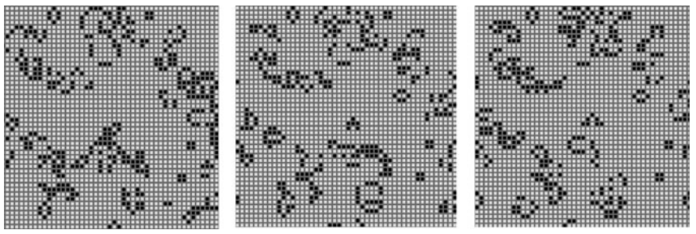

# Chapter16 Computer Animation 计算机动画

- [Chapter16 Computer Animation 计算机动画](#chapter16-computer-animation-计算机动画)
  - [16.1 Principles of Animation 动画的原则](#161-principles-of-animation-动画的原则)
    - [16.1.1 Timing 时间控制](#1611-timing-时间控制)
    - [16.1.2 Action Layout 动作布局](#1612-action-layout-动作布局)
    - [16.1.3 Animation Techniques 动画技术](#1613-animation-techniques-动画技术)
    - [16.1.4 Animator Control vs. Automatic Methods 动画师控制对比自动化方法](#1614-animator-control-vs-automatic-methods-动画师控制对比自动化方法)
  - [16.2 Keyframing 关键帧](#162-keyframing-关键帧)
    - [16.2.0 概念](#1620-概念)
    - [16.2.1 Motion Controls 动作控制](#1621-motion-controls-动作控制)
    - [16.2.2 Interpolating Rotation 旋转的插值](#1622-interpolating-rotation-旋转的插值)
  - [16.3 Deformations 变形](#163-deformations-变形)
  - [16.4 Character Animation 角色动画](#164-character-animation-角色动画)
    - [16.4.0 角色动画](#1640-角色动画)
    - [16.4.1 Facial Animation 表情动画](#1641-facial-animation-表情动画)
    - [16.4.2 Motion Capture 动作捕捉](#1642-motion-capture-动作捕捉)
  - [16.5 Physics-Based Animation 基于物理的动画](#165-physics-based-animation-基于物理的动画)
  - [16.6 Procedural Techniques 过程式技术](#166-procedural-techniques-过程式技术)
  - [16.7 Groups of Objects 对象群](#167-groups-of-objects-对象群)

这一章介绍了计算机动画相关的内容, 主要介绍了动画的基本概念, 动画之间的插值, 几何变形, 角色层级动画, 基于物理的动画, 生成式动画和对象组动画这几个领域. 对于这些领域都只介绍了最基础的内容, 想要了解必须阅读其它, 难度不高, 当作科普看待即可.

## 16.1 Principles of Animation 动画的原则

1930年的时侯迪士尼提出了著名的动画十二原则: 

1. 挤压与伸展（Squash and stretch）
2. 预期动作（Anticipation）
3. 演出方式（Staging）
4. 接续动作与关键动作（Straight ahead action and pose to pose）
5. 跟随动作与重叠动作（Follow through and overlapping action）
6. 渐快与渐慢（Slow in and slow out）
7. 弧形（Arcs）
8. 附属动作（Secondary action）
9. 时间控制（Timing）
10. 夸张（Exaggeration）
11. 立体造型（Solid drawing skill）
12. 吸引力（Appeal）

尽管这十二原则一般是给动画师参考的, 但是其中的很多效果需要由计算机来辅助实现, 因此我们也需要对其有一定的了解.

### 16.1.1 Timing 时间控制

时间控制, 也就是动画的时间节奏. 直觉上来说就是动作的停顿和快慢, 质量大的物体我们希望动作慢, 反之动作快.

### 16.1.2 Action Layout 动作布局

也就是如何安排动作来吸引观众的目光, 一方面是需要对动作设置一些明显的预先动作和结束动作, 另一方面是给动作加上很多次要动画, 例如过渡的重叠帧, 保证不同动画之间的自然过渡.

### 16.1.3 Animation Techniques 动画技术

这主要指我们希望动画中存在一些挤压和拉伸夸张化动作, 常见的是柔软物体加速度急剧改变时发生的明显形变. 另一方面是我们希望动作的变化有缓入缓出, 并且尽量避免出现直线动作因为直线动作并不自然. 这些设计需要动画师有高超的技巧, 并且也需要它们对图形学有些理解才能更好地使用图形学工具进行动画设计.

### 16.1.4 Animator Control vs. Automatic Methods 动画师控制对比自动化方法

动画师能够设计出精细生动的动画, 自动化方法难以达到动画师的效果. 因此更重要的是设计出图形软件方便动画师更好更直观地进行动画设计, 既要利用自动化方法补全一些不重要的部分, 又要给动画师足够的自由设计出生动的动作. 自由的设计自然带来复杂的操作, 这又需要我们这些开发者在这两者之间做出平衡.

## 16.2 Keyframing 关键帧

### 16.2.0 概念

关键帧用于指示出某一个时间点中场景物体的状态, 其状态包括但不限于对象的位置, 颜色, 各个轴上的尺寸缩放, 复杂对象不同部分的变换情况, 相机的位置和方向, 光照情况等等. 关键帧设计使得动画师从复杂的动画中稍微解放出来, 只需要设置好关键时间点上的参数情况, 中间的时间就交给自动化方法去生成, 当动画师需要细致的动作时可以将关键帧的时间贴得很近来实现, 需要偷懒的地方则留下大量的中间帧补全即可.

动画师设置好关键帧之后, 用什么样的策略对中间帧进行插值就是图形学的内容了. 通常来说关键帧都可以表示为一个个时间点t和一个个参数向量p, 如果将各个变量抽离出来, 我们便可以将中间帧的插值视作曲线拟合的问题, 因此上一章[Chapter15 Curves 曲线](../Chapter15%20Curves%20曲线/README.md)的内容在这一章都可以用上. 通常来说动画都要求曲线有C1连续性, 但并不要求更高的连续性, 因为二阶以上的导数在现实中是可能突变的, 无须平滑过渡, 动画中最常用的拟合曲线是Catmull-Rom形式曲线, 也就是基数三次样条.

对于这个拟合曲线的样式动画师也有一定的操作自由, 但是通常我们不会让动画师去设置一阶导数之类的数学量, 而是提供了TCB控制(张力, 连续性, 偏置; Tension, Continuity, Bias), 通过允许动画师直观地将曲线想象为一条有弹性的绳子, 然后操控这三个简单易懂的物理量. 改变这三个量的效果如下图, 直观来说T代表绳子的松紧, C是平滑程度, B是峰值相对中心点的偏离程度: 

  

这三个量的实现是通过改变曲线中心点前后段的斜率的加权情况得到的, 相当于基数三次样条增加更多参数的扩展形式:

  

### 16.2.1 Motion Controls 动作控制

尽管对于物体位置的拟合曲线可以插值得到物体的轨迹, 但是却无法得到各个时间点上物体的速度, 如果直接使用插值曲线的方程来计算物体位置, 直观上会导致目标不匀速的运动. 由于无缘由的变速运动看起来很不自然, 因此我们希望物体的插值运动尽量匀速, 下面的示意图中黑色三角标明了曲线等距离的分段, 每个白色三角之间则相隔了相同的时间, 因此白色三角稀疏的地方物体运动快, 密集的地方运动慢. 最上面的曲线是匀速运动的情况, 下面的两条曲线则是插值运动可能导致的情况:

  

解决这个问题的方法是函数套壳, 通过给方程的时间参数进行包装, 按照下面的公式, 先利用匀速运动方程 s=vt 或其它形式包装出路程函数, 然后再利用某个路程到弧长的映射函数u, 将得到的参数映射到(0,1), 接着传递到插值曲线的方程中能够得到关于时间的匀速运动. 

  

其中的问题是路程到弧长的比例映射函数, 我们很多时侯都无法得到曲线精确的弧长, 这给映射带来了麻烦. 通常使用的方法是使用牛顿迭代法之类的方法近似积分出曲线的长度. 使用数值方法得到的长度虽然准确, 但是计算量更大, 因此还有一种近似方法是在曲线上进行采样然后使用点与点之间的直线来拟合曲线的长度, 然后通过这个长度我们可以生成出分段的映射表来作为映射函数. 得到的映射表大致如下图, u就是路程映射后用来插值出位置的参数: 

  

### 16.2.2 Interpolating Rotation 旋转的插值

相对于对位移的控制, 我们想要在三维物体的两个旋转状态之间进行的插值更为复杂. 首先前面[Chapter6 Transformation Matrices 变换矩阵](./../Chapter6%20Transformation%20Matrices%20变换矩阵/README.md)所使用的变换矩阵是不能直接用来插值的, 这主要是两个相反的旋转相加会得到0矩阵, 而不是代表不进行旋转的单位矩阵.

一种替代的方法是使用欧拉角(Euler-angle)进行插值, 欧拉角将一个物体的旋转表示为分别绕xyz三轴的旋转组合, 这样我们通过分解和组合旋转的角度就可以用旋转矩阵来实现旋转的插值. 绕这三个轴的旋转常使用飞行术语描述, 绕x轴的称为俯仰(pitch), 绕y轴称为偏航(yaw), 绕z轴称为桶滚(roll), 自己比划一下就能感受到这个形象.

欧拉角旋转有一个常见的问题是著名的万向节死锁问题(常平架锁定, 框架自锁; Gimbal Lock), 下图是这种情况的典型情况. 由于欧拉角旋转是首先按照世界坐标系中的一个轴进行旋转, 这个旋转会改变局部其余两个轴的朝向, 然后再依次绕局部的轴进行旋转(见下图的常平架示例图, 这里是依YZX顺序). 所以显然有一个轴在旋转中方向始终不变(下图的Y轴), 因此旋转可能导致两个轴进入平行状态(下图中X轴和Y轴平行了), 这种特殊的情况不但使得后续旋转和无法达到预期, 还会使得之后的旋转丧失一个自由度, 让我们后续对X和Y的旋转是等价的. 如果我们不人为改变旋转顺序或者重置旋转来退出死锁的话, 将永远无法得到失去的那个自由度.

  

万向节死锁问题在程序中其实很难完全避免, 且死锁情况很容易发生, 再加上用欧拉角表示旋转还会带来欧拉同名问题, 也就是同样的一个旋转目标可以有多种不同的旋转方式达到, 这对于三维旋转和插值问题非常不利. 因此图形学中常用的其实是另一种旋转方法: 四元数(quaternion). 四元数的理解相对来说要复杂一些, 但其有很多优良的数学性质值得我们使用. 关于四元数直观上的理解可以观看下面3B1B的视频:

> 四元数的可视化
> https://www.bilibili.com/video/BV1SW411y7W1
>
> 四元数和三维转动，可互动的探索式视频
> https://www.bilibili.com/video/BV1Lt411U7og

而关于四元数的详细数学计算可以参考下面Krsjt的笔记:

> 四元数与三维旋转
> https://github.com/Krasjet/quaternion/blob/master/quaternion.pdf

简单介绍四元数的话, 首先原始定义上四元数是有三个虚部的虚数, 可以和高中教过的二维虚数(复数, 只有一个虚部)以类似的写法表示: q=s+x\*i+y\*j+z\*k. 其中i,j,k都是虚部, s称为标量, 其符合下图的关系:

  

有了这个对应表后我们就可以以向量运算的方式对四元数进行运算了, 看表中有标颜色的区域我们很容易意识到四元数乘法并不满足交换律. 如果一个四元数的s项为0, 称为纯四元数.

尽管四元数的概念很复杂, 但对于用其计算三维旋转这个需求来说, 操作起来并不困难. 步骤如下:

1. 对于我们需要旋转的目标点, 用纯四元数表示为**v**=(0, xp, yp, zp)
2. 然后类似的用纯四元数表示出旋转轴**u**=(0, xu, yu, zu)
3. 再设置好逆时针旋转的角度theta
4. 然后通过下面的式子我们可以构造出单位四元数**q**=(cos(theta/2), sin(theta/2)**u**), 注意这里的角度都需要除2
5. 再写出这个四元数的共轭(逆)形式: **q\***=**q^{-1}**=(cos(theta/2), -sin(theta/2)**u**)
6. 这样就可以计算处旋转后的向量坐标: **u'**=**q****v****q\***
7. 这个旋转公式可以用上面四元数乘法公式来计算, 也可以使用著名的Graßmann积, 这个公式将两个四元数之间的乘法简化为普通的向量计算, 不再需要虚数计算表了.
8.   

四元数形式的旋转公式可以避免万向节死锁的问题, 而且通过不断复合这个旋转公式, 使用不同的旋转四元数就可以对目标连续旋转. 利用四元数可以连续使用的特点, 我们可以对四元数进行插值. 首先尽管四元数是处于四维空间的虚数, 但是由于我们只需要在两个四元数间进行插值, 因此可以将其投影到一个二维的圆上, 让问题变为普通的向量插值(详细见[Krsjt的笔记](https://github.com/Krasjet/quaternion/blob/master/quaternion.pdf)).

转换为普通向量后, 四元数的插值最常用的方法有线性插值(Lerp), 正规化线性插值(Nlerp), 球面线性插值(Slerp). Lerp由于计算简单在图形程序中比较常用, 就是直接在两个向量端点形成线上插值, 得到新的向量还原就能得到插值的四元数. 这样插值得到的四元数由于模长不为1因此旋转会有瑕疵, 如果额外除以模长单位化后再使用就是Nlerp. 这两种方法都有一个问题, 由于插值都是针对直线进行而试图拟合圆周曲线, 当弧度很大的时侯误差也会很大, 旋转容易表现得不均匀. 因此更好的方法是对向量的角度进行插值, 时刻保持向量在球面上旋转, 这就是Slerp, 这个操作计算量更大但是误差也更小.

即使Slerp能达到最好的线性插值效果, 但是对角度进行插值不可避免地会遭遇sin函数, sin函数在角度很小的时侯可能变为0而导致除零错误, 当发生除零错误的时侯就应该改用Nlerp来修正, 当角度很小时Nlerp和Slerp的插值差距可以忽略不计. 如果对插值精度有更高的要求还可以采用前面的样条曲线之类的方法进行处理. 下图是Lerp和Nlerp的对比.

  

## 16.3 Deformations 变形

变形是计算机图形学中非常大的一个技术分类, 书中这里只用了一页的篇幅, 这部分我以后可能会写一些详细的笔记. 这里介绍的变形方法是在常见的动画中最常用的基于笼框(cage, 或称栅格, lattice)的自由变形(Free-Form Deformation; FFD). 首先基于目标模型通过网格简化和膨胀操作得到一个包围目标网格的基准网格, 利用这个笼框目标表面的每个顶点都可以得到自己的局部坐标, 然后用传统的网格变形算法对外框进行变形操作, 变形后按照局部坐标重建出变形后的表面. 下面是重建表面的式子, 右边的**P'**是新的笼框顶点坐标, 参数s,u,t是需要重建的顶点的相对坐标. 这种变形方法尽管在细节上不如其它复杂的方法, 但是其大大减少了变形所需处理的顶点数因此广为应用.

  

下图形象地给出了FFD方法的效果:

  

## 16.4 Character Animation 角色动画

### 16.4.0 角色动画

前面[Chapter12 Data Structures for Graphics 图形学中的数据结构](../Chapter12%20Data%20Structures%20for%20Graphics%20图形学中的数据结构/README.md)中的12.2提到了场景图这个数据结构, 利用场景图的分级特性, 我们可以将人物动作利用下图的层级结构来设计, 其中身体被分为多段的骨骼, 控制骨骼相当于控制FFD的笼框, 蒙皮是重建表面细节的过程. 通过将深度优先遍历和栈结构配合, 层级地给每个部件应用变换矩阵从而实现人物的分层动画效果, 这种方法在图形学里广泛用来制作角色动画, 称为正向动力学(也翻译为正向运动学; Forward Kinematics; FK). 下图是骨骼动画典型的层级结构.

  

正向动力学需要动画师指定每个关节的运动情况, 一方面工序复杂, 另一方面也不能适应所有的复杂动画. FK的问题关键在于动画师是需要按照层级自上而下对动作进行设定的, 但是现实中我们人的动作除了受到自己肌肉的控制, 还会收到周围环境的影响, 因此又提出了从终端往回进行设定的反向动力学(也翻译为逆向运动学; Inverse Kinematics; IK).

反向动力学的核心思想是对关节一些区域设置效应器, 当效应器被触发, 例如角色的脚在idle时触碰到比较高的石头, 就将脚的位置固定在石头上, 然后通过一定的物理方程反向推算出当前肢体应该如何摆放才能让脚放置在石头上. 这个过程大多都是依靠求解优化方程得到, 且由于反向动力学推导的不唯一性, 人物的关节常常需要设置一些约束来保证计算出来的形态比较自然. 下图上方是正向动力学, 下方是反向动力学的示意:

  

通过将FK和IK协同起来运用动画师可以比较轻松地设计出复杂且自然的动画, 有了合理的骨骼之后就需要给角色蒙皮(也就是重建表面的部分). 常用的蒙皮分为刚性蒙皮和平滑蒙皮两种, 主要差别是在处理不同关节出重叠表面的混合问题. 刚性蒙皮将各个关节近似看作独立的, 在关节折叠处也没有太多特殊的处理, 独立重建出来的表面顶点容易在关节处看到不平滑的过渡. 而平滑蒙皮对关节处的表顶点位移采用了不同权重混合不同关节重叠的表面, 从而能够得到更好的变形效果. 下图是两种蒙皮效果的示意:

  

### 16.4.1 Facial Animation 表情动画

计算机动画中脸部动画可以说是最容易被看穿的部分了, 因此对脸部动画的设计更要谨慎. 有很多种复杂的方法可以来优化脸部动画的表现, 其中有称为构象参数的方法, 其将人脸的五官分布用参数的方法呈现, 类似现在游戏里常见的参数化人物创建过程, 然后使用表现参数来控制某个情绪下人的五官会发生的固定的动画, 再通过1978年一篇论文种提出的表情动作编码系统(FACS)和一些动画权重的辅助, 动画师可以自动化地生成各种各样的生动的表情.

### 16.4.2 Motion Capture 动作捕捉

动作捕捉则是大家都很熟悉的轻松获得现实世界真实人物动作的方法, 主要思路就是通过电子仪器从演员的表演上采集所需的FK动画参数, 然后通过IK技术优化动画与环境之间的配合, 加上动画师进一步的适配后可以在计算机中复现出非常精准的动作, 而且还可以录制大量的动画然后通过一定的插值技术将动画自然地融合在一起, 对于多个动画的融合算法也是现在的热门研究方向之一.. 这种方法的采集途径主要分为电磁式和视觉式, 视觉式既利用大量摄像机和标定点将人物关键从现实中重建到计算机里, 是现在最常用的动捕思路. 

## 16.5 Physics-Based Animation 基于物理的动画

这是图形学中另一个很大很复杂的门类, 也就是物理模拟, 书中同样只介绍了几页, 详细的需要阅读别的书籍. 基于物理的动画一般都需要用到很多数值求解方法, 求解微分方程. 物理模拟的核心思想是使用差分方法近似微分方法, 然后将目标表示为很多的离散点, 通过优化离散点之间的关系方程组来得到物理模拟后的点的位置. 这其中差分方法的显著影响模拟的精度, 主要分为隐式方法和显式方法, 显式方法仅通过过去时间的数据来估算未来的情况, 而隐式方法还运用了估计后得到的其它预测值通过优化来达到更好的计算结果. 隐式方法需要求解优化方程, 计算量比较大, 但是通常来说隐式方法比较稳定, 在较长的时间间隔后依然可以得到比较准确的结果, 这允许了我们减少计算的频率, 而显式方法单次计算比较快但是需要不断计算来较准模拟的过程. 这两种方法的取舍需要依靠使用场景和性能要求决定, 下图是两种方法运用的信息差异的形象表示, 可以看到右边的隐式表示方法还运用到了同一时间的预测数据:

  

基于物理的动画最大的缺陷是其不可控性, 动画师最好将物理动画作为参考, 然后固定住物理模拟的结果, 再加入自己的审美调整以得到更好的动画效果.

## 16.6 Procedural Techniques 过程式技术

过程式技术可以理解为人工设计的可以全自动生成随机动画的一种函数, 最简单且常见的过程式技术就是用相位不断改变的三角函数波来模拟海浪效果, 而书中介绍了比较有代表性的"生命游戏"(Game of Life)和"L系统"(L-System). 

生命游戏是1970年John Conway提出一种二维细胞自动机, 初始的时侯二维矩阵中所有元素都视作死细胞, 然后将某些元素设置为活细胞激活系统, 按照下面的规则开始对每个细胞进行处理并运行:

1. 一个死细胞周围8个元素中存在正好3个活细胞时, 这个死细胞转化为活细胞
2. 一个活细胞周围存在2或3个活细胞时, 这个细胞保持不变
3. 其它情况下, 这个细胞死去或保持死亡
  
这套简单的规则可以依据初始化的时侯比较随机的细胞放置情况产生千变万化的结果, 其中一部分生成最终会消亡, 也有一部分会呈现出周期性, 可以用来做有趣的动画. 下图是一些生命游戏的中间状态:

  

L系统则是Astrid Lindenmayer创建的一套使用自动生成的字符串序列模拟植物生长的算法, 分为生成和解析两个阶段. 生成阶段典型需要指定形如下图的一系列并列的转换表:

  

上图的转换表标识了字符串中的字符所需的变换. 在每个迭代阶段, 遍历当前字符串中所有字符, 对于每个非操作符和终止符(大写字母)的元素, 按照一定的策略(例如随机)从定义好的转换表中选择一个对应的映射进行转换, 直到没有能够转换的字符时终止, 经过这样多次迭代得到的就是用于解析的字符串, 这个转换过程形如下图:

  

上图给出的逐步的转换步骤, 可以看到整个字符串是在慢慢增长的. 实际解析中只需要使用最终情况的字符串, 然后按照下面的步骤进行解析和渲染, 使用这种字符串的时侯要想象一个受到字符串控制的画笔, 串行读取和绘制:

1. f代表将当前节点在生长方向上(默认朝上)前推一个单位(绘制一条枝干)
2. +代表将生长方向旋转60°(顺时针)
3. [代表压入当前状态到栈内 
4. ]代表弹出栈内顶部的状态成为当前状态
5. @代表当前位置是终点(绘制一个叶片)

下图是上面的树的生成过程, 其它的英文字符自身没有意义也不需要绘制, 这里绘制出来只是方便我们想象树的生成规律:

  

这种方法很经常用来绘制树木, 但是缺点是对转换步骤和转换策略的设计需要大量的实验和经验, 需要多加练习才能自创文法.

## 16.7 Groups of Objects 对象群

尽管前面的这些动画技术都可以用来绘制不同的动画对象, 但是当我们需要使用大量的对象进行动画时, 这些动画技术会显得有些过于复杂, 浪费很大的计算资源, 一种折中方法是使用对象群. 对象群是一组有微弱关联和微弱智能的对象, 它们只与周边的几个对象有互动, 并在大多数时侯, 在群体中表现出较高的相似性, 自然界中常见的例子就是逃跑的人群, 迁徙的飞鸟, 洄游的鱼群, 也正因如此, 这种对象群也被称为类鸟团(boid).

