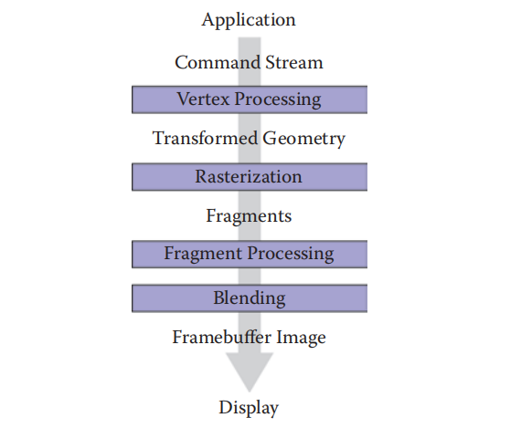
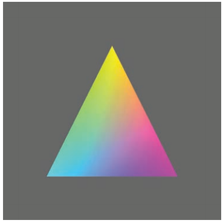

# Chapter17 Using Graphics Hardware 使用图形硬件

- [Chapter17 Using Graphics Hardware 使用图形硬件](#chapter17-using-graphics-hardware-使用图形硬件)
  - [17.1 Hardware Overview 硬件总览](#171-hardware-overview-硬件总览)
  - [17.2 What Is Graphics Hardware 什么是图形硬件](#172-what-is-graphics-hardware-什么是图形硬件)
  - [17.3 Heterogeneous Multiprocessing 各种各样的多进程](#173-heterogeneous-multiprocessing-各种各样的多进程)
  - [17.4 Graphics Hardware Programming: Buffers, State, and Shaders 图形硬件编程: 缓冲, 状态, 着色器](#174-graphics-hardware-programming-buffers-state-and-shaders-图形硬件编程-缓冲-状态-着色器)
  - [17.5 State Machine 状态机](#175-state-machine-状态机)
  - [17.6 Basic OpenGL Application Layout OpenGL程序的基本布局](#176-basic-opengl-application-layout-opengl程序的基本布局)
  - [17.7 Geometry 几何](#177-geometry-几何)
  - [17.8 A First Look at Shaders 着色器一瞥](#178-a-first-look-at-shaders-着色器一瞥)
  - [17.9 Vertex Buffer Objects 顶点缓冲对象](#179-vertex-buffer-objects-顶点缓冲对象)
  - [17.10 Vertex Array Objects 顶点数组对象](#1710-vertex-array-objects-顶点数组对象)
  - [17.11 Transformation Matrices 变换矩阵](#1711-transformation-matrices-变换矩阵)
  - [17.12 Shading with Per-Vertex Attributes 按顶点属性着色](#1712-shading-with-per-vertex-attributes-按顶点属性着色)
  - [17.13 Shading in the Fragment Processor 用片元处理器着色](#1713-shading-in-the-fragment-processor-用片元处理器着色)
  - [17.14 Meshes and Instancing 网格和实例化](#1714-meshes-and-instancing-网格和实例化)
  - [17.15 Texture Objects 材质对象](#1715-texture-objects-材质对象)

这一章介绍了计算机与图形硬件和实际编程相关的内容, 其中主要利用OpenGL简单介绍了实际的图形编程部分, 但是如果想要真正开始OpenGL编程, 查阅其它资料是必不可少的. 注意这一章最新的英文版和中文版由于时代不同所以内容差别非常大, 建议还是阅读英文版本.

## 17.1 Hardware Overview 硬件总览

这一章的目的是将前面章节的图形技术与可以落地的图形编程进行一点对接.

## 17.2 What Is Graphics Hardware 什么是图形硬件

所谓图形硬件是为了对3D图形进行高效渲染而设计的专用硬件部件, 以往的图形硬件一般用于加速光栅化过程, 现在也有了加速光线追踪步骤的图形硬件. 收到电子游戏产业的大力推动, 图形硬件得以高速迭代, 相应的游戏依赖的实时图形渲染(Real-Time Rendering)技术也飞速发展. 这里的实时渲染通常指的是以60Hz频率在屏幕上刷新显示的渲染, 如果刷新频率长期在15Hz以下我们便不再认为它是实时渲染. 图像刷新率也常用每秒刷新帧数(Frame Per Second; FPS)来表示. 

通常来说我们将这个用于加速渲染的图形硬件称为显卡, 显卡结构类似微型计算机, 其处理器称为图形处理单元(Graphics Processing Unit; GPU), 与中央处理单元CPU相对应, 通常也有自己专用的内存(显存)和总线来辅助. GPU是进行图形计算的具体位置, 其优势在于GPU中设计了大量的并行计算组件, 尽管单个组件计算速度不快, 但巨大的数量非常适合加速重复性很高的图形计算. 尽管GPU是为了加速图形渲染而设计的, 仍然有一些API使其能够支持通用计算操作, 例如OpenCL和英伟达的CUDA, 这也使得GPU在近年来的机器学习领域发挥不可磨灭的作用.

图形硬件内部通过流水线对数据进行处理, 这称为图形管线, 程序员利用OpenGL或DirectX这样的API来进行图形计算, GPU通过特殊的硬件设计来最大程度加速图形管线的运行. 图形管线在前面[第八章](./../Chapter8%20The%20Graphics%20Pipeline%20图形管线/README.md)有过比较多的介绍, 基本的流程图如下: 程序从提供顶点数据开始, 借助设计好的指令流, 顶点处理阶段对顶点进行各种模视变换和光照等处理, 然后处理后的顶点经过投影变换到屏幕空间中, 屏幕空间中图形经过光栅化步骤成为带有例如深度值和纹理坐标等额外信息的像素级数据"片元"(Fragment, 也译为片段), 片元再经过片元处理阶段得到对应的颜色, 透明度等等信息, 最后经过融合阶段得到最终渲染的对应图像并显示在屏幕上.

  

在大约十多年前的时侯, 由于图形硬件性能的限制, 上面的图形管线的顶点处理和片元处理两个阶段都是固定设计好的以求最高的执行性能, 程序员只能通过API中少数几个选项来调整这两个处理过程, 这被称为固定管线. 而今由于图形性能的增强, 程序员终于可以利用改良后的API, 自由编程操控这两个处理阶段了, 这就是可编程管线. 在图形学编程的时侯, 渲染管线的基本架构是一定要熟记的.

## 17.3 Heterogeneous Multiprocessing 各种各样的多进程

使用图形硬件的时侯, 有两个关键的专有名词需要记忆: 主机(host)和设备(device), 主机通常指的是计算机的CPU, 设备指的是GPU, 一台计算机可以有多个GPU. CPU和GPU之间的合作依赖于内存中的数据映射和交换, 这个数据映射和交换过程涉及了很多底层信息, 本质上是平台依赖的, 这方面的知识大多数时侯我们没有必要了解, 而是可以使用包装了这些底层操作的图形API例如OpenGL和DirectX来进行图形程序设计. 其中OpenGL由于良好的跨平台性和开放的环境而人气不少, 而DirectX由于其较强的性能和设计在商业程序中广泛使用.

**用OpenGL来编程**

OpenGL这本书中所使用的是3.3版本(发布于2010年), 尽管年代久远但是足够用于教学了. 简单地说, OpenGL是一个C风格的图形API用于方便我们操作GPU进行图形渲染, 其所有函数都以gl为前缀, 并使用专用的C风格语言GLSL来编写着色器控制可编程管线, 对于常见的线性代数运算通常调用GLM库进行. 著名的LearnOpenGL网站可以有效入门OpenGL的使用:

> https://learnopengl-cn.github.io/

## 17.4 Graphics Hardware Programming: Buffers, State, and Shaders 图形硬件编程: 缓冲, 状态, 着色器

**Buffers 缓冲**

缓冲这个遍布操作系统和软件工程的数据结构对我们应该都很熟悉了, 开辟一个空间用于存放一些数据以尽量平衡数据读写和处理器处理之间的时间差和效率差问题. 缓冲这个概念在图形学中也非常常见, 其中最常见的就是显示缓冲.

**Display Buffer 显示缓冲**

显示缓冲可以简单理解为一张图片, 用来储存GPU目前渲染好的画面像素. 显示缓冲与屏幕像素是一一对应的, 设置的目的是防止由于屏幕刷新间隔内画面还没有渲染好引起的画面撕裂情况, 

**Cycle of Refresh 刷新循环**

将显示缓冲中的数据刷新到屏幕上就需要两个相同的缓冲区, 而更新这些数据的循环称为刷新循环. 显示缓冲的双缓冲区分为前缓冲区和后缓冲区, 其中前缓冲区用于显示, 后缓冲区用来临时储存GPU目前渲染好的像素. 在每个渲染循环结束的时侯, 当前的后缓冲区数据会被复制到前缓冲区中, 从而显示在屏幕里, 后缓冲区则会被清空用于下次写入. 由于双缓冲区的存在, 即使当前的渲染循环速度慢于屏幕的刷新率, 屏幕也始终会显示前缓冲区中已经完全渲染好的画面, 画面撕裂的可能性就会被大大降低了(仍然有可能出现在复制缓冲区这个过程中).

## 17.5 State Machine 状态机

很多介绍OpenGL的教程中都会提到OpenGL有远见地在当年即选择了状态机架构, OpenGL的状态机可以简单将渲染程序理解为产出渲染图形的巨大抽象机器, 这个机器能够记忆自己当前的状态和数据, 通过外部的操作改变自己内部的状态. 当我们实际进行OpenGL编程的时侯我们会发现我们的很多操作并不是直接赋值给系统某一个值, 而是通过调用某个函数然后内在地改变OpenGL的状态, 然后改变状态的OpenGL其后的所有计算都会受到新状态的影响. 由于OpenGL状态机的特点, OpenGL整体是复杂的面向过程的函数组合, 因此很多代码思路和我们常用的面向对象思路不同, 可能阅读起来很困难.

理解OpenGL的状态机概念对理解代码非常重要, 下面是一个经典的开启默认是关闭的OpenGL的深度测试状态的例子, 在下面的例子中尤其是glEnable函数, 我们并没有显式地将OpenGL的某个变量进行赋值, 而是启用了名为GL_DEPTH_TEST的状态, 从此以后这个程序都会进行带有深度测试的渲染, 直到使用glDisable关闭这个状态:

```C++
// 启用深度测试状态
glEnable(GL_DEPTH_TEST);    
// 设置深度绘制状态的判断函数为: GL_LESS, 当目标像素z值小于当前像素时才进行绘制
glDepthFunc(GL_LESS);   
```

实际编程中我们一般追求只对OpenGL的状态进行最小的改变, 然后要时刻记住每个状态的改变都会影响到后续所有计算的执行.

## 17.6 Basic OpenGL Application Layout OpenGL程序的基本布局

下面是OpenGL的核心循环大致样子. 这个while的每个循环称为一次渲染循环, 我们每一帧画面就在这个循环中进行绘制, 这里的关键就是刷新前面提到的两个显示缓冲区:

```C++
while (!glfwWindowShouldClose(window)) {
{
  // 清空前缓冲区的颜色缓冲和深度缓冲
  glClear(GL_COLOR_BUFFER_BIT | GL_DEPTH_BUFFER_BIT);
  // 交换前后显示缓冲区指针, 这样后缓冲区成为新的前缓冲区, 被清空的前缓冲区则又可使用
  glfwSwapBuffers(window);
  // 处理各种事件
  glfwPollEvents();

  // 判断是否退出循环
  if (glfwGetKey( window, GLFW_KEY_ESCAPE ) == GLFW_PRESS)
      glfwSetWindowShouldClose(window, 1);
}
```

## 17.7 Geometry 几何

之前我们介绍了图形学中的图形都是由点线面组成的, 出于执行效率的考虑, OpenGL只支持绘制三种结构的几何数据, 称为图元(primitive), 分别是: 点(points), 直线(lines), 三角面(triangles). 这三种数据的绘制方法在前面[第八章](./../Chapter8%20The%20Graphics%20Pipeline%20图形管线/README.md)也已经进行了介绍, 这里就不再过多描述. 由于OpenGL的这个限制, 我们在编程的时侯一定要将各种几何数据都转换为这三种基本元素的组合, 例如对四边形进行切分, 对样条曲线进行采样.

## 17.8 A First Look at Shaders 着色器一瞥

现代图形API都采用可自定义的两个着色器来控制渲染管线中的顶点处理和片元处理两个过程, 着色器是一个用类C语言编写的小程序, 也有自己的变量和出入口. 我们可以简单理解为所有的顶点在顶点处理阶段都会经过顶点着色器程序的处理, 片元同理. 正是可编程管线和着色器的出现我们能轻松并高效地实现后续丰富多彩的渲染效果和技术.

**Vertex Shader Example 顶点着色器样例**

下面是一个最简单的顶点着色器程序的代码, 描述了最基本的顶点着色器架构. 在着色器代码中, 我们都可以将这些数据当作一个独立元素来进行操作, 着色器会自动使用SIMD并行交给GPU处理.

```C++
// 指明此着色器使用的GLSL版本
#version 330 core
// layout指明了当前顶点着色器的此项元素是从外部传入的顶点数据的哪个索引取出的
// layout这里的location设定得和17.9顶点数据传入一起理解
// in关键词表明这一项是输入的数据, 相对应的有关键词out
// vec3是用于解析的GLSL自带数据类型, 后面的变量名则可以自己定义
layout(location=0) in vec3 in_Position;
void main(void) {
  // gl_Position是内置的变量
  // 一旦我们将数据赋值给gl_Position, 数据就会传递到后面的片元着色器中
  // 着色器中也使用xyzw表示法对顶点和向量进行区分
  // 因此这个顶点着色器没有进行任何工作, 仅仅是读入了传入的vec3, 设置顶点(w=1)然后传出
  gl_Position = vec4(in_Position, 1.0);
}
```

**Fragment Shader Example 片元着色器样例**

有了顶点着色器的经验, 片元着色器也会发现是类似的构造:

```C++
#version 330 core
// 这里变为了设置传出的变量out, layout同样指明了索引位置, 要和后面的内容一起理解
// 从这里可以看出和顶点着色器不同, 片元着色器可以输出多份缓冲数据, 具体需要自学
layout(location=0) out vec4 out_FragmentColor;
void main(void) {
  // 注意到此处是赋值给上面自定义的传出变量out_FragmentColor
  // 因此这个片元着色器就是将所有传入的片元都设置为同一个颜色然后输出
  out_FragmentColor = vec4(0.49, 0.87, 0.59, 1.0);
}
```

**Loading, Compiling, and Using Shaders 读取, 编译, 然后使用着色器**

着色器程序需要以字符串的形式传输到GPU上, 然后在GPU上编译执行, 下面的三个函数是每个着色器应用前都需要调用的:

1. glCreateShader 得到硬件上放置着色器的句柄
2. glShaderSource 将着色器载入到GPU的显存中
3. glCompileShader 在GPU上编译着色器

着色器编译完成后, 和其它程序一样, 我们需要将其和其它着色器链接在一起才能生效. 下面的四个函数描述了这个过程:

1. glCreateProgram 在GPU上创建用于连接编译好的着色器的程序对象
2. glAttachShader 将编译好的着色器连接到程序对象上
3. glLinkProgram 将连接在程序对象上的着色器链接起来
4. glUseProgram 绑定当前GPU需要使用的着色器程序对象

## 17.9 Vertex Buffer Objects 顶点缓冲对象

为了一次性将大量的顶点数据传递到GPU上进行处理, 顶点数据是以缓冲区的形式保存在GPU上的, 我们用顶点缓冲对象(Vertex Buffer Objects; VBO)来管理这些数据, VBO保存了顶点的颜色, 法线, 材质坐标等等信息. 以一个三角形为例, 将三角形对应的顶点传入GPU的步骤大致是下面代码段的样子. 这段代码看起来了很迷惑, 其目的是权衡易用性和执行效率, 通过对相同缓冲区不同位置的绑定, 我们可以利用VBO句柄来操作庞大的缓冲区的一小段区域, 但是GPU处理的时侯又无须考虑顶点之间的差别只要一起解析整个缓冲区即可.

```C++
// 假设三角形顶点数据以数组形式保存在vertices中
GLfloat vertices[] = {-3.0f, -3.0f, 0.0f, 3.0f, -3.0f, 0.0f, 0.0f, 3.0f, 0.0f}
// 创建保存句柄的ID标识triangleVBO
GLuint triangleVBO[1];
// 从GPU上得到一个缓冲区的句柄(仅仅是一个名称, 可以理解为指针), 保存在triangleVBO中
glGenBuffers(1, triangleVBO);
// GL_ARRAY_BUFFER是缓冲对象的类型, 也可以理解为一个状态
// 此后对GL_ARRAY_BUFFER的操作都会对名为triangleVBO的缓冲对象进行
glBindBuffer(GL_ARRAY_BUFFER, triangleVBO[0]);
// 将vertices的数据从CPU复制到GPU上, 每个顶点的数据量是9 * sizeof(GLfloat)
// GL_STATIC_DRAW提示GPU这些顶点在程序中几乎不会改变. 所以GPU会进行最大程度的优化
glBufferData(GL_ARRAY_BUFFER, 9 * sizeof(GLfloat), vertices, GL_STATIC_DRAW);
// 令GL_ARRAY_BUFFER与VBO解绑(0默认就是解绑), 此后可以绑定新的VBO名称
glBindBuffer(GL_ARRAY_BUFFER, 0)
```

## 17.10 Vertex Array Objects 顶点数组对象

但是很显然假如我们要绘制的物体有复杂的顶点属性时, 由于VBO是在与实际上的缓冲区进行交互因此操作比较繁琐, 对每个物体配置和修改自己的VBO会是一件很折磨的事情. OpenGL对此提出了顶点数组对象(Vertex Array Objects; VAO)来进一步封装这些不同类型的数据简化操作, 注意VAO并不保存实际的数据. 下面的代码段描述了典型的VAO操作:

```C++
// 和VBO类似的初始化一个句柄
GLuint VAO;
glGenVertexArrays(1, &VAO);
// 牢记OpenGL的状态机特性, 将当前的OpenGL绑定到这个VAO状态上
// 从此以后对顶点数组的改变都将影响这个VAO
glBindVertexArray(VAO);
// 打开下标为0的VAO属性, 这里就是在指定前面"layout(location=0)"所指的位置location
// 因此这个状态的修改就是在控制数据与着色器的沟通, VAO的下标0和接下来的数据绑定了
glEnableVertexAttribArray(0);
// 和前面一样, 绑定VBO到顶点缓冲, 由于前面调用了glBindVertexArray, 因此也会影响VAO
// 也即表示这个VAO和三角形VBO和对应的缓冲区完成了绑定
glBindBuffer(GL_ARRAY_BUFFER, triangleVBO[0]);
// 这个函数控制了如何将当前绑定的缓冲区中的数据与VAO的顶点属性映射起来
// 第一个参数指明现在设置的是location为0的属性, 第二个参数表示每个属性由三个元素组成
// 这三个元素是GL_FLOAT浮点数, 并且数据不进行归一化(GL_FALSE)
// 第五个参数值是数据读取的步长, 这里步长和要读取的变量大小是一样的3个浮点数
// 最后一个参数指明此数据从绑定的缓冲区的下标0开始读取, 至此就完成了VBO到VAO的映射
glVertexAttribPointer(0, 3, GL_FLOAT, GL_FALSE, 3 * sizeof(GLfloat), 0);
// 解绑当前OpenGL的顶点数组对象, 此后可以绑定新的VAO进行操作
glBindVertexArray(0);
```

以上的顶点缓冲和顶点数组操作都要在渲染开始前进行, 真正进入渲染后我们就只需要在每次渲染循环中间调用下面的小代码段就可以渲染出想要的顶点数据了. 这段代码和着色器程序的调用一起插入17.6的渲染循环中间就能够显示出一个绿色单色的三角形, 具体的完整代码较长可以看书:

```C++
// 给当前OpenGL绑定属性为VAO的顶点数组
glBindVertexArray(VAO);
// 以三角形图元的形式渲染这个数组中的元素, 从VAO绑定的缓冲的0下标开始, 渲染3个元素
glDrawArrays(GL_TRIANGLES, 0, 3);
// 解绑以供后面别的VAO
glBindVertexArray(0);
```

  

## 17.11 Transformation Matrices 变换矩阵

了解了如何读入顶点数据并完成对数据对象的绑定后, 又回到了渲染的一些基本问题上, 首先是对[第六章](./../Chapter6%20Transformation%20Matrices%20变换矩阵/README.md)各种变换矩阵的设置. 最开始的时侯说到OpenGL通常使用的是第三方矩阵库GLM来进行矩阵操作, GLM除了提供基本数学对象外, 以变换矩阵为例, GLM提供的常用三个变换矩阵, 大大简化了编写变换矩阵的过程:

1. glm::ortho 按照传入的参数创建一个正交投影矩阵
2. glm::perspective 创建透视投影矩阵
3. glm::lookAt 创建一个能改变摄像机方向和位置而指向某个目标的仿射变换矩阵

利用这些提供好的变换矩阵, 我们可以很方便地完成渲染管线中几何变换的过程. 但是回忆一下, 类似正交投影变换这样的几何变换通常都是统一发生在所有顶点上的, 我们没有必要对所有顶点对象都传入一个相同的变换矩阵到顶点着色器中, 因此OpenGL设置了一类专门的类型用来控制这种通用的数据: 统一(Uniform). 声明为Uniform的变量在程序进行中都是静态的, 对于投影变换, 光源等等不常变动的数据非常有用, 大大提高了内存的利用率和执行效率. 下面是运用了Uniform变量的顶点着色器样例:

```C++
#version 330 core
layout(location=0) in vec3 in_Position;
// uniform数据, 这里从外部传入了投影矩阵, projMatrix是Uniform数据的名称, 在外部指定
uniform mat4 projMatrix;
void main(void) {
  // 按照矩阵乘法来对顶点进行矩阵变换
  gl_Position = projMatrix * vec4(in_Position, 1.0);
}
```

设置Uniform数据的步骤并不困难, 只需要按照下面的几行代码在着色器链接后获得对应名称的变量句柄然后传入数据即可:

```C++
// 利用glm生成一个正交投影矩阵
glm::mat4 projMatrix = glm::ortho(-5.0f, 5.0f, -5.0, 5.0, -10.0f, 10.0f);
// 当前的着色器程序绑定名称为projMatrix的Uniform变量句柄
GLint pMatID = glGetUniformLocation(shaderProgram, "projMatrix");
// 切换当前OpenGL到需要这个变量的着色器状态
// 着色器由各自的shaderID标识, 多个着色器链接得到着色器程序shaderProgram
glUseProgram(shaderID);
// 将projMatrix的指针和对应句柄pMatID绑定, 此后这个着色器就能读取到外部的矩阵
// 函数glUniformMatrix4fv表示目标是Uniform变量, 是矩阵, 四个float元素, 传入的是指针v
glUniformMatrix4fv(pMatID, 1, GL_FALSE, glm::value_ptr(projMatrix));
```

## 17.12 Shading with Per-Vertex Attributes 按顶点属性着色

至此我们大致搞明白了如何应用着色器来操控渲染管线的处理过程, 下面就是一个简单的着色器样例介绍了如何进行按照顶点属性着色前面那个简单的单色三角形. 

```C++
// 假设现在三角形数据数组增加了各个顶点的颜色信息, 从下面可以看出,分别为连续的6个数据:
// 每个顶点都是x, y, z, r, g, b, 所以所有数据一共是3*6=18个浮点数
GLfloat vertexData[] = {0.0f, 3.0f, 0.0f, 1.0f, 1.0f, 0.0f, -3.0f,
-3.0f, 0.0f, 0.0f, 1.0f, 1.0f, 3.0f, -3.0f, 0.0f, 1.0f, 0.0f, 1.0f};
// 同样是VBO绑定
glBindBuffer(GL_ARRAY_BUFFER, m_triangleVBO[0]);
// 设置0号位的属性
glEnableVertexAttribArray(0);
// 仍然是读取3个GL_FOLAT数据, 但是步长变为了6 * sizeof(GLfloat)
glVertexAttribPointer(0, 3, GL_FLOAT, GL_FALSE, 6 * sizeof(GLfloat), 0);
glEnableVertexAttribArray(1);
// 最后一个参数是数据读取的开始下标, 也就是从顶点缓冲区的(const GLvoid *)12位置开始
// 这里的(const GLvoid *)12和3 * sizeof(GLfloat)是等价的, 也就是从颜色出现的位置开始
glVertexAttribPointer(1, 3, GL_FLOAT, GL_FALSE, 6 * sizeof(GLfloat), 
(const GLvoid *)12);
```

有了这样的新属性输入后, 我们需要修改顶点着色器为下面的样子:

```C++
#version 330 core
layout(location=0) in vec3 in_Position;
// 新增的颜色属性
layout(location=1) in vec3 in_Color;
// 这里设置了一个属于顶点着色器的out变量, 用来返回顶点的颜色
// 当名称匹配时, 顶点着色器的out变量会传递到后面片元着色器对应的in变量中
out vec3 vColor;
uniform mat4 projMatrix;
void main(void) {
  // 赋值颜色给out从而传递给片元着色器
  vColor = in_Color;
  gl_Position = projMatrix * vec4(in_Position, 1.0);
}
```

对应的片元着色器只要把硬编码的颜色值转为传入的颜色值即可, 在此不表. 经过这样的修改后, 只要OpenGL保持默认的三角形图元渲染方式, 顶点颜色就会自动进行重心插值从而得到过渡平滑的带颜色的三角形如下图:

  

**顶点数据的结构体**

仅仅给顶点增加了一个属性, 就需要仔细考虑数据在缓冲中的错位排放等等问题, 这个过程显然有些繁琐且脆弱, 可想而知若顶点属性变得复杂这个过程将会多么麻烦. 联想到这里我们传入数据本质上只是将一整块连续的数据复制进GPU对应的缓冲区而已, 因此我们在外部可以大胆使用其它的数据结构来控制这些数据. 最直观的想法就是使用struct和vector这两个连续储存的数据结构来代替我们自己控制的数组vertexData[]. 对于VAO的设置仍然是上面的处理方法, 但是VBO的绑定就可以改为下面的形式, 这种操作大大简化了人工操作数组的困扰且不会带来什么效率损失:

```C++
// 用结构体代替顶点属性数组
struct vertexData
{
  glm::vec3 pos;
  glm::vec3 color;
};
// 用标准库的vector(动态数组)来组织多个顶点
std::vector<vertexData> modelData;
// 用自带的函数来轻松计算出数组所占的真实空间
int numBytes = modelData.size() * sizeof(vertexData);
// 用vector.data()来得到指向真正数据的指针, 如何就可以和前面一样传入GPU了
glBufferData(GL_ARRAY_BUFFER, numBytes, modelData.data(), GL_STATIC_DRAW);
glBindBuffer(GL_ARRAY_BUFFER, 0);
```

## 17.13 Shading in the Fragment Processor 用片元处理器着色

前面[第十章](~)中介绍了Blinn-Phong着色的原理, 而[第八章](./../Chapter8%20The%20Graphics%20Pipeline%20图形管线/README.md)中又介绍了逐片元着色对光照效果的重要意义, 这一小节就通过介绍Blinn-Phong着色的编写一边回顾算法一边总结顶点着色器与片元着色器的配合.

```C++
#version 330 core
layout(location=0) in vec3 in_Position;
layout(location=1) in vec3 in_Normal;
out vec4 normal;
out vec3 half;
out vec3 lightdir;
struct LightData {
  vec3 position;
  vec3 intensity;
};
uniform LightData light;
uniform mat4 projMatrix;
uniform mat4 viewMatrix;
uniform mat4 modelMatrix;
uniform mat4 normalMatrix;

void main(void) {
  vec4 pos = viewMatrix * modelMatrix * vec4(in_Position, 1.0);
  vec4 lightPos = viewMatrix * vec4(light.position, 1.0);
  normal = normalMatrix * vec4(in_Normal, 0.0);
  vec3 v = normalize( -pos.xyz );
  lightdir = normalize( lightPos.xyz - pos.xyz );
  half = normalize( v + lightdir );
  gl_Position = projMatrix * pos;
}
```

## 17.14 Meshes and Instancing 网格和实例化

## 17.15 Texture Objects 材质对象