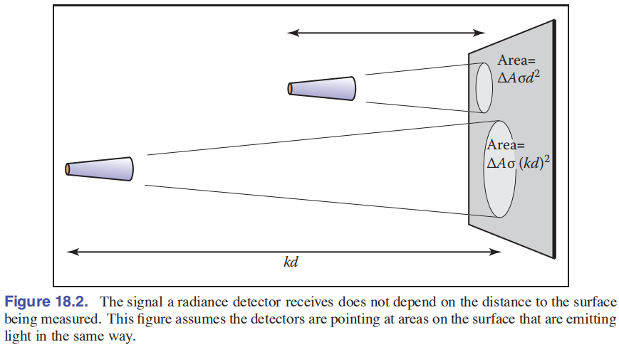
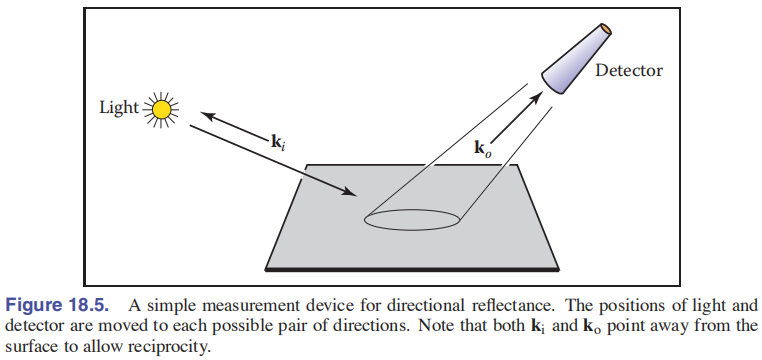
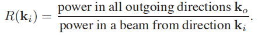
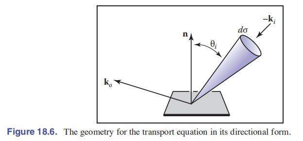
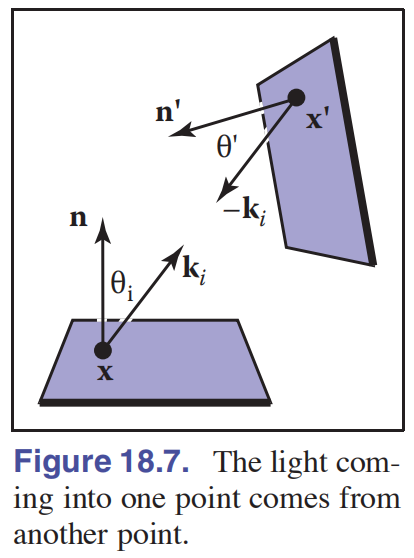
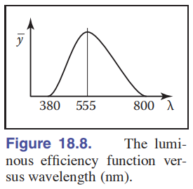

# Chapter18 Light 光

- [Chapter18 Light 光](#chapter18-light-光)
  - [18.1 Radiometry 辐射学](#181-radiometry-辐射学)
    - [18.1 Photon 光子](#181-photon-光子)
    - [18.1.2 Spectral Energy 光谱能量](#1812-spectral-energy-光谱能量)
    - [18.1.3 Power 功率](#1813-power-功率)
    - [18.1.4 Irradiance 辐射度](#1814-irradiance-辐射度)
    - [18.1.5 Radiance 辐射率](#1815-radiance-辐射率)
    - [18.1.6 BRDF 双向反射分布函数](#1816-brdf-双向反射分布函数)
  - [18.2 Transport Equation 传输方程](#182-transport-equation-传输方程)
  - [18.3 光度学](#183-光度学)

现代图形学不断朝着物理模拟的方向前进, 所以辐射学的知识在图形学中愈发重要起来, 如果不简单了解一下辐射学(Radiometry)的知识, 后续学习基于物理的渲染(PBR)和各种高级的光照效果都举步维艰. 这一章主要就介绍了辐射学的基础概念和著名的双向反射分布函数(BRDF), 同时少量涉及了光度学(Photometry)的内容. 这一章用到了很多符号, 且各个概念之间容易混淆, 需要注意.

## 18.1 Radiometry 辐射学

### 18.1 Photon 光子

辐射学, 描述和研究辐射现象运作的学科, 图形学需要用到其描述光线传播的部分. 下面是需要用到的光的一些属性:

1. 能量(q): 描述光的能量, 和其他能量的描述单位一样都是焦耳(J)
3. 位置(p): 光有波粒二象性, 如果将光视作光子(Photon)组成的粒子束, 那么光就有自己的位置
4. 方向(d): 光传播方向
5. 速度(c): 光自然也有自己的传播速度
6. 波长($\lambda$): 将光视为波, 那么光就有自己的震动波长, 单位为纳米(nm), $nm=10^{-9}m$
7. 频率(f): 光在反射时速度和波长都有可能发生改变, 但它们的比值会保持不变, 这个比值就是频率, $f=c/{\lambda}$
8. 普朗克常量(h): 光的能量可以通过普朗克常量从频率中联系起来, 即$q=hf=hc/{\lambda}$. 普朗克常量是$h=6.63*{10^{-34}}J$

### 18.1.2 Spectral Energy 光谱能量

如果我们有一束光, 那么这束光的能量可以通过求这一大组光子的总能量得到, 用Q表示. 由于光有自己的波长, 一个很自然的想法是度量不同波长的光子在这束光中表示的能量大小, 按照波长划分的能量大小称为光谱能量Spectral Energy($Q_{\lambda}$), 通常来说我们将光按照相同的波长间隔进行划分, 然后计算出波长段内的平均能量大小来得到这个量, 例如: $Q_{\lambda}[500,600]=10.2/100=0.12(J/nm)$. 这个式子中, 显然我们对一个波长段内的光子能量进行了无限微分. 尽管这种表达在物理意义上有争议但我们不需要太纠结这个量的使用. 

由于光谱能量是无限微分的光谱波长段能量的平均值, 所以可以作为一种密度函数来使用. 光谱能量也有和其它密度函数一样的注意事项: 离散点的值都没有意义, 只有在一个小波长段上的积分才是我们需要的能量值.

在实际使用中整束光的能量对我们意义不大, 绝大多数情况下我们都使用光谱能量来表示光的能量, 因此后面的部分里为了简洁都直接用Q表示光谱能量. 

### 18.1.3 Power 功率

比起能量, 我们很多时候也喜欢用与时间有关的功率Power(p)描述能量, 单位自然是我们熟悉的瓦特(W=J/s).

和前面一样, 比起完整的功率我们更喜欢用与波长有关的量, 也就是光谱功率Spectral Power, 即一小个波段上功率的平均值. 对应的表达式是: $\Phi=\Delta q/(\Delta t \Delta \lambda)$

### 18.1.4 Irradiance 辐射度

辐射度Irradiance是一个非常自然的概念, 我们希望描述某个小区域上光谱功率的大小, 用$H=\Delta q /(\Delta A \Delta t \Delta \lambda)$表示. 

为了描述方便, 通常将辐射度(Irradiance)具体代表入射表面的功率, 而反射出表面的功率称为辐出度(Radiant Exitance)

### 18.1.5 Radiance 辐射率

辐射度仅度量了区域上光谱功率的大小, 我们还希望度量这个区域上来自某个方向的光谱功率, 这就是辐射率Radiance. 辐射率在图形学中非常常用, 最直观的式子就是按照立体角$\Delta\sigma$对辐射度进行微分. 由于有了角度的存在, 我们光源到平面的辐射度$\Delta H$所用的面积并不等同与投影在平面上的面积, 需要引入cos项计算出对应的投影面积, 即$\Delta H/ (\Delta \sigma cos \theta)$

对于辐射率有一个重要的近似: 辐射率与距离无关. 可以借助下图理解为由于立体角不变, 因此距离增大会增大受光面积, 但距离增大减少了到达平面的光, 因此平衡之下辐射度与距离无关, 仅如上式与方向有关. 

  

辐射率由于是经过重重微分才得到的, 因此在图形学中是最基本的辐射量, 我们可以利用它推导出所有其他的辐射度量量. 例如某个表面的辐射度可以用下式推导: 

$$
H=\int_{all_k}L_f(k)cos\theta d\sigma
$$

这实际上就是上面计算辐射率的反向操作. 这里需要注意k是入射方向. 由于辐射率由于一般对各个方向都是不同的, 因此通常使用函数形式表示. 

### 18.1.6 BRDF 双向反射分布函数

双向反射分布函数(Bidirectional Reflectance Distribution Function; BRDF)是一个详细描述了表面如何反射射入的光线的函数, 其是基于物理的渲染(PBR)领域的基石. 直观上说, 从方向ki射入平面的光线总会朝向反射角度ko周围发散反射. 详细度量的话我们可以用角度反射率来表示, 也就是如下式计算某个出射角度ko上的面辐射率Ls(出射方向的辐射率)和方向为ki的光源引起的这个区域的辐射度的比值.

$$
\rho=L_s/H
$$

  

由于这个反射率与入射方向和出射方向都相关, 因此这个反射率可以写为函数$\rho(k_i,k_o)$, 这个函数就是双向反射分布函数(BRDF). 迪士尼通过大量的实验测量了一系列现实材质的BRDF函数可供我们应用, 大大推动了PBR领域的发展. 

**半球方向反射**

有了BRDF后, 自然会想要知道对于一个入射光, 会产生多少对应的反射光, 也就是想要得到确切的反射率. 但从函数我们知道出射和入射的计算是耦合的, 我们观察方向(反射方向)得到的值依赖于入射方向光线的分布, 要记录一个材质(入射方向枚举数*反射方向枚举数)个数据的话复杂度太高了. 

因此实际使用中为了方便BRDF的计算, 提出了半球方向反射的概念(由于光路可逆, 以下部分也可以理解为整个半球方向入射光作用到某个方向上的出射光的效果). 对于某个方向的入射辐射率, 我们计算对应的反射点上半球方向上所有方向上反射的辐射率之和, 写为下面的形式: 

  

由于简化了反射方向的计算, 这个函数转换为可以查表得到的与入射角度相关的比率值, 我们可以按照当前光源的入射角度, 计算对应的R值, 乘在入射辐射率上就可以用来近似所需的反射率. 这个简化的BRDF一方面大大优化了Phong反射这个中整个表面只能表现出非常一致的反射效果的缺陷, 对于不同角度的入射光线如今可以计算出不同的半球反射强度了, 而已得到了比较理想的执行性能. 

这个半球方向反射函数总的来说就是进行如下对整个半球面出射方向k的积分得到的: 

$$
R(k_i)=\int_{all_{k_o}}\rho(k_i, k_o)cos\theta_o d\sigma_o
$$

**理想漫反射BRDF**

回想前面我们模拟漫反射的时候, 我们使用材质图的颜色值来作为漫反射的比值. BRDF对于漫反射现象的解释就是对于所有入射角度都返回相同反射值的材质, 这种理想的材质的表面就是朗伯表面. 由于在所有方向上的BRDF值都是常量C, 进行积分后就会得到$R(k_i)=\pi C$. 这里的pi显然是因为引入半球面的立体角而带来的. 

## 18.2 Transport Equation 传输方程

传输方程, 也就是大名鼎鼎的渲染方程(Rendering Equation), 在1986年提出, 是当前图形学真实感渲染的基石. 现代光照计算的核心就是渲染方程. 这个著名的方程表示如下: 

$$
L_s(k_o)=\int_{all_{k_i}}\rho(k_i,k_o)L_f(k_i)cos\theta_i d\sigma_i
$$

  

可以看到这个式子实际上就是对全域的入射方向的光照, 按照光照自身的辐射率, 根据对应的BRDF求出射的反射率进行积分, 从而得到所需出射方向的辐射率. 这个方程的思想很简单直接, 实际上这个积分很难进行, 所以通常适应路径追踪算法以可见性思想, 在可见的(v=1)的目标小面积上进行如下积分: 

$$
L_s(x,k_o)=\int_{all x'}\frac{ \rho(k_i,k_o)L_s(x',x-x')v(x,x')cos\theta_i d\sigma_i}{||x-x'||^2}dA'
$$

  

## 18.3 光度学

光度学能度量辐射量对人感受上的效果, 结果称为光度测量量. 这个测量量与波长有关, 用下面这个积分式来计算: 

$$
f_p=683\frac{lm}{W}\int^{800nm}_{\lambda=380nm}\bar{y}(\lambda)f_{r}(\lambda)d\lambda
$$

这部分会在下一章进行更详细的介绍, 现在只要看到这个积分式与一个非线性函数$\bar{y}(\lambda)$相关, 函数的大致图像如下图:

  

可以看到函数在人眼可见波长即380-800nm以外是无效. 图形学以和色度学相同的单位——亮度(Luminance)——来衡量光度测量量, 单位是流明(lumens; lm). 这个单位本身没什么意义, 但是由于现实中的灯泡用瓦数或流明来描述发光效率, 因此很多渲染软件也模仿现实使用这种单位来描述虚拟光源的亮度. 

仅需记住, 一个理想灯泡能将所有功率转为对人眼效用最高的555nm波长的光线, 从而每瓦产生683流明. 一流明亮度的光源在一球面度中的光照度量称为一烛光/坎德拉(candela; $cd=lm/m^2$). 有些渲染软件也用功率(W)来描述灯泡强度, 总之搞清楚这几个转换关系就比较好理解光源亮度设定中可能遇到的单位了.

这里没有介绍到的一个常见辐射量是辐射强度Radiant Intensity(I), 其描述了点光源到每个立体角的光谱功率. 由于光线追踪算法难以处理好点光源, 因此这里不细究.