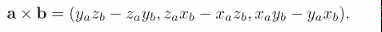
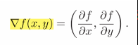
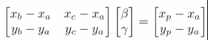

# Chapter2 Miscellaneous Math 各种数学工具

- [Chapter2 Miscellaneous Math 各种数学工具](#chapter2-miscellaneous-math-各种数学工具)
  - [2.1 集合和映射](#21-集合和映射)
  - [2.2 解二次方程](#22-解二次方程)
  - [2.3 三角学](#23-三角学)
  - [2.4 向量](#24-向量)
  - [2.5 曲线和曲面](#25-曲线和曲面)
  - [2.6 线性插值](#26-线性插值)
  - [2.7 三角形](#27-三角形)

## 2.1 集合和映射

几个集合标识

  

区间

  

对数

  

## 2.2 解二次方程

很基本的一节
判别式D=B2-4AC要记得在求解前判断根的数量

## 2.3 三角学

asin，acos之类是普通三角函数的逆函数，其中有一个atan2函数输入参数"对边和邻边"返回对角的度数

  

常用的三角函数变换

  

  

## 2.4 向量

点乘展开

  

  

叉乘展开

  

  

如果想要转换向量坐标在不同坐标系中的表示，假如我们要将uvw坐标中表示的向量转换到xyz坐标中表示，首先我们需要有uvw坐标系的基uvw在xyz坐标系中的表示，然后将目标向量的坐标与这三个基的这个表示相乘，这样就可以得到xyz中表示的目标向量。

在这里我们可以将这三个基组合成矩阵A，这样只要让矩阵左乘目标向量即可完成转换
当我们需要将xyz的坐标转换回uvw中，则应对变换矩阵A进行求逆，然后同样左乘这个矩阵即可逆操作

因为这个特性当我们需要对a坐标系中的向量实施b坐标系中的c转换时，我们应该先将向量左乘变换矩阵A变到b坐标系中，再应用c转换，然后再使用逆矩阵A-1将转换后的向量变回a坐标系中的坐标表示

如果两个坐标系的原点位置不同，转换到相同坐标系中后直接进行原点偏移即可

有时我们需要从一个向量构造一组比较适合这个向量的标准正交基也就是一组相互垂直且模长为1的向量来构建坐标系。常用方法是：

- 选定这个向量转为单位向量作为其中一个基；
- 对一个与这个基相同的向量，将其坐标中最小的数字改写为1，这样这个向量与原先的基会有比较大的角度保证叉乘时的精度，接着两个向量叉乘得到第二个基；
- 最后这两个基叉乘可以得到垂直的第三个基来构建坐标系

  

从两向量建基则更简单，如果两个向量a和b已经是正交的则直接用刚才的方法标准化即可
如果两向量并不正交，则类似单向量的情况

上面的构建基的方法一般得不到互相垂直的一组基，如果觉得得到的结果不够理想，开销最小的方法就是选择不太相同的另一组w和u来构造基，如果还是不够理想，可以使用奇异值分解SVD来得到接近于原先坐标系的正交基

## 2.5 曲线和曲面

二维梯度
对隐式曲线方程f的x和y求偏导即可，f的值是xy在三维空间中对一个曲面映射出来的高度值。这里要注意尽管我们脑内对这个式子可能仍然想象是一个曲面，但是实际上更加合适的想象是一条有颜色的曲线，因为在二维的处理部分我们真正面对的是一个三维曲面在二维平面上的切面，对于z值我们是无法操控的

  

因此上面式子算出来的梯度向量是z值上升最快的方向，专业点说是值增长最快的方向导数向量。即是对所取点处的xy平面进行偏导，得到的向量是在xy平面上的能使得f变化最大的方向

然后我们常说梯度与法线方向相同，仍然要谨记这里是二维的有值的曲线，也就不难理解梯度为什么与切线垂直了，因为这里的切线恰恰是三维曲面切平面在这个点的平面上的交线

二维直线的一般式$Ax+By+C=0$中，点到线的距离为：

  

类似的某点的三维曲面的梯度或者说法向量可以由下式得到，同样的此时要想象为一个彩色的三维曲面：

  

## 2.6 线性插值

这是最简单的插值方法，以线性多项式对一个区间内进行插值

## 2.7 三角形

重心，对于均质物体等同于形心，重心位于三角形三边中线的交点上

而重心坐标系是在三角形中描述一个点的非常实用的坐标系，在图形学中由于三角形是大多数图形程序中组成模型的最基本元素，因此用三角形定位各个三角形内部点的坐标非常重要

重心坐标系的关键是利用三角形的边和顶点来定位坐标，如下图我们二维中可以用三角形的一点a和两条边作为基描述中间蓝点p的坐标

  

显然此时我们可以用下式描述点p

  

然后将这公式进行变形，可以得到更简洁的公式，从此我们可以用(β,γ)来描述一个点的坐标

  

此时如果α，β，γ中有哪个坐标在[0,1]之外，则表示这个点在此三角形外

那么重心坐标的好处在哪里呢，好处在于我们可以轻松从坐标α，β，γ中很方便地进行图形学中很关键的三角形颜色插值，而且可以很简单地得到点到边的距离比值，从下图中可以看到，由于平行线距离只差一个常量的原因，如果我们假设边到另一个顶点的距离为1，则坐标分量就是距离的比值了

  

那么如果我们已知点p的xyz坐标，想要得到其重心坐标，有几个方法：
第一种是代数法，直接按照前面的定义法的思路构造求解β，γ的线性方程组，然后再求解α即可

  

第二种是几何法，运用前面说到的距离比值的特性，我们先按照点法式列出如下的方程，只有当x，y恰好在ab构成的直线上时值才会为0

  

那么如果我们此时代入的点不在线上，必然得到的函数值就是点到直线的距离。但是只有一个距离不够，我们需要的是点分量在三角形内的比值，因此我们将这个值除以代入另一个顶点的值就可以得到坐标分量

  

同理可以得到其他的分量值

第三种是面积法，这里我们要知道重心坐标的分量比恰好就是三角形被划分出的子三角形的面积比，具体的证明在很多地方都可以找到。由于面积比定理，我们可以通过计算面积来得到坐标

  

三维空间中的三角形依然可以直接利用上述的方法来得到坐标。
而面积法对三维空间中的三角形很有用。首先我们可以通过三角形两边向量的叉乘模长乘1/2得到三角形的面积，将叉乘展开就可以简单理解。然后我们可以用下面的公式计算出重心坐标，其中三个额外的向量是目标点到子三角形其中一个顶点的向量，用来计算子三角形的坐标

  
