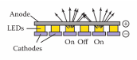
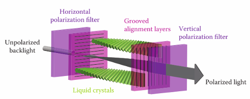
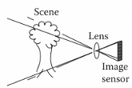
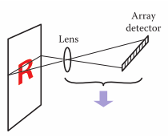
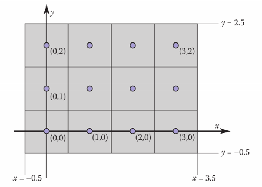
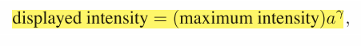
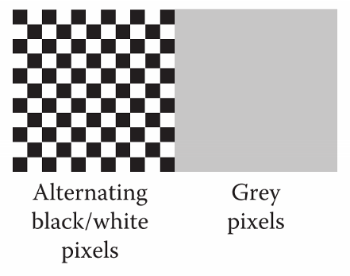
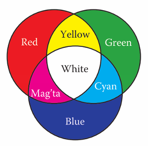
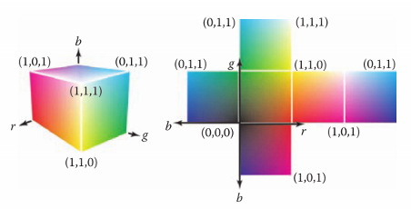
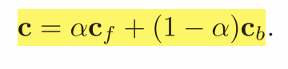

# Chapter3 Raster Image 光栅图像

- [Chapter3 Raster Image 光栅图像](#chapter3-raster-image-光栅图像)
  - [3.1 光栅设备](#31-光栅设备)
  - [3.2 图像, 像素, 几何](#32-图像-像素-几何)
  - [3.3 RGB颜色](#33-rgb颜色)
  - [3.4 Alpha混合](#34-alpha混合)

## 3.1 光栅设备

光栅显示是指将图像以矩形像素数组的形式显示的方法。像素是图像元素的简称。光栅图像就是一组储存了为每个像素都储存了一个像素值的二维数组，像素一般以RGB三个值来表示，设备实用这些值来控制显示时各个像素的颜色。光栅图像是一种用来显示的设备无关的描述，显示设备是一种近似还原图像本身的方法

和光栅图像相对应的是矢量图像，也就是把图像保存为一组图形的组合。矢量图最大的好处在于它是分辨率无关的，因此可以很好地在高分辨率设备上显示；但是缺点是矢量图必须被"光栅化"后才能显示出来

光栅设备分为输出设备和输入设备，常见设备有下面几种：
- 输出：LCD显示器，LED显示器，喷墨打印机，热升华打印机
- 输入：数码相机，平板扫描仪

输出设备中的显示设备分为发光式和透视式：

发光式显示设备常见是建筑外墙之类的大面积显示区域的LED显示屏，特点是它是由发光二极管点阵显示的，通过改变LED灯泡的开关组成图像，优点是亮度高成本低，但是缺点是点阵排列无法很密集因此只能用于大面积显示，经不起细看

  

透视式的代表是我们最常用的LCD显示器也就是液晶显示器，特点是屏幕实际上操作的是屏幕夹层中的液晶分子的方向，液晶分子在电压的影响下会进行旋转，其排列会改变光的前进方向。因此我们在液晶屏的背面加上白色背光，然后在透视板的阻隔下我们可以利用电压调整光的方向从而调整每个单元的显示亮度，然后再用滤色片改变每个单元的颜色，每三个颜色单元组成一个像素，这样就可以显示了。优点是显示密度很高，可以做得很清晰，缺点是成本较高
	
  

输出设备中的打印设备分出的喷墨式和热升华式我们不用了解很多

喷墨式是喷头移动着将点状的墨水到纸上组成图案，热升华式是一个温度打印头将染料纸按照图案局部加热升华让染料附着到目标纸上
打印设备带来了两个现在很常用的单位：每英寸像素数(ppi)和每英寸点数(dpi)

输入设备中数码相机与平板扫描仪原理类似，最大的区别是其图像感应器的行数：

数码相机的图像感应器主要分电行耦合元件(CCD)和互补金属氧化物半导体(CMOS)两种，尽管它们由很多特性上的区别例如一个得到模拟信号一个得到数字信号，成像效果不同之类，但是相机处理原理类似，都是利用透镜将场景中的光线透射到一个二维矩阵式的感应器上，感应器上排布着的感应不同颜色的马赛克半导体，从而获取各个像素区域的RGB值还原出图像。也有部分相机用分层感应器从而能避免逆马赛克变换等处理阶段直接得到像素的颜色值
相机也带来了一个常用单位：百万像素(MP)

  

平板扫描仪也有透镜和感应器，感应器的原理也类似，但是平板扫描仪的感应器常常是个一维的长条，然后通过移动纸张完整扫描下整个图像

  

## 3.2 图像, 像素, 几何

有时候我们需要显示比显示器分辨率更清晰的图像，此时最简单的一种解决方法就是只显示图像上对应显示器区域的像素中心最接近的那个像素，这被称为点采样

而我们在选择像素时，会产生一个很重要的问题就是屏幕坐标系的选择，在不同的系统中，在不同的API中常常有不同的坐标系设定（最常见的就是原点在左上角朝下的坐标系，这是由于信号传输的历史原因产生的），而在本书中描述显示器时采用了我们比较常用的左下坐标系，即原点在左下角，x轴水平向右，y轴垂直向上。然后我们描述一个像素时自然是i(x,y)，也就是先列后行

  

在上图中可以看到重要的一点，由于像素本身有一定面积，屏幕坐标系是对准了像素中心位置的，因此像素会产生一定的"过冲"

图像的像素值通常由不同的颜色值组成，也就是我们所知的[0,1]的RGB值，尽管我们常常用8个二进制位也就是1/255的倍数来表示它，但这种用整数来表示值的方法称为低动态范围LDR，现在也有用浮点数来记录这些值的高动态范围图HDR，通过对值进行截断或近似操作来适配到显示器上

但是又要知道，我们在显示器上看到的元素亮度值与图像亮度值本身并不是线性相关的，这本来是CRT显示器的缺陷，但如今变成了我们经常要处理的γ(伽马)问题。在显示中，像素的显示亮度由下面的式子决定：

  

其中a是像素的值，γ是我们需要调整的指数，由于这道式子的存在输入的像素值与显示的像素值实际上是指数关系而非线性关系，如果γ取2的话(这接近于常见的γ值)，0.5的像素值显示出来只有0.25的亮度

如果我们希望校正显示器的γ，也就是让0.5的像素值显示出来的亮度也是0.5，利用设备0和1值必然亮度是准确的这一特性，常用方法是用肉眼来混合判断。如下图我们让显示器左边显示由0和1构成的黑白棋盘图像，然后右边显示像素值位0.5的灰色像素图，然后通过远离屏幕，摘下眼镜之类的方式，肉眼会渐渐看不见左图的棋盘，呈现和右侧类似的灰度图像，我们的操作就是调整γ直到左右几乎相同就完成了校正

  

γ值的选择与每个人的具体感受和显示器本身的情况都有关系，因此很多图形软件中我们可以看到调整γ值的选项，计算机系统一般也有内置的选项可以调节，除了棋盘对比外也有图案对比，人脸对比等其他校准方式

## 3.3 RGB颜色

三原色，指用可以组合出可见的色彩空间的三种颜色。有时候我们会说三原色是品红，黄，蓝，这三个称为减色三原色，是常用于印刷业的三原色，通过减色法来组合出彩色，三种颜色叠加在一起时是黑色；而计算机中的三原色是光学中常用的加色法三原色，也就是RGB红绿蓝，三种颜色相加组合颜色，叠加在一起为白色。在像素值中，颜色也按照(R,G,B)排列

  

我们可以将三原色绘制在一个立方体中，这样能组合出一个RGB立方体

  

## 3.4 Alpha混合

有时候我们需要只显示部分像素，也就是处理遮挡，半透明之类的效果，在计算机中我们通过设置一个不透明度α值来实现，α为1时这个前景像素会完全遮挡背景像素，α为0时这个前景像素则完全透明显示出背景像素。被显示出来的像素的值由下式进行具体计算，其中cf是前景，cb是背景，这条式子可以不断从背景叠加：

  

α值可以看到是独立于RGB值的存在，因此如何储存图像的α就成了一个问题，一般来说分为两种解决方案：

1. 额外储存一张单通道的灰度图像作为α掩码图，其像素值指明了每个彩色图像对应的α值，具体显示时一起处理
2. 将α值和RGB值储存在同一个数字中组成RGBA图像，由于对于8位图像这种储存方法使得每个像素都可以用一个32位的int来保存，2幂次的整数也适合计算机的处理，因此被广泛采用

大多数图像都是每通道8位的RGB图像，这导致了一张一百万像素的图像就需要3Mbit的空间来储存，这是对储存空间的一大要求，因此产生了对图像压缩的需求。常见的图像压缩分为无损压缩和有损压缩两种，其含义大家都清楚，这里介绍了四种常见的图像压缩格式：

1. jpeg，有损压缩，最常见的图像格式，利用了人眼感知的特性对于符合自然规律的图像的压缩效果很好
2. tiff，无损压缩，比较常见的格式，早期为了打印机和扫描仪设计而只能存储二值图像，后来也支持了灰阶图和彩色图
3. ppm，无压缩，是8bitRGB图像最常见的无压缩格式，由于其无压缩的特性很方便人类阅读和处理，对于不想深究图像格式的人可以直接用ppm格式处理
4. png，无损压缩，由于其开源无需专利许可的特性而广为运用
