# Chapter4 Ray Tracing 光线追踪

- [Chapter4 Ray Tracing 光线追踪](#chapter4-ray-tracing-光线追踪)
  - [4.1 基础光追算法](#41-基础光追算法)
  - [4.2 透视法](#42-透视法)
  - [4.3 计算视线](#43-计算视线)
  - [4.4 光-物相交](#44-光-物相交)
  - [4.5 明暗着色](#45-明暗着色)
  - [4.6 光追程序](#46-光追程序)
  - [4.7 阴影](#47-阴影)
  - [4.8 理想镜面反射](#48-理想镜面反射)

## 4.1 基础光追算法

实时的光线追踪是这两年非常热门的话题，下一代的游戏机和游戏都以自己能够达到实时光线追踪为荣。但是光追实际上并不是个新兴的技术，相反它是一个很早就被提出的，最接近于我们直觉的图形学渲染技术，只不过因为其庞大的性能消耗而一直没能实用地进行实时渲染而已。光线追踪，或者更广泛地叫做射线追踪，也并不是完全没有在实时渲染中出现，实际上在三维空间的物体拾取判断就广泛用到了这个技术，实时阴影的计算也用到了这个技术

渲染通常来说分为两类，一个是物体顺序的渲染，遍历每个物体，在物体对应的像素上绘制出来；另一个是图像顺序的渲染，遍历每个像素，将像素覆盖到的物体绘制在屏幕上。这两者的区别就是嵌套循环的顺序，简单来说物体顺序的渲染编写起来更复杂，但是执行效率很高，而图像顺序的渲染编写起来简单，但是效率低下。光线追踪就属于图像顺序的渲染，而我们平时见到的大多数是物体顺序的渲染

光线追踪的基本思想就是从屏幕的每个像素发出视线，视线最早接触到的物体被渲染出来，直到绘制出所有像素

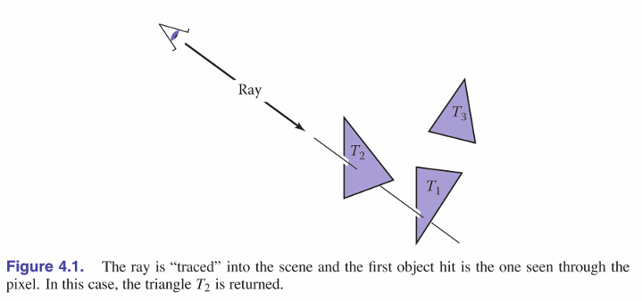  

因此基础的光线追踪包含下面三部分，对每个像素执行一次：

1. 生成视线：计算出每个像素发出的视线
2. 视线相交：找出与视线相交的最近一个物体和相交面的法线
3. 着色：利用相交的交点，法线和光照计算出当前像素所需显示的颜色
	
更复杂的光线追踪会在10，12，13章慢慢完善

## 4.2 透视法

将三维物体显示在二维空间中，自然需要透视法。和绘画中一样，传统上分为平行投影和透视投影两种

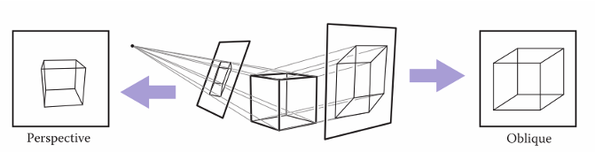  

平行投影的特点是相互平行的线投影后仍然平行，实现起来最简单也就是所有视线都互相平行。平行投影又能划分为轴测投影，正交投影，斜投影三种，轴测投影的视线与轴平行且与投影面垂直，正交投影的视线与投影面垂直，其余皆为斜投影

透视投影则是自然界中的投影形式，虚拟一个投影面后的焦点，然后视线从焦点开始穿过投影面抵达物体，也就是视线本身不再是平行的了，这样物体在投影面上的成像就有了近大远小的特性

## 4.3 计算视线

视线也是一个向量，由向量起点和终点组成，向量的起点e类似投影面上的像素位置或焦点，终点s是我们我们想要指向的方向，然后利用一个缩放参数t来控制向量的长度。也就是：p(t)= e + t(s − e)，这里s-e也被写为视线方向向量d，所以视线实际上为 p = e + td

找到这些坐标坐标并不容易，首先我们要定义一个相机坐标系框架，以视点e为中心，然后u水平指向视平面的右边，v垂直指向视平面的上方，然后指向后方的w由这两个向量叉乘可得到。注意这里w与视线方向是反向的，u是指向右边的，都与直觉相悖，这里重点是要把相机坐标系看作一个反着放置的坐标系，之所以这么设置与之后的物体顺序渲染有关，暂时记住就好

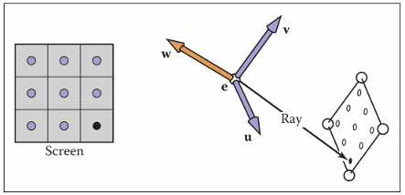  

对于正交投影，视线是最容易计算的。视线的方向都是-w，视线的起点则是由投影面的像素位置决定，所以重点就转化为了如何确定投影面的位置。通常来说通过规定投影面的四边界偏移值和投影面的横像素数量nx和纵像素数量ny，四边界分别是左边界l，右边界r，上边界t，下边界b，然后用下面的式子求得(i,j)处像素的横纵偏移值(u,v)，再叠加到视点位置上得到具体的像素位置，最后利用视线方向-w合成出视线

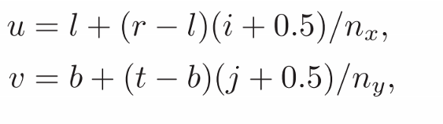  

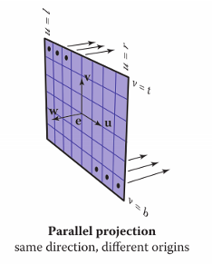  

透视投影则相对复杂一点。这里视点位置是固定的，但需要一个称为相平面距离或者焦距的d来计算视线方向。计算像素位置的方法和之前差不多，但是计算视线方向时需要用得到的像素位置和视点做差得到

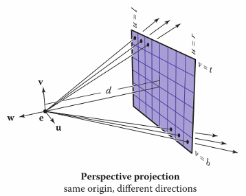  

## 4.4 光-物相交

在一开始的时候我们提到了基于像素顺序的渲染需要判断出每条视线最先接触的物体，首先前面说到视线可以用e + td 来表示，而视线由于长度无限我们可以扩展下看作一条直线，那么我们可以将视线写为隐函数f(e+td)=0

**视线与球相交**

1. 为了简化问题，先尝试判断视线与球模型的相交点
2. 在高数中，我们都知道球上一点的方程可以写做 (p − c) · (p − c) −R^2 = 0，其中p是点的坐标，c是球心坐标
3. 又因为这里我们要求的是视线上与球相交的点，因此我们将视线方程代入球的方程中，得到：
4. 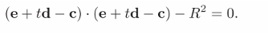  
4. 所以目标是求出上式中的t，由于未知数只有一个，将其拆开为完全平方标准形式
5. 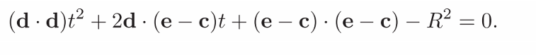  
5. 然后我们可以先使用判别式求出式子解的数量，0根代表视线不经过球，1根代表视线擦过球，2根代表视线与球相交
6. 最后用求根公式可以得到t的值，如果求出的t是两个正数，在视野内，t一正一负，视点在球内，t两负，球在视野背面，代回视线我们就可以得到视线与球的具体交点位置了
7. 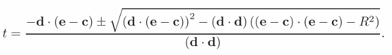  

**视线与三角面相交**

1. 这是最常见的相交问题，需要用到之前提到的三角的重心坐标系概念
2. 视线与三角面相交实际上是求解一个直线与平面交点的问题，类似球的相交，我们首先将直线方程代入到三角的平面方程中，这里使用之前重心坐标系的方程：
3. 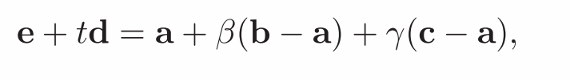  
3. 这里我们要求解的是距离t和交点位置参数β和γ，可以看到这显然是一个三元的线性方程组，将其每个纬度的坐标拆出来写为线性方程组的矩阵形式
4. 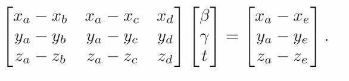  
4. 对线性代数熟悉的朋友应该至少求解这样的线性方程组最程序化的做法是什么，自然是使用克莱姆法则。也就是按顺序用右侧的列来替代左侧矩阵中的列，然后求行列式的商。而对于行列式的求法具体在下一章介绍，通常使用拉普拉斯展开来计算
5. 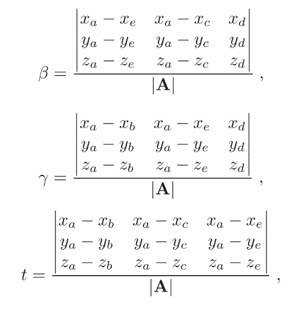  
5. 这里三个参数都可以分开并行计算，也可以分开逐个计算，顺序求解时其中的求解步骤有一些步骤可以优化复用，具体运算克莱姆法则时就会发现
6. 当逐步求解时，为了优化执行效率，应该每求解出一个参数就判断交点是否在观察范围和是否在三角面上，这样可以省去一些明显无用的计算

**视线与多边形相交**

1. 视线与多边形的相交判断是个更加复杂的问题，因为多边形可能是凸多边形或凹多边形，平面交点可能刚好穿过多边形的空洞。关键思路是计算射线在多边形平面的交点与投影到二维平面的多边形可以形成的交点数量
2. 首先求解下面的式子，其中p=e+td，通过求解t得出射线与多边形所在平面相交的交点，这一步可以筛选掉多边形与射线平行的情况
3. 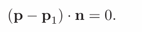  
3. 然后我们将多边形和交点投影到某个轴面上，例如xoy面，在二维上让交点向着某个轴向例如x轴方向形成直线，接着计算与多边形产生的交点数量，如果交点数量是偶数个则代表交点在多边形外，如果交点数量是奇数则表示交点在多边形内
4. 由于将多边形投影到轴面上可能导致判断的不精准例如投影后多边形很多顶点重叠缩为一条线，这里我们可以在投影前进行一次预判断，将多边形往三个轴面都进行一次投影，然后找出投影后剩余的可判断顶点数量最多的轴面来进行计算

**视线与一组物体相交**

1. 场景中一般不会只有一个物体，对于复杂的场景通常的射线相交判断方法是先将需要判断是否相交的物体归为一组
2. 然后计算出这组物体中所有相交的交点
3. 返回交点t在范围内且最小物体，也就是最接近投影面物体

## 4.5 明暗着色

和现实世界不同，计算机中物体表面的明暗变化很多时候并不是通过计算物体间的阴影完成的，而是一种直接的启发式计算方法，也就是这些算法尽管能得到漂亮的明暗效果，但是终究只是对现实的近似，而不是真正的物理模型。关于明暗算法这里不会讲很多，更详细的内容会在第10章记录

Lambertian明暗也就是用来模拟物体表面漫反射的明暗，我们知道现实中例如石膏表面，白纸表面被光照时会被均匀的照亮，且如果光是斜着照射则强度没有直接照射时高。利用这个特性图形学根据下面的式子，利用光源方向向量和表面法线向量来计算出在某个光照角度下物体应该呈现出的颜色。在这个式子中，n·l是利用单位向量的特性直接得到法线与光照方向的cos值，通过这个cos值来改变漫反射的强度，光照方向越是接近法线方向，反射强度就越高，I便是光照强度，而kd是表面的反射率或者说表面的颜色，这几个数乘在一起得到了表面真正要渲染出来的颜色。在这里可以看到后面用了一个max操作符，这是为了保证光照反向时不会产生范围外的颜色值

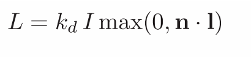  

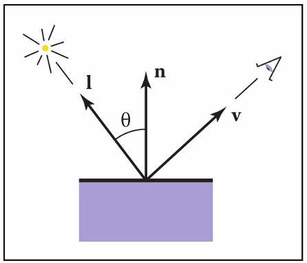  

Blinn-Phong明暗则主要是为处理高光而生，比较光滑的物体表面会不均匀地反射光线导致表面局部区域表现出高光，产生类似镜面的效果(但不是真正的镜面)，一般高光的颜色是光照本身的颜色。前面的Lambertian明暗是与视线向量v无关的光照模型，而我们知道高光的特点是若我们的视线方向越接近光线反射的方向，则看到的高光就越明亮，由于高光可以近似看作遵守镜面反射定律，所以我们可以用下面的式子来模拟这个物理现象。在这里算法取了个巧，通过比较法线与光照向量和视线之间的角平分线的角度来判断视线是否接近于光线的镜面反射，由此得到下面的式子。L式子的前半部分仍然是Lambertian明暗部分，后半部分才是Blinn-Phong明暗部分，因为明暗着色就是不断叠加色彩的。式子后半部分中，除了我们熟悉的元素外，可以看到max操作符后面加上了一个大于1的指数p，这个指数p称为Phong指数，是用来控制镜面反射的聚集程度的，指数越大反射出来的效果就越接近于镜面反射(对于普通的点光源反射来说就是一个精确的点)

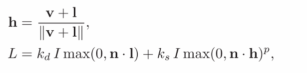  

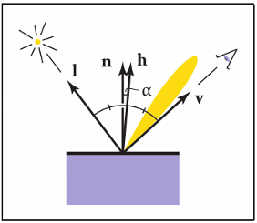  

环境明暗。在实际生活中，物体通常不会只受到一个光照的影响，而是常常有周围的间接反射的光线将没有被直接照亮的区域照亮。对于这种间接照明的现象，传统的明暗模型无法很好地模拟出来，但是传统的明暗模型仍然通过一个环境光项来控制，简单介绍就是不去考虑实际的照明，直接给物体附加上固定的光照强度来模拟间接光照，式子如下：

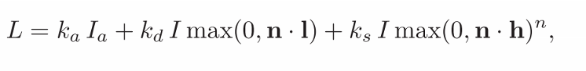  

多个光源明暗。对于一个复杂的场景常常需要多个直接照射的光源，这种情况其实很好处理，只要保持环境光项不变，然后将其他的明暗项叠加起来即可，出现多个高光也是符合物理规律的

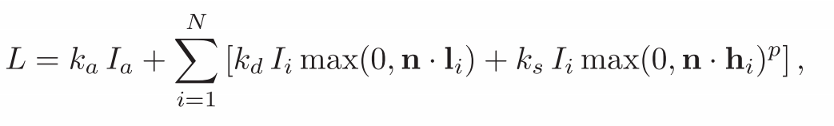  

## 4.6 光追程序

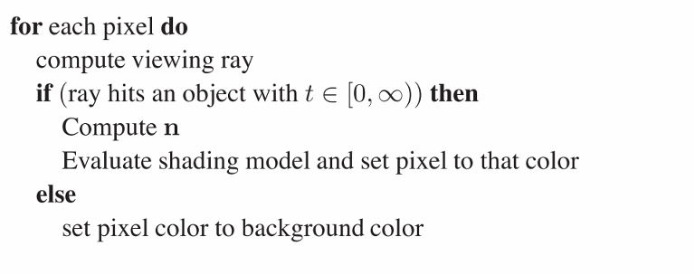  

上面这段伪代码的核心就是要判断是否在视线范围内，只有范围内的物体才需要考虑着色的问题，否则设置背景色即可

为了提高程序的逻辑性，最好将所有可以被hit的surface都继承同一个抽象类方便管理。然后在光追的运行中，每个hit的调用都返回一个hit_record，记录被射线命中的物体引用，最简单的记录方法是维护一个指向surface类的链表

## 4.7 阴影

除了一些软件中可能出现的通过再次渲染物体进行透视变换的假阴影和预渲染的阴影外，我们平时经常见到的可以调整精细度的"实时阴影"其实就是射线追踪的一种典型应用，它的原理类似于在光源处进行一次透视投影或者对全局进行一次平行投影，但是这里的视线看到的像素区域我们将其正常着色，而由于物体遮挡没能看到的像素我们对其进行阴影着色，这样的视线称为阴影射线

前面的明暗着色部分说到没有被直接光照的部分我们对其进行环境光着色，这个想法延续下来就是阴影覆盖的区域(没有光线照射的区域)我们只进行环境光着色，其余区域进行正常着色。分析下面的伪代码能更清楚地理解这部分，外层的if是前面光追程序的伪代码的延续，决定物体是否在观察范围内，但是在第一个if里，也就是能被观察到的像素中，首先对所有物体附加上对应的环境光，然后内层的if判断光源发出的射线能否照射到它所看到的物体，对于能被照射到的物体进行正常着色，否则不进行进一步着色从而呈现阴影的效果

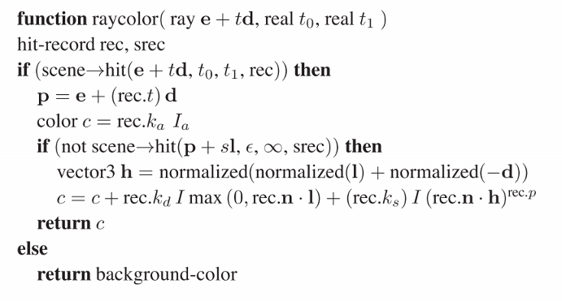  

到这里将这些着色都渲染出来就可以得到下面的效果，从左到右分别是：仅有Lambertian明暗，Lambertian明暗+环境光+阴影，完整的明暗。我们在游戏等软件中常常有"阴影精细度"这一选项，这就是由于光线追踪算法的高开销从而对光线探测密度的妥协

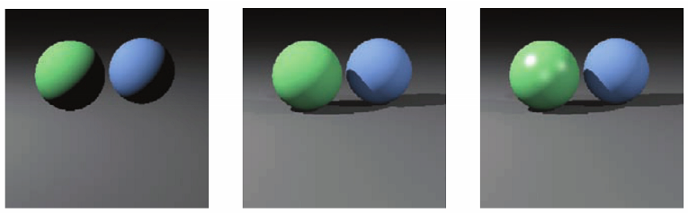  

## 4.8 理想镜面反射

处理理想的镜面反射例如水面反射，镜子之类一直都是实时渲染的难题。对于光线追踪算法，解决这个问题有一个很直接的做法那就是利用理想镜面反射的特性：理想镜面反射的效果类似于有个观察者在视线镜面反射的方向对目标进行观察，因此我们只需要在渲染了无镜面反射物体的情况下，在镜面反射发生的区域，计算出法线轴对称方向的视线r，然后对画面再进行一次渲染裁剪后放入镜面中。再镜面反射中颜色通常还会产生色差，一部分颜色是镜面本身的颜色c，一部分是反射时发生的衰减比率km，将这些也考虑在内后下面的式子就是镜面反射应该有的效果

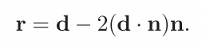  

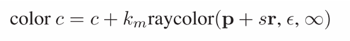  

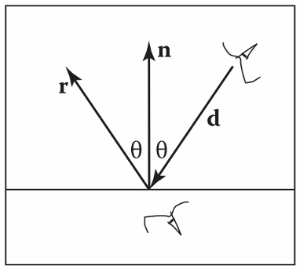  

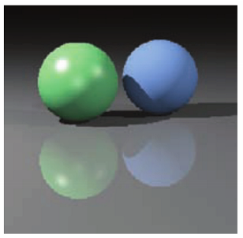  