# Chapter5 Linear Algebra 线性代数

## 5.1 行列式

行列式determinant，也叫决定式，是一个数，几何意义是边组成的空间的值。如二维行列式是平行四边形的面积，三维行列式是平行六面体的体积，因此行列式必须是方阵矩阵，且行列式必须线性无关否则值会降维因而得零，相应有一个特性就是|vv| =0，因为这样就线性相关了

行列式是值，且求值时是按照右手坐标系求的，表现出来就是行列式中的向量如果顺序相反则得到的行列式的值也会是相反数，也即是|ab| = −|ba|

向量模式的行列式可以数乘|(ka)b| = |a(kb)| = k|ab|；可以剪切|(a + kb)b| = |a(b + ka)| = |ab|；还满足分配律|a(b + c)| = |ab| + |ac|。其中剪切的几何意义是保持高和底不变的平行四边形无论怎么倾斜其面积都如下图是不变的

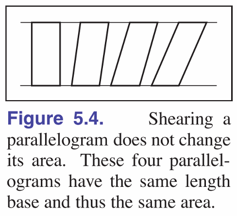  

在阅读不同地区的中文文章时，要注意行列可能会出现下面的别名

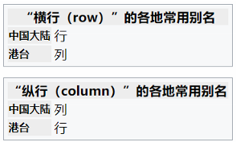  

## 5.2 矩阵

矩阵的数乘是把数逐项乘到矩阵的元素上，矩阵的加减是矩阵间的主元素加减，矩阵相乘是行列对应项相乘再相加，具体效果如下图，矩阵相乘是矩阵最常见的运算，要牢记矩阵乘法没有交换率，也就是左乘右乘结果通常不同

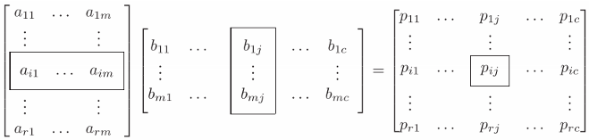  

矩阵有分配律

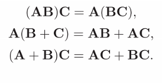  

矩阵和对应的逆矩阵相乘结果是单位矩阵，相乘的矩阵求逆得到的结果内外都会相反

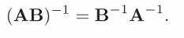  

矩阵的转置会使得矩阵的行列反转

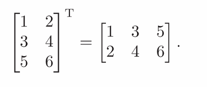  

类似矩阵求逆，矩阵相乘的转置也会转置且顺序反转

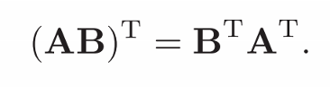  

这些矩阵的性质也有对应的行列式性质，大多数时候我们把行列式看作一个数就能八九不离十

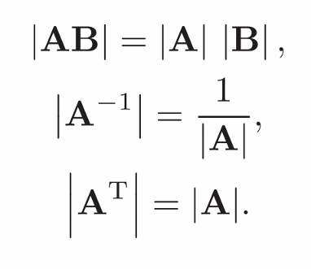  

同维度的向量有外乘和内乘之分，例如现在有两个n*1的向量a和b，那么aT·b得一个1*1的数，a·bT得一个n*n的矩阵，这用矩阵的乘法大小计算即可记忆

对角矩阵的特点是所有非零元素都在对角线上，对称矩阵的特点是矩阵的转置与原矩阵相同，正交矩阵的特点是矩阵每列向量的长度为1且与其他向量正交(相乘为0)。正交矩阵还有个特点是其转置与原矩阵相乘可得单位矩阵

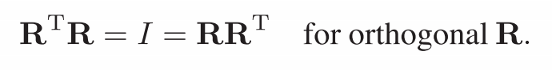  

## 5.3 用行列式和矩阵来运算

前面说到了行列式是依照平行四边形形式对向量进行了求值，而具体来说行列式的求值在维度低的时候可以使用简单的交叉法，维度高了之后最常用的方法是拉普拉斯展开，也就是对行列式的某一行/列的元素，逐元素与其对应的代数余子式相乘并求和。所谓的代数余子式就是去除了对应元素的行列后，剩余元素组成的子行列式乘上正负标记棋盘得到的新的值。这个算法是递归进行的，不断递归子行列式直到可以直接求出为止

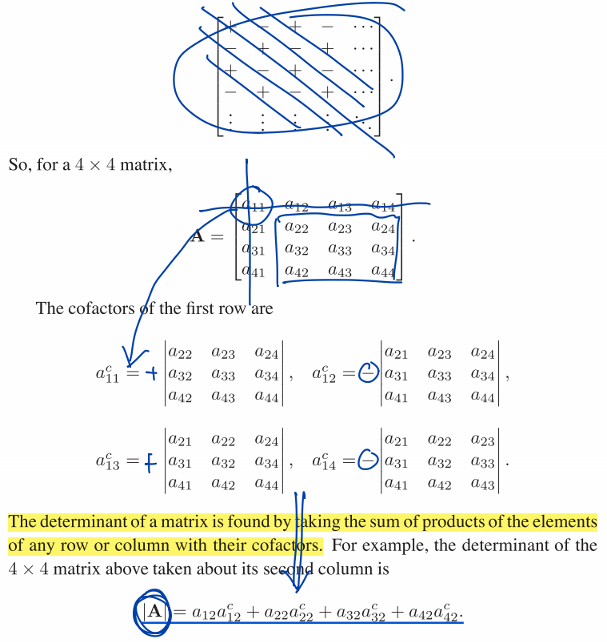  

矩阵的求逆同样需要用到代数余子式。首先由矩阵中每个元素的对应代数余子式组成的新矩阵的转置矩阵称为原矩阵的伴随矩阵，记为A*，而这个伴随矩阵数乘原矩阵行列式的倒数得到的矩阵就是原矩阵的逆矩阵，矩阵和它的逆矩阵相乘会得到单位矩阵I。这里要注意行列式为0的情况是不可逆的，所以在计算前最好先检查下行列式的值。行列式为0的矩阵称为奇异矩阵，这个概念后面还会遇到

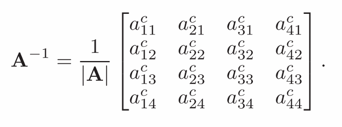  

线性代数很大的一大用处就是用来解决线性系统的问题，对于有n个等式和n个未知数，幂次为1的方程组我们称之为线性系统，线性系统可以通过将未知数，常量和等式右边拆分为矩阵相乘的形式，一旦将其写为矩阵形式我们便可以按照矩阵的思路来处理它。前面在4.4的时候说到过求解线性方程组的一大程序化做法就是使用克莱姆法则，通过两个行列式的比值我们可以求解出线性方程组中对应变量的值，同样我们需要注意先检查矩阵是否奇异，行列式为0的时候也就是方程组线性相关的时候将会有无穷多组解

矩阵在几何意义上是对目标向量的线性变换，也就是旋转，缩放，投影三种变换的组合，而矩阵求出来的逆矩阵的意义是对目标进行一次逆变换，也就是对其进行反向的对应变换

## 5.4 特征值和矩阵对角化

这部分主要是特征值分解(矩阵对角化)EVD和奇异值分解SVD，实际上这两个是类似的东西。我们知道矩阵变换的几何意义就是对目标向量进行线性变换，线性变换本质就是缩放与旋转的组合，特征值分解是对那些应用后在某个方向上只会发生缩放的变换矩阵，将矩阵拆解为【旋转-缩放-反旋转】的三个矩阵连乘状态；而奇异值分解是为了处理那些又旋转又缩放的矩阵，将矩阵拆为【旋转-缩放-另一个旋转】的三个矩阵连乘状态，本质上都是为了从复杂的矩阵变换中找到本质的特性。下面就是如何进行特征值分解和奇异值分解：

特征值分解首先需要计算特征值和特征向量。矩阵的特征值代表的是对目标进行缩放，特征向量则指示了发生缩放的方向，效果如下面式子：非零的特征向量a在矩阵A变换下会仅仅在向量本身的方向上发生缩放一个特征值倍率λ。特征向量和特征值在计算中常常用来简化会重复多次的矩阵变换，让复杂的矩阵乘法可以用简单的特征值连乘来解决

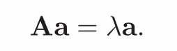  

矩阵特征值和特征向量的计算在线性代数的学习中我们都很熟悉了，这里简单回顾下：

1. 将上面的式子变形为下面的形式
2. 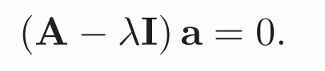  
2. 由于特征向量a假定为非零向量，那么(A− λI)部分必然奇异，也就是其行列式为0
3. 利用(A− λI)行列式为零的特点，代入具体数字求解二次方程得特征值
4. 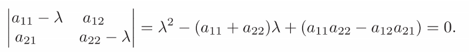  
4. 得到特征值后再代回一开始的矩阵乘向量形式，求解特征向量，由于特征值可能有多个所以对应的特征向量也可能有多个

计算出矩阵的特征值和特征向量后，特征值分解其实就已经完成了。首先将特征值排列为对角矩阵D，然后按照特征值排列的顺序将特征列向量排列为矩阵Q，前面我们知道特征值分解是为了将矩阵拆解为【旋转-缩放-反旋转】三个矩阵连乘，此处我们已经有了旋转矩阵Q，缩放矩阵D，还差反旋转矩阵Q^-1。这里我们其实并不需要对Q进行求逆，要知道旋转矩阵Q是由矩阵的特征向量组成的，而矩阵的特征向量都是相互正交的，对于正交矩阵我们有一个特性就是正交矩阵的逆矩阵和其转置矩阵是相同的，所以反旋转矩阵就是Q^T。以上组合起来就是特征值分解的形式了

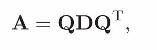  

奇异值分解的方法和特征值分解有点相似，但是奇异值分解的第三个矩阵是另一组基底V。在这里我们可以想到由于相似的形式，如果我们对一个方阵A使用奇异值分解，得到的结果将与特征值分解相同

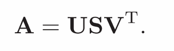  

奇异值分解的步骤在工业上有效率更高的做法，这里的做法是比较好理解但效率没那么高的做法：
1. 首先假设我们要奇异值分解矩阵A，由奇异值分解的基础式子我们可以写出下面的矩阵M
2. 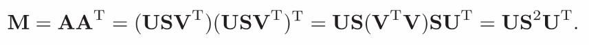  
2. M由于是A和A的转置的乘积，因此一定是一个方阵，我们可以对M进行特征值分解，这里我们把U看作Q，S^2看作D
3. 然后从上面的式子我们可以想到，如果有一个M'=A^T·A，那么我们就可以得到以V为主的特征值分解
4. 按照前面特征值分解的方法，求出U，V，S^2
5. 最后很明显我们可以看出奇异值矩阵S就是S^2的开平方，开平方得到S，完成奇异值分解
6. 这里我们还可以简化计算，通过下面的式子直接计算出V避免多余的特征值分解过程
7. 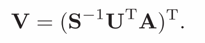  

关于奇异值分解SVD的详细应用下一章还会继续讨论
