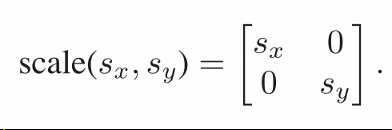

# Chapter6 Transformation Matrices 变换矩阵

## 6.1 二维线性变换

在图形学中我们用矩阵来进行几何变换，通过矩阵左乘列向量，对列向量实施的这个变换就是线性变换。如下是二维线性变换的标准形式

  

二维线性变换有几个常见的基本形式，这些基本形式的组合可以得到所有的二维线性变换，这里下面简单介绍一下：

缩放：

1. 缩放是最简单的二维线性变换，缩放矩阵是一个对角矩阵，对角线上的元素分别是x轴缩放的倍率和y轴缩放的倍率
2. 缩放是基于坐标轴缩放的，所以如果需要朝着某个方向进行缩放的话需要旋转到轴上，缩放，再旋转回去
3.   
4.   

错切：

1. 错切变换形象地说类似于把一堆扑克牌推斜，也就是在高和底边都不改变的情况下，将整个图形往轴向方向拉
2. 错切矩阵是上/下三角矩阵，参数s指的是将那个轴的顶部元素推动的比率距离
3.   
4. 错切还有一种比较好的理解就是参数代表了将垂直轴顺时针/水平轴逆时针转动的角度的tan值
5.   
6.   
	
旋转：

1. 旋转变换矩阵相对比较复杂，需要在极坐标系下进行简单的推导才能得到矩阵，平时我们使用旋转矩阵的时候只要记住其形式就好
2. 旋转矩阵的参数Φ是坐标轴逆时针旋转的角度，一定要注意是逆时针的旋转
3.   
4.   

反射：

1. 反射是比较简单的变换，效果类似于对称操作，实际上我们可以理解为参数为负产生的缩放变换
2.   
3. 在反射中，如果我们让两个轴都进行一次反射，得到的结果将和旋转180度相同
4.   

变换的组合与分解：

1. 可以通过连续的矩阵左乘来组合多个变换，由于矩阵乘法拥有结合性，我们可以提前让变换矩阵左乘起来得到一个复杂的矩阵，然后再把这个组合左乘应用到向量上
2. 在应用变换时我们要记得，由于矩阵是依靠左乘组合在一起的，所以变换的顺序需要从右往左看
3. 变换没有交换率，所以矩阵变换的乘法千万不要随便交换顺序，矩阵乘法顺序的改变一般都会带来不一样的结果
4. 而之前我们说到我们可以用特征值分解和奇异值分解来拆解矩阵，实际上这些分解方法在几何上是将一个变换拆解为了旋转-缩放-旋转的三个子变换的组合
5. 所有的对称矩阵都可以被拆分为 旋转-缩放-反旋转 的组合，特征值分解得到的结果就是这样
6. 而普通的矩阵可以被拆分为 旋转1-缩放-旋转2 的组合，这是奇异值分解的结果
7. 还有一种变换的分解方式是Paeth在1990年提出的Paeth错切分解，它可以将一个非零的旋转矩阵分解为 错切1-错切2-错切1 的形式如下，这个分解的好处是错切变换的组合效率更高且可以避免直接应用旋转变换在图像光栅化途中会产生的空洞问题
8.   
9.   

## 6.2 三维线性变换

三维的线性变换要比二维的复杂的多，很多时候我们的处理方法和二维相似，通过将需要变换的物体旋转到轴上然后进行三维缩放或三维错切，然后再旋转到想要的方向上

  

三维上的线性变换常见的表示是对二维的线性变换进行扩张，但是扩张出来的那一维通常保持不变，也就是用[0,0,1]作为增加的维度，然后一样通过多个变换组合左乘来得到完整的变换。三维变换同样可以用奇异值分解将其分解为 旋转-缩放-旋转的形式。三维变换在后面十六章的时候还会有进一步的讨论

物体在进行线性变换的时候，如果我们只把物体表面的法线当作普通的向量一起变换的话，法线很可能在变换后就不是正确的法线了，最简单的例子就是下图的错切变换，原本垂直于切向量t的法线n经历变换M之后不再垂直于Mt了，在下图我们可以看到此时正确的法线应该是Nn，因此这里需要找到正确的单独用在法线身上的变换N才能得到法线

  

法线变换N的推导在书中有详细的介绍，但是这里我们只要记住结论，变换N实际上就是变换M逆矩阵的转置矩阵

  

也就是说N就是M的代数余子式的正常排列形式，把这个矩阵应用在法线上才能得到正确的法线

  

## 6.3 移动和仿射变换

我们前面的线性变换都只能对空间中的向量进行原地操作，并不能改变向量的位置，也就是不能移动向量。如果我们想要对向量进行移动，最简单的做法就是给向量加上偏移值如下

  

但是这样做势必会带来许多麻烦，例如记录偏移值会带来很多多余的操作，这个簿记操作本身也很麻烦。为了解决这个问题人们提出了在齐次坐标系中的仿射变换矩阵的概念，简单说就是给普通的变换矩阵加上一列并把空位填上0得到下图。仿射变换矩阵的好处是当把向量和变换矩阵改写成这个形式后，我们可以把线性变换和移动操作糅合在一个变换矩阵中且仍然保留之前的矩阵合成与分解的特性

  

对于仿射变换矩阵，我们可以看到应用矩阵的向量最下面有一个多出来的1，这个1代表的是这个向量是否可以应用偏移值。可以简单自己测试一下效果，对于值为1的向量，变换矩阵第三列的偏移值会应用到向量上，而如果那个值为0，则偏移量不会应用到向量上。这个巧妙的写法使得我们可以很简单地处理实际的需要进行移动的向量和仅仅用来指示方向，不希望发生移动的向量

而在程序的编写时，这个特殊的值通常用一个标记位额外记忆，然后矩阵变换为仿射矩阵是计算前才合成出来的，这样就还节省了很多储存矩阵的空间。仿射变换的这个标记位还有其他的用处，这将会在下一章谈到透视变换时解释

三维空间中的仿射变换矩阵，格式也与二维空间中的版本相似，处理起来也是一样的道理

  

## 6.4 变换矩阵求逆

在图形学中我们常常要用到线性变换的逆变换，将转换后的物体转换回去。这个操作在数学上通常通过求变换矩阵的逆来实现，但是由于图形学中矩阵的特殊性，我们有很多种方法来避免真正地求逆以加快运算的速度。

1. 对角矩阵的逆就是将对角线上的元素取倒数
2. 旋转矩阵的逆是反向度数的旋转矩阵
3. 移动矩阵的逆是反向的移动矩阵
4. 一系列合成的变换矩阵的逆是每个矩阵求逆后以相反的顺序再作用一次
5. 正交矩阵的逆是矩阵的转置
6. 底部是[0,0,0,1]的矩阵例如仿射变换矩阵，求逆后底部依然是[0,0,0,1]
7. 有时候对于一个复杂的线性变换我们可以用SVD分解为基本的变换然后用上面的方法求逆

## 6.5 坐标系变换

想要移动世界中的目标点，通常来说有两种方法：一种是在不动的坐标系中移动目标点，另一种是保持目标点不动直接移动坐标系。这两种方法在数学上来说效果是等价的，尽管可能会带来编程上的问题，效果如下图

  

这样就引出了坐标系变换的问题，前面我们讨论的都是如何在不动的坐标系中移动目标点，而如何得到物体在新的坐标系中的坐标这个问题就是坐标系变换，之前在2.4中稍微提到过一点点。下图我们可以看到同一个点在不同坐标系中的表示是不同的，也可以很清楚的看到其不同的根源就是坐标系的基向量和原点的差别，

  

那么加入我们现在有一个在uev坐标系中的点，如何得到其在xoy坐标系中的坐标呢，其实这本质上还是仿射变换的思路，首先我们需要得到当前坐标系uev的基向量和原点在xoy坐标系中的坐标，然后由于我们当前目标点的坐标是在uev坐标系中的，也就是在这个点眼里uev坐标系是处于(0,0)的标准正交坐标系，我们按照下面的式子对这个点进行旋转和偏移，要将这个相对的坐标转换为绝对坐标。首先将这个标准的坐标系旋转为真正的uev坐标系的方向，然后偏移到对应的原点位置即可

  

然后上面的变换我们可以将其简写为下面的向量形式，这就是坐标系变换的公式

  

而如果我们需要将坐标再转回到原来的坐标系中，方法和之前的各种变换一样，最简单最数学化的处理就是对其应用之前变换的逆变换即可。当然同样的还有一种方法就是找出xoy坐标系在uev坐标系中的表示任然后进行一次坐标系变换

  

以上的坐标系变换都可以很自然地推广到三维空间中，效果如下：

  
