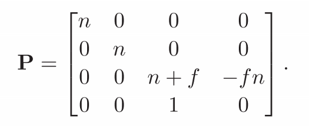

# Chapter7 Viewing 观察

- [Chapter7 Viewing 观察](#chapter7-viewing-观察)
  - [7.1 观察变换](#71-观察变换)
  - [7.2 投影变换](#72-投影变换)
  - [7.3 透视投影](#73-透视投影)
  - [7.4 投影变换的一些性质](#74-投影变换的一些性质)
  - [7.5 视域(FOV)](#75-视域fov)

## 7.1 观察变换

上一章里讲到了对模型的各种变换，这一章则要介绍如何观察这些三维模型，将三维模型投影到二维屏幕的点上的过程就称为观察变换。关于如何观察三维世界，前面第四章里已经简单介绍过了分为物体顺序的渲染和图像顺序的渲染两种基础方法，这一章要讲的就是最常用的基于物体顺序的渲染，它编写起来更加复杂但是执行效率非常高

这一章的叙述顺序初看之下会觉得有点相反，这是因为基于物体顺序的渲染是基于对物体的连续矩阵变换进行的，每个矩阵将物体变为更简单更接近渲染结果的形式，然后把矩阵组合起来。这里的叙述顺序从简单变换到复杂变换逐步深入，而这个叙述顺序正好与矩阵乘法的顺序是相反的

在图形学中，基于物体顺序的渲染根据下面图示的顺序进行，且这些步骤分为三个大部分：

  

1. 相机变换部分
上图左数的两个步骤，对于一个世界坐标系空间中的物体，我们将虚拟摄像机相机旋转和移动到需要的角度上，然后把物体的顶点坐标从世界坐标系转到相机坐标系中
2. 投影变换部分
中间的步骤，把那个横着的金字塔形视体压缩为下面规范视体的形状，这会让顶点发生很多变化，是观察变换里最复杂的部分
3. 视口变换部分
最右边的步骤，将规范视体中的三维顶点们投影到二维的屏幕空间中，这以后才能光栅化顶点渲染到屏幕的像素上

**视口变换部分**

上面介绍了渲染顺序后，那么这里从最简单也是矩阵最后一层的变换开始介绍，也就是流程最右边的视口变换(也称为视点变换)部分。和我们人眼观察世界时有视野大小和可视距离一样，在计算机空间中观察物体是有范围限制的，这个范围称为视体，只有在这个视体内的物体才可能被渲染到屏幕画面中来。窗口变换假设我们现在的视体就是流程图中右下角的规范正方体视体，且当前是一个正交投影所以我们不必担心近大远小的问题，然后我们要把这个正方体中的顶点和线转为屏幕上的二维坐标

回到刚开始的3.2节中，我们讲到了屏幕坐标排列的问题，在这里我们要通过一个矩阵把三维空间中的坐标转换为二维的屏幕坐标，并且其排列顺序要按照3.2中的介绍，也就是依据左下坐标系的形式，将[-1,1]^3的三维空间投影到[-0.5,n-0.5]的二维空间中。这里的0.5是3.2提到的过冲问题引起的，n是在x或y轴上的像素长度，这部分可以对照前面3.2的图来看

  

那如何对三维空间进行一个这样的投影呢，我们可以很自然地想到，由于这是一个正交投影，所以这首先是一个降维的问题，我们需要忽视掉视体中的z轴，将顶点拍扁；然后我们可以将顶点在轴向上进行缩放，将其拉伸对齐到像素网格中；最后我们将这个投影好的矩形进行移动，移动到适配屏幕左下角坐标系的形式。整理一下这个思路，我们可以得到下面的仿射变换矩阵，明显可以看到这是一个缩放矩阵配合了位置的仿射变换，自己动手试一下就能清楚其中的过程

  

在这个矩阵中，我们保留了Z的值没有真的拍平它，这是因为Z轴的值需要在之后的章节负责深度测试进行隐藏面消除，现在我们可以不理会Z值

**正交投影变换**

然后我们再回去看流程图，我们的介绍顺序是逆推的顺序。可以看到现在我们需要的就是投影变换的部分了，我们要将那个金字塔形的视体转为上面使用的规范视体的形式。在流程图中金字塔形的视体是透视投影的视体，和之前说的一样投影分为正交投影和透视投影两大类，这里先跳过透视投影，来介绍比较简单的正交投影部分，这部分是透视投影的变换的基石

  

上面的图是一个标准的正交投影的形式，在这里我们可以看到相机由相机自己的相机坐标系和一个立方体形的视体组成，在这幅图中就提出了几个问题：

1. 此处相机坐标系为什么z轴正方向和视体不在同一个方向上？
2. 为什么视体和坐标系原点中间有一段距离？
3. 如何将正交视体变换为上面的规范视体？

首先这里相机坐标系的z轴正方向和视体不在同一个方向上实际上是一个习惯问题。我们通常使用的坐标系都是上图的右手坐标系，我们习惯了让x轴指向右侧，y轴指向上方，但是视体又必然是处于屏幕内侧的，这就导致了我们只能让z轴是指向屏幕外侧的，而视体处于z轴的负方向上。也有少数的API中让视体处于z轴正方向上，尽管这让深度值更直观却让xy坐标变得奇怪或者需要改用左手坐标系

然后视体与坐标系原点中间的距离就相当于现实中相机的焦距，由于我们只能渲染出视体中的内容，因此焦距越长，我们就能看到越远处的物体，焦距越小我们就看到越近的物体。计算机中的相机不会发生散焦等情况，因此在正交投影下调整焦距的效果类似于相机在移动

那么最后如何将正交视体变换为规范视体呢，很显然这也是一个缩放和移动仿射矩阵的情况，只是这一次我们无需忽略Z轴的值了，三轴都要进行移动和变换，具体的矩阵就是下面的样子，自己动手试一下就能清楚其中的过程

**相机变换**

再回到流程图中，这就到了最后的一个变换部分了，前面的变换都假设物体已经稳稳当当地放在视体中了，但实际上我们需要利用变换让相机坐标移动到需要的位置并让视体对准我们要的物体，再把物体的坐标从世界坐标系转换到相机坐标系中提供给上面的变换。这部分听起来很复杂但实际上就是上一章最后6.5节讲到的坐标系变换问题，在那一节中给出了从世界坐标系xyz坐标转换到相机坐标系uvw坐标的变换公式

公式需要得到xyz坐标系中的视点也就是相机坐标系的原点坐标e，和相机坐标系三个坐标轴的xyz表示，对于如何得到想要的三个坐标轴之前2.4节已经介绍过生成三个正交轴的方法，在此只给出公式不再赘述。综合起来就得到了下面的公式和相机变换的变换矩阵，这个矩阵由坐标系变换矩阵和原点移动仿射矩阵组合而成

  

  

**综合**

到此为止我们可以将以上这些矩阵连乘起来得到正交投影下的观察变换程序了，程序的伪代码如下

  

## 7.2 投影变换

上一节中介绍了正交投影的观察变换过程，在投影变换的途中我们跳过了透视投影，在这一节先来介绍投影的基础理论

投影的核心是下面的公式和示意图，由于焦距d和焦点e到物体的距离z的比率的不同，物体实际高度y成像在视平面上时的大小ys也会不同，也就是会产生近大远小的效果，越远的物体对应的d/z就越小，这个除法称为透视除法

  

而这种变换显然是非线性变换，如何在矩阵运算中处理这个问题呢？上一节介绍仿射变换的时候提到了标记位w在透视投影中有意义，这就是这里使用到的透视除法，这个w值是其他坐标的缩放程度。如果我们有一个w值不为1的坐标，我们通过将整个坐标除w值来使得w值变回1，这个过程称为齐次化

齐次化有一个良好的特性，就是未齐次化的点和齐次化后的点在空间中表示的是同一个点，在后面的透视投影中，尽管未齐次化的坐标不是真实的坐标，我们仍然可以对其进行一系列的观察变换，只不过我们在一系列变换的最后需要进行透视除法得到真实坐标才能对应到屏幕空间中渲染

## 7.3 透视投影

在上一节中，我们知道了透视的核心是近大远小的透视除法，对于上一章例图中y的变换，我们可以用下面的矩阵来表示。动手计算一下就能知道这样的处理后，如果我们将得到的向量做透视除法齐次化，得到的ys就是d/z*y也就是例图中的样子，这个矩阵利用了携带的z值与焦距d协同完成了缩放操作

  

但是前面我们一直以来的观察变换都在保持点的z轴深度值，这是为了后面的隐藏面消除操作，因此我们想要和之前一样通过给变换矩阵加一行来保留z值。透视变换的近大远小应该只改变了xy轴上的内容而不修改z轴的内容，然而如果我们想实际写出这样的透视投影变换矩阵会发现让xy按照我们需要的尺度进行变换而不影响到z实际上是不可能的

在这个时候我们想到处理隐藏面消除的时候，我们真正需要的其实是顶点之间z的深度顺序不变且能保留在视体内，实际上的z值并不重要，因此我们构造出了下面的矩阵，后面是乘法的效果。这个矩阵比较复杂，其中n是视体的近平面的z值，f是远平面的z值。矩阵的1，2，4行明显就是上面那个不完整的投影矩阵的形式，经过齐次化后，我们成功让xy值都变成了我们想要的样子，而第3行是为了保持z深度值顺序且保证z可以被映射到[n,f]区间中的妥协

  

  

这时候为了加深理解，我们再理一下透视矩阵到底在干什么。利用这个矩阵，我们可以按照物体的距离将远处的物体按比例缩小到投影面上的大小，并且把z值从一个不确定的范围映射到确定的[n,f]中。为什么我们要把z映射到[n,f]中？这里看下面的这张示意图，透视投影实际上做的是下面这个过程，将一块金字塔形的视体非线性地扭曲为一个正交视体，也即是说透视投影实际上不是真正的投影，而是将空间中的物体按照投影应有的比率进行了变形，这一切操作都是为了将透视投影和前面的正交投影能连接到一起，至此我们就完成了透视投影的部分

  

有时候我们需要运用透视投影变换的逆变换，例如从正交投影视体中恢复点的z坐标值，透视投影的逆变换矩阵在进行简单整理后就是下面的样子：

  

得到透视矩阵后我们把至今为止的这些矩阵按照流程图串联起来，得到下面的最终变换矩阵和渲染的伪代码。从右到左依次应用：调整相机位置和方向，将物体透视变形到正交视体里，将正交视体转为规范视体，将规范视体中的顶点裁剪投影到屏幕空间中。给每个点乘上这个矩阵后再进行依次透视除法得到物体变换后的真实坐标

  

  

在上面的伪代码里，正交透视和透视矩阵的乘积合成为了完整的透视投影矩阵，这个矩阵在不同的API中有一些差别，例如OpenGL中对其每个值视体两个面的z坐标取了绝对值，但是整体的思路都是一样的

  

## 7.4 投影变换的一些性质

透视投影变换有一个重要的性质就是它会将直线映射为直线，平面映射为平面，线段映射为线段，并且保留了所有点的排序正确，这保证了三角形正确映射为三角形。这个性质在书中有证明的过程，关键是证明出线段上所有的点在透视矩阵的处理后仍然共线，也就是仍然可以用一条三维直线方程来描述，在此就不赘述了

前面透视投影的时候我们将z映射为下面的值。手动测试一下我们就会发现在这个映射中，正的z值会被映射到负z上，负的z值被映射到正z上，当我们要渲染的物体都在视体内时自然还能正确投影到屏幕上，但是一旦出现了跨越z=0的线段，线段就会有一部分被映射到正负无穷因而被撕裂。这个问题需要用视体裁剪算法来解决，在十二章会介绍这部分

  

## 7.5 视域(FOV)

最后的视域部分我们在日常生活中接触的就比较多了，所谓视域field-of-view，简称FOV，其实是一个角度值，这个值控制着我们视体近投影面的大小。我们知道透视投影的变换将物体都变形到符合近投影面尺寸的状态，控制近投影面的大小会影响视点到投影面边缘的角度进而影响我们的视野宽度大小。在这里假如为了方便处理，我们让近投影面的中心与视点中心形成的线恰好就是z轴(也就是投影面正对着焦点)，然后我们让窗口的宽高比恰好等同于投影面的宽高比，我们便可以得到下面的示意图

  

由于视体的后面部分由可视距离和上面的θ角度共同决定，因此这里没有画出来。在上图中我们可以想象到，在固定这条式子中的一项的情况下，改变其他项可以调节画面的视野广度。在大多数观察系统中，例如常见的一些提供了调节选项的三维游戏中，系统都固定了焦距n然后允许我们通过调节θ控制投影面的大小也就是视野大小，因此这个θ的角度就被称为视域(FOV)，代表了焦点到投影面在垂直方向上总共覆盖的视锥角度