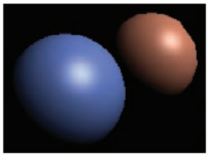
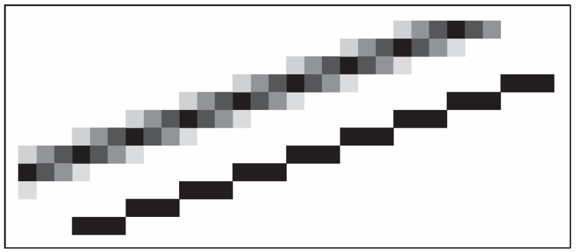

# Chapter8 The Graphics Pipeline 图形管线

- [Chapter8 The Graphics Pipeline 图形管线](#chapter8-the-graphics-pipeline-图形管线)
  - [8.1 光栅化](#81-光栅化)
  - [8.2 光栅化前后的操作](#82-光栅化前后的操作)
  - [8.3 简单的反走样](#83-简单的反走样)
  - [8.4 为效率剔除图元](#84-为效率剔除图元)

## 8.1 光栅化

光栅化是渲染的中心步骤，光栅模块也是任何图形管线的核心部分，其作用是列出被图元覆盖到的像素们，将图元与像素进行对应后输出为片元，由于图元在光栅化前的顶点处理部分已经完成了所有几何变换，因此这里对应像素后得到的就是二维形式尺度与屏幕像素一一对应的片元了

**绘制线段**

我们知道图形学中的模型由三角面或四边形组成，也就是由线段组成，因此如何在屏幕上绘制出线就是光栅化的关键。在图形学中，我们大多数时候使用两点式隐式方程来表达一条线段，这里的两点就是线段的两个顶点，使用如下的式子，在这里我们假设x0<x1：

  

然后得到表达式后，我们的目的是利用这个式子找到屏幕上对应的像素，标记为需要着色的像素点。这里我们需要按照不同的线段的斜率分情况处理，计算线段的斜率如下：

  

之所以分斜率处理是为了简化接下来的一些像素选择策略。这里显而易见斜率m可以分为4种情况，以-1，0，1为分界线，四种情况的处理方法相似，我们取m属于(0,1]的情况来介绍，由于x0<x1，所以也就是线段略微斜朝右上角的情况：

1. 由于线段斜朝右上角且斜率小于1，那么我们可以想像线段对应到屏幕上，相邻像素可以呈现两种可能的排列：
   1. 左右像素在同一条水平线上
   2. 右边像素比左边像素高一个单位
2. 由于屏幕上的像素是离散化的，无法完美表现出连续的线段，因此我们只能利用上面两种情况来逼近一条斜线段。那么此时的要求就是如何在合适的时候选择合适的排列方式让折线最终能连接到重点且整体看上去和真实的线接近
3. 解决方法很符合直觉，横向从左往右开始绘制，然后每绘制完一个像素就将两个候选像素的平均值的坐标也就是(x+1,y+0.5)代入直线的表达式中，如果得到的值小于0代表此时线在点的上方，所以应该绘制上面的像素来逼近线，如果大于0代表需要绘制下面的像素。效果如下图的选择：
4.   

这个算法就是绘制直线的基本算法，但是如果每绘制一个像素点都要代入中点到函数里求值的话会很浪费资源，这里利用了像素之间的等距性和函数本身是一个线性函数的特点，对这个计算算法进行了优化。由于函数是线性的，因此函数值在变量相同变化的情况下值的变化也是相同的，可以用下面的式子进行表示：

  

因此我们只要有了初始的f(x,y)，就可以用简单的加法类推出后面所有的f值，通过判断这个结果也可以得到整条直线推广中的偏移值，最终的伪函数写出来就是下面这样，d就是用来类推并在后面负责判断的那个函数值：

  

这个类推法有一个明显的缺陷就是由于数制的原因，在不断累加的过程中，计算过程的小误差会被不断累加，这个可能会导致绘制出来的线出现偏移。但是实际运用的时候由于线的长度本身就是有限的，因而这个误差基本上不会表现出来

**三角形光栅化**

前面介绍了如何绘制线条，模型的基本三角面是由线段组成的，自然绘制手法也是类似的。但是和绘制线段不一样的是，对三角形进行光栅化是为了将其转为片元，那么就需要得到三角形上的纹理坐标，从而表示出各个像素的着色

对三角形内部的点进行着色最常见的方法是使用前面2.7讲到的三角形重心坐标系，按照三角形内的点对应的重心坐标值从三个顶点处取颜色加权融合起来，表达式如下，这种方法称为Gouraud插值：

  

但是这仅仅是最简单的着色方法，实际中三角形常常是互相连接出现的，如何对两个三角形之间的公共边进行着色呢？在绝大多数情况下，三角形的边都不能正好符合像素的排列，在这种情况下所谓的公共边也就不成为题了，因为那些像素一定是输入其大部分区域所在的三角形的颜色值，我们通过下面的伪代码进行对应的着色。由于我们没有记录那些像素是刚才计算出来的线段上的点，因此需要遍历所有的像素，然后其中首先遍历线段光栅化后所有的点，判断各个点是否在三角形内，是就进行着色

  

这个代码有一个显而易见的缺点，就是对于每个想要着色的三角形都需要遍历屏幕上所有的点来保证着色的正确，因而下面的伪代码又缩小了搜素的范围，因为需要着色的点只可能可能处于三角三个顶点构成的矩形内，通过这个优化大幅加速了计算的过程。这里要注意由于f是二维线性函数，因而也可以用上面线段光栅化的时候所使用的累加法来优化函数值的计算那一步，如下图的彩色三角形可以看到三角形的重心坐标系的各个值是可以累加的

  

  

  

解决了大多数的公共线重叠情况后，需要解决的就是那种很少见的公共线刚好与像素排列重叠的情况，在这种情况下，像素要绘制哪一边的三角形都是允许的，因此通过设置默认的三角形选择即可。常用的选择方法是在重叠边处，绘制与点(-1,-1)处于同一侧的那个三角形的颜色，通过比较顶点代入公共边后的函数值与(-1,-1)代入边的函数值的正负就可以决定需要绘制的颜色。节选的伪代码如下图：

  

**裁剪**

前面在7.4的时候我们提到透视投影的性质导致跨越了0点的z值会产生撕裂，详细来看其实是下面的图所导致的。下图所表示的经过透视投影处理后的z值情况，可以看到由于视体标准化的原因n+f是真正意义上的0点，z值在n+f的位置发生的翻转，这个翻转导致了图的下半部分的三角形c点经过透视投影后出现在了另一个方向，这将会导致光栅化的时候绘制出错误的片元

  

观察上面的图我们可以法线在视体中的部分(z=n到z=f的区域)经过透视投影后也会保持原来的顺序和位置，因而解决这个问题的方法就很直观了，在透视投影前就先将视体之外的面片裁剪掉，这称为视体裁剪。视体裁剪除了防止撕裂外还有一个显而易见的好处就是减少了后面进行投影变换时需要处理的顶点数量，而且减少掉的内容本来就在视体之外所以不会影响到最终的画面

要进行视体裁剪有两种可选的方法，一种是在世界坐标系中指定需要的裁剪面，另一种是在透视除法前在齐次坐标系中进行裁剪。不论采用的是哪种裁剪，裁剪都会产生几个小情况：当三角形完全处于裁剪面外的时候，我们完全删去那些三角形，完全处于裁剪面内的则完全保留，而如果三角形正好如下图有一个角处于裁剪面外的话，我们将那个角裁剪掉后将剩余的四边形进行切割使其变回两个三角形。

  

**两种裁剪**

常用的两种裁剪方法：

1. 在世界坐标系中指定需要的裁剪面，难点在于需要求出包围视体的6个平面的方程，我们可以用下图中视体的八个顶点来推算出对应的方程
2.   
3. 透视除法前在齐次坐标系中进行裁剪，这种方法是当前最常用的方法，因为这个描述中的六个平面方程方便计算很多，实际运行中的效率也高很多，而且同样可以通过将整体尺寸映射到[0,1]中来进一步提高计算效率
4.   

利用平面进行裁剪

得到视体的六个平面后，在2.5中我们知道过一点q的法向量为n的平面可以写成下面的表达式：

  

将任意点代入上式得到的函数值指示了点是在平面的内侧还是外侧，如果三角形的顶点代入后都小于零代表三角形完全在裁剪面内无需担心，如果都大于零则直接删去即可，如果三角形中代入后出现了异号的值则说明异号的那条线穿过了平面。我们可以通过下面的式子得到这条线与平面的交点，然后使用BSP算法对这个三角形进行裁剪，具体的裁剪在12.4中会介绍

  

## 8.2 光栅化前后的操作

前面说到在光栅化前图形管线有顶点处理阶段，光栅化后管线有片元处理阶段和融合阶段。一般来说顶点处理阶段被认为是准备数据的阶段，这段阶段在进行各种矩阵变换，同时也在对例如颜色，法线，材质坐标等进行变换和准备。而片元处理阶段则是管线的后半部分，负责进行颜色计算，深度计算，后处理等步骤。最后的融合阶段但负责将片元们最终组合起来，例如选择出深度最小的片元然后计算出最后要显示的颜色

**最小三维管线**

对于最最简单的管线来说，我们不会对片元进行额外的操作，只会简单地按照出现的顺序将其渲染出来，先出现的先渲染，后出现的替换先出现的。我们知道距离镜头比较近的物体应该遮挡住比较远的物体，这在图形学中称为隐藏面消除问题。如果我们希望保持物体之间的遮挡顺序正确，最简单的方法就是让物体按照深度的反序进入管线，也就是让离视平面最近的物体最后一个被绘制，这种隐藏面消除的方法称为画家算法(painter's algorithm)。这种算法有很明显的缺陷：

1. 控制物体按照深度顺序进行渲染这个环节的代码编写复杂
2. 按照深度顺序控制渲染先后执行效率低下
3. 仅仅以物体作为深度测试的主体，导致无法处理交叉和相互遮挡问题
4.   

**用z缓冲来进行隐藏面消除**

隐藏面消除算法更简单的一种方法是z缓冲算法(z-Buffer algorithm)。这种方法需要额外的数据结构支持，其为每个片元上的每个像素都追踪了一个深度值，保存为一张深度图，然后在渲染的时候将片元的深度图叠起来，只保留深度值最小也就是离视平面最近的像素渲染出来。这个算法会在片元融合阶段被应用，片元的深度是依靠片元顶点的深度使用类似前面颜色插值的方法进行计算的。这种方法的好处是无论片元是以什么顺序进入管线都可以被正确地绘制出来，如今z缓冲算法已经被大多数的硬件管线和软件管线内置了。下图是用z缓冲算法对两个深度对称的三角形进行渲染的效果，可以看到无论输入管线的顺序如何都被正确地渲染了出来

  

z缓冲法的一个需要注意的点就是精度问题。z缓冲法在实际使用的时候常常使用非负整型来表示深度，这可能导致深度接近的物体被归类到了同一个深度值中，从而使得隐藏面消除错误。为了解决这个问题而改为浮点数表示深度以得到更高的精度会造成资源的严重浪费，还有一种方法是有意识地划分整数区，手动控制需要用来存放z缓冲值的空间的位数。我们可以用Δz = (f − n)/B来计算出Δz的大小，也就是允许多小范围的深度被归为一类深度。然后这里的B就是我们的储存长度，B = 2^b，b每个深度就是需要用来储存的位数

前面我们知道在透视变换之后顶点的z值变为了下面的样子

  

经过适当的变形可以得到下面的式子

  

利用这个式子我们可以在通过指定自己想要的Δzw来算出所需的Δz进一步算出B的值，我们的最终目的就是在一个可接受的范围内尽可能缩小B的值从而节省内存空间又不会太影响到视觉效果。而在很多管线中，B值是被固定的，那么这种情况下我们需要手动计算Δzw，仔细选择合适的f和n来尽量保证视觉效果的正常

**着色方法**

片元的着色有两种常见的方法，逐顶点着色和逐片元着色，不同的着色方法适合不同的模型情况，也会带来不同的着色效果。

1. 逐顶点着色。逐顶点着色的效果类似于光线追踪的方法，发生在顶点处理阶段，对每个顶点按照法线，视角，光照，表面进行着色，然后用颜色插值的方式将颜色插值在周边的区域里。这种着色方法有时称为Gouraud着色
2. 逐顶点着色常常在相机坐标系中进行，因为这样我们可以忽略相机位置和方向对视角向量的影响。这种着色的缺点是无法在比图元更小的区域上着色，也就是细节纹理无法被映射到片元上因为我们只能改变顶点的颜色。而且这样的着色面对光照着色的计算时，由于光照方向只在顶点处才有采样，因此一方面处于图元中间的光源照射得到的光照常常比实际的暗，而且曲面区域上的高光效果会呈现很明显的多边形特征。如下图：
3.   
4. 逐片元着色。逐片元着色能在多边形比较少的模型上得到更好的效果，因为它发生在片元处理阶段，它对每个片元像素通过向量插值的方式，独立计算它们的视角法线光照等等属性，从而能得到像素级精细的着色效果，也能够得到更清晰的纹理效果
5. 逐片元着色常常在片元坐标系中执行，因为这样方便计算法线等向量。也有在相机坐标系中执行的样例，通过在相机坐标系中插值进行。由于逐片元着色的优点，逐片元着色可以得到更加真实的光照效果例如非常圆滑的高光区域和更集中的高光亮度。但是片元着色对性能的要求要比顶点着色更高。如下图：
6.   

**纹理映射与着色方法的选择**

纹理映射的目的是将二维图像映射到三维的空间中，或者说让三维空间的点映射到二维图像的坐标上，目的一般是直接取得顶点该有的颜色。从二维纹理图片中查找对应三维点的值并渲染的操作称为纹理查找，着色代码用于查找对应的纹理坐标。纹理映射的细节会在第11章介绍，物体表面的光照着色效果会在第10章介绍

对于不同的使用场景，不同的着色方法需要配合着使用，一般来说这是为了在效率和效果间取得平衡。我们常常对片元很大的对象使用逐片元着色以保证表面纹理的效果，而对顶点密集片元很小的区域使用逐顶点着色减少性能消耗又不会太过于影响效果。电子游戏这种对效率要求很高的软件为了保证效率常常使用片元较大顶点较少的模型来渲染，所以电子游戏一般采用逐片元着色

## 8.3 简单的反走样

在光栅化部分我们看到了，线段在光栅化后会呈现出锯齿状的边缘，这些锯齿边缘我们称为走样，产生的本质原因是数据的连续性与屏幕坐标的离散性之间的冲突，通俗上直接称之为锯齿。走样一般来说会让物体表面看起来不平滑影响观感，因此就产生了反走样(抗锯齿)技术试图去优化减少走样的显示，在这个基础上，没有采用反走样技术的画面称为基础渲染或者走样渲染。下面两条线段就是对比，上面带有模糊效果的线段就是应用了反走样技术的渲染结果

  

由于前面说到是数据的连续性与屏幕坐标的离散性之间的冲突，也就是屏幕分辨率有限因而采样精度不足导致了走样，因此如果我们能得到更精细的画面数据然后将其依据某种规则下采样就能得到更准确的像素着色，一般我们用一个矩形滤波器来采样那些精细的数据，这称为盒式滤波法

应用了盒式滤波法的最简单的反走样方法就是超级采样反走样SuperSampling AntiAliasing(SSAA)，这是最古老的反走样方法。SSAA简单粗暴地在管线内渲染出长宽各为屏幕分辨率2倍甚至更精细的画面，然后再利用盒式滤波将其下采样到屏幕上。这种反走样有很好的效果，但是由于相当于在光栅化阶段和片元着色阶段多渲染了很多的画面，因此性能消耗非常大

为了优化SSAA巨大的性能损耗，人们又提出了一个简单一些的反走样方法，多重采样反走样MultiSample AntiAliasing(MSAA)。MSAA同样在光栅化阶段采样了更大的图像，但是在片元处理阶段，MSAA利用片元着色器对片元深度的计算，对深度值不同的区域进行了超采样着色，深度相同的片元内部保留传统插值的颜色，因而大大减少了片元着色时的消耗。MSAA因为这个特性可以得到模型边缘更加顺滑的画面，但是对于模型面片本身纹理或光照着色的模糊却无能为力

## 8.4 为效率剔除图元

图像管线中每个环节都有自己的性能消耗，这些性能消耗与其处理的对象挂钩，顶点处理阶段与顶点数量挂钩，光栅化阶段与图元数量挂钩，片元处理阶段与片元数量挂钩。因而如果我们想要提高光栅化的效率我们可以在光栅化之前对图元进行剔除，通过删掉一些不会影响最终效果的图元来加速渲染

图元剔除一般有下面三个大类：

1. 视体剔除
2. 遮挡剔除
3. 背面剔除

其中遮挡剔除是最为复杂的部分这本书没有介绍，其他两个剔除则在书里简单介绍了一下

视体剔除的与光栅化阶段中的视体裁剪并不一样，视体裁剪目的是精细确定场景中哪些物体不会出现在视体中并防止片元投影之后发生撕裂，而视体剔除是为了减少视体裁剪部分的负担。默认的视体裁剪需要逐个判断场景中所有的物体是否需要裁剪，但是裁剪过程的判定本身就很耗性能，我们想到的是能不能在裁剪前就先剔除一些几乎不可能在视体中出现的物体。

剔除算法需要满足一个条件就是行之有效且计算简便，计算简便是因为我们不能让剔除算法占用太多性能最后反而不如直接等待光栅化阶段处理。最简单的视体剔除方法是用一个以相机为原点的大球，用下面的式子判断物体与球心的距离，将那些离得比较远的物体直接剔除掉。这个方法要仔细控制好球的大小，因为球太大会导致剔除效果不明显，而球太小会使得一些本能够看到的物体被剔除消失

  

背面剔除则需要提前用到图元的法向量，对于一些法向量与相机相反的图元，我们一般认为这个图元由于背对着我们所以不应该被看见，然后直接将这些图元剔除。背面剔除的直观效果是当我们处于封闭模型中时，我们很可能看不到这个模型，因为模型正对着我们的图元都背对着摄像机，这在我们玩游戏时偶尔可以观察到。而如果不打开背面剔除功能的话我们在封闭模型的内部也可以看到模型，只不够是从内往外看因而纹理都是相反的，这比较符合直觉但是性能消耗比较高