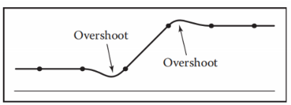
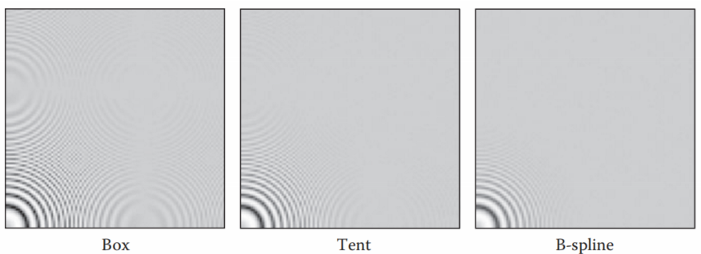

# Chapter9 Signal Processing 信号处理

- [Chapter9 Signal Processing 信号处理](#chapter9-signal-processing-信号处理)
  - [9.1 数字音频: 一维采样](#91-数字音频-一维采样)
  - [9.2 卷积](#92-卷积)
  - [9.3 卷积滤波器们](#93-卷积滤波器们)
  - [9.4 对图像的信号处理](#94-对图像的信号处理)
  - [9.5 采样理论](#95-采样理论)

## 9.1 数字音频: 一维采样

最简单的采样例子就是例如对数字音频进行的一维采样。例如下图里面，我们先让模拟音频进入低通滤波器中筛去高频信息防止采样的时候发生走样，然后通过模拟数字转换器ADC对音频进行采样，得到一串离散的数字音频信号保存起来，当需要还原为用于播放的模拟信号时，将数字信号输入数字模拟转换器DAC中，重建出来的模拟信号经过低通滤波器去除重建阶段的走样后输出

  

在这个阶段中，ADC的采样频率是影响重建结果的关键，过低的采样频率可能会导致重建的时候产生完全错误的结果，如下图中原本周期较短的正弦波由于采样频率过低重建结果(下图虚线)发生了很大变化，这关系到9.5中会提到的采样理论。在这里由于采样频率与原始信号的频率不匹配所产生的错误就被称为走样，无论是一维信号还是二维三维等。而在走样中，对于二维信号来说最常见的走样就是摩尔纹问题，也就是当采样频率与图像本身的规则波纹频率接近时，产生的不规则波纹走样

  

## 9.2 卷积

那么在讨论如何对二维图像进行采样前，这里先介绍什么是卷积。卷积在如今的神经网络中已经是非常常用的特征提取方法了。卷积是一种简单的数学操作，在信号处理中在采样，滤波，重建等多个步骤中都存在。很多时候我们说到卷积就会觉得这是一个作用在二维信号上的方法，但很显然卷积也可以对一维信号使用

卷积的核心就是一个接受多个输入，将输入组合起来然后得到一个输出的运算，类似函数的运算。卷积的数学符号是一个类似乘号的星号，如果说A和B卷积，那么写为A★B。卷积不止可以用于连续函数，也可以用在离散序列中，可以在一维也可以在更高维，是一种很自由的运算

**移动平均滤波器**

对于卷积最简单的一个理解就是卷积可以作为移动平均值的计算工具，也就是将一个小范围中的所有值逐个应用决定好的权值然后相加到一起输出，接着移动这个卷积到下个位置继续进行操作。这里如果所有权值都是元素数量的倒数的话，这个卷积就成了移动平均值的算法，可以作为信号的平滑化工具使用，如下图

  

将移动平均滤波器应用在离散数据的一个元素i上时写为公式如下：

  

写为连续函数如下，由于信号处理经常在离散情况下处理信号，因此这个比较少用：

  

**盒式滤波器**

卷积这个运算之所以重要就是因为我们将其用来表示滤波效果，上面的移动平均值就是一种滤波器，将波形用其局部的平均替代使其平滑化。还有其他很多很重要的滤波器，例如盒式滤波器box filter，这个滤波器因为其权值绘制出来像个盒子因而得名，它的效果是将信号变化的部分进行平滑化，运算如下图，通常来说盒式滤波器的权值之和为1以保证滤波前后整体的信号强度不会改变

  

**卷积的属性**

卷积在离散状态下运用起来要依据下面的公式：

  

介绍完简单的卷积，我们需要知道卷积操作有下面三个非常重要的数学属性：交换性，结合性，分配性。利用这三个基本的属性可以让一些复杂的连续卷积运算得到简化，最常见的就是让卷积在应用到目标上前先进行相互运算来简化。想要记住这些属性非常容易，因为卷积的属性与乘法一致，后面也有相互转换的方法

  

类似乘法，我们有时候用1来对复杂的乘法进行提取简化，卷积也有类似的操作就是离散卷积中的单位滤波器，其特点就是在0处的权值是1，其他权值都是0，因此可以作为一个不会改变数据的滤波器使用。一般情况下单位滤波器用d表示

**移动求和滤波器**

离散卷积也可以看作是一个移位求和滤波器，这里的想法会比较绕。如果我们把卷积的移动反过来看待，认为序列值才是权值，卷积是被处理的值，然后让整个卷积滤波器与序列的单个值相乘，然后得到的滤波器的值加到结果上，再移动一步滤波器，继续重复这一步。写出来也就是下面的式子，这里可以看到序列a成为了按下标获取的权值，滤波器不断移动加到结果上，成为被加权的目标

  

移动求和滤波器的想法得到的结果和前面移动平均想法的效果是一样的，画成图是下面的效果，中间重叠的曲线就是那一部分由于移动而产生的滤波器的值，中间重叠的曲线相加得到下面的滤波结果

  

**对连续函数进行卷积**

对连续函数进行卷积本质上和对离散值卷积是一样的，只是求和步骤变为了定积分。同样的对连续函数的卷积也可以有移动平均和移动求和滤波两种理解方法。式子如下：

  

  

连续函数的卷积也有盒式滤波器之类的滤波器，而如果我们将两个盒式滤波器相互错开地进行卷积，我们可以得到一定范围内为1-|x|的新的一种非常常用的滤波器，由于图像形似帐篷，称为帐篷式滤波器。下图就是两个盒式滤波器相互卷积得到帐篷滤波器的过程

  

**狄拉克delta函数**

狄拉克delta函数，英文一般写为Diracδ，有时候我们称其为狄拉克脉冲Dirac impulse，函数写为δ(x)，是信号处理中非常常用的一种泛函，也是一种单位函数，其是一个在0处函数极限窄的区域，除0以外所有区域的函数值都是0，函数整体积分为1，0处没有确定值但可以认为是正无穷。之所以要定义这个函数是为了代替前面说到的离散卷积里的单位滤波器，这个函数应用于连续函数卷积中

正因如此，如下式，任何函数与狄拉克delta函数卷积会得到原函数

**离散-连续卷积**

我们需要将离散空间和连续空间联系起来，最常见的就是模数转换器ADC和数模转换器DAC，也就是将连续函数变为离散值的采样操作，和将离散值还原为连续函数的重建操作。连续函数变为离散值很好理解，本质上就是按照一定固定间隔输出函数值，例如使用后面会提到的狄拉克筛。而离散值要变为函数值需要使用另一个形式的卷积，也就是离散-连续卷积，其特点是每个卷积后的函数值都是由目标点与相近的离散点的卷积用滤波器函数插值得到的，通常公式如下，如果可知滤波器半径的话可以只在半径中求和：

  

相类似的也有移动求和理解下的版本：

  

**高于一维的卷积**

高于一维的卷积其实就是一维卷积的推广，只不过现在求和是在高维空间中求和，定积分也变为了多重积分。在平时最常见的还是二维中的卷积，两种公式如下图：

  

## 9.3 卷积滤波器们

前面简单介绍了几种滤波器，这节比较详细地介绍了几种常用的卷积滤波器。在这之前，先要说明每个滤波器都有其自己的自然半径，也就是用来区分出一个处理单元大小的尺寸。但是这个半径很多时候只是约定俗成而已，且有时候需要进行缩放调整半径。当我们需要调整一个滤波器的尺寸时，可以对半径进行缩放或对输出幅度进行缩放，下面的公式将滤波器的半径r缩放为了sr

  

**盒式滤波器**

盒式滤波器的公式如下，图形之前已经介绍过了。这里要注意连续函数型的盒式滤波器区间的两端只有一端是闭合的，这是为了保证两个点在滤波器边界时不会被相同处理而保持稳定。这里的自然半径r=1/2

  

  

**帐篷滤波器**

帐篷滤波器往后都是连续的滤波器，因此我们不需要区分连续版本和离散版本的定义了，离散版本对着连续版本离散取值即可。这里的自然半径r=1，公式如下：

  

**高斯滤波器**

高斯滤波器的特点是用它来重建可以得到很平滑的结果，或者也是个很平滑的采样滤波器。其公式和正态函数一样，且是个没有边界的滤波器，使用的时候我们一般认为r=1或r=3是其裁剪半径

  

  

**三次B样条滤波器**

英文是B-Spline Cubic，这个滤波器的公式比较复杂，源于样条曲线的混合函数(样条曲线15章会提到)。这个滤波器的特点是拥有连续的一阶导和二阶导，因此滤波时能保留函数更多的性质。这个滤波器更好的记忆方法是记得它其实是四个盒式滤波器的连续卷积

  

 

**三次Catmull-Rom滤波器**

这个滤波器也与样条曲线有关，但是它的特点是滤波器包含了一些负值，存在-2，-1，1，2四个零点，因此重构的时候会插值样本

  

**三次Mitchell-Netravali滤波器**

这个滤波器是前两个三次滤波器的加权和，很多时候这是最合适的三次滤波器

  

  

**滤波器的性质**

上面那么多种滤波器各自有需要考虑和取舍的性质：

1. 脉冲响应。这是对滤波器函数的另一种称呼，描述了对单个脉冲输入能否做出相应
2. 插值性。有插值性的滤波器除了对没有离散点的部分能进行合理的插值，在离散点正对着的位置还要能恰好保持住原先的离散函数值
3. 过冲/振铃。有负值的滤波器会产生这种现象，当函数值急剧改变时会在转折处产生过冲，或者称为振铃。效果如下图：
4.   
5. 无波性。无波性的滤波器对于常数输入会得到常数输出，很多带有插值的滤波器会在常数输入出插值出现抖动波纹。如下图，着重观察不同滤波器下，图片的输入序列是否保持水平。对于波纹有一种简单的处理方法就是按照更下面的公式对卷积后的函数除去权值
6.   
7.   
8. 连续度。这描述了滤波器处处有定义的最高阶导数的阶级，这关系导重构的时候继承滤波器的连续性如何

**可分滤波器**

很多时候我们需要用二维滤波器来对二维信号进行卷积处理，但是二维滤波的性能代价是很大的。但是假如这个二维滤波器的两维互不相关，我们就可以将其拆为两个滤波器相乘如下式：

  

将其拆为两个滤波器，我们可以用下面的式子来优化二维卷积。对于二维某点处的卷积，我们原先需要全部点逐点处理一次，但是经过优化我们可以先预处理求出图片所有的S[i`]，然后求卷积时只要求外面的卷积再乘上去就好了。当只卷积一个像素区域时这个优化好像没有什么意义，但是当我们需要卷积一大块连续区域时，这些预处理的数据可以被重复利用从而减少了乘法的次数，复杂度上来说直接从O(n^2)变为了O(n)，是非常大的改进

  

  

## 9.4 对图像的信号处理

我们图形学中最常用的还是对二维图形的处理，又由于数字图像都是离散数据组成，因此所讨论的都是二维离散卷积滤波器

**离散滤波器的图像处理**

我们可以用不同的滤波器对图像进行卷积处理来使图像产生不同的效果。以模糊效果为例，我们常用的滤波器有以下几个：

1. 盒式滤波器。就是简单地用周围的点的平均值来模糊，计算简单，效果勉强
2. 线性滤波器。用斜向上的点的值来模糊，能产生朝一个方向动态模糊一样的效果
3. 高斯滤波器。效果很好的非线性滤波器，模糊效果很自然

其各自的效果可以从下图明显看出

  

而锐化效果常使用的是负模糊和原图像叠加的滤波器，如下公式中，锐化滤波器的特点是先对原图像进行模糊，然后让原图像减去模糊图像，这样操作后高频细节会被提取出来，这个过程中只要对原图像和模糊图像进行加权就能达到保留原图像亮度的情况下强化高频细节

  

  

还有一种常用来在物体下方模拟出阴影效果的滤波器，其如下图是模糊滤波器和移动滤波器的组合，移动滤波器可以将目标的每个像素都移动同样方向距离到想要的位置

  

  

  

**图像采样中的反走样**

在对图像信号进行采样的时候，如开头所说总会出现很多走样，最常见的两种走样就是锯齿和摩尔纹，这两种走样本质上都是由于采样频率低于其信号特征频率导致的。由于这个特征，我们知道走样总是发生在高频细节处，因此最简单的反走样方法就是使用一些低通滤波器将高频细节滤去，这个操作虽然可以有较好的效果但是会导致图像整体产生模糊，因此反走样滤波器的选择需要谨慎的取舍。下图是常用的三种滤波器，可以看到摩尔纹渐渐减少，但是相应的图像细节也在减少

  

**重建与重采样**

所谓重采样也就是对采样后的数据再进行一个采样，改变采样频率从而达到对信号的缩放效果。重采样分为上采样和下采样两种，上采样将信号放大，下采样将信号缩小

对于下采样，有一种简单的方法就是将下采样看作删除元素的过程，选择网格中对应位置最近的元素保留，然后删除重复而距离远的元素。这种方法操作很快但是效果很差，适合作为简单的缩放预览

对于重采样，更实用的方法还是运用一个重建滤波器按照9.2中的方法将离散数据重建为连续函数形式，然后再按照新的间隔进行采样，如下图：

  

那么很明显我们能想到，重建滤波器和重采样滤波器的选择是这个过程中最关键的一环。滤波器最关键的属性就是其形状和尺寸(半径)，对于采样来说，我们希望滤波器了足够大这样可以收集更多的信息并减少出现的失真，而对于重构来说，我们希望滤波器足够平滑来减少重构失真和减少重构波纹的产生。而对于滤波器的尺寸，一般来说当输出比输入粗糙时，我们用较大的滤波器，当输出比输入精细时，我们用较小的滤波器进行采样。通常来说，盒式滤波器用在最粗糙的输出上，帐篷式滤波器中等，三次滤波器用在高清晰度的重构上

由于很多滤波器都是可分滤波器，因此我们可以按照不同轴的顺序对目标进行滤波处理

## 9.5 采样理论

采样理论这一节与数学知识相关较多，主要是傅里叶变换相关的内容，这部分比较复杂这里只简单记录一下，掌握得好的话可以对前面的概念更加理解，但是掌握不好单单是使用前面的工具也未尝不可

**傅里叶变换**

傅里叶变换作为信号处理中最重要的公式，其核心思想是将原本由空域表示的函数转换为由频域来表示。所谓空域表示就是我们平时使用的函数形式，x轴是函数的自变量，可能是空间坐标可能是时间参数之类，y轴是函数的函数值。傅里叶变换可以将任意形状的函数转换为多个不同频率和振幅的正弦的组合，而我们可以将大量正弦曲线按照其频率不同排列起来，x轴表示其频率，y轴表示其振幅，这样我们就可以用傅里叶变换将空域函数转换为了对应的频域空间表示。这个过程表现出来就是下图的样子，如果我们使用越多的正弦曲线来组合就可以得到更接近真实函数的图形

  

而傅里叶变换是由下面的两个式子实现的，其中第一个式子将空域中的函数转为频域中的函数，称为傅里叶正变换FT，第二个式子将频域中的函数转换回空域中的函数，称为傅里叶逆变换IFT。这里可以看到其实正变换和逆变换的式子除了指数项的正负外完全相同，实际上这两个变换可以被视作相同的变换。变换后的频域函数我们也称其为傅里叶频谱，函数的参数就是频率，函数值则是对应频率下的正弦函数的振幅。这里要提到一点，尽管数学上这个变换还有更多信息，但是在信号处理中我们不关系这个正弦函数的相位，也不关心这个变换在复数域中的情况，高等数学课上还有介绍到正弦级数等内容，在这里也不用在意

  

  

傅里叶变换有几个值得重视的性质，对计算很有帮助：

1. 我们通常将傅里叶变换简单写为F(f)，逆变换写为F^-1(f)，这里的F一般是花体的
2. 函数和其对应的傅里叶变换后的频谱函数有相同的平方积分值，这说明了变换并不改变函数的能量
3. 因上一点，函数强度放大a倍，频域中振幅也放大a倍，即F(af)=aF(f)
4. 函数的时域拉伸a倍，则频域变为1/a，即f(ax)=1/a*F(f)(x/a)，这里进行了缩放让两边能量相等。这个性质让我们可以用一个典型傅里叶经过缩放得到别的函数
5. f的平均值就是F(f)(0)的值，因为F(f)(0)就是信号的零频率部分
6. 如果f是实函数，那么F(f)必定是偶函数

**卷积与傅里叶变换**

在9.2一开始的时候我说到卷积的性质和乘法很像，而且可以相互转换，这个转换的方法就是傅里叶变换。空域函数的卷积经过傅里叶变换后会变为频谱的乘法，而频谱的卷积又相当于空域函数的乘法。这个完整的转换过程记住下面的关系图即可，尤其是记住下图的右半边部分

  

**几种常见滤波器的傅里叶变换**

一些我们前面提到过的简单的卷积滤波器都可以经过傅里叶变换变为正弦函数的变式如下，这里要注意sinc是sinc(x)=sinx/x函数

盒式函数：

  

帐篷式函数：

  

B样条函数：

  

高斯函数：

  

**采样理论中的狄拉克脉冲**

在9.2中我们提到了狄拉克delta脉冲函数，狄拉克脉冲在采样中常常以狄拉克筛Dirac comb的状态出现，也就是每隔一定固定间隔就发生一次的狄拉克脉冲，也称为脉冲链/脉冲序列。让函数与脉冲链卷积可以得到对应对函数采样的结果。相应的我们也可以对脉冲链进行傅里叶变换，当周期为1时，脉冲链变换后还是一样的脉冲链，但当周期不同时，我们需要按照之前的傅里叶缩放特性进行缩放，效果如下图：

  

**采样与走样**

传统上我们采样一个函数时，先对目标函数进行傅里叶变换，变为频谱后我们选择适当的脉冲周期，用脉冲链进行离散化，当需要使用时，我们将离散化的频谱重建为连续函数，再逆傅里叶变换回到想要的状态。这个过程表现出来就是下面的图

  

在上面这个过程中，经过这一节的学习我们就可以理解之前采样时的一些概念的由来了，为什么我们说采样频率非常重要，因为采样频率也就是脉冲周期的倒数。频率越高，上图得到的离散点就越密集，且由于狄拉克脉冲缩放时的倒数特性，经过傅里叶变换后的频谱就会收窄。然后当我们对原函数进行了脉冲链卷积后，我们可以看到频谱在中间部分显然还是原先的正确的频谱，但是两侧却开始以采样频率为间隔出现了看起来重复的频谱，这些重复频谱实际上就是因为脉冲链每隔一个距离就对目标进行了一次卷积得到原函数的傅里叶变换结果

在这里中间的频谱我们称为基频谱，两端的重复频谱称为走样谱，这里我们就会想到一件事，如果走样谱和基频谱重叠会怎么样呢？这就是常常发生在两个脉冲中间的走样了。两个频谱的边缘被叠加在一起，直觉上来说就是因为采样频率没有原函数的频谱那么高而导致高频信息之间互相叠加干扰，重叠的高频信息被错认为是另一个脉冲的低频信息，从而产生了走样，这正是我们优化的关键

走样产生的核心是两个脉冲之间的高频干扰部分，那么减少走样的方法就有两条路可以走。一种是增加采样频率，让傅里叶变换后基谱与走样谱之间的距离增大，从而让更多的高频信号能被保留下来而不会重叠混合。这里需要提到一个关键的公式，在计算机网络课程中我们会遇到的奈奎斯特-香农采样定理：一个信号如果想要保证采样后可以正确重建，需要保证采样频率不低于两倍真实波形频率，这个最低频率被称为奈奎斯特极限。现实中我们遇到的信号不会那么纯净，但是这个公式可以帮助我们计算需要保留细节时所需的最低采样频率。采样频率的改变对频谱的影响从下图可以看到：

  

另一种方法是对信号进行低通滤波，将高频信号消去。这种方法需要在信号处理的时候用低通滤波器进行处理，不同的滤波器有不同的特性，频谱越宽的滤波器平滑效果越强。尽管这种方法能有效消除走样，但是无法保留足够的高频细节是其缺陷。低通滤波器频谱大小变换对信号的影响如下图：

  

选择好的采样滤波器后，还要选择合适的重构滤波器。重构滤波器的工作是可以和采样滤波器合并的，因为其工作一个就是和采样的低通滤波器一样削弱走样的影响，另一个就是将其他倍频处的走样谱都消除，同时尽量不要影响基频谱。在一开始的采样流程中所使用的重构滤波器就是盒式滤波器，盒式滤波器满足一个重构滤波器的特性，既减少了走样又消去了倍频处的信号。但是盒式滤波器仍然留下了太多的走样，我们很多时候并不使用它，而是使用帐篷滤波器或B样条滤波器来控制走样和提取基频谱。这三种重构滤波器的对比在下图，重点是观察各自在保留高频细节和抑制走样上的取舍：

  

**理想滤波器与实用滤波器**

和我们直觉相反，盒式滤波器才是采样和重构的理想滤波器，因为它最大程度地保留了高频信息，频域表现是最好的，也满足采样和重构的要求。但是很显然我们很少用到盒式滤波器因为它太过粗暴，保留下来的高频很多时候都是剩余的走样信号。在大多数时候我们还是使用高斯滤波器来作为实用的滤波器，而如果信号不算复杂的话使用帐篷滤波器也是一种好选择
