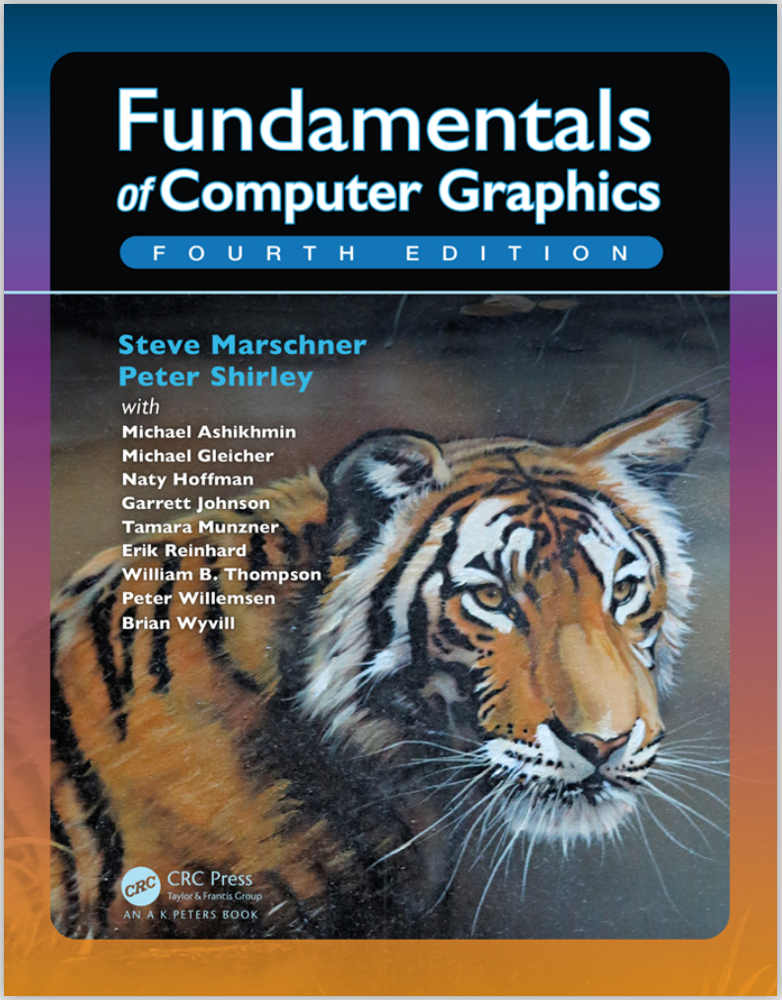

# 《Fundamentals of Computer Graphics, Fourth Edition》笔记

  

著名的图形学虎书英文版第四版，笔记还在更新中。

# 目录：

（以下是已上传的部分，前面章节很多在公众号中还没进行搬运）

- [Chapter12 Data Structures for Graphics 图形学数据结构(未完工)](./Chapter12%20Data%20Structures%20for%20Graphics%20图形学中的数据结构/README.md)

- [Chapter13 More Ray Tracing 光线追踪扩展](./Chapter13%20More%20Ray%20Tracing%20光线追踪扩展/README.md)