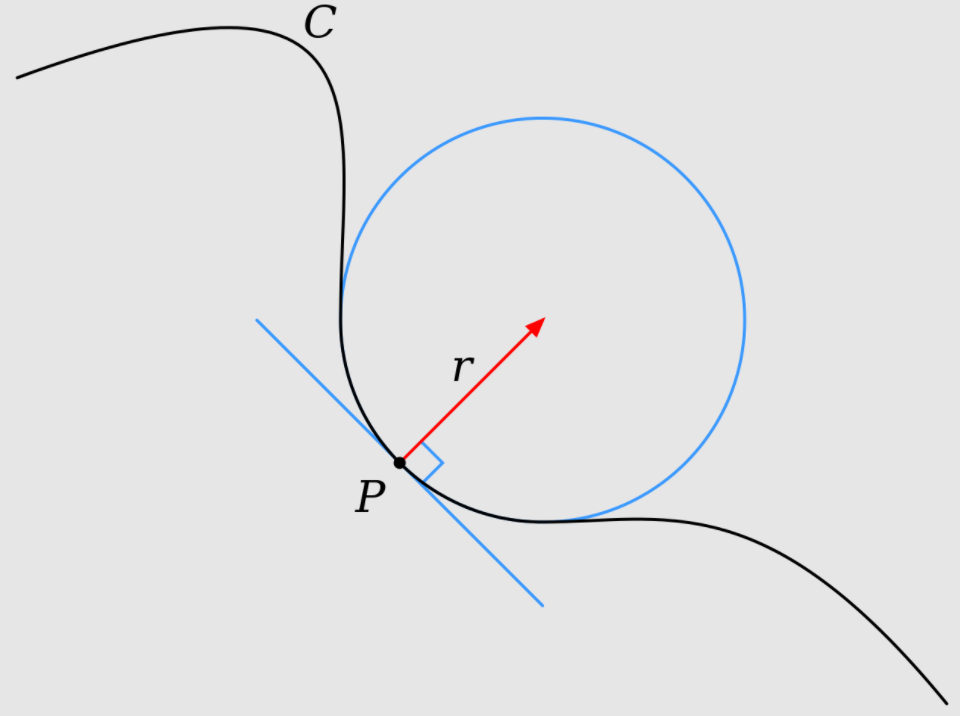
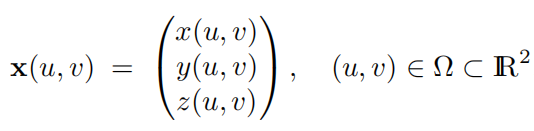

# Chapter3 Differential Geometry 微分几何

本章是对几何处理中需要用到的微分几何数学知识的介绍, 由于微分几何中大量问题都需要这些数学工具来处理, 因此一定要看熟并理解如何将这些工具实现为代码. 几何处理有些时候会用到微分几何等比较深入的数学知识, 但是常常只是取其中一小部分去应用, 因此面对一个不认识的概念时, 只要能做到简单理解即可, 不要过于深究, 舍本逐末.

- [Chapter3 Differential Geometry 微分几何](#chapter3-differential-geometry-微分几何)
  - [3.1 曲线](#31-曲线)
    - [3.1.1 弧长](#311-弧长)
    - [3.1.2 曲率](#312-曲率)
  - [3.2 曲面](#32-曲面)
    - [3.2.1 曲面的参数表示](#321-曲面的参数表示)
  - [3.3 离散曲面与算子](#33-离散曲面与算子)
  - [3.4 总结与拓展](#34-总结与拓展)

## 3.1 曲线

曲线在几何处理中常常以参数曲线的形式表示, 如参数曲线$x(u)=(x(u),y(u))^T$. 因此我们能轻松地对曲线进行相关性质的计算, 其切向量就是对曲线各个分量按照参数求一阶导, 如$x'(u)=(x'(u), x'(v))^T$; 而其法向量自然是与切向量垂直的那个, 在二维中单位化后表示为$n(u)=x'(u)^\perp /||x'(u)^\perp||$, 其中倒T字表示将向量旋转90度.

但参数曲线依赖于参数化映射函数表示, 不同的参数化也能表示出相同的曲线. 微分几何关注于那些可以独立于参数化方法存在的属性, 典型的就是弧长和曲率.

### 3.1.1 弧长

弧长是曲线最基础的属性, 也就是我们常说的长度. 在微分几何中, 我们同样从微分的思想来表示弧长, 其微分量就是导向量, 这个时候我们将导向量成为曲线的度量(metric). 而假如我们如下面的式子利用导向量对曲线进行参数化, 此时称为弧长参数化, 曲线的参数变量就是曲线的弧长, 这使得曲线的表示可以独立于具体的参数. 这样的参数化可以在变形中拥有保持弧长的良好性质, 且无论参数如何改变, 整条曲线在弧长参数域上的积分都是相同的. 第五章会提到这种参数化无法简单推广到曲面上.

$$
s=s(u)=\int^u_a||x'(t)||dt
$$

### 3.1.2 曲率

一阶导是曲线点处的弧长微分量, 是切向量, 是曲线值的微分变化, 曲线的二阶导则以下式称为曲率, 表示切向量的转动率, 描述曲线偏离切向直线的速率.

$$
\kappa(s):=||x''(s)||
$$

从上面可以看到曲率大小与曲线二阶导有关, 可以将这个二阶导写为二阶导向量如下, 我们就可以看到它与法线的关系:

$$
x''(s)=\kappa(s)n(s)
$$

因此和弧长不同, 曲率是有符号的数, 当曲线的法线发生反向时曲率的符号也会改变. 我们可以计算出曲线的密切圆使得曲率的大小还等于曲线密切圆的半径的导数, 与圆相切. 密切圆是微分几何中的一个概念, 圆在于曲线的切点处无限接近, 在那一点上圆的曲率与曲线曲率相同. 密切圆中心称曲率中心, 半径称曲率半径.

  

## 3.2 曲面

### 3.2.1 曲面的参数表示

和曲线类似, 曲面也可利用参数化方法得到自己的参数表示, 如下:

  

最常用的曲面参数化方法是球面参数化

## 3.3 离散曲面与算子

## 3.4 总结与拓展