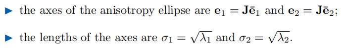

# Chapter3 Differential Geometry 微分几何

本章是对几何处理中需要用到的微分几何数学知识的介绍, 由于微分几何中大量问题都需要这些数学工具来处理, 因此一定要看熟并理解如何将这些工具实现为代码. 几何处理有些时候会用到微分几何等比较深入的数学知识, 但是常常只是取其中一小部分去应用, 因此面对一个不认识的概念时, 只要能做到简单理解即可, 不要过于深究, 舍本逐末.

- [Chapter3 Differential Geometry 微分几何](#chapter3-differential-geometry-微分几何)
  - [3.1 Curves 曲线](#31-curves-曲线)
    - [3.1.1 Arc Length 弧长](#311-arc-length-弧长)
    - [3.1.2 Curvature 曲率](#312-curvature-曲率)
  - [3.2  Surfaces 曲面](#32--surfaces-曲面)
    - [3.2.1  Parametric Representation of Surfaces 曲面的参数表示](#321--parametric-representation-of-surfaces-曲面的参数表示)
    - [3.2.2  Metric Properties 度量性质](#322--metric-properties-度量性质)
    - [3.2.3  Surface Curvature 曲面曲率](#323--surface-curvature-曲面曲率)
  - [3.3 Discrete Differential Operators 离散微分算子](#33-discrete-differential-operators-离散微分算子)
    - [3.3.1 Local Averaging Region 局部平均域](#331-local-averaging-region-局部平均域)
    - [3.3.2 Normal Vectors 法向量](#332-normal-vectors-法向量)
  - [3.4 总结与拓展](#34-总结与拓展)

## 3.1 Curves 曲线

曲线在几何处理中常常以参数曲线的形式表示, 如参数曲线$x(u)=(x(u),y(u))^T$. 因此我们能轻松地对曲线进行相关性质的计算, 其切向量就是对曲线各个分量按照参数求一阶导, 如$x'(u)=(x'(u), x'(v))^T$; 而其法向量自然是与切向量垂直的那个, 在二维中单位化后表示为$n(u)=x'(u)^\perp /||x'(u)^\perp||$, 其中倒T字表示将向量旋转90度.

但参数曲线依赖于参数化映射函数表示, 不同的参数化也能表示出相同的曲线. 微分几何关注于那些可以独立于参数化方法存在的属性, 典型的就是弧长和曲率.

### 3.1.1 Arc Length 弧长

弧长是曲线最基础的属性, 也就是我们常说的长度. 在微分几何中, 我们同样从微分的思想来表示弧长, 其微分量就是导向量, 这个时候我们将导向量成为曲线的度量(metric). 而假如我们如下面的式子利用导向量对曲线进行参数化, 此时称为弧长参数化, 曲线的参数变量就是曲线的弧长, 这使得曲线的表示可以独立于具体的参数. 这样的参数化可以在变形中拥有保持弧长的良好性质, 且无论参数如何改变, 整条曲线在弧长参数域上的积分都是相同的. 第五章会提到这种参数化无法简单推广到曲面上.

### 3.1.2 Curvature 曲率

一阶导是曲线点处的弧长微分量, 是切向量, 是曲线值的微分变化, 曲线的二阶导则以下式称为曲率, 表示切向量的转动率, 描述曲线偏离切向直线的速率.

  

从上面可以看到曲率大小与曲线二阶导有关, 可以将这个二阶导写为二阶导向量如下, 我们就可以看到它与法线的关系:

$$
x''(s)=\kappa(s)n(s)
$$

因此和弧长不同, 曲率是有符号的数, 当曲线的法线发生反向时曲率的符号也会改变. 我们可以计算出曲线的密切圆使得曲率的大小还等于曲线密切圆的半径的导数, 与圆相切. 密切圆是微分几何中的一个概念, 圆在于曲线的切点处无限接近, 在那一点上圆的曲率与曲线曲率相同. 密切圆中心称曲率中心, 半径称曲率半径.

  

## 3.2  Surfaces 曲面

### 3.2.1  Parametric Representation of Surfaces 曲面的参数表示

和曲线类似, 曲面的参数表示如下:

  

比较常用的曲面参数化方法是球面参数化, 也就是曲面映射到球坐标系上, 得到的球坐标系上的两个角度就是二维的参数. 当固定一个角度不变时会在表面映射出经纬线, 通过观察经纬线在模型表面的变形情况可以知道当前模型是否适合球面映射.

  

### 3.2.2  Metric Properties 度量性质

类似的曲线弧长, 参数曲面上也会有对应的度量, 通过求对应参数的一阶导数决定.

  

也类似的, 参数面上的切向量可以导出曲面上的等参数曲线, 曲线是固定一个参数改变另一个参数得到. 若将两个切向相加, 可以得到方向导数, 在方向导数上移动可以得到另一个曲线Cw.

  

曲面上的法线则是由上面两个方向的切向量叉乘然后单位化得到.

  

为了方便计算方向导数, 提出了雅各比(Jacobian)矩阵J, 其通过求偏导的方法能够快速将向量转为方向导数形式, 表达式如下:

  

类似曲线上计算弧长, 参数曲面的切向量通过下面的公式可以计算出微分弧长, 是平方形式的.

  

微分几何中通过第一基本型(First fundamental form)来方便定义三维曲线长度和曲面的面积, 核心是在切空间中定义了内积:

  

通过上式的一系列微分, 我们可以得到第一基本型的系数EFG, 然后我们来利用上面的微分弧长可以积分得到三维曲线的弧长, 二按照第一基本型将式子拆开则系数配合参数能让计算更加方便.

  

进一步还能很方便地计算曲面面积.

  

借助第一基本型, 我们可以计算出曲面表面的各向异性椭圆, 这是用于作为曲面邻域计算的. 如下图, 利用第一基本型的矩阵, 我们可以计算出其特征向量$\bar{e_1} ,\quad \bar{e_2}$; 和对应的特征值$\lambda_1, \quad \lambda_2$. 然后对于参数域上一点, 这两个特征向量就指出了参数域上的小圆.

  

计算出特征向量和特征值后, 利用雅可比矩阵, 参数域上的小圆又可以被转换回到三维曲面域上, 转换方法如下, 此时得到的椭圆称为各向异性椭圆:

  

### 3.2.3  Surface Curvature 曲面曲率

类似曲线可以计算曲率, 曲面自然也可以计算曲率, 其定义是由曲线的曲率的定义扩充而来的. 为了方便曲面曲率的计算, 微分几何引入了第二基本型(second fundamental form)如下:

  

## 3.3 Discrete Differential Operators 离散微分算子

### 3.3.1 Local Averaging Region 局部平均域

### 3.3.2 Normal Vectors 法向量

## 3.4 总结与拓展