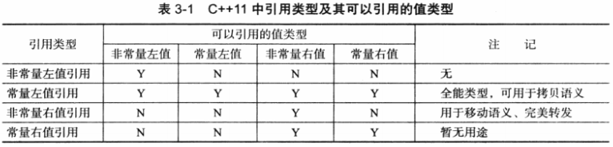

# 0 绪

本篇是看完《深入理解C++11：C++11新特性解析与应用》后做的笔记的上半部分. 这本书可以看作是《C++Primer》的进阶版, 主要是更加详细地介绍了C++11的一些常用设计和标准库设施, 很多知识点都在面试中会遇到, 值得一读.

阅读并笔记的途中我跳过了一些之前已经总结过的内容, 而对于一些自己看书后依然没搞清楚的内容(例如SFINAE和内存模型)搜索资料进行了扩展, 参考文献在每一段的开头给出. 全文 字, 慢慢来吧.

# 1 新标准的诞生

1. C++11的目的是成为更适合系统开发的语言, 成为更易入门的语言, 且保留稳定性和兼容性. 理解这个初衷就能理解C++11很多新内容的设计缘由
2. 核心改进点:
   1. 并行编程: 内存模型, 线程, 原子操作
   2. 泛型编程: 统一初始化表达式, auto, decltype, move
   3. 系统编程: constexpr, POD
   4. 库编程: 内联命名空间, 继承构造, 右值引用
3. C++11标准的设计准则:
   1. 在稳定性和兼容性之间抉择: auto, using, nullptr
   2. 用库而非扩展语言语法来实现特性: std::regex, 库尽量以头文件实现, 但也有并行库这种必须深入编译器的库
   3. 用通用而非特殊的手段来实现特性: 显式类型转换
   4. 让特性对专家和新手都适用: 统一初始化表达式
   5. 增强类型安全: enum class
   6. 与硬件紧密合作, 但保持透明: 并行库
   7. 开发改变思维方式的新特性: lambda
   8. 融入编程现实: 引入少数的几个通用属性
   
# 2 保证稳定性和兼容性

> 预定义宏 https://docs.microsoft.com/zh-cn/cpp/preprocessor/predefined-macros?view=msvc-170

## 预处理器

1. `__func__` 所在处的函数名称, 可以用在初始化成员列表中
2. `__DATE__` 编译日期
3. `__FILE__` 当前文件的名称
4. `__LINE__` 所在处的行号
5. `__TIME__` 编译时间
6. `_Pragma()` 和`#pragma`一样, 用来指示编译器进行一些行为, 不过前者属于操作符因此可以用在宏中调用
7. `__VA__ARGS__` 变长宏参数, 用于替换掉宏函数中省略号代表的字符串
8. `__cplusplus` 返回cpp版本, C语言则无定义, 用于混合编译

## 新编译特性

1.  `<cassert>` 中提供`assert()`宏, 用于运行时断言; `static_assert()`用于编译期断言, 接受表达式和提示信息两个参数
2.  由于`static_assert()`是静态的, 能在任何命名空间中使用, 因此最好写在外部作为提示并防止用到局部变量
3.  `noexcept` 和 `noexcept()`指明某函数不能抛出异常(若抛出则直接terminate), 参数可以用bool值来决定是否允许抛出, ture就不允许. 此举是为了节省抛出异常的额外开销. C++11的delete操作和析构函数默认是noexcept的
4.  窄字符串`char`和宽字符串`wchar_t`连接的时侯会统一位宽字符串然后连接
5.  `long long` 至少64位的长整型, 字面值以LL结尾
6.  C++11放松了就地初始化(类内直接赋值)的使用限制并引入了构造函数后面的初始化列表设置. 初始化列表的效果总是慢于就地初始化, 但也快过在构造函数中进行赋值
7.  注意: 非常量的静态变量依然要在头文件外定义从而保证在程序中只存在一个
8.  `sizeof()`可以对类成员表达式使用了
9.  类模板也可以声明友元了(`friend T;`)
10. 函数声明的尾部加上`final`可以阻止后续派生类的覆盖, 函数声明的尾部加上`override`可以强制派生类进行覆盖
11. 模板函数也可以有默认参数了, 且不一定要和模板类一样从右到左指定, 只要能够从实参被合理推导即可. 但是如要注意模板实际参数始终都以实际类型优先, double和int是这个特性的常见例子, 例如1, 如果默认参数是double就会被推导为double
12. C++11引入了extern模板. 原因和extern变量一样, 普通的模板只存在于对应文件的`.o`中, 如果一个模板文件被多个文件实例化就会产生多份重复代码, 没有extern的话此时重复的模板会冲突. 有了extern后编译器会自动删除重复的实例化模板, 不但节省内存还节省了多余的实例化时间
13. 注意被其他文件调用的外部模板一定要在要用到的类实例化之前实例化
14. 局部和匿名成员可以作为模板实参了, 但仍要注意匿名类型的声明不能在参数位置

# 3 通用为本, 专用为末

## 继承构造

1. 为了减少派生类层层透传函数以复用基类代码的情况, 可以在类内用`using Base::Func;`来获取基类被隐藏的同名成员函数(包括构造函数, 此时被称为继承构造函数)的访问, 从而在外部可以自动调用基类构造
2. C++11中继承构造函数和其他默认函数一样, 存在隐式声明的默认版本, 且如果不被使用就不会生成
3. 继承构造函数的默认参数不会被继承, 反而会生成多个不同声明的构造函数的产生, 所以当发生冲突的时侯应该显式声明构造函数来因此冲突的函数
4. 当派生类是虚继承了基类时, 不能使用继承构造函数
5. 一旦使用了继承构造函数(用`using Base::Base;`)暴露出来, 自身的默认构造函数就和之前的隐藏规则一样, 不会被自动生成
   
## 委派构造

1. 在初始化列表中可以调用构造函数了, 此时称为委派构造函数. 不但可以调用基类的构造函数, 也可以调用当前类的其他构造函数, 这样就能进一步减少重复代码
2. 但要注意委派构造不能和普通的初始化列表共用, 因为目标构造(初始化列表)总是先于委派构造被调用, 这会导致目标构造的参数无效. 如果使用委派构造, 就必须在构造函数体中进行其余成员的初始化
3. 一种解决方案是修改构造的顺序, 让参数最多的构造函数作为委派构造的最终目标, 然后在这个构造函数的初始化列表中完成成员初始化. 其他构造函数通过带有默认值的委派构造来调用这个目标构造函数
4. 千万小心环形委派, 会导致编译错误
5. 委派构造函数使得构造函数的模板编程也成为一种可能, 通过让模板构造函数成为委派构造函数, 我们可以很容易地接受多种不同类型的参数进行相同的底层初始化


## 右值引用

1. "右值"没有严谨的定义, 通常来说, 出现在等号右边的内容就是右值, 可以取地址, 有名字的就是左值
2. 不跟对象关联的字面值等称为纯右值, 其他右值称为将亡值
3. 右值引用是为了优化对临时对象进行深拷贝的效率
4. 右值引用形成的拷贝/赋值函数称为移动拷贝/赋值, 核心是直接窃走目标对象内部指针指向的内存内容, 然后置空目标对象的指针
5. 无论声明了左值引用还是右值引用, 都必须在声明时立即初始化(参数列和初始化列表也算立即初始化). 但注意右值引用不能被绑定到左值
6. 右值引用能够延长右值的声明周期, 常量左值引用属于万能引用, 也能够延迟生命周期, 但是常量左值引用后的值不能修改所以一般用来减少临时对象的开销而已
7. 当类没有定义移动构造时, 如果定义了常量左值引用构造也能正确执行, 只不过会变为拷贝形式
8. 常量右值引用存在但是没有实际用途
9.    
10. `std::move()`能强制使一个左值变为右值, 但是不会改变其生命周期
11. 右值引用本身是个左值, 因此需要配合`std::forward()`来完美转发(或者直接用`std::move()`)
12. 默认的移动构造函数和拷贝构造函数是一样的, 只是执行按位拷贝操作. 因此只要需要移动语义就一定要自己实现移动构造
13. 拷贝构造/赋值和移动构造/赋值两大类函数是同地位的, 只要声明了其中一种另一种就不会产生默认版本, 因此只要声明了一种就一定要手动编写其余函数
14. 移动构造时抛出异常是很危险的, 因此应该用noexcept修饰移动构造函数
15. move也有`std::move_if_noexcept`的版本, 其在当前函数没有noexcept时主动转换为左值应用从而调用拷贝构造版本. 但显然这种做法损失性能
16. 只要定义中出现了左值引用, 引用折叠规则就会将其变为左值引用, 这是`std::forward()`的核心原理
17. 编译器优化的时侯本身就打开了返回值优化功能, 因此返回右值并不是很必要的事

## 语法扩展

1. 函数前面加上`explict`可以防止参数发生隐式类型转换, 用于构造函数和operator中
2. 不要将explict与delete共用, 因为这相当于删去了显式转换版本的函数, 可能会留下默认的隐式转换的实现.
3. 大括号初始化会制止类型收窄
4. 大括号的返回值是`initializer_list`, 可以用作函数的一种重载参数
5. 大括号也可以在return, 一般用来构造临时变量, 具体构造出来的临时变量还是依靠声明的返回值决定
6. 新增`ReturnType operator "" X(Args)`作为后缀操作符, 其允许我们将字符串字面值加上自定义的后缀X来转换为目标字面类型
7. 但是对于这个操作符的编写有相关的参数限制:
   1. 字面值是整型: 参数只能是unsigned long long或const char*, 当unsigned long long无法容纳字面值时会自动转为字符串, 以`\0`结尾
   2. 字面值是浮点: 参数只能是long double或字符串
   3. 字面值是字符串, 参数是字符串和size_t标识处这个const char*的长度
   4. 字面值是字符, 参数只能是单个字符
8. 为了避免和内置的字面值后缀混淆, 后缀名最好以下划线开头

## Plain Old Data (POD)

1. 这是C++11引入的新概念(平凡旧类型), 这个概念本质上就是为了描述哪些类可以在内存层级上生成与C相同的结构体模型. 初看会很复杂的介绍在了解对象模型后就不混乱了. POD需要满足以下条件:
2. 平凡(Plain)限制:
   1. 与memset兼容的默认的构造和析构函数
   2. 与memcpy兼容的拷贝, 移动, 赋值, 移动赋值函数
   3. 不包含虚函数和虚基类
3. 标准布局(Old)限制:
   1. 所有非静态成员有相同的访问权限(为了保证成员摆放的顺序一致)
   2. 派生类有非静态成员时, 只有一个仅有静态成员的基类(为了保证基类能被直接折叠, 因为C没有继承关系)
   3. 基类有非静态成员时, 派生类没有非静态成员(为了派生类折叠, 因为C没有继承关系)
   4. 类中的第一个非静态成员类型要与基类不同(为了类指针能直接指向第一个成员)
   5. 没有虚函数和虚基类
   6. 所有非静态成员都满足POD布局(递归定义)
4. 之所以C++11引入POD的概念是为了保证我们可以安全地用memset和memcpy来对POD操作, 方便C/C++混编
5. 而且POD保证了静态初始化的安全有效, 可直接在内存级别赋0
6. 我们可以用标准库的`is_trivial<T>::value`来判断一个类是否Plain, 用`is_standard_layout<T>::value`判断一个类是否Old. 最终可以用`is_pod<T>::value`直接判断是否POD

## 非受限联合

1. C++11后, 任何非引用类型都可以成为union的成员(包括函数), 因此称为非受限联合
2. 不允许静态成员变量存在
3. union的一些默认函数将被删除, 例如当存在非POD成员且这个成员有非平凡的构造函数时, 这个union的默认构造将被删除
4. 匿名的union对外是开放的, 因此放在类的声明中可以按照构造函数的不同而初始化为不同的类型, 此时类被称为枚举式的类, 这个union被称为变长成员

## 内联名字空间

1. namespace嵌套namespace后, 调用内部内容可能很繁琐
2. 如果用using打开一些内层的空间又可能与模板编程冲突, 因为模板不允许不同名称空间的名字在模板中特化
3. C++11给namespace引入了inline关键字, 经过inline的名称会自动内联展开到上层, 从而破坏名称空间的封装
4. 因此建议还是尽量用打开空间的方法使用

## SFINEA规则

> SFINAE: Substitution Failure is not an Error | Top-Up C++ [C++ #02] https://www.youtube.com/watch?v=mNxAqLVIaW0
> 
> C++模板进阶指南：SFINAE https://zhuanlan.zhihu.com/p/21314708
> 
> Substitution Failure is not an Error https://en.wikipedia.org/wiki/Substitution_failure_is_not_an_error

1. SFINEA: Substitution failure is not an error, 替换失败不是错误
2. 这个词实在标准化地描述如何为函数模板进行合理的参数匹配. 在C++11的标准中提出SFINEA的动机是当年C++98中并没有对这个规则进行标准化的描述, 因此各个编译器对于函数模板的匹配规则都是混乱的, 因此新标准提出SFINEA来使程序员能按照自己的想象来理解编译器并令其能精确匹配我们所需要的函数.
3. 函数模板是根据我们的实参类型在调用时进行特化并实例化的, 具体来说匹配遵循以下步骤:
   1. 首先对于一次调用, 编译器查找所有具有此名称的函数和实例化的模板函数表
   2. 在这些函数中进行比较, 将不可行的函数剔除, 可行的保留并计算匹配的精确度, 选择最佳匹配的候选函数作为结果
   3. 如果存在两个相同匹配等级的参数列, 优先保留普通函数
   4. 完全找不到匹配的函数或者产生二义性时, 引发error
   5. 这个尝试进行参数替换的过程中编译器只发生failure, 不会引发error, 直到完成所有尝试
4. 基础来说, SFINEA使得模板实例化的过程在各个编译器上都能表现出一样的效果, 且避免在不相关模板可见时实例化出错误的程序. 下面是样例代码
```C++
// From: https://en.wikipedia.org/wiki/Substitution_failure_is_not_an_error
// 这段是在展现SFINEA下模板函数的匹配逻辑
struct Test {
  typedef int foo;
};

template <typename T>
void f(typename T::foo) {}  // f1 针对类的特化

template <typename T>
void f(T) {}  // f2 更加泛化的一种模板类型

int main() {
  // 调用f1和f2皆可, 参数列中f1版本参数有定义foo, Test更符合f1的参数, 因此实例化f1
  f<Test>(10); 
  // 只能调用f2, 因为在这个匹配过程中若把int替换到f1的参数列中, int没有定义foo, 失败
  // 由于SFINEA的原因int对f1的尝试不算做实例化的error, 而属于匹配过程中的一次failure 
  f<int>(10);
}
```
9. 基于对这个匹配过程的标准化描述, 我们可以无关编译器地对模板匹配的可行性进行判断(例如上面我们检测出Test才拥有foo定义), 一些人发现这种行为可以用来进行"编译时内省"(introspection, 例如RTTI), 也就是能在模板实例化途中检查出参数具有某些性质.
10. 如果在代码中看到了大量的`std::enable_if`, 那么要想到这是和SFINEA相关的模板编程特性. 下面是这类做法的一个简单样例
```C++
// From: https://en.wikipedia.org/wiki/Substitution_failure_is_not_an_error
// 这段在展示如何利用模板在编译器判断模板参数是否具有某个定义的符号
template <typename... Ts>
using void_t = void;

// 继承true_type和false_type是为了能用value返回结果
// f1, 无法满足T::foobar的参数列要求, 因此候选项只剩下这个泛化的版本
template <typename T, typename = void>
struct has_typedef_foobar : std::false_type {};

// f2, 进行了T::foobar这种典型的无意义偏特化, 仅用于筛选掉不匹配的参数
template <typename T>
struct has_typedef_foobar<T, void_t<typename T::foobar>> : std::true_type {};

struct foo {
  // typedef也行
  using foobar = float;
};

int main() {
  std::cout << std::boolalpha;
  // int匹配的时侯无法满足f2特化的参数列中的T::foobar要求, 因此无法实例化f2
  // 比较之下, int可以满足f1的要求, 因此实例化f1, 从而继承了false_type
  std::cout << has_typedef_foobar<int>::value << std::endl; // 输出 false
  // foo两者都可以满足, 同时对于f2来说匹配更加特化, 因此实例化了f2, 从而true
  // 通过这样对于函数匹配的hack操作, 我们可以在编译期获得某个模板参数是否具有某个属性
  std::cout << has_typedef_foobar<foo>::value << std::endl; // 输出 true
}
```
10. 这个特性在C++20中被`concept`以更好的语法取代

# 4 新手易学, 老兵易用

## auto

1. `auto`是静态类型推导, 必须被初始化
2. auto本质上时一个类型占位符, 在编译的时侯推导出类型然后以类似字面替换的方式进行使用
3. auto和cv限制符(cv-qualifier, 指const和volatile)一起使用时, auto无法带走变量的cv限制, 因此需要我们额外写清楚对应的限制
4. auto可以用来在一个表达式中声明多个变量, 此时这些变量的类型必须相同且都是第一个变量的类型
5. auto的类型推导式从左到右进行的, 由于类似字符替换的特性, 表达式`auto t = 1, &r = t, *p = &r;`是合法的
6. auto不能作为形参的类型, 需要泛型的时侯还是应该用模板处理
7. auto禁止对结构体中的非静态成员进行推导
8. 不允许声明auto数组
9. 新增的range-for语法要求目标有`begin`和`end`函数, 且支持`++`和`==`, 常与auto共用, 但要注意range-for中的auto是解引用后的对象而不是迭代器

## decltype

1.  C++11扩展了C++98就有的RTTI(运行时类型识别)机制, 每个类在编译的时侯都会产生一个type_info类型保存多种与类相关的信息, 例如`type_id(a).name()`返回类的名称. C++11给typeinfo新加入了hash_code()这个函数可以返回类型唯一的哈希值
2.  `decltype`也是编译期的类型推导, 但是其从一个表达式作为参数返回该表达式的类型
3.  有了decltype后, 各种匿名类型也都可以被重新命名并重用了
4.  decltype只能以表达式作为参数, 所以需要获取某个函数的返回类型时可以用虚假的参数进行传入, 注意decltype是编译期进行的, 因此不会真正运行这个函数, 所以不会降低效率
5.  标准库中的`std::result_of()`内部的type命名本质就是decltype
6.  decltype有所谓的推导四原则:
    1. 如果目标是一个没有带括号的标记符表达式(也就是除去关键字, 字面量等编译器标记后的其他程序员自定义的标记)或者类成员访问表达式, 那么返回目标的类型. 如果目标是被重载的函数则编译错误
    2. 否则, 对于带括号的表达式, 如果目标是将亡值, 那么返回右值引用
    3. 对于带括号的表达式, 如果目标是左值, 返回左值引用
    4. 否则返回目标本身类型
7. 推导四规则中最麻烦的是规则3, 一种编程习惯是当需要用decltype定义变量时, 先声明再定义, 这样如果被编译器推导为左值引用的话会由于没有初始化而报错, 从而提供改错的机会
8. decltype能够带走目标的cv限制符, 但是无法继承对象内部的cv限制符. 也就是decltype一个const对象时, 尽管对象本身的const类型能被获取, 但是从这个对象中取出成员的const会丢失

# 5 提高类型安全

## 强类型枚举

1. 普通的枚举`enum`代表对应到整数值的一些名字(常量数值的别名), 从0开始, 且其成员在所在的范围内全局可见
2. enum关于在编译期被替换, 不占用代码的储存空间, 曾被用作TMP中的一种特殊常量声明, 称为enum hack
3. 由于enum的全局可见性, 同一个作用域内不同enum的相同命名也会冲突, 因此很不好用. 而且由于其本质是常量数值的原因, enum成员总是可以被隐式转换为整型, 这很容易导致比较两个不同的枚举名称时出现错误的结果
4. C++11之前会通过类结构将枚举封装, 并建立新的转换和比较函数覆盖原先的操作, 但是这种做法带来了更大的开销, 且代码复杂, 还会丢失POD特性, 运算的时侯也因为是结构体而非整数而无法放在寄存器上传参
5. C++11引入强类型枚举, `enum class TypeName : type { Name0, Name1 };`直接获得了强作用域, 转换限制, 可指定底层类型三大优点
6. 其中通过上面代码中在类型名冒号后面写所需的type, 我们可以指定枚举属于type类型的元素的集合, 同时原生的enum也有了一样的指定功能
7. 由于枚举类是强作用域的, 因此使用枚举类的成员必须要作用域操作符(`::`), 因此匿名枚举类没有什么意义, 除非用decltype重新指名