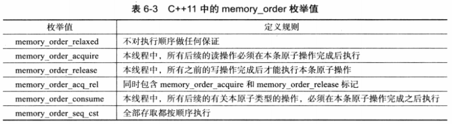
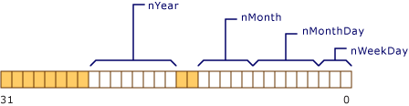

# 0 绪

本篇是看完《深入理解C++11：C++11新特性解析与应用》后做的笔记的下半部分. 这本书可以看作是《C++Primer》的进阶版, 主要是更加详细地介绍了C++11的一些常用设计和标准库设施, 很多知识点都在面试中会遇到, 值得一读.

阅读并笔记的途中我跳过了一些之前已经总结过的内容, 而对于一些自己看书后依然没搞清楚的内容(例如SFINAE和内存模型)搜索资料进行了扩展, 还补充了一些原书没有介绍但稍微有所相关的内容, 参考文献在每一段的开头给出. 全文6.6k字, 慢慢来吧.

# 6 提高性能及操作硬件的能力

## 常量表达式

1. const是运行期常量, 效率较低
2. 为了实现类型安全的define而提出的编译期常量, 在表达式面前加上`constexpr`来声明
3. 编译器会在编译时期对constexpr进行值计算, 类似模板元编程
4. constexpr可以在函数前声明, 但是C++11的时侯常量表达式函数有很多限制, 后来的版本渐渐放松限制. C++11的时侯:
   1. 函数体只能有单一的return语句(或者额外的不影响数据的编译期语句)
   2. 函数必须返回值, 因为一定要从常量表达式中获得常量
   3. 函数使用前(编译期)一定要有定义
   4. 返回语句中不能有非常量的函数或数据. 必须是个常量表达式
5. 常量表达式的值必须在使用前初始化, 但是如果没有代码用到其地址, 编译器可以不生成数据, 直接将常量表达式作为编译时期的值使用
6. 编译时浮点常量表达式的精度至少要等于/高于运行时浮点数常量的精度
7. constexpr不能用于类的定义, 但是可以用于类的构造函数使得类也能在编译期当作实例使用. 注意此时类的构造函数函数体必须为空, 所有成员都只能依靠常量表达式在初始化列表中初始化
8. 常量表达式不能用于virtual
9. 常量表达式函数不需要重写非常量版本, 编译器会自动生成, 重写反而会报错
10. 当模板函数声明为常量表达式后, 如果函数的实例化结果不满足常量表达式要求, 那么常量表达式符号会被忽略而不会报错(也是一种SFINAE)

## 变长模板

1. C标准中的变长宏不强调类型并不安全
2. C++11中的tuple模板就是典型的变长模板
3. 模板类型后面的三个点`...`称为模板参数包, 模板参数包也可以是特化的
4. 推导后的模板参数包再通过参数名称后的三个点`...`来进行解包(包扩展)
5. 变长模板自然也可以用在函数模板中, 称为函数参数包.
6. 注意函数参数包必须是函数的最后一个参数包(模板参数包没有这个要求)
7. 模板参数包可以在以下七个位置展开, 但是不用太关注, 这些展开位置基本覆盖常见需求:
   1. 表达式
   2. 初始化列表
   3. 基类描述列表
   4. 类成员初始化列表
   5. 模板参数列表
   6. 通用属性列表
   7. lambda捕捉列表
8. 理解包扩展的核心是谨记其将`...`前面的直接成员进行多次使用
9. C++11还引入了`sizeof...()`操作符来计算参数包中的参数数量, 返回一个size_t
10. 变长参数也可以和完美转发联合, 语法更加晦涩, 见书6-17

```C++
/// 经典的tuple定义, 利用上了各种变长模板特性
// 变长模板的声明
template<typename... Elements> class tuple;
// 利用偏特化作为模板的入口, 用继承结构来递归解包来逐渐得到各个参数
template<typename Head, typename... Tail>
class tuple<Head, Tail...> : private tuple<typename... Tail>{
    Head head;
};
// 递归结束的条件
template<> class tuple{};
```

```C++
/// 新的基于函数模板的printf()
// 模板参数划分为当前参数和参数列表
// 当前参数列表的第一个参数作为类型T被捕获, 后面的留作递归
template<typename T, typename... Args>
void printf(const char* s, T value, Args... args){
    // 逐字符打印字符串
    while(*s){
        // 发现%时跳过这两个字符, 然后用cout打印
        if(*s=='%' && *++s!='%'){
            cout<<value;
            // 移动到下一个字符, 然后将剩余的参数继续递归
            return printf(++s, args);
        }
        // 否则直接打印当前字符串的字符即可
        cout<<*s++;
    }
    // Error
}
// 递归结束的条件, 参数全部用完的情况, 此时应该直接能打印完剩下的全部字符串
void printf(const char* s){
    while(*s){
        if(*s=='%' && *++s!='%'){
            // Error
        }
        cout<<*s++;
    }
}
int main(){
    // 调用测试
    printf("print %s%d\n", string("a"), 1);
    return 0;
}
```

```C++
/// 多种的参数包展开效果
// 变长右值引用
// 牢记...的本质是...在参数列表中进行了展开, 前面的类型进行了多次的扩展出现
template<typename... Args>
void foo(Args&&... args);

// 变长继承
template<typename T, typename... Args>
class Foo : private Foo<Arg>...{}

// 变长返回值作为参数
template<typename... Args>
void foo(Args... args){
    // 此时args展开并调用到poo上然后又组成一个变长参数给boo使用
    boo(poo(args)...);
}

// 模板作为参数包
template<typename T, template<typename> class A, template<typename> class... B>
class Foo<T, A, B...>{}

// 两个模板参数包(容易编译错误, 必须保证编译器能够推导)
template<
    template<typename> class... A, typename... AArgs,
    template<typename> class... B, typename... BArgs>
class Foo<A<AArgs...>, B<BArgs...>>{}
// 这样就可以初始化多个tuple的模板类
Foo<tuple<int, char>, tuple<double, float>> f;

// 获得参数包的长度
template<typename... Args>
void foo(Args&&... args){
    int args_len = sizeof...(args);
}
```

## 原子操作

1. 原子操作是多线程中最小且不可并行化的操作, 用于实现对某些数据的互斥访问. 具体来说就是对一个内存上的变量的"读取-变更-储存"过程作为整体一次性完成
2. `std::atomic<T>`来声明一个原子变量
3. 一般来说原子类型都属于资源型的数据, 多个线程只能访问其拷贝, 删除了拷贝移动赋值等构造, 但总是定义了从`std::atomic<T>`到`T`的转换方便使用
4. 各种不同的原子类型定义了不同的操作, 其中绝大多数原子类型都支持`load()`, `store()`和`exchange()`三大成员函数, 这三种操作在其赋值操作符中广泛使用
5. 有一个特殊的原子类型`std::atomic_flag`, 其特点是无锁赋值, 因此没有上面的三大函数, 而是使用`test_and_set()`和`chear()`这两个原子操作进行读写, 经常用于制作自旋锁.
6. `std::atomic_flag`构造的时侯是false的, `test_and_set()`会将其原子地赋值为true, 然后`chear()`将其改回false


## 内存模型

> 如何理解 C++11 的六种 memory order？ - Furion W的回答 - 知乎
https://www.zhihu.com/question/24301047/answer/83422523
>
> 如何理解 C++11 的六种 memory order？ - 知乎用户的回答 - 知乎
https://www.zhihu.com/question/24301047/answer/1193956492
>
> What Do Each Memory Order Mean? https://stackoverflow.com/questions/12346487/what-do-each-memory-order-mean
>
> C++11中的内存模型下篇 - C++11支持的几种内存模型 https://www.codedump.info/post/20191214-cxx11-memory-model-2/

1. 内存模型通常是硬件概念, 标识单线程中机器指令是以怎样的顺序被处理器执行的
2. 由于编译器优化, 程序的指令在编译的时侯可能会发生重排, 这导致高级语言代码执行的顺序可能与编译后的汇编代码不同. 且由于现代CPU的指令多发射特性, 汇编代码实际在CPU运算的顺序也难以预测. 为了保证线程中的程序运行既能发挥优化的高效率又能拥有正确的顺序, C++11对底层硬件抽象出了一系列枚举值, 这些枚举值称为C++的内存模型
3. C++11中, 原子类型变量本身已经满足多线程的同步特性, 多个线程对原子变量操作时内部的指令是不会互相影响的. 但是这些原子操作前后的普通代码却没有做任何要求, 因此可以自由重排, 这就带来了多线程冲突的隐患.
4. 在内存模型之前, 我们无法控制原子操作前后的代码执行的顺序, 因此有可能代码中本来写了y在x前进行修改, 但是实际运行的时侯y在x之后才发生修改. 如果此时有线程B在修改x的同时读取了y, 那么就会得到不合理的y值(原本期待y在修改x的时侯已经改变)
5. 对此C++的内存模型提供了六种枚举值, 核心就是让对性能有极限要求的程序员可以按照自己的想法控制原子操作前后其它有关内存读写的代码(因为只有有关内存读写的代码可能引起同步问题)应该以怎样的顺序运行, 这些枚举值作为目标原子操作函数(如`store()`, `load()`)的第二个参数被传入, 通常表现为在原子操作函数周边设置的"内存栅栏"(用于清空流水线的一种指令)
6.   
   1. `memory_order_relaxed`不对原子之间的顺序做任何要求, 一般用于单纯的原子计数器函数
   2. `memory_order_seq_cst`这是默认的也是额外开销最高的内存模型, 这个选项不允许一切内存操作的重排, 确保了程序完全按照我们的要求执行
   3. `memory_order_acquire`只能用在load操作中, 其使得该操作后的内存读写不能被重排到这个操作前, 相当于"读者"
   4. `memory_order_release`类似, 只能用在store中, 其禁止这个操作前面的内存读写重排到这个操作之后, 相当于"写者"
   5. `memory_order_consume`也只能用于load操作中, 其也禁止后面的重排, 但是这个限制只影响自己这个原子变量, 不会影响其他操作的重排. 这个模型比较少用, 很多编译器将其实现得和acquire相同
   6. , `memory_order_acq_rel`是获取-释放顺序, 是acquire和release的结合体, 起到一个内存栅栏的作用

## 线程局部存储TLS

1. 线程局部存储(thread local storage; TLS)就是在描述线程可见的变量有哪些
2. 首先线程显然拥有自己的栈内存, 并且共享了堆空间, 全局和静态变量区
3. 然而共享的全局变量可能会在多线程读写中产生不确定的结果, 因此C++11提出给需要跨线程共享的全局变量的名字前面加上关键字`thread_local`来声明为TLS变量. 如`int thread_local share_val;`
4. 声明为TLS变量后, 每个线程会拥有一个独立的拷贝变量, 一个线程对这个线程的修改不会影响另一个线程. 这个变量在线程开始的时侯被初始化, 且可以取得地址, 但是取得的是当前线程所指的这个TLS变量的地址
5. C++11对TLS变量的实现没有任何性能规定, 通常来说读写性能不会高于普通的全局/静态变量

## 程序退出机制

1. `terminate()` 代表程序发生异常退出, 默认情况下内部调用了`abort()`, 不过可以通过`set_terminate()`来改变默认行为
2. `exit()` 代表程序正常退出, 会自动调用变量的析构函数, 并调用`atexit()`注册的函数
3. `abort()` 代表无可挽回的程序终止, 不会调用任何析构函数, 操作系统直接结束掉这个进程, 可能导致很多交互中的进程的中间状态发生问题
4. `atexit()`可以注册多个函数, 退出的时侯以与注册相反的顺序调用
5. 然而`exit()`由于会调用析构的原因, 退出程序的时侯可能需要卸除大量堆内存导致退出速度很慢, 但是这些堆内存本来都是可以交给操作系统一口气回收的. 且`exit()`在多线程中还需要进行线程通信, 等待其他线程正常析构, 不正常的信号数据还可能导致死锁.
6. C++11引入了`quick_exit()`, 其不执行析构函数, 只是终止程序执行. 但不同于`abort()`, 系统不会判断程序为错误退出因此不会进行额外的异常分析. `quick_exit()`也可以用`at_quick_exit()`注册一批函数在退出时调用, 标准要求至少支持32个

## 位域

> C++ 位域 https://docs.microsoft.com/zh-cn/cpp/cpp/cpp-bit-fields?view=msvc-170
> 
> C/C++ 位域知识小结 https://www.cnblogs.com/zlcxbb/p/6803059.html

1. C++允许我们以位为单位储存某些数据, 从而使数据结构更加紧凑, 但是会增加访问的耗时
2. 位域不能取地址
2. 位域不能是类的静态成员
3. 位域在内存中是从低向高顺序放置的
4. 位域的典型应用是bool的极限压缩(bool:1)和RGB565分配(R:5, G:6, B:5)
5. 语法和内存布局如下:
6.   
```C++
// 通过成员名后加冒号和位域结束的bit位来进行标记
// 每当到达一个字节长度就重新计数
// 一个位域必须存储在同一个字节中, 不能跨两个字节
// 故位域的长度不能大于一个字节的长度
// 类中自然可以混合使用多种位域, 因为本质是压缩储存
struct Date {
   unsigned short nWeekDay  : 3;    // 0..7   (3 bits)
   unsigned short nMonthDay : 6;    // 0..31  (6 bits)
   unsigned short nMonth    : 5;    // 0..12  (5 bits)
   unsigned short nYear     : 8;    // 0..100 (8 bits)
};
```

# 7 为改变思考方式而改变

## nullptr

1. `nullptr`是"指针空值类型"的编译期常量关键字, 该类型命名为`nullptr_t`, 即`typedef decltype(nullptr) nullptr_t;` 这是为了能给这个特殊的类型进行操作符重载等设计
2. nullptr可且仅可隐式转换为任何一种指针类型
3. nullptr无论如何都不能被转换为非指针类型, 不能用于算术表达式
4. nullptr可以用于关系比较, 但仅能与nullptr比较, 返回true
5. nullptr用于模板时, 模板之将其作为一种普通类型而非T*来推导
6. nullptr占用的内存与void*相同
7. C++11规定不能取nullptr的地址, 但还是可以用右值引用捕获nullptr然后取地址, 虽然这个地址没有意义

# 8 融入实际应用

## 内存对齐

1. C++中每个类型的数据都有自己的对齐属性, 决定了它们被放置的内存地址应满足的条件
2. 对齐的数据在读写上有性能优势, 类的默认对齐是内部符合对齐要求的最大元素
3. `alignof()`能返回目标的对齐字节, 返回值是`size_t`. 很直观的, 类型不完整的类无法通过alignof的编译
```C++
// 这里的Color按照8字节对齐, 但是结构体显然大多数时侯是一整个一整个地访问的
// 那么8字节的对齐并不能提高读写的效率, 也不能充分利用缓存
struct Color{   // alignof(Color): 8
    double R;   // alignof(double): 8
    double G;
    double B;
    double A;
}
// 通过alignas我们可以重新设定类的对齐方式, 从而提高访问效率
struct alignas(32) Color{   // alignof(Color): 32
    double R;               // alignof(double): 8
    double G;
    double B;
    double A;
}
```
4. 但要注意`alignas()`只能设定2的指数倍的对齐大小, 这是为了满足内部成员的对齐.
5. 对齐值越大我们称对齐要求越高
6. C++还规定了"基本对齐值"`alignof(std::max_align_t)`, 每个平台各自设定, 一般是16字节. 上面32字节对齐的设定称为扩展对齐, 可能会引起错误, 要谨慎
7. `std::align()`可以动态根据指定的对齐方式调整数据块的位置从而提高访问效率
8. `std::aligned_storage()`可以在产生对象实例的时侯对对齐方式做出一定保证
9. `std::aligned_union()`则针对union处理, 选择类型中对齐最严格的一个值返回

## 通用属性

> C++ 中的属性 https://docs.microsoft.com/zh-cn/cpp/cpp/attributes?view=msvc-170

1. C++11标准化了一种批注C++方法(变量, 类, 块都行)的附加语法, 写为两个中括号中间关键词, 一般放置在目标上面一行或者目标的最前方, 通常会在触发的时侯产生编译器警告
2. 目前通用属性的更新比较蛮, 有以下几种:
   1. `[[noreturn]]` (C++11) 指定函数的控制流永远不会返回, 也就是一旦进入此函数必然引发异常, 不会回到调用者
   2. `[[carries_dependency]]` (C++11) 既可以标识参数也可以标识函数本身(返回值), 表示此数据于多线程中没有数据依赖, 无需产生内存栅栏
   3. `[[deprecated]]` (C++14) 此目标不适合使用, 将被废弃, 使用此目标会产生警告
   4. `[[fallthrough]]` (C++17) 用于switch中, 表明此case没有break是预期内的行为, 只是一种提示
   5. `[[nodiscard]]` (C++17) 目标的返回值不应放弃
   6. `[[maybe_unused]]` (C++17) 当目标有意暂时不使用时, 令编译器不要发出警告
   7. `[[likely]]` (C++20) 标记此分支为热代码, 提示编译器可以进行优化
   8. `[[unlikely]]` (C++20) 标记此分支为冷代码, 提示编译器可以进行优化

## 调用约定

> 参数传递和命名约定 https://docs.microsoft.com/zh-cn/cpp/cpp/argument-passing-and-naming-conventions?view=msvc-170
> 
> C++ 的函数调用约定 https://blog.csdn.net/weixin_39731083/article/details/82533349

1. 函数调用约定, 是指当一个函数被调用时, 描述函数参数是如何压入栈和由谁平衡栈的约定, 直接将其写在函数名和返回值之间的位置
2. 平衡栈: 函数返回时由谁负责将压入栈的函数参数清除
3. 函数调用过程:
   1. 根据调用约定把函数参数压栈或存入寄存器
   2. 跳转到函数代码
   3. 把函数用到的外层正在使用的寄存器值压栈
   4. 执行函数代码
   5. 处理返回值
   6. 将第三步压栈的寄存器值读出并恢复到寄存器中
   7. 根据调用约定清除第一步压栈的参数并返回, 或者返回后才清除参数
4. 这些调用规定与编译器相关, 以下是windows常用的调用约定
   1. `__cdecl` C和C++的默认调用约定, 参数从右向左入栈, 由调用者清理堆栈, 因此允许可变参数函数
   2. `__stdcall` `WINAPI`是它的别名, `CALLBACK`也是它的别名, windows编程中很常用. 参数从右向左入栈, 函数自己清理堆栈, 因此不支持变长参数
   3. `__fastcall` 由寄存器传递开头的一小部分参数, 剩余参数从右向左入栈, 函数自己清理
   4. `__thiscall` 常用于类成员函数, 把this指针存入寄存器, 剩下的入栈, 函数自身清理. 如果参数不确定, 那么this指针在所有参数入栈后入栈, 调用者清理. 程序员不能使用这个调用约定