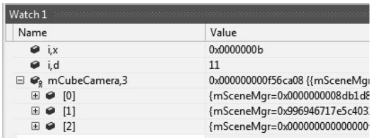

# Chapter2 专业工具

- [Chapter2 专业工具](#chapter2-专业工具)
  - [2.1 版本控制](#21-版本控制)
  - [2.2 微软 Visual Studio](#22-微软-visual-studio)
  - [2.3 剖析工具](#23-剖析工具)
  - [2.4 内存泄漏和损坏检测](#24-内存泄漏和损坏检测)

## 2.1 版本控制

版本控制的目的是允许多个开发者在同个项目上合作, 会自动记录文件的每个改动并在需要的时候可以还原改动, 甚至能让多个用户修改同一份文件, 不过最好是文本文件. 就算是单人项目, 版本控制系统的历史记录, 分支和标签等功能也很实用. 

版本控制系统有很多可选的, 一般来说个人选择Git, 专业级选择Perforce即可. 游戏领域有还有类似NxN Alienbrain, ClearCase这样的专门为游戏优化的系统. 

版本控制系统的核心是维护主（master）版本, 然后对比每个提交（commit）的文件与当前文件的区别（diff）, 将修改的部分保存log, 然后改动. 程序员可以随时回到之前的每个commit时的快照（snapshot）中. 如果多个commit之间在某部分代码产生了冲突, 则需要合并（merge）改动, 一些改动可以自动合并, 一些需要手动控制. 在版本控制系统中删除的文件只会被标记而不会真的被删除, 可以随时通过snapshot找回之前的文件. 

## 2.2 微软 Visual Studio

C++之类的编译型语言需要使用编译器和链接器来将代码转换为可执行文件. VS作为集成开发环境（IDE）包含了完善的文本编辑器, 编译器, 链接器, 调试器等种种组件, 很方便使用. 

程序的执行的过程：
1. C++编写的程序由源文件组成, 预处理器首先将所有宏命令（#号开头的行, 例如头文件）替换为对应的文本内容, 此时的文件称为翻译单元
2. 然后编译器将所有翻译单元翻译为机器码（这其中还有汇编器的协助）, 此时称为对象文件, 扩展名为.obj或.o. 此时的对象文件已经是可以执行的代码, 但是还没有决定代码的内存地址且一些文件中存在不属于该文件的外部数据, 也就是可重定位且未链接
3. 对象文件可以集成为程序库交付给其他程序一起使用, 使用的方法是链接
4. 链接器会将所有对象文件和程序库进行符号查找, 计算出所有代码的相对位置和所有完成解析的外部数据, 称为可执行文件, windows下的扩展名为.exe
5. 可执行文件虽然已经是完整的但是其内存地址仍然是浮动的相对值, 执行的时候操作系统将给程序指定一个内存的最终基址并载入内存, 这样机器才会真正执行程序

在这个流程中比较特别的存在是动态链接库（DLL）, 其既像静态链接库一样是包含了很多函数的可以用来与其他程序链接使用的程序库, 又像可执行文件一样可以正常执行. 使用了DLL的程序中会存在未完全链接的代码, 这使得程序可以正常运行, 但是当遇到这些代码时操作系统会寻找合适的DLL, 若DLL不在内存中就会进行载入, 这样的优点是实现了程序库级别的代码, 且使得我们可以只修改DLL而不用修改可执行文件. 

而在这之外, VS又为C++包装了项目文件.vcxproj, 这是一个xml文件汇集了项目包含的源文件, 可执行文件, DLL等信息方便使用. 除此之外还包装了更上一层的解决方案文件.sln, 其是项目的集合, 并组织了与本机路径无关的树状文件目录结构. 当然, 按照真实目录来设置解决方案的目录是好习惯. 

VS中开始生成项目需要生成配置文件, 其就是包含了对这个项目的预处理器链接器等等组件的设置配置. 大典型的生成配置是调试(Debug)和发布(Release), 调试配置用于平时的开发, 带有大量的调试信息, 运行比较慢, 发布配置用于软件的出版, 有最好的性能优化和最少的调试信息. 设置生成配置中, 常见的选项有: 

1. 预处理器设置: 控制include的展开和define宏的定义与替换, 我们通过在代码开头define _DEBUG符号, 然后每个需要打印调试信息的地方都用一个ifdef括起来, 正式发布的时侯将符号全局修改为NDEBUG, 这样就能够去除所有的调试信息. 这种操作称为条件编译. 还有多个类似的符号例如_WIN32指示程序由windows进行编译.
2. 编译器设置: 主要是去除编译器自己的调试信息, 和调试程序的优化等级, 可以使得程序运行效率提高很多, 但是高优化级别的代码难以调试
3. 链接器设置: 主要用于设置需要链接哪些文件, 可以让外部库保持一份调试版和发行版, 按需链接

除了这两个基本的调试设置, 还有完全舍弃调试可能, 最大程度进行优化的制作(Production)配置, 用于给其它程序协作的工具(Tools)配置. 此外, 混合生成配置也是一种不错的选择, 让每个文件可以有不同的生成配置, 从而达到控制部分调试信息的目的. VS上设置比较麻烦, 用make比较合适, 不过现在VS也可以用make生成程序了方便很多.

越多的生成配置就意味着要进行测试的版本越多, 所以一味增加配置不是好事情. 有些忍受布族的工作室只保留Debug和Release配置, Release配置去除调试信息后直接发布, 放弃制作(Production)配置的使用.

书中接下来介绍了VS的一些具体操作, 只记录比较少用的:

1. VS的"监视窗口"可以检查当前程序中变量的值, 注意监视窗口可以输入几乎任何有效的C++表达式, 这使得我们在调试的时侯可以尝试对很多式子进行取值, 甚至修改运行中的变量, 减少调试试错的难度.
2. 监视窗口中可以通过给要显示的值添加",d";",x";",n"...后缀, 让VS将指定的值视作十进制/十六进制/有n个元素的数组...进行显示
3.   
4. 在VS的监视窗口中可以按照某个目标的内存地址设置数据断点, 每当有新数据写入地址时就会中断

程序总有需要发布的一天, 但是发布配置的程序难以调试. 有几个用来调试最终版本程序的技术应该学习:

1. 使用反汇编检示模式单步执行程序的反汇编代码
2. 运用寄存器去推理变量的值和地址, 近期使用过的变量大概率会留存在同一个寄存器中
3. 习惯使用地址去检查变量内容
4. 使用静态和全局变量来调试, 这是难得调试器还能正常追踪的变量, 借助这些变量来推算其它变量的地址
5. 暂时性地修改源代码, 用print来显示变量问题

## 2.3 剖析工具

游戏是对性能高度敏感的程序, 帕累托法则告诉我们80%的性能被20%的代码拖慢, 因此我们要活用性能剖析工具来找到优化的切入点.

优化器大体上分为两大类: 

1. 统计式剖析器(statistical profiler): 周期性地采样当前CPU所允许的函数和近似的时间, 从而近似估计代码的运行状况. 不怎么影响代码执行的性能, 但是不够准确.
2. 测控式剖析器(instrumental profiler): 自动在程序中按插初构代码(prologue code), 大大降低程序的执行速度, 但是能够得到各种详尽精确的运行信息, 例如函数的调用跳转情况, 甚至于每一行代码的运行次数和运行时间
3. 微软发布了混合这两种类型的剖析器LOP(Low Overland Profiler), 既不会太影响运行效率, 又能得到函数调用信息

## 2.4 内存泄漏和损坏检测

C++经常遇到内存泄漏和内存损坏的问题. 内存泄漏指有些内存分配后忘记释放导致最终内存不足, 内存损坏则是不小心将数据写进了错误的内存位置, 覆盖了不该修改的数据, 这都是指针引起的. IBM Purify Plus中的Rational Purify工具可以追踪指针产生内存泄漏报告, Bounds Checker也功能类似.