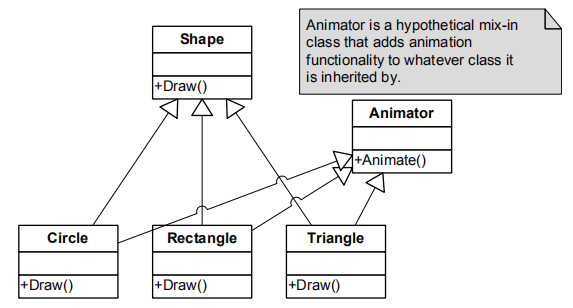

# Chapter3 游戏软件工程基础

- [Chapter3 游戏软件工程基础](#chapter3-游戏软件工程基础)
  - [3.1 重温C++及最佳实践](#31-重温c及最佳实践)
    - [C++的一些常用词](#c的一些常用词)
    - [几个游戏设计模式](#几个游戏设计模式)
    - [C++11相关](#c11相关)
  - [3.2 C/C++的数据, 代码及内存](#32-cc的数据-代码及内存)

## 3.1 重温C++及最佳实践

### C++的一些常用词

1. 类: 有意义的数据和代码的集合体, 其实例称为对象
2. 封装: 令对象/类只向外提供有限的接口, 隐藏内部实现细节简化理解, 应该通过封装使得类使用的时侯逻辑上整体保持一致
3. 继承: 延伸已有的类去定义新的类, 是面向对象语言的核心优势. 通过继承和虚函数的使用, 面向对象语言的多态特征才完美体现, 利用丰富的继承操作来替换掉难以扩展的内部switch模块, 大大简化了编程
4. 多重继承: C++支持多重继承操作, 即一个子类有一个以上的同级父类. 多重继承能够使扩展类的功能的操作变得非常优雅简单, 但是一旦设计不当很容易产生混淆甚至致命的菱形继承出现. 多重继承使得类之间的类型转换变得非常复杂, 所有实际开发中多重继承常常被最大限度地限制使用甚至完全禁止使用, 一般只允许在单继承结构中继承一些简单且无父的类, 例如下图对基本图形元素的功能扩展
5.   
6. 多态: 多态目的是让调用者可以通过相同的接口操作一批不同类型的对象, 能大大简化设计
7. 合成与聚合: 这种设计是为了减少多重继承的使用, 简化设计的难度. 从实现上来说就是在类的内部通过一系列指针元素来使一个总的类可以调用不同类的功能, 从而通过类似组装而非继承的方法实现功能扩展. 合成通常指"有一个"的关系, 聚合则是指"用一个"的关系.

### 几个游戏设计模式

1. 单例模式: 确保某个特殊类在全局都只有一个实例(例如渲染器), 然后提供这个实例的全局访问方法
2. 迭代器模式: 高效简洁地存取某个集合的对象
3. 抽象工厂: 提供一个接口创建一组相关或相互依赖的类, 而不需要指明具体类

有一本经典书籍<<游戏设计模式>>介绍了游戏编程中常用的设计模式和架构, 以后再阅读并笔记.

### C++11相关

这里简单回顾一下C++11一些常用的新特性

1. auto: 自动类型推导, 可以方便我们进行一些复杂类的编写, 让我们不用人工推导复杂的类型名. 这个特性用于简单的类时一定程度上会降低代码的可读性, 但是又能提高对复杂类例如容器迭代器描述时的可读性, 所以要权衡着使用. 另外不用担心auto会带来性能损失, 我们平时编程时编译器也会进行类型推导来判断是否类型匹配, auto某种意义上还提高了编译速度.
2. nullptr: NULL的替代品, 是std::nullptr_t的实例, 拥有类型安全性, 无脑用就行.
3. foreach: 利用冒号和迭代器大大简化容器元素遍历的过程, 是一种简化代码的小特性
4. override和final: 用来辅助标识虚函数的继承情况, 只是令编译时增加一层检查, 无性能代价也无效果. override会限制此函数必须覆盖父类的同名虚函数, final则会使此函数到此为止不能继续被子类覆盖.
5. 强类型的enum: 新增了enum class XXX的写法, 从而使得枚举也能经过编译类型检测的查错, 且可以指定枚举类的底层类型了
6. 智能指针: std::unique_ptr, std::shared_ptr和 std::weak_ptr三个类大大降低了以前C++的指针和内存管理难度, 回顾之前的C++笔记有记录. unique是独占指针, shared是传统意义上的多计数指针, weak类似shared但是不影响引用技术, 常用于作为反向指针.
7. lambda: 也就是匿名函数, 用来简化一些编写
8. 移动语义和右值引用: 用来优化对象的拷贝, 其运行了直接盗取临时对象的内存移到目标对象上, 能够大大提高对临时对象的处理效率. 这个特性比较复杂但是熟悉后作用非常大, 更为详细的记录也在之前的C11笔记中.

## 3.2 C/C++的数据, 代码及内存

