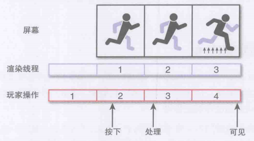

# 1 游戏编程概述

## 游戏主循环

1. 游戏循环: 整个游戏程序的核心流程控制, 不断执行直到退出
2. 帧: 循环的一次迭代. 一般一秒30-60帧, 也就是程序每帧耗时需要在33ms以下
3. 传统的游戏循环: 输入(控制器), 更新世界和逻辑, 输出(画面)
4. 多线程游戏循环: 最简单的方法是让线程做自己的事情, 例如一个线程负责图形以外的计算, 另一个线程负责渲染图形
5. 多线程合作的时候渲染线程需要等待主线程的数据, 因此为了提高利用率最好借用流水线的思路, 让渲染线程比主线程慢一帧
6. 多线程可能导致更高的输入延迟如下图: 第一帧进行了计算, 第二帧才会渲染出画面, 然后第三帧才能处理玩家的输入, 第四帧玩家才能看到输入的结果.
7.   

## 游戏中的时间

1. 真实时间: 真实世界流逝的时间, 用于记录
2. 游戏时间: 游戏内的时间, 用于游戏性设计使用, 例如制造时间减速效果, 加速效果, 倒退效果等等. 游戏可能内含多个时间
3. 增量时间(deltatime): 游戏从上一帧起流逝的时间, 游戏中与速度有关的设计都应该用这个时间来计算. 尽管我们无法得到当前帧的时间, 但是可以依据上一帧甚至之前的多帧来预测当前帧可能的耗时, 尽量保证游戏在各种帧率下都能正常运行, 而不是像早期游戏一样依赖于CPU频率或者显示器刷新率等
4. 与物理有关的游戏当帧率波动的时候按照不稳定的增量时间模拟出的结果可能产生很大的误差, 最简单的优化方法是限制物理模拟部分的帧率来使得数值积分过程尽量稳定
5. 遇到某帧绘制时间过长时, 程序可以选择丢弃过长的帧(跳帧)或者就正常表现(卡帧), 这方面的权衡应该视需求而定

## 游戏编程中的对象

1. 游戏对象可以大体分为三种: 需要更新状态也需要绘制的动态对象(如人物), 需绘制但是不需要更新状态的静态对象(如场景), 需要更新状态但无须绘制的工具对象(如摄像机和触发器)
2. 三大游戏对象的程序实现可以通过抽象出Drawable和Updateable接口然后通过继承(或组合)来配合得到
3. 游戏对象被创建出来后一般会加入游戏中维护的队列, 按照策略模式等设计进行更新和渲染