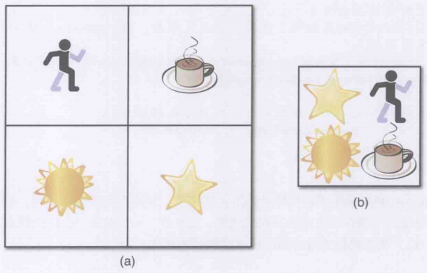

# 2 2D渲染基础

## 渲染时的帧刷新问题

1. 显示器有固定的刷新率, 按照显示-刷新-显示的循环进行. 如果程序在屏幕刷新的途中输入画面到屏幕的缓冲区的话会可能屏幕撕裂的现象, 也就是上半个画面是新内容, 下半个画面是旧内容, 虽然持续时间很短但是观感还是不好
2. 因此解决屏幕撕裂的关键在于必须在刷新之前就将所需的内容输入显示器缓冲, 但是帧率的不稳定导致这个过程可能过早或过晚
3. 为了最大化流水线效率, 游戏设计了双缓冲技术, 前缓冲是用于输入显示器的完整图像, 后缓冲是正在绘制的下一帧图像, 显示器按照周期从前缓冲获取内容, 程序渲染完画面就进行前后缓冲交换. 这会加大输入延迟但是让画面的渲染和显示独立开来, 从而一定程度上避免了由于渲染带来的帧率波动导致的画面撕裂
4. 如果帧率变化剧烈的话双缓冲依然可能出现显示器不得不取用目前正在绘制的图像的情况, 为了优化有些游戏引入了三缓冲技术, 进一步加大了延迟但是对特殊帧率的容忍性也更高了

## 2D精灵的绘制与动画

1. 精灵: 使用图片的一个方块绘制的2D图像游戏对象. 可能是动态也可能是静态, 2D游戏需要大量的精灵对象
2. 绘制2D画面大多使用画家算法(遍历排序好的场景进行渲染, 这样无须深度测试). 因此2D游戏中每个精灵都应该有自己的坐标和绘制序号, 然后程序按照这个序号列表按顺序渲染, 前景覆盖背景
3. 一些图形库支持按层次组合一组图像的绘制顺序, 方便美术人员设计场景
4. 动画精灵: 也就是带有自己动画的2D游戏对象, 动画一般用一组图片来表现, 类似现实中的帧动画.
5. 组织动画一个简单的方法是包装一个帧动画结构体, 内含当前需要显示的动画的索引, 当前动画需要显示的图像, 每帧图像的时间, 动画播放的帧率, 和对应的init, update, change接口. 其中update是最重要的, 因为需要利用当前的增量时间(deltatime)来决定是否需要切换下一帧动画, 并按照当前游戏的状态决定是否需要切换到不同的动画上
6. 更加复杂的动画应该用状态机来实现
7. 将每帧的图像作为一张图片进行保存会产生很多读取和传输开销, 且图像的空白区域也会产生很多浪费的空间. 比较好的方法是用一张(少数张)来保存多个精灵所需的内容, 称为精灵表单. 然后按照设置好的索引位置和区域大小来从表单中读取所需的图像, 这样能消除图像切换的消耗
8. 下图左边是分离的图像, 右图是整合后的精灵表单:
9.   

## 常见的2D游戏

1. 单轴滚屏: 游戏世界只按照x轴或y轴滚动, 典型的是跑酷类游戏. 其背景的实现方法一般是按照屏幕大小进行背景切割, 然后以片段为单位组成链表放在游戏世界中, 摄像机始终追随玩家只要范围不要超过第一张和最后一张背景即可. 通常同时只需要绘制两张背景图
2. 无限滚屏: 通常是多张背景以随机的方式组成序列来显示
3. 平行滚屏: 这种技术将背景分为多层, 每层都有自己的滚动速度的因子, 设定越远的背景滚动速度越慢从而产生深度感
4. 四向滚屏: 游戏世界会同时在xy上滚动, 类似单轴滚屏, 需要同时准备四张背景图像用于显示, 而且背景不再使用链表来组建, 而是改为二维数组来决定目前需要显示哪些背景图像
5. 砖块地图: 将背景切分为等分的方块, 方块可以集合在一张表单里然后按照索引进行查找, 此时游戏世界由精度更高的二维索引数组构建, 一般储存为外部文件然后按需读入. 这种组建形式可以制作随机产生的地图, 且方便美术人员调整, 而且可以让一个砖块ID对应多张不同的图片从而实现常见的"季节性皮肤"功能
6. 斜视砖块地图: 视角通过旋转来让常见更有深度感的砖块地图, 需要支持多层次渲染和成组的砖块绑定设计来保证前后景效果和一些遮挡效果, 砖块一般是正方形(竖放)或者平行四边形.