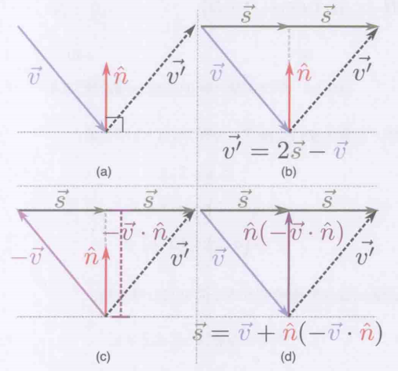
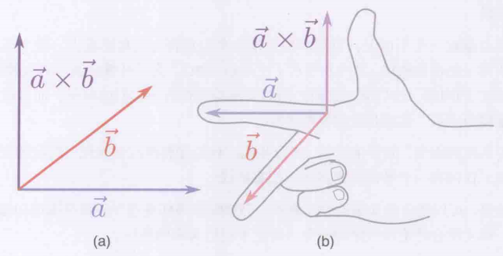
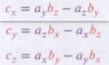
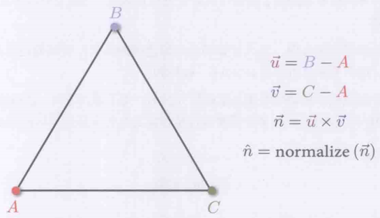
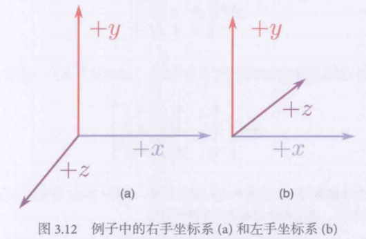

# 3 游戏中的线性代数

## 向量点乘

1. 向量长度需要开方, 代价比较大, 应该避免. 比较向量长度和比较向量长度的平方是一样的, 所以尽量不要开方
2. "卡马克快速平方根"是通过概率估算牛顿法第一次迭代的结果加速了求开方的速度
3. 点乘得到标量, 叉乘得到向量
4. 两个向量的夹角向量夹角: $\theta=arccos(\frac{\vec{a} \cdot \vec{b}}{||\vec{a}||||\vec{b}||})$.
5. 非单位向量投影到单位向量方向上的投影长度投影长度: $\vec{a} \cdot \vec{b}$
6. 单位向量点乘为0时两个向量垂直, 为1时两个向量平行且同向, -1时平行且反向. 结合原始的向量乘法公式来记忆即可
7. 向量长度的平方就是用自己与自己点乘

## 求反射向量

1. 与向量有关的问题画图会比较好理解, 求反射向量需要有入射向量本身与反射点的法线
2. 首先将入射向量反向然后与法线点乘, 得到入射向量在法线方向上的投影长度
3. 将这个投影长度乘在法线上后, 将入射向量与投影法线相加能得到平行于切面的半向量
4. 将反向的入射向量与两倍的半向量相加就得到反射向量了
5.   
6. 反推一下得到反射向量的直接计算公式: $\vec{v'}=\vec{v}-2\vec{n}(\vec{v}\vec{n})$

## 向量叉乘与顶点序

1. 两个不共线的向量确定一个平面, 它们的叉乘就是垂直于这个平面的法向量
2. 如果想要对二维向量进行叉乘, 只需要将z分量设置为0
3. 叉乘后的向量指向遵循右手法则如下图: 食指对准第一个向量, 中指对准第二个向量, 此时右手拇指的方向就是叉乘的方向
4.   
5. 因此向量不满足交换律, 但是满足反交换律$\vec{a} \times \vec{b} = -\vec{b} \times \vec{a}$
6. 叉乘公式的记忆口诀: xyzzy. 即如下图, 叉乘后的向量的三个分离是基于ab-ab结构, 然后按照xyzzy字符进1的顺序进行推导的
7.   
8. 叉乘得到的0向量代表前两个向量共线
9. 可以通过计算三角形的法线与当前向量的叉乘来判断当前向量与目标三角形是否垂直(垂直时当前向量与三角形法向量共线)
10. 由于反交换律, 两个向量可以得到两种方向的叉乘结果, 因此需要在游戏中规定全局的三角性顶点的顺序(称为顶点缠绕顺序: Vertex Winding Order)来统一叉乘后法向量的方向.
11. 大多数图形库都可以自己指定所需的顺序, DirectX的默认顺序是顺时针, 也就是如下图三角形, A作为核心顶点, B-A是第一条向量, C-A是第二条向量, 叉乘得到的法向量朝屏幕内
12.   

## 二维向量旋转与三维坐标系

1. 两个向量间的夹角可以由两个向量点乘后arccos得到
2. 二维向量可以简单判断旋转的方向, 先将向量的z设为0扩展为3维, 然后起点向量叉乘终点向量, 得到的叉乘向量z为正时代表顺时针, z为逆代表逆时针
3. 常见的三维坐标系有两种, 左手系和右手系. 其都是y轴向上的, 区别在于z轴向屏幕内侧(左手系)或屏幕外侧(右手系). DirectX是左手系, OpenGL是右手系
4. 坐标系的手系可以通过计算基向量组的行列式得到(区别只在于z轴基向量的方向), 行列式为正的是右手系, 否则是左手系
5.   
