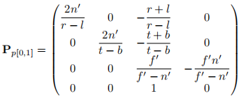

# 4 3D图形

## 矩阵与仿射变换

1. 矩阵相乘只要行列对应得上即可
2. 但因此3D图形向量也有行和列两种等价的表示方式, 对应的变换矩阵是转置与左乘右乘的区别. 大多数3D图形库都是以行向量表示的, OpenGL使用列向量表示. 这里都按照行向量表示
3. 3D中3x3矩阵只能表示向量的线性变换(旋转, 缩放, 错切), 但是无法表示非常常用的平移变换(非线性), 因此引入了一维(w)表示平移, 称为仿射变换. 对应的4x4矩阵称为仿射变换矩阵, 此时扩展出来的4维向量坐标称为齐次坐标. 注意运算最后的齐次坐标的w分量应该总保持为0或1
4. w为0的向量表示3D方向, w为1的向量表示3D的点
5. 四种最基本的三维变换:
   1. 缩放: 只在需要缩放的轴对应的对角线上设置倍率, 其他位置保持0. 缩放倍率为负时称为反射:
   2. 
   3. 错切: 保持对角线上的值不变, 改变另一个轴的偏移量. 或看为坐标系变换, 这里原本是(0, 1)的y轴变换为了(1, 1), 因此整个图形发生了倾斜:
   4.    
   5. 平移: 借助了齐次坐标的特性, 行向量左乘下面的矩阵后, 如果w为1也就是3D的点的话, 矩阵最下面一行就会起到平移点的作用, w为0的时候则不生效, 符合向量的性质
   6.   
   7. 旋转: 二维旋转用手就能很容易从向量中推导出来, 要注意默认的旋转角度指朝向旋转轴负方向方向, 逆时针旋转的角度. 大多数时候三维旋转使用xyz三个轴固定下的轴对齐欧拉角旋转矩阵连乘得到. 同样按照坐标系基底变换的思路理解: 对物体的旋转相当于进行将原本的单位坐标系改为旋转后的坐标系, 因此我们只要手推xyz坐标轴旋转后的新坐标并以列向量的方式排列即可
   8. 
   9. 注意这里的y轴的旋转角度发生了反向, 这个特性动手推一下就能够得到, 本质是因为与x和z轴的时候不同, 绕y轴旋转时, z的初始位置是(0, -1), 本质是手性带来的不对称性.

## 常见坐标系

1. 模型坐标系: 相对于模型自身的坐标系, 通常坐标系的原点置于模型中心或者角色脚下
2. 世界坐标系: 将所有对象按照设定的对象坐标进行偏移, 放置到同一个坐标空间中成为世界坐标系, 此时的坐标系原点是世界中心
3. 相机坐标系: 将整个场景(世界)移动到以相机坐标为原点的坐标系上, 相机的上方朝向为y轴, 前向和其二的叉乘为z(或-z)和x轴. 将场景变换到相机坐标系所用的变换矩阵称为观察矩阵
4. 投影坐标系: 有时称视口坐标系. 将自定义的视体变为标准视体的过程, 变换后的原本自定义视体中的内容会变换到标准视体中. 基于OpenGL的书中常见的标准视体的是比较符合数学规则的三个轴都在(-1, 1)的立方体, 而基于DirectX的标准视口则为了表达方便将z映射到(0, 1)上, 这会使得投影变换矩阵产生差别, 具体查看对应文档即可
5. 屏幕坐标系: 将投影后的坐标系(-1, 1)进一步移动和缩放到对应屏幕像素分辨率的坐标系上, 供给像素着色器的处理

## 投影变换

1. 正交投影: 最简单的投影矩阵, 由右侧的平移部分和左侧的缩放部分组成, 注意这里是基于列向量的DirectX版本, 因此投影后视体的z处于(0, 1)
2.   
3. 透视投影: 同样是将整个场景缩放, 但是透视投影的原始视体是锥形的, 所以推导上相对复杂一些. 基础的思路是先绘制一个二维的透视示意图, 可以看到xy上的投影结果可以依据相似三角形得到. 但是由于投影的分母是深度z, 需要利用透视除法将深度值带到xy上. 而z分量本身则需要保持近似线性插值, 联立方程将近平面和远平面的深度投影到0-1从而求解出第三行的两个矩阵系数. 最后将这个视体进行一次正交投影映射到(1, -1)即可. 下图是通用的DirectX版本投影矩阵, 实际DirectX使用的时候并没有第三列上面的两个系数
4.   
5. 透视投影变换只能保证深度投影后前后顺序不变, 但是并不能保持线性关系, 整体的深度值会向后挤压, 也就是大多数深度投影后分布在较后的比例. 近平面越接近相机则向后分布越严重, 有些时候这会引起精度问题.
6. 为了优化这个精度问题, 一种方法是将深度取反处理从而让靠近近平面的场景分配到更多的浮点空间, 还有一种方法是对深度按照对数储存, 对数精度能让深度值得到更均匀的分布

## 光照

1. Phong光照属于一种简单的BRDF模型, 且属于一种局部光照模型(不考虑光线的二次反射)
2. Phong光照由环境光项+漫反射项+高光项得到
3. 环境光项是直接附加的一个常数
4. 漫反射项是颜色乘上一个权重, 权重是法线方向与光照方向的点乘
5. 高光项也是颜色乘权重, 权重是视线方向与光照方向的半程向量(相加然后单位化)与法线方向的点乘, 然后经过一个指数幂处理来控制得到的高光范围大小, 幂次越大高光范围越小

## 四元数

1. 目的是避免欧拉角表示旋转会有的万向节死锁问题, 并优化旋转插值的效果, 且用四元数来表示多个旋转的合成可以减少计算量
2. 表示旋转的四元数是一个由四个浮点数组成的四维向量, 写为q=[q_v, q_s]或[x, y, z, w]的形式. 其中q_v中的a是旋转轴, theta是旋转角
3.   
4. 四元数在使用前要记得将向量分量q_v归一化后才能正常使用, 否则旋转会表现出奇怪的缩放效果
5. 四元数也可也连续使用, 但需要以下式进行相乘, 且顺序相反, 即物体是先q后p旋转时, 乘法四元数是pq
6.   
7. 四元数可以很轻松地取逆, 只要将向量分量取反即可, 这两个四元数互为共轭
8. 两个旋转间的插值可以直接用四元数线性插值或球面插值等其他插值得到, 计算方便效果好
9. 应用到图形库时可以用下面的式子将四元数转换为变换矩阵
10.   