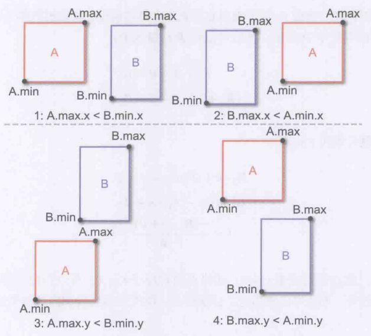
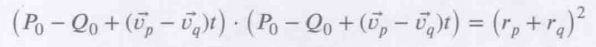
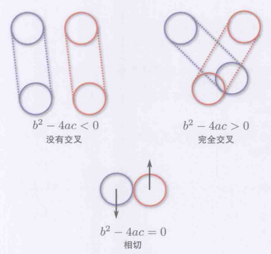

# 7 物理

## 平面的表示

1. 游戏中习惯用一般式来表示平面, 需要: 法线n, 平面到原点的最小偏移(也就是原点法线方向上的距离)d, 和我们需要判断的点P
2. $P \cdot \hat{n} + d = 0$
3. 三角形可以很方便地确定一个平面:
   1. 两个边向量叉乘后标准化可以得到法线n
   2. 由向量点乘公式可以知道, 将任意点P与原点形成的向量与法线相乘得到的结果就是点在法向量上的投影距离, 由于点在平面上, 法线与平面垂直, 因此此时的结果就是距离d
4. 通常表示平面的结构体中只保存法向量n和距离d, 然后通过将某个需要判断的点带入形成的平面公式中是否为0来判断点是否在平面上

## 射线与线段

1. 射线通常以参数方程表示, 需要: 起点R0, 射线方向向量v, 发射持续时间t
2. $R(t) = R_0 + \vec{v}t$
3. 实际使用的时候不会使用真正的射线, 而是使用有终点的线段
4. 通常表示射线的结构体中保存起点坐标和终点坐标, t由[0, 1]表示, 0代表起点坐标, 1代表终点坐标

## 各种碰撞体

1. 包围球: 最常见也最简单, 利用两个点之间的距离差值与半径和做比较来判断是否碰撞, 适合作为碰撞检测的最外一层快速筛选判断目标
   ```C++
   class BoundingSphere{
       Vector3 center;
       float radius;
   };
   ```
2. 轴对齐包围盒(AABB): 也相当常见, 每条边都与轴平行, 用两个角点来表示, 常用于人形角色, 因为人形角色通常在xy平面上变化很小(旋转), z轴上不改变(身体一般垂直朝上)
   ```C++
   class AABB{
       Vector3 min_p;
       Vector3 max_p;
   };
   ```
3. 朝向包围盒(OBB): 不再要求与轴平行的包围盒, 核心就是用完整的8个点或6个面表示盒子, 且盒子随包围的目标的旋转而旋转
4. 胶囊体: 常用于人形角色, 作为AABB的替代. 可以看作带有半径的线段
   ```C++
   class Capsule{
       Vector3 start_point;
       Vector3 end_point;
       float radius;
   };
   ```
5. 凸多边形(凸包): 一般从目标模型的一些显著的顶点上采样并连接生成的一个新多边形, 判断效率很低但是精准度是最高的
6. 组合几何体: 也就是对每个模型嵌套多个不同优先级的碰撞体, 然后从简单到复杂逐步排除场景中需要渐层的碰撞体, 知道最后用最精确的方法判断剩余的碰撞体, 从而在效率和效果上进行平衡

## 碰撞检测

1. 球与球: 用球心的距离差与半径和比较判断, 为了减少开平方的开销, 通常直接对比平方的结果
     
2. AABB与AABB: 检测无交叉速度更快, 以下四个条件(2D形式)只要满足了一个就能返回当前AABB无交叉, 都不满足时就交叉了. 
     
3. 线段与平面: 核心就是联立将线段的公式代入平面的方程中, 判断是否存在t的可行解(0~1内). 注意这里t的求解式中, 要通过提前判断v与n是否平行来排除除零异常(平行时, 带入判断线段的点是否在平面上)
     
4. 线段与三角面: 先判断是否与三角面形成的平面相交, 然后判断这个交点是否在三角形内. 第一步如上, 第二步通常采用凸多边形扫描法, 从某个顶点开始, 以A为顶点, P为交点为例, 如果$\vec{AB} \times \vec{AP} = \vec{BC} \times \vec{BP} = \vec{CA} \times \vec{CP}$, 也就是三个叉乘都同向(也可以在规定顶点序为顺序的情况下判断是否与法线同向), 那么这个点就处于内部. 这个算法可以推广到所有同平面的凸多边形, 同向判断通常以点乘后的正负号来判断
     
5. 球与平面: 最简单的方法就是计算球心在目标平面法线n方向上到原点的距离dC, 然后计算目标平面到原点的距离d, 两者相减的绝对值小于球半径那么存在相交
     
6. 胶囊与胶囊(球形扫掠体): 主要用于例如子弹检测的连续碰撞检测(CCD)情况. 胶囊体由球体上一帧的位置和当前帧的位置作为起点和终点, 判断思路和射线检测类似, 核心是判断能否找到一个合法的t(同一个)使得两个球心在t处的距离小于等于半径之和
   1. 首先球心由下式表示:
   2.   
   3. 用平方简化距离计算得到下式
   4.   
   5. 代入射线方程并提取公因式得到
   6.   
   7. 用AB对式子进行简写
   8.   
   9. 展开完全平方式并移项, 得到下面关于t的一元二次方程
   10.   
   11. 以此提取abc后可以用方程判别式来判断是否存在合法的根
   12.   
   13. 合法根有下面三种情况, 至此就能初步返回是否相交了. 但是要判断t是否合法和具体的t还需要完整解方程, 将[0, 1]之外的部分排除就能得到最终的相交结果
   14.   

## 碰撞响应与优化

1. 刚体碰撞的响应结果一般是弹性碰撞, 也就是速度方向变为反射方向
2. 首先利用上面的扫掠体算法计算出碰撞的交点中t较小的那个时间点T, 那就是碰撞开始时的时间点, 用T计算出碰撞时的速度
3. 然后利用T时两个球的坐标, 按照其半径线性插值就能得到精确的碰撞点, 然后这两个球心的连线就是切平面的法向量线, 借助这个创建碰撞点上的切平面
4. 使用前面的算法, 对当前球, 按照速度和切平面求解出反射向量, 这个反射向量就是反射速度的方向
5. 具体碰撞后各自的速度会受到恢复系数的影响, 恢复系数为1时代表完全弹性碰撞. 定义恢复系数e为
6. $e = \frac{v`_{2} - v`_{1}}{v_2 - v_1}$
7. 然后根据动量守恒可以推出碰撞后各自的速度, 合力分配给对应的方向即可
8.   
9. 碰撞检测和响应只能在一对物体间进行, 因此对于对象很多的场景复杂度就非常高, 一种效率优化方法是将场景使用八叉树(2D则是四叉树, 或使用更复杂的二进制空间分割BSP)进行分区, 递归分区直到一个叶子只保留一个对象, 然后从外到内以树的节点形成的包围体作为单位进行碰撞检测从而有序筛去大部分无用的对象

## 基于物理的运动

1. 游戏中的物理基本都是牛顿物理中的线性力学部分, 核心是牛顿三定律和对力/速度/加速度等物理量的积分和求导操作, 主要是积分.
2. 由于游戏是以帧为单位的离散模拟, 因此采用数值积分代替. 数值积分的最大问题是由于计算的不连续, 误差可能在计算中不断累积
3. 大多数游戏的物理模拟部分都采用固定时间步长(不可变帧)进行计算, 且很多时候物理部分的计算帧数必渲染帧数更高(例如120fps)
4. 游戏物理的基础计算: 通过a=F/m来求出加速度, 从而按帧数值积分改变速度, 进一步数值积分从而改变物体的位置
5. 欧拉积分, 最简单的算法, 由于速度不准确导致误差不断累加: $Position_{new} = Position_{old} + Velocity_{old} * DeltaTime$
6. 半隐式欧拉积分, 使用了相对准确的速度, 整体更加稳定: $Position_{new} = Position_{old} + Velocity_{new} * DeltaTime$
7. Verlet积分, 用中点速度作为当前帧的平均速度, 更稳定但需要用平均来计算中点速度: $Position_{new} = Position_{old} + Velocity_{mid} * DeltaTime$
8. Runge-Kutta方法: 使用四阶泰勒近似求解, 但是计算代价过大, 大部分游戏不适用
9. 部分游戏在描述旋转的时候会引入角力学和对应的积分, 也就是关于角的各种物理量的操作