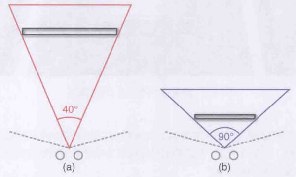
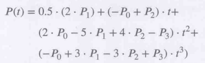

# 8 摄像机

## 各种摄像机

1. 固定摄像机: 常见于带有恐怖元素的游戏, 比较早期, 随着玩家位置选择场景中某个固定的相机使用
2. 第一人称摄像机: 一般在眼睛处放置, 身体采用一个只有手臂或者特殊的部件组成的模型
3. 跟随摄像机: 就是常见的各种第三人称摄像机
4. 场景切换摄像机: 播片尤其是场景展示的片时, 放置在场景各处或者依照设定好的样条曲线移动的摄像机

## 摄像机的参数

1. 视场(FOV): 人眼共有最大180度的视野, 但是能够比较清晰使用的只有中间的120度
2. 显示器的推荐使用距离大约是对角线长度*1.2, 因此显示器通常是电视的主机游戏并不需要太大的视场, 而距离很近的PC游戏则需要更大的视场才不会让人感到难受. 家用机游戏大约需要40-65度, PC游戏需要90度
3.   
4. 视场太大时会有鱼眼效果, 不推荐太大的视场, 最大不要超过120度
5. 游戏的宽高比是射击之初就应该决定好的, 主要是4:3, 16:9, 16:10
6. 一般宽高比切换时都是以16:9作为基准, 切去左右部分来适配其它宽高比

## 摄像机的实现

1. 基础跟随摄像机: 相机eye始终在目标forward的后上方某个固定距离的位置, 相机forward是eye与目标的连线, 相机的forward与目标的up叉乘得到相机自己的left, 然后forward和left叉乘得到相机自己的up
2. 弹性跟随摄像机: 相机以弹性模拟的效果调整eye, 本身是基础跟随摄像机, 视觉效果舒服很多. $加速度 = (弹性常量 * 剩余偏移) - (阻尼常量 * 速度)$
3. 旋转摄像机: eye记录的是相对于目标本身的偏移量, 从而将所有旋转处理为相对于原点的旋转. 通常变量是偏航yaw和俯仰pitch, 一般不桶滚.
4. 计算旋转摄像机有两种思路:
   1. 偏移旋转: 先将向量(0, 1, 0)进行yaw旋转得到forward, 然后配合up向量叉乘出正确的left向量, 再对这个left进行pitch旋转, 得到正确的forward向量, 叉乘得到正确的up向量, 在forward方向上实行和(0, 1, 0)相同的offset偏移即可.
   2. 球面坐标: 直接依据角度计算出球面坐标然后将球半径设置为偏移值即可
5. 第一人称摄像机: 摄像机位置总是角色位置加上某个偏移, 但使用旋转摄像机的思路将target在单位球上进行变换即可. 注意为了防止死锁pitch一般存在取值限制
6. 样条摄像机: 用下面经典的4点Catmull-Rom样条就可以了. 用一个很小的deltaTime来计算两点的差值就可以近似得到切线方向, 切线方向可以作为相机的forward, 很方便
     

## 摄像机算法

1. 最简单的解决摄像机碰撞的方法是从摄像机向目标位置发射射线, 如果碰撞到任何物体那么将摄像机移动到物体前面, 这种方法效果很突兀
2. 另一种方法是用一个物理对象表示摄像机
3. 还有一种流行的方法是让阻挡在中间的对象淡出或消去, 比较自然
4. 相机拣选: 鼠标选择画面中一个2D点, 然后将z补为0和1, 正好是前后投影面. 然后乘上反投影矩阵:$M_{unprojection} = (M_{view} \times M_{projection})^{-1}$得到这两个点的三维坐标. 以这两个点作为射线的起点和终点, 计算t最接近近平面的交点就是相机拣选的结果