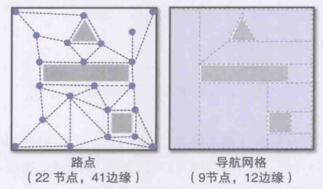
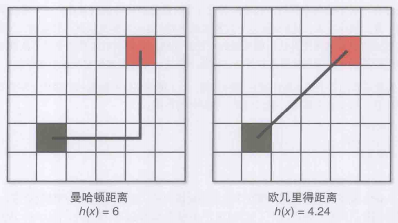
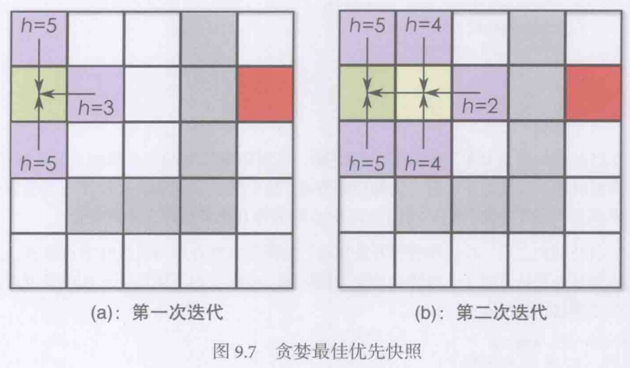
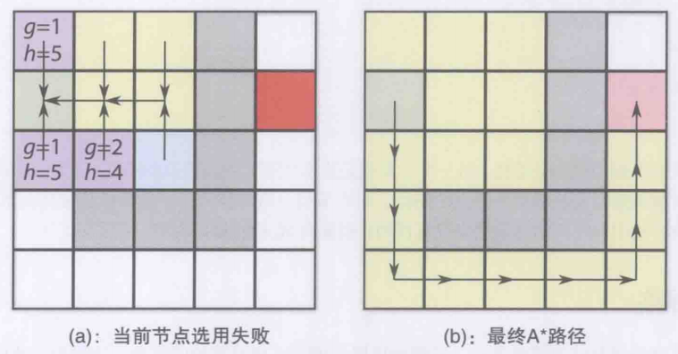
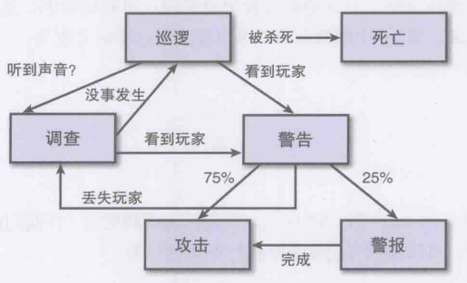

# 9 人工智能

## 寻路基础

1. 理想的寻路算法是求解最短路径, 合适的搜索空间是效率的关键, 但是搜索空间并不影响寻路算法的使用
2. 方格结构: 将世界构造为图数据结构, 世界划分为相等的格子(正方形/六边形), 然后用邻接表或邻接矩阵表示和寻路. 常见于策略游戏中
3. 寻路节点: 在世界中摆放一系列的节点表示可以到达的区域, 节点与节点之间有边连接, AI借助这个图数据进行寻路. 这种方法使得AI只能在边上游走, 显得不自然, 且必须给世界防止足够密集的节点才比较精确, 却又降低了效率
4. 导航网格: 用凸多边形将世界划分, 分为可行和不可行的多边形, 多边形内部都是完全可行的区域(支持任意行走), 多边形本身是寻路的节点(在多边形之间运行寻路算法). 导航网格可以完全自动生成, 且AI行走更加自然, 近年来比较常用
5.   

## 贪婪优先算法

1. 最简单的启发式搜索算法, 核心是利用估算的距离进行节点选择
2. 以正方形网格为例, 根据角色是否允许对角移动, 贪婪优先算法通常使用曼哈顿距离或欧几里得距离来在假定不存在障碍物的情况下对距离估算, 用h(x)表示
3.   
4. 在算法的每一刻, 查看目前路径中还没尝试的位置中, 往哪个位置前进后新的距离是最短的就选择哪一个.
5. 为了避开递归的使用, 对每个节点保存指向上一步的节点的指针prev和当前节点对应的距离值h
6. 然后还需要一个开放集合和一个封闭集合, 分别保存了目前需要考虑的节点和已经无法使用的节点. 其中开放集合通常用优先队列实现(为了快速取出h最小的节点), 封闭集合通常用BST实现(为了快速判断待测节点是否属于封闭集合)
7. 算法:
   1. 首先将起点加入开放集合
   2. 从开放集合中取出h最小的节点, 将这个节点加入封闭集合
   3. 将这个节点周围邻近的非封闭节点加入开放集合, 记入刚才那个封闭节点到这些节点的prev中
   4. 重复2~3直到到达终点, 如果还未到达终点开放集合就为空了, 返回寻路失败
   5. 到达终点后, 从终点节点开始利用prev形成的链表借助栈翻转追溯就能得到终点到起点的路径
   6. 如果将寻路算法改为从终点到起点的寻路就可以避开翻转计算
8.   

## A*算法

1. A\*, 读作A-Star算法, 在贪婪优先算法的基础上更改了寻路估价公式, 每次迭代都选择f(x)最小的节点$f(x) = g(x) + h(x)$, 其中g(x)是当前路径的最小开销
2. A\*的特点是在寻路过程中会根据附近封闭节点的g值来更新自己的g值和prev指针, 从而得到一条尽量短的路径. A\*算法的缺点是计算量比贪心优先更大
3. 算法: 
   1. 首先将起点加入开放集合, 设置好节点的g, h, f
   2. 从开放集合中取出f最小的节点
   3. 遍历这个节点的所有邻接节点, 排除掉所有处于封闭集合的节点
   4. 如果邻接节点不存在于开放集合中, 那么计算这个邻接节点的f, g, h, 其中g值为当前节点的g值加一, 然后压入开放集合
   5. 如果邻接节点存在于开放集合中, 那么比较邻接节点的g值与当前节点的g值, 如果邻接g小于当前g, 那么将当前prev指向这个邻接节点, 然后将当前节点的g设置为这个小邻接g加一
   6. 循环直到遍历完当前节点的所有邻接节点, 将当前节点加入封闭集合中
   7. 和贪心优先算法一样, 重复直到找到最终路径, 此时由于路径动态更新的原因可以得到比贪心优先更好的路径
4.   

## Dijkstra算法

1. 不属于启发式搜索, 特点是代价函数f(x)只考虑当前路径开销g, 不考虑距离估计, 因此需要访问更多的节点, 速度较慢但是能确保得到最优路径
2. 历史: A\*算法是对Dijkstra算法的改良
3. 这类最短路径算法主要用于在图中存在多个目标节点时, 返回最近的节点

## 状态机

1. 现代游戏中的AI角色基本都是状态机驱动的, 例如下图的潜行游戏敌人状态机
2.   
3. 最简单的状态机以一系列的枚举值作为标记, 在update中通过switch来实现不同状态下的AI行为, 通过设置枚举值来切换状态. 这种实现的缺陷是很不灵活, 会导致一个难读的update并难以实现状态代码的复用, 可能需要层层继承和多继承来节约代码, 除非AI非常简单否则不推荐
4. 状态机设计模式: 通过类的组合来实现状态机. 每个对象有自己的状态, 所有状态都继承自AIState基类例如:
   ```C++
   class AIState{
      // 有时候需要通知控制者做一些事
      AIController Parent;
      // 下面是每个状态都需要的函数
      virtual void Update(float DeltaTime) = 0;
      virtual void Enter() = 0;
      virtual void Exit() = 0;
   };
   ```
5. 然后每个状态都依靠AIController类进行切换即可, 实现了状态和状态管理的解耦, 而且方便了代码复用
   ```C++
   class AIController{
      AIState CurrentState;
      void Update(float DeltaTime){
         CurrentState.Update(DeltaTime);
      }
      void SetState(AIState NewState){
         CurrentState.Exit();
         CurrentState = NewState;
         CurrentState.Enter();
      }
   };
   ```
6. AI的描述中, 策略一般指一系列特定的目标, 例如提高总体科技等级等, AI通常有一个优先级容器存放多个策略, 同时选择一个或者多个不冲突的策略作为当前的广泛目标
7. 然后对于每个策略, 都应该能够生成一系列的计划, 也就是AI当前要进行的行为. 通常来说计划由状态机切换来实现, 计划中的每一步都可以是状态机的一个状态, 游戏AI就这样在策略和计划的调控下, 依据状态机来与玩家互动