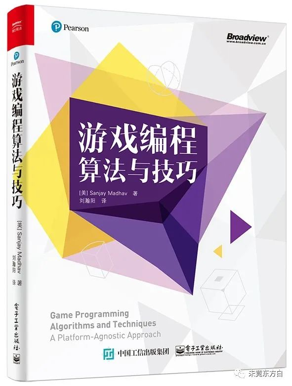

# 游戏编程算法与技巧 笔记

## 封面

  

## 目录

1. [游戏编程概述](./1%20游戏编程概述/README.md)
2. [2D渲染基础](./2%202D渲染基础/README.md)
3. [游戏中的线性代数](./3%20游戏中的线性代数/README.md)
4. [3D图形](./4%203D图形/README.md)
5. [游戏输入](./5%20游戏输入/README.md)
6. [声音](./6%20声音/README.md)
7. [物理](./7%20物理/README.md)
8. [摄像机](./8%20摄像机/README.md)
9. [人工智能](./9%20人工智能/README.md)
10. [用户界面](./10%20用户界面/README.md)
11. [脚本语言和数据格式](./11%20脚本语言和数据格式/README.md)
12. [网络游戏](./12%20网络游戏/README.md)