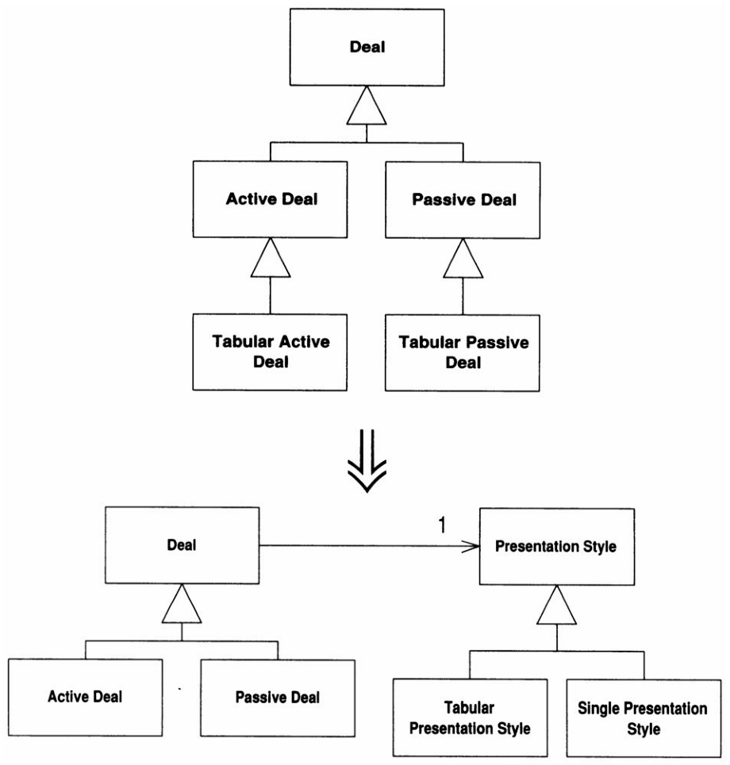
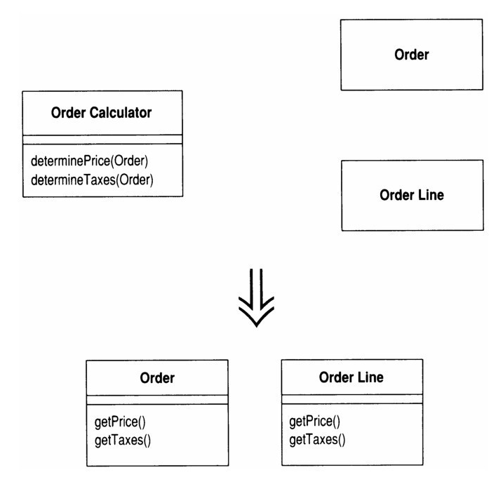
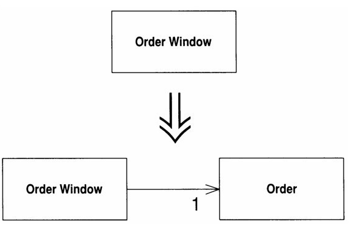
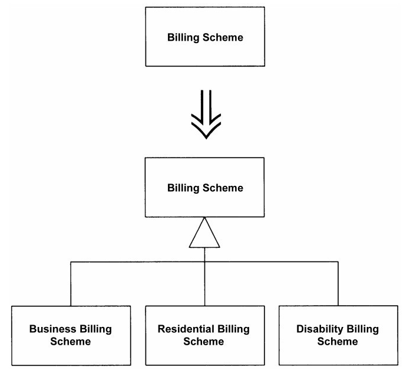

# 12 大型重构

- [12 大型重构](#12-大型重构)
  - [12.1 梳理并分解继承体系](#121-梳理并分解继承体系)
  - [12.2 将过程化设计转化为对象设计](#122-将过程化设计转化为对象设计)
  - [12.3 将领域和表述/显示分离](#123-将领域和表述显示分离)
  - [12.4 提炼继承体系](#124-提炼继承体系)

这是庞大的重构指引, 是前面所有重构技巧的总结, 是需要大量时间和整个团队一起努力才能完成的任务, 目的是优化整个项目的结构, 使得后续开发更稳妥. 大型重构不必要一次性完成, 可以将其摊分在很长时间里, 一点一滴取得进步.

## 12.1 梳理并分解继承体系

  

让每个继承体系只承担一种责任, 最常见的就是让数据显示和数据处理两个部分分离, 让同一套显示代码以参数或委托的形式接受各种不同的数据, 数据则自己处理自己

## 12.2 将过程化设计转化为对象设计

  

将数据变为对象, 将大块的行为切分并移动到数据对象中, 让分离的数据自己可以进行一些计算, 从而方便后续其它的重构而不用被一个大型的过程函数限制.

## 12.3 将领域和表述/显示分离

  

也就是用MVC设计模式设计GUI, 核心是对每个窗口建立一个储存自身数据的领域类(Field), 将与计算和显示通过领域类分离开来

## 12.4 提炼继承体系

  

某个类做了太多工作, 大多数工作是依靠条件表达式分离的, 那么提炼子类. 这是渐进式开发常见的情况, 也是一个非常漫长的重构, 需要仔细设计后再动手, 一切花费的时间都是为了以后更好地开发.

