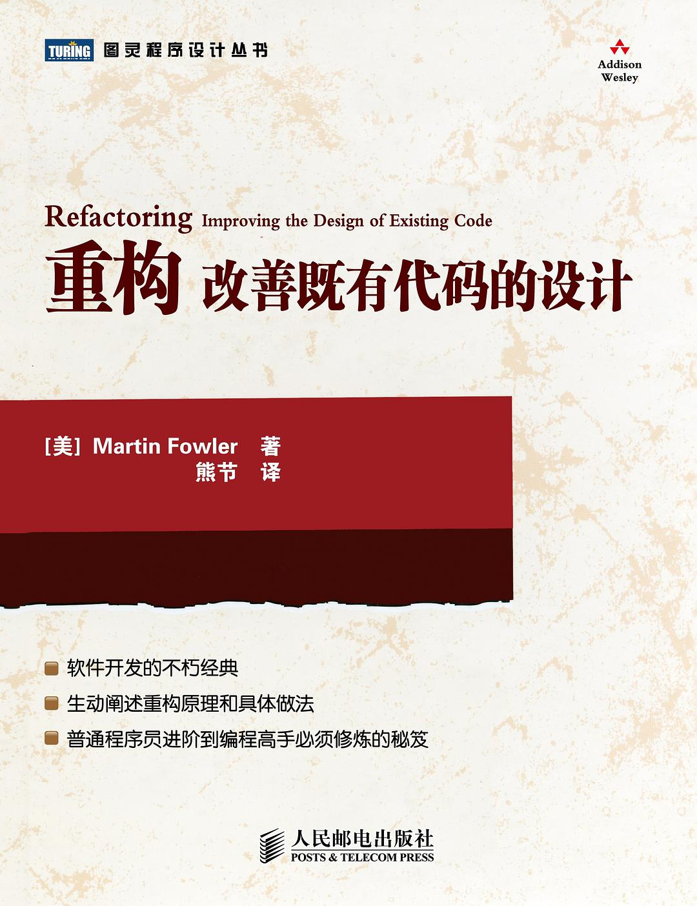
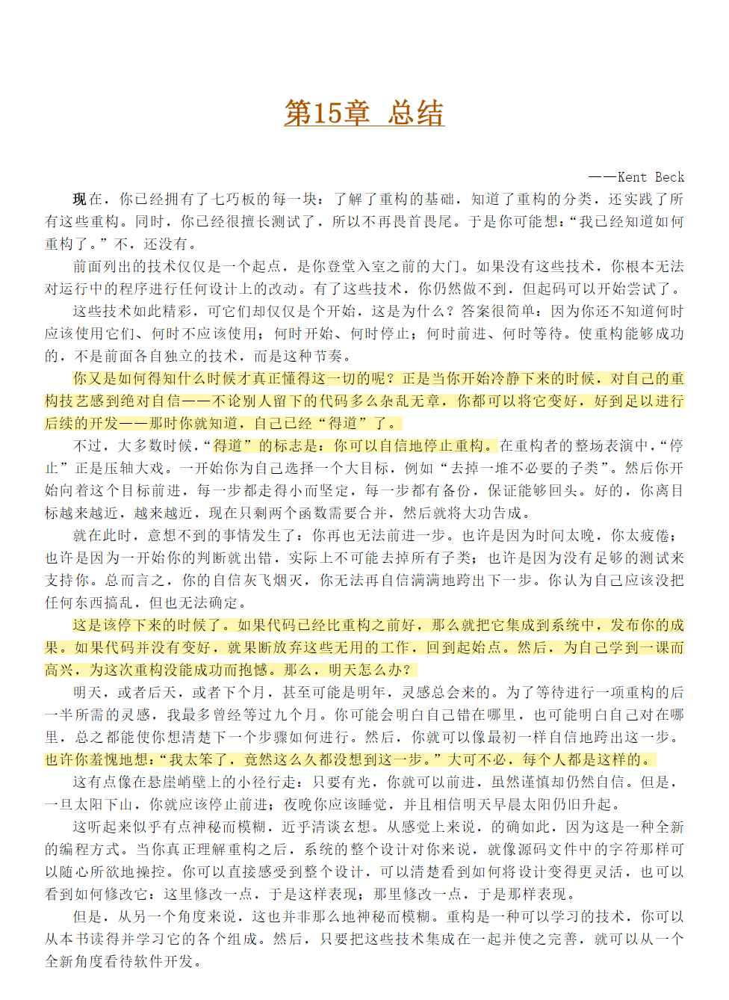
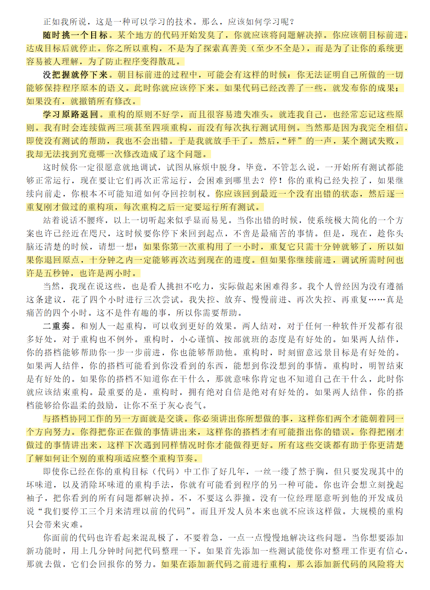
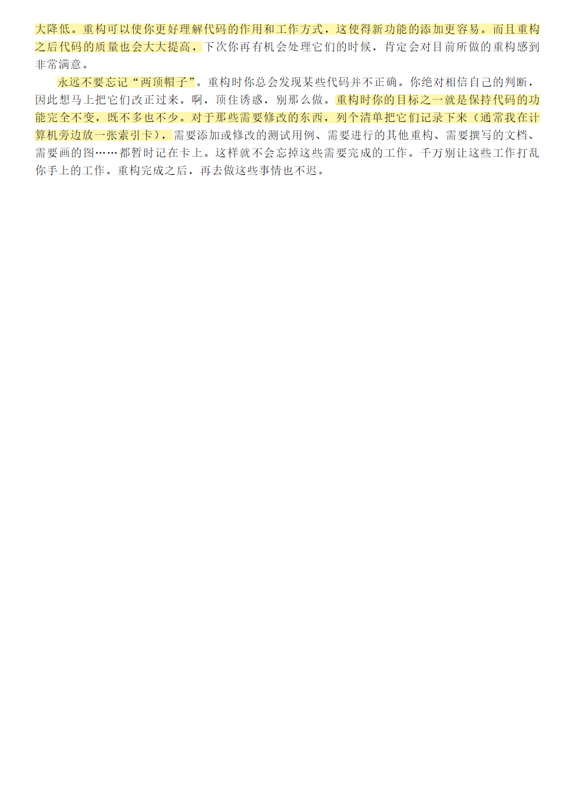

# 重构 笔记

## 封面

  

## 目录

1. [重构, 第一个样例](./1%20重构,%20第一个样例/README.md)
2. [重构原则](2%20重构原则/README.md)
3. [代码的坏味道](./3%20代码的坏味道/README.md)
4. [构筑测试体系](./4%20构筑测试体系/README.md)
5. [重构列表](./5%20重构列表/README.md)
6. [重新组织函数](./6%20重新组织函数/README.md)
7. [在对象之间搬移特性](./7%20在对象之间搬移特性/README.md)
8. [重新组织数据](./8%20重新组织数据/README.md)
9. [简化条件表达式](./9%20简化条件表达式/README.md)
10. [简化函数调用](./10%20简化函数调用/README.md)
11. [处理概括关系](./11%20处理概括关系/README.md)
12. [大型重构](./12%20大型重构/README.md)

13, 14章略

## 15 总结

这是整本书思想上的总结, 值得放在这里牢记

  

  

  
