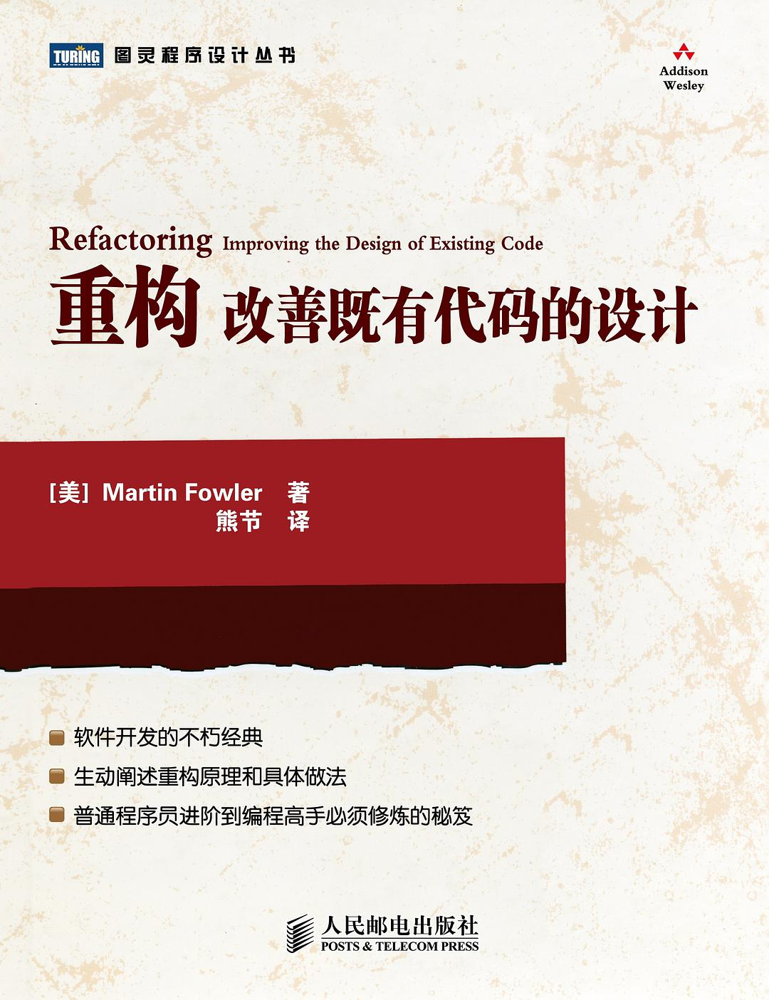
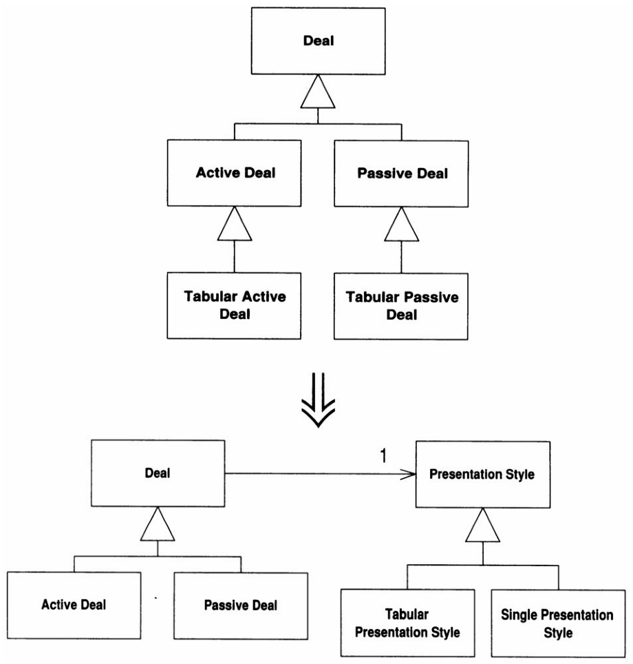
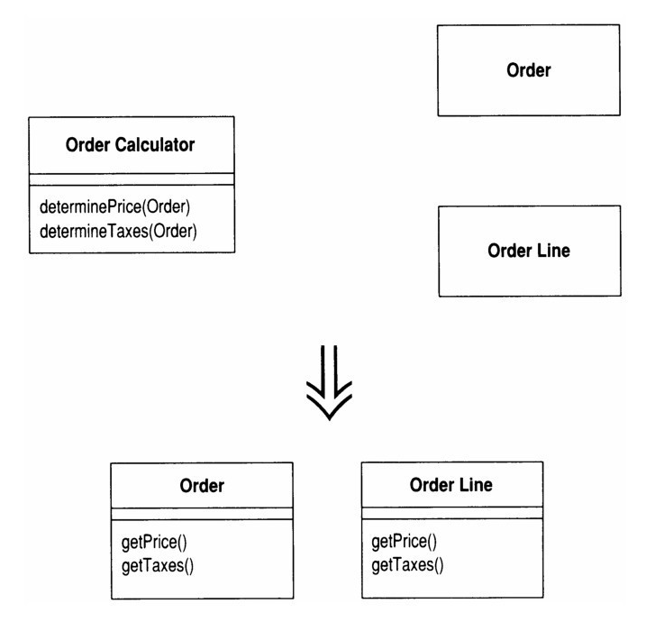
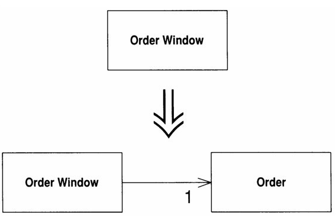
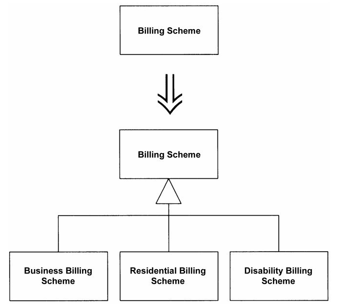
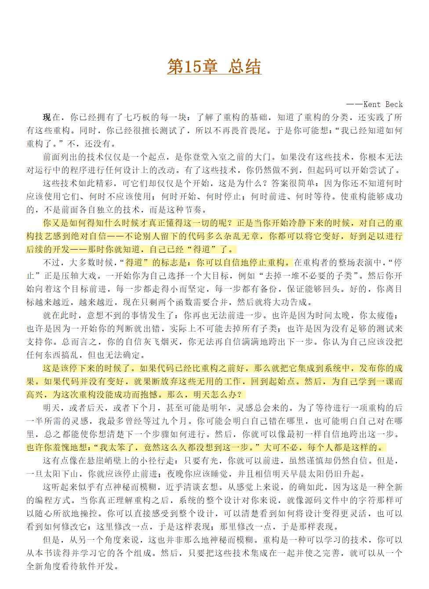
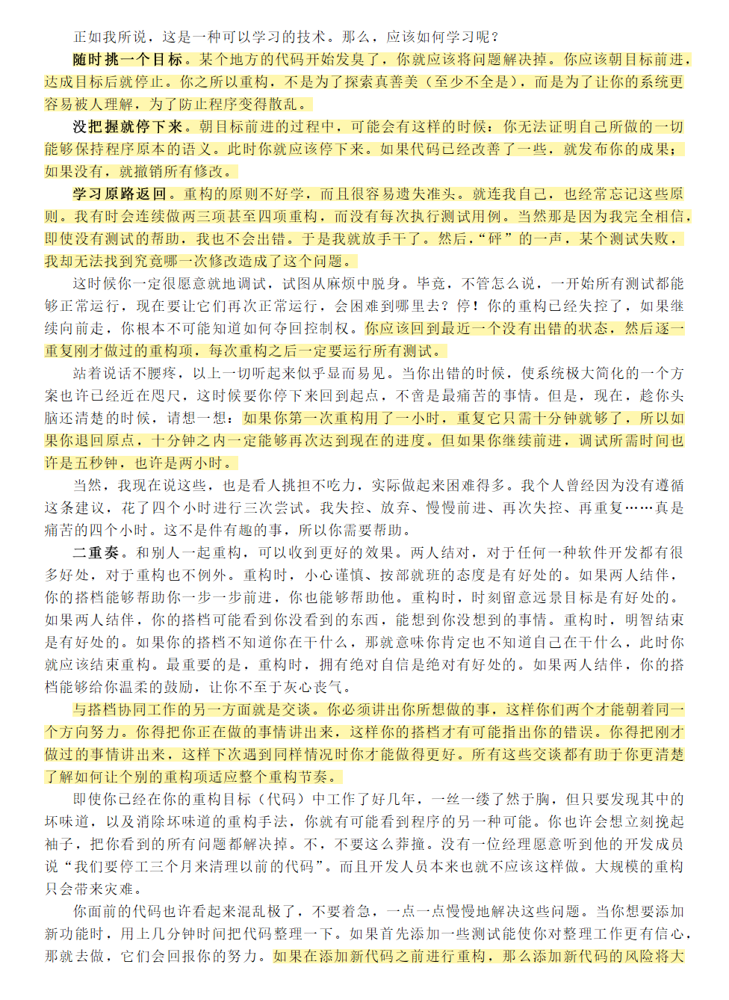

# 重构 笔记

## 封面

  

## 1 重构, 第一个样例

### 1.1 起点

1. 重构是在不改变代码外在行为的前提下对代码进行修改以改进程序的内部结构
1. 太长的函数做了太多的事情是很不好的
2. 差劲的系统很难修改因为很难找到好的修改点, 这导致程序员很容易犯错
3. 通过复制粘贴来完成多个功能很危险, 如果程序要保存很长时间且需要修改, 复制粘贴会造成潜在的威胁, 后来对需求的改变需要同步到多个复制的函数中, 很容易出bug
4. 如果发现需要对程序加一个特性而代码结构很难方便地进行修改, 那么先重构那个程序然后再添加特性

### 1.2 重构的第一步

1. 重构的第一步是为代码建立一组可靠的测试环境
2. 测试需要自动对各种样例进行检验并给出结果, 结果需要自动化指出错误行号等信息减少人工比对
3. 好的测试是重构的根本, 建立一个优良的测试机制会给你的重构必要的保障

### 1.3 分解并重组statement()

1. 代码块越小, 代码的功能就越容易管理, 代码的处理和移动也就越轻松
2. 任何不会被修改的变量都可以作为参数传入新函数
3. 如果只有一个变量会被修改, 那么可以作为函数的返回值
1. 重构时需要不断进行单元测试, 每次进行小修改就进行一下简单的调试, 是的哪怕犯下错误也能很快发现
2. 写出人类容易理解的代码才是优秀的程序员
3. 当不想修改接口时, 先写一个新函数, 然后将其用旧函数来包装可以避免一些接口修改的问题
4. 临时变量只属于函数本身, 容易助长冗长的函数, 且我们容易忘记临时变量的跟踪导致一些意外的错误计算
5. 用函数调用消除临时变量可以让程序更直观, 但是可能会影响性能
6. 在单元测试的时候也应进行时间计算, 最好是分模块的, 这样能够方便进行性能评估. 但是性能优化不要在重构的时候进行, 等到专门的优化时段再来利用留下的信息进行优化

### 1.4 运用多态取代与价格相关的条件逻辑

1. 类的数据应该只属于内部, 最, 对类的数据操作应该在类内进行而不是类外
2. 任何时候都应通过类提供的取值和设值函数来调整类内的变量
3. 每次修改功能后测试的时候应该加多一些暂时的输出确保部件运行正常
4. 重构就应该是反复的”修改-测试“循环, 一步步缓慢朝前推进

## 2 重构原则

### 2.1 何谓重构

1. 重构是对软件内部结构的一种调整, 目的是在不改变软件可观察行为的前提下, 提高其可理解性, 降低其修改成本
2. 与重构形成对比的是性能优化, 性能优化一般也不会影响软件的观察行为, 但是代码的可理解性常常会与效率妥协变得难以理解
3. 软件开发中应该时刻记得把自己分为两种状态：1.添加功能；2.重构. 
4. 添加功能时, 不应该修改与功能无关的代码, 只管添加功能和通过测试
5. 重构时, 不应该添加新功能, 只应该专注于改进程序的结构

### 2.2 为何重构

1. 软件开发之中, 代码不可避免地会越来越乱, 如果永远只是为了短期利益修改代码, 那么程序必然逐渐失去自己的结构. 重构就像是整理代码, 不断提炼代码的意图, 帮助维持代码的形态
2. 改进设计的重要方向就是减少重复的代码, 方便未来对代码的修改
3. 重构模式编程的核心就是理解代码, 然后修改代码, 让代码本身更好地表达出我们的理解
4. 遇到不熟悉的代码时我们也可以进行重构, 重构的途中慢慢理解代码, 然后重新执行看看行为是否正常来验证自己的猜想
5. 随着重构, 我们将在日益简洁的代码中看到一些以前看不到的设计层面的问题
6. ”我不是个伟大的程序员, 我只是个有着一些优秀习惯的程序员“
7. 重构还能提高我们的编程速度, 没有良好设计的时候盲目进行编程也许一段时间内能进展迅速, 但是随着发展会越来越难把握, 未来的开发会越来越困难
8. 良好设计是维持软件开发速度的根本. 重构可以帮助你更快速地开发软件, 因为它阻止系统腐败变质, 它甚至还可以提高设计质量

### 2.3 何时重构

1. 重构不是一件应该特别拨出时间做的事情, 重构应该随时随地进行. 我们不应该为重构而重构, 之所以重构, 是因为我们想做别的什么事时, 重构可以帮助我们把那些事做好
2. 三次法则：第一次做某件事时只管去做；第二次会反感, 但还是可以做；第三次就应该重构
3. 添加功能时：用重构来理解别人的代码令我们快速添加新功能；当发现某些功能重构后可以变得容易添加时可以重构
4. 修补错误：遇到bug时进行, 因为代码结构没有清晰到让我们一眼看出bug
5. 复审代码：重构可以让我们更快理解别人的代码且发现他人代码结构中的问题. 对于他人代码中的错误可以以极限编程的思路直接动手重构, 但是如果项目过大则应该以图示提交重构的思路
6. “如果我们纯粹只是为了今天工作, 明天我将无法工作”
7. 我们希望程序：(1)容易阅读；(2)所有逻辑都只在唯一地点指定；(3)新的改动不会危及现有行为；(4)尽可能简单表达条件逻辑. 

### 2.4 怎么对经理说

1. 最好就是不要告诉经理重构的意图, 我们需要重构来提高开发速度, 那么就尽可能快地完成重构
2. “计算机科学是这样一门科学：它相信所有问题都可以通过增加一个间接层来解决. ”
3. 重构的两种核心思路：找到缺乏间接层的地方, 加入一个间接层. 找到多余的间接层, 删去这种过度设计

### 2.5 重构的难题

1. 重构并不是毫无缺点, 我们应该时时监控重构的行为, 时刻注意重构可能引入的问题
2. 在两个模型之间加入一个分隔层可以隔离两个组件的变化
3. 修改接口是重构的重要事项, 要非常谨慎
4. 普通接口的改名只要直接文本替换就能实现, 但是那些已经发布给外部人员使用的接口则不容易. 对于这种情况最好先让旧接口调用新接口并让两者共存, 标记为“弃用”, 然后在足够久的未来后删去旧接口
5. 对于内部团队可以让其他人自由修改别人的代码, 不要太过强调代码所有权, 这样才能让接口应用更加自由
6. 开发之前不要过度设计, 但也不能不要设计. 应该先思考若出现了某种预期之外的变化, 进行对应的重构会不会过于复杂, 如果会就进行详细设计, 否则就使用最简单的设计哪怕它不够全面
7. 进行重构之前必须保证代码可以基本正常运作, 否则重构无从开始. 如果代码基本无法正常运作, 连测试都很困难, 我们就应该考虑进行重写而非重构
8. 对大型程序进行重构时, 最好将其重构为大量封装良好的小组件的组合, 这样对未来的重构和修改也容易
9. 快速开发的时候常常无法进行重构, 特别是截止日期前不要去重构. 但是日期一过就该进行重构防止未来更大的坑出现, 在坑小时就解决问题

### 2.6 重构与设计

1. 快速开发的关键就是只选择简单够用的设计, 然后着手开发, 再周期性进行重构
2. 很多前期开发时留下的灵活性设计都是无用的, 多选择简单方案即可
3. 度量程序性能很重要, 很多对性能的估测都是错误的, 实验才是检验真理的唯一标准

### 2.7 重构与性能

1. 先写出可调的软件, 然后再进行性能优化, 不要有太多预先设计
2. 三种编写高性能软件的方法：
    1. 预计算每个模块的耗时然后严格按照要求开发的时间预算法, 这种方法对大多数软件都太严苛类
    2. 在开发的时候就持续关注性能的持续关注法, 这种方法容易让程序员耗费优化时间于一些小模块上, 但是优化应该注重于耗时很大的大模块
    3. 先完成设计然后再按照统计数据进行重构优化的统计优化法, 这种方法在前期可能使软件比较慢但是最终还是有好效果, 关键是在后期着重性能大头然后像重构一样反复修改-度量-考虑

### 2.8 重构起源何处

1. 借助重构工具也很重要
2. 依赖统计和性能度量大大优化来重构的效果

## 3 代码的坏味道

### 3.1 重复代码

如果项目内多个地方看到了相同的代码, 那就想办法将其合为一

### 3.2 过长函数

多对大函数进行分解, 每当需要长注释的时候就应该将所需的分段进行包装了, 有时候替换后的函数只包含一行代码也没关系. 

注释, 条件表达式和循环, 都是提炼代码的信号. 提炼的时候可能会产生过长的参数列表, 考虑如何将长参数包装为一个参数对象进行传递

### 3.3 过大的类

和大函数一样, 当某个类负责了太多内容时就会产生冗余和混乱, 最好按照类所进行的工作为每个方法都提炼出接口, 然后慢慢分解

### 3.4 过长参数列

太长的参数列难以理解, 太多参数会造成前后不一致、不易使用, 且一旦需要更多数据就不得不修改它. 因此可以包装一个足够全面的参数类, 然后让目标函数自己从参数对象中获取自己需要的参数

但是有时候不希望两个对象由于大量和互相使用而耦合, 那种时候还是需要适当提炼为函数, 但是还是要保持参数列别太长

### 3.5 发散式变化

我们希望软件能够更容易被修改, 一旦需要修改, 我们希望能够跳到系统的某一点, 只在该处做修改. 如果不能做到这点, 一个类由于外界发生对变化需要进行不同部分对修改时, 发散式变化发生了

这种时候我们应该将这个类进行拆分, 另外界某一功能的修改产生的变化之发生在一个类中

### 3.6 霰弹式修改

和3.5类似, 但这是一个外界变化产生的修改发生在各处. 这种问题需要将所有需要修改的代码整合为一个类集中修改, 如果眼下没有合适的类那就创建一个

### 3.7 依恋情结

如果一个函数高度依赖多个类的属性, 那么应该判断哪个类被这个函数使用得最多, 然后将函数放到这个类中

这也就是核心：总是将一起变化的东西放到一起, 保持变化之在一处发生

### 3.8 数据泥团

总是绑定在一起使用的数据应该拥有属于自己的对象, 判断方法就是删除这堆数据中某个, 看看这堆数据是不是一起失去了意义, 失去了就代表该绑定了

### 3.9 基本类型偏执

不要吝啬使用小对象, 将一些基本类型包装为类很实用

### 3.10 Switch惊悚现身

switch的问题在于重复, 相近的switch常常遍布程序各处. 而我们使用switch的目的常常是达到一种简单的多态, 那更好的选择就是将switch提取为一个函数然后将其放到可以复用的类里

### 3.11 平行继承体系

这是3.6的特殊情况, 我们可能在某个时候发现修改需要发生在两个平行继承的类中（霰弹创建的多个平行类）, 此时可以让一个继承体系的类的实例去引用另一个继承体系的实例, 避免产生新的麻烦

### 3.12 冗赘类

尽管我们需要分解代码来保持逻辑的清晰, 但是一旦我们发现某些类的存在是不必要的, 徒增了理解的难度, 那就要及时将其删除

### 3.13 夸夸其谈未来性

不要过度设计, 绝大多数预先设计都是无用的. 如果我们发现某个设计除了在测试样例中外毫无作用, 那么我们应该讲这个设计连同这个测试样例一起删掉

### 3.14 令人迷惑的暂时字段

如果一个类中有一个复杂算法, 需要好几个临时变量的协作, 那么我们应该将这些操作和变量拆分提取到一个独立类中, 提炼后称为函数对象. 由这个类去维护那些临时变量, 也方便我们传递这些变量

### 3.15 过度耦合的消息链

长长的消息链并不一定是坏事, 有时候是被逼无奈的. 重要的是防止消息链过度耦合, 使得一个小小的修改影响了整个链的运作. 我们应该将消息链尽量提取和拆分, 提炼一些小函数作为链条中间的接口, 当用户可以从链的任何节点开始运行时, 解耦就做得差不多了

### 3.16 中间人

避免太多的委托和中间人的设计, 如果发现某个类和另一个类的交流中有一半以上的接口都由中间人来负责的话, 不如将中间人的相应实现提回对话的两边, 然后消除这个无用的中间人. 中间人应该只负责一点点粘合工作, 两个类间如果可以的话尽量不要中间人

### 3.17 狎昵关系

不要让两个类过于亲密, 大量的private都能互相访问, 我们应该将这种耦合的类的相关方法尽量提取到新的类中, 然后让这两个类一起使用中间类来交互. 

相似的, 如果子类对父类在继承中有了过多的了解, 也应该用委托来减少过多的试探, 和3.16似乎有冲突/取舍, 3.17这里主要是针对访问private的问题

### 3.18 异曲同工的类

如果出现两个函数做着一样的事情但是名称和接口不太一样, 应该尽量将其整合为一个函数, 或者用一个类来包装

### 3.19 不完美的库类

库类的设计有时候也有一些不好的问题, 如果只想修改库类的一两个函数, 可以运用后面的Introduce Foreign Method方法；如果想要添加一大堆额外行为, 就得运用Introduce Local Extension. 

### 3.20 纯稚的数据类

用来管理字段的数据类很好, 但是我们要注意对其进行良好的封装, 尽量少暴露其内部的接口, 并为其设计一些非常常用的功能以物尽其用

### 3.21 被拒绝的馈赠

传统思想中常常告诉我们超类应该是抽象的, 但是这并不是很大的问题, 我们常常需要继承来服用父类的方法, 所以没必要保持抽象. 而且如果遇到了我们需要继承一个类, 可是这个类中有些接口我们不想继承, 不要立刻为父类创建兄弟类, 我们只需拒绝继承超类的实现即可, 其实接口的多余继承并不重要

### 3.22 过多的注释

注释是一种好习惯, 但是当感觉需要撰写注释时, 先尝试重构试着让所有注释都变得多余, 通过提炼函数, 重命名各种函数和变量, 用断言替代注释中的规格声明. 注释的良好运用时机是记述将来的打算和自己都没有十足把握的区域. 这类信息可以帮助将来的修改者, 尤其是将来的自己

## 4 构筑测试体系

### 4.1 自测试代码的价值

1. 想要重构就需要有一个可靠的测试环境. 每个类都应该有一个测试函数并以它来测试自己这个类. 
2. 这个测试还应该有自己的期望输出, 然后在测试中进行自我校验, 确保所有测试都能完全自动化. 
3. 频繁地运行测试, 每完成一小段功能就测试一次, 甚至重构途中的每一小节就测试一次, 由于自动化所以不会太费心, 这样可以及时在思路还没断开的时候轻松解决错误
4. 编写测试的最佳时机就是开始编程新特性之前. 先写测试代码再进行开发, 这也使得我们能先设计好接口, 明确功能再进行开发, 也给工作设下了明确的阶段标识, 一旦测试通过, 一个阶段就结束了. 
5. 频繁测试是极限编程的标识, 只有频繁的测试才能加速我们的开发, 少数的测试就能大大提高开发效率. 
6. 测试一种方法是对每个类都有自己的testing函数负责校验功能, 但是这样不太好操控, 更好的方法是建立一个独立类, 在一个外部框架中进行测试

### 4.2 JUnit测试框架

1. 我目前不写java所以这个东西的实际使用对我意义不大, 但是还是很有启发
2. 写一个专门的测试框架来负责各种测试时间计算, 测试结果输出等操作
3. 然后测试框架调用子测试函数/类, 负责将测试分块, 每一块都有自己的理想输入和输出
4. 子测试类内部调用各种待测函数
5. 为了时间考虑, 应该将测试分块, 每次只测试一小段即可, 这样才比较快. 但是最好每天都进行一次完整测试, 测试最重要的就是不要嫌麻烦. 
6. 测试机制自己也需要有测试, 但是不用太复杂因为测试本身的逻辑就不是很复杂
7. 开发者重要的是单元测试, 也就是测试各种接口. 功能测试是测试人员负责的

### 4.3 添加更多测试

1. 测试应该是一种风险驱动的行为, 目的是希望找出现在或未来可能出现的错误, 所以太简单的功能是不需要测试的, 只测试最容易最担心出错的部分
2. 编写不完整的测试并实际应用, 好过等待一份完整的测试而迟迟不动手
3. 要有特殊的命名习惯, 所有测试函数都以test起头然后作为用例被包含
4. 测试的重要技巧是寻找各种边界条件, 专注于如何破坏自己的代码
5. 测试不单单要测试正确情况, 也要测试意外情况是否被正确捕获
6. “花合理时间抓出大多数bug”要好过“穷尽一生抓出所有bug”. 应该把测试集中在关键地方, 别让编写测试占用太多时间
7. 不用测试每种多态组合, 尽量测试每个子类就ok了

## 5 重构列表

1. 这一小节介绍了笔记重构信息的方法和重构的注意事项
2. 先命名, 如何写个简要的摘要和动机, 再写做法, 再给出一个范例
3. 摘要应该一句话给出重构的意义, 一句话给出大致做法, 再用uml图之类的草图展示重构前后的变化
4. 应该多借助文本查找工具甚至内置数据库来查找引用点, 比人工查找快准狠
5. 也可以借助编译器找出各种重构途中带来的引用错误
6. 重构的基本技巧是小步前进, 频繁测试
7. 设计模式是我们期望到达的目标, 而重构则是到达之路

## 6 重新组织函数

### 6.1 提炼函数

当看见一个过长的函数或者一段需要注释才能理解用途的代码, 就会将这段代码放进一个独立函数. 只有当能够对小型函数合适地命名时, 它们才能很好地起作用. 

命名的关键在于函数名称和本体之间的语义距离. 如果提炼可以强化代码的清晰度, 那就去做, 就算函数名称比提炼出来的代码还长也无所谓. 只要新名字能更清晰地表现代码, 那就改名, 但如果想不出更好的名字, 那就别动. 

提炼的困难点在于临时变量和局部变量的处理, 最简单的方法是用参数来连接, 如果变量太多可能需要用到参数对象之类的进一步方法. 当后续代码需要用到这些变量时, 用返回值进行连接, 尽量让返回变量的命名足够清晰, 别老用result之类的模糊的词. 返回值尽量保持只有一个, 需要多个返回值很多时候就是提炼还不到位. 

### 6.2 内联函数

是“提炼函数”的反操作, 有时会遇到某些函数的内部代码和函数名称同样清晰易读. 果真如此就应该去掉这个函数, 直接使用其中的代码. 间接性可能带来帮助, 但非必要的间接性总是让人不舒服. 

另一种情况是：手上有一群组织不甚合理的函数, 可以将它们都内联到一个大型函数中, 再从中提炼出组织合理的小型函数, 也就是分层处理, 以比较大比较合理的模块进行重构会比较轻松. 

如果内联需要进行的额外操作非常多例如破坏了一体性, 破坏递归等等, 那么就不应该进行内联. 

### 6.3 内联临时变量

有一个临时变量只被一个简单表达式赋值一次, 而它妨碍了其他重构手法.  将所有对该变量的引用动作, 替换为对它赋值的那个表达式自身. 这一条和下一条一般一起出现. 

### 6.4 以查询取代临时变量

程序以一个临时变量保存某一表达式的运算结果. 将这个表达式提炼到一个独立函数中. 将这个临时变量的所有引用点替换为对新函数的调用. 此后, 新函数就可被其他函数使用, 这个重构是为了简化其他的重构步骤, 因为临时变量是重构的大敌, 驱使着我们写出更长的代码. 

有时候会遇到带有计数的临时变量, 可以尝试将循环提炼出来使得计数也被提炼到查询中. 

和其他性能问题一样现在不用管, 因为十有八九根本不会造成任何影响. 若是性能真的出了问题也可以在优化时期解决它. 代码组织良好往往就能够发现更有效的优化方案：若没有进行重构, 好的优化方案就可能失之交臂. 如果性能实在太糟糕, 要把临时变量放回去也是很容易的. 

### 6.5 引入解释性变量

这是上面两条的反操作, 但是目的是类似的. 你有一个复杂的表达式, 将该复杂表达式（或其中一部分）的结果放进一个临时变量, 以此变量名称来解释表达式用途. 尽管提取出名称更合适的函数更实用且常用, 但当提取函数非常难以进行时, 引入解释性变量就可解燃眉之急. 

### 6.6 分解临时变量

你的程序有某个临时变量被赋值超过一次(承担多种责任)，它既不是循环变量，也不被用于收集计算结果。针对每次赋值创造一个独立对应的临时变量来表达, 防止读者混乱

### 6.7 移除对参数的赋值

千万不要对参数进行赋值, 尽全力使得参数只用来表示(传进来的东西), 而对于拥有返回参数特性的语言, 除非性能瓶颈之类的考虑, 尽量不要用这种技巧. Java可以将参数标记为final来防止参数的重新赋值.

### 6.8 以函数对象取代函数

当大型函数对局部变量的使用使你无法采用ExtractMethod(110)时, 将这个函数放进一个单独对象中，如此一来局部变量就成了对象内的字段。然后你可以在同一个对象中将这个大型函数分解为多个小型函数。例如让外部对此的调用都变为: 初始化一个对象, 然后调用对象的compute()方法. 这种优化可以使得你减少参数的传递.

### 6.9 替换算法

重构就是使得能以清晰的方式取代复杂的方式, 尽量减少重复性, 提高复用能力. 遇到一个屎山时, 先一步步对复杂函数进行分解但保留外部接口一致, 直到最后能完全替换掉复杂函数时再开始具体的算法优化.

## 7 在对象之间搬移特性

### 7.1 搬移函数

当有类中有一个函数对于另一个类有着更多的交流, 也就是与另一个类高度耦合, 那么将这个函数搬移到那个类中.

有时候即使移动了其他函数还是很难对眼下这个函数做出决定。这也没什么大不了的。如果真地很难做出决定，那么或许“移动这个函数与否”并不那么重要。

将源函数的代码复制到目标函数中。调整后者，使其能在新家中正常运行。如果目标函数使用了源类中的特性，你得决定如何从目标函数引用源对象。如果目标类中没有相应的引用机制，就把源对象的引用当作参数，传给新建立的目标函数。如果源函数包含异常处理，你得判断逻辑上应该由哪个类来处理这一异常。如果应该由源类来负责，就把异常处理留在原地。如果你经常要在源对象中引用目标函数，那么将源函数作为委托函数保留下来会比较简单。

如果目标函数需要太多源类特性，就得进一步重构。通常这种情况下，我会分解目标函数，并将其中一部分移回源类。

### 7.2 搬移字段

某个字段被其所驻类之外的另一个类更多地用到。在目标类新建一个字段，修改源字段的所有用户，令它们改用新字段。为了稳定搬运, 都是先在目标类建立相同的字段和对应的设/取值函数, 然后慢慢对接直到最终从源类中删除字段. 这里提醒了建立设/取值函数能使得后期需要修改引用点功能的时侯不会太困难

### 7.3 提炼类

某个类做了两个类的事情时, 适当地将其切分为两个.如果某些数据和某些函数总是一起出现，某些数据经常同时变化甚至彼此相依，这就表示你应该将它们分离出去。如果某些数据和某些函数总是一起出现，某些数据经常同时变化甚至彼此相依，这就表示你应该将它们分离出去。

分离的时侯记得先分离低层函数再搬移高层函数, 然后搬移后尽量不要建立新旧类之间的链接. 旧类一般分离后都是类似基类的存在, 可以适当缩紧访问控制.

### 7.4 将类内联

7.3的反操作, 当一个类没做多少事情时将其特性搬运到基类中.

### 7.5 隐藏委托关系

客户通过一个委托类来调用另一个对象, 在服务类上建立客户所需的所有函数，用以隐藏委托关系。这种封装使得客户可以尽可能少地了解底层原本的实现, 同时也要调整客户令其只调用委托类.

### 7.6 移除中间人

7.5的反操作, 原先的类的复杂程度已经完全不方便导致客户需要频繁调用委托类, 但是委托类并没有做多少额外的操作, 单单是不停转发源类的操作时, 直接把委托类去掉令客户调用源类更加方便

### 7.7 引入外加函数

当需要给一个无法修改的类添加功能时, 可以在客户中建立一个函数以参数形式接受目标类, 然后自己包装新的功能. 但这种做法只是权宜之计, 可以话还是修改目标类解决最好.

### 7.8 引入本地扩展

和7.7类似, 但是更进一步, 使用一个新的类包装老的类来扩展功能. 新的类必须要包含老的类的所有功能, 这种新类称为本地扩展, 必须保证在任何使用原类的地方都可以用本地扩展替代

本地扩展的实现有包装类(原类是新类的一个成员)和子类(原类是新类的基类)两种, 通常子类比较好实现, 但是需要接管原类的构造, 在原类构造后则只能通过逐元素拷贝构造来实现副本, 而包装类能做到的事情更多, 用户应该能够自然地将包装类当作原类使用.

一般来说, 本地扩展应该只添加新函数而非覆写, 防止增加用户的学习成本和防止混淆

## 8 重新组织数据

### 8.1 自封装字段

直接访问字段时, 字段之间越来越耦合, 此时应该用设/取值函数来包装字段, 提供访问字段的更复杂的功能, 并进一步优化子类访问字段时的能力. 一般来说为了方便可以先直接访问, 直到需要增加访问功能的时侯再使用设/取值函数.

要注意初始化途中最好少用设/取值函数, 防止语义混淆. 建议额外建立数据初始化函数. 处理数据项时, 最好让值对象是只读的, 也就是get函数返回副本, set函数创建新对象. 这样能防止用户使用的时侯出现一些引用别名问题

### 8.2 以对象取代数据值

当一些数据必须依赖于其它数据才有存在的意义(例如xyz坐标)时, 将这些数据进一步包装为数据对象减少耦合.

### 8.3 将值对象改为引用对象

8.1的Tips的进阶版, 主要是修改get的返回值令其返回引用. 当我们需要返回的一个应该同步改变且拷贝代价较大的对象时使用.

### 8.4 将引用对象改为值对象

8.3的反面, 对于那些很细小且不太应该同步改变的数据项返回内部不可变的一份拷贝, 在分布式系统中这种不可变对象比较常见因为不用太考虑同步问题. 也就是确保返回回来的值我们可以随意修改且不管什么用户在一个阶段内get的都是同一份值

### 8.5 以对象取代数组

简单的数组结构保存多个数据不够精准明了, 用对象包装这个数组并用设/取值函数作为入口, 然后将内部的数组写为private

### 8.6 复制"被观察数据"

主要是GUI编程会遇到的问题, 核心是观察者模式, 令GUI显示的代码与内部处理业务数据的代码分离开, 让GUI组件仅负责传递输入输出指令和结果, 后台业务代码负责真正的设值计算. 通常上也就是GUI类只有get, set和update函数, 后端业务代码处理算法逻辑, 然后额外建立一个领域类, 领域类中存放了用于计算的数据, GUI只保存用于显示的数据, 与领域类脱离. 后端结构处理领域类中的数据后, 调用update刷新显示GUI的数据.

### 8.7 将单向关联改为双向关联

当两个类都需要对方特性时, 繁复的get/set不够方便, 使用两个指针来直接操作对方数据. 通常关联有主次之分, 一对多的情况下, 那个一就是主, 负责更多的控制函数, 一对一或多对多时则无所谓.

### 8.8 将双向关联改为单向关联

8.7的反面, 主要是防止大量的引用导致的僵尸对象, 也就是某个对象已经死亡了但是由于主控制类对其的引用还存在所以始终不被清理. 方法是重新用设/取函数替代指针调用.

### 8.9 以字面值取代魔数

主要就是使用常量给魔数命名来提高代码的可读性

### 8.10 封装字段

也就是public转private

### 8.11 封装集合

有时候用户需要繁复的设/取值函数来控制目标类, 改为拷贝一个精简的副本(clone)打包供用户自己内部使用, 同时避免了用户始终在目标类上直接操作.

### 8.12 以数据类取代记录

通过数据类来分析记录类数组的元素并替代

### 8.13 以类取代类型码

如果类型码不会影响当前类的行为的话(例如仅用于一些常量函数), 用一个小小的类包装一下名称即可, 如果会影响当前类则应该考虑使用多态处理. 经过包装后的类型码主要是为了方便后续修改时的引用点查找, 提高代码的可读性而不是仅仅看着一堆不明所以的数字, 还适配了编译器的类型检查.

### 8.14 以子类取代类型码

8.13的进阶, 对于会影响目标类行为的类型码, 可以尝试用多态子类来处理, 用工厂函数包装和类型码有关的目标类, 然后返回不同的子类, 这样未来也方便进行扩展, 尽量保证与类型码相关的switch只出现在工厂函数中.

### 8.15 以状态/策略对象取代类型码

8.14的扩展, 对于无法经过多态处理优化的类型码场景, 例如某个对象携带的类型码自身在运行中会变化, 则应该使用状态/策略设计模式. 首先建立一个类并按照类型码用途进行命名, 这是状态对象. 然后为这个类添加对应各个类型码的子类, 然后在我们的目标类中保存这个类型码类, 增加对应的set函数, set函数会从工厂函数生成所需的类型码对象. 目标类后续的switch以这个类型码对象进行判断, 和8.13相似, 区主要是8.13的目标类不负责有关类型码的计算, 仅仅承载储存功能.

### 8.16 以字段取代子类

当很多子类之间的差别仅仅是返回的某个常量数据不同的时侯, 直接将这个常量数据字段放到基类中然后撤销这些子类, 因为仅有常量函数不同的子类没有足够的价值, 徒增复杂性而已.

## 9 简化条件表达式

### 9.1 分解条件表达式

不要在if-else中写太复杂的逻辑, 改为在if-else中调用子函数提高代码可读性, 让代码就像注释一样清楚

### 9.2 合并条件表达式

如果多个if检测条件不同但结果相同, 则用一个命名合适的函数将这多个if合在一起简化. 这个重构要注意不要引发副作用且要保证语义的完整性和可读性

### 9.3 合并重复的条件片段

一组条件表达式中都出现了相同的代码, 那么将这段代码包装好并提炼到条件式外面

### 9.4 移除控制标记

尽量用break, continue, return语句代替isDone之类的循环跳出标记, 这种做法虽然不那么适合"单一出口原则", 但能让语义更清晰, 看着办吧.

### 9.5 以卫语句取代嵌套条件表达式

条件表达式通常有两种表现形式。第一种形式是：所有分支都属于正常行为。第二种形式则是：条件表达式提供的答案中只有一种是正常行为，其他都是不常见的情况。如果是第一种则应该用if-else组合, 而如果是第二种则单独检查那些特殊条件, 并将这些条件视为一个特殊的if直接跳出函数, 强烈表达我们对出现这种情况后的代码不再感兴趣了. 这种风格同样会破坏单一出口原则, 但是很多时候代码更清晰.

### 9.6 以多态取代条件表达式

和第8章对于类型码的处理类似, 就是将switch提前到基类工厂函数的意思

### 9.7 引入null对象

null对象模式的核心是构造一种特殊的多态子类, 其是我们正常多态的分支, 可以和普通对象一样调用各种我们所需的功能, 但是其回应都是之前对象为null时应该返回的特殊值, 并带有isNull函数用来做基础判断. 这种模式一般都是用在与用户交互的任务中, 例如GUI环境, 能减少很多复杂的null判断.

本质上null对象模式属于Special Case模式(特例类模式), 最常见的就是float标准的NaN特例

### 9.8 引入断言

断言(Assert)本身就是一个特殊的条件语句, 用来表示那些由于程序员错误导致某些函数无法进行的致命问题. 断言通常都是debug阶段使用的, 在正式版本中断言会被全部移除因为普通用户不应该触发断言

## 10 简化函数调用

### 10.1 函数改名

函数名应该和注释一样清晰, 让人可以只看名字就理解函数用途

### 10.2 添加参数

过长的参数列不是好事情, 小心着点

### 10.3 移除参数

随便移除参数也很危险, 当对代码不是完全清楚时, 不要随便移除参数, 应该自创一个新的包装函数来完成需求

### 10.4 将查询函数和修改函数分离

对于任何一个有返回值的函数都不应该有看得到的副作用(内部优化查询缓存之类的操作是允许的), 应该将设值和取值功能分离. 当有返回值提供给调用者时, 必须确保返回值是可丢弃的.

多线程系统中常常有在同一个函数中完成检查和赋值操作(同步锁操作)的情况, 这种情况是允许的, 最好将这类函数清楚命名为synchronized, 然后作为设/取值函数外的第三种函数单独提供, 且其内部最好还是分别调用私有的设/取值函数组成.

### 10.5 令函数携带参数

多个命名不同但是内部行为类似的函数, 应该用参数取代混乱的命名.

### 10.6 以明确的函数取代参数

10.5的反面, 主要是当参数可选范围很小时, 提高语义的清晰度使用.

### 10.7 保持对象完整

是一个有两面性的重构, 主要是考虑传参的时侯要传数据对象还是只传对象中的某些数据项. 一般来说传整个数据对象更方便也更清晰(甚至直接传递this指针), 但是只传参可以提高函数的泛用性, 降低耦合度.

### 10.8 以函数取代参数

当某个函数的某个参数固定由另一个函数提供时, 将这个函数调用吸收到这个函数内简化参数列表. 当然如果这个提供值的函数调用依赖于调用者那我们就无法精简这个参数, 但是这种情况出现说明这几个函数可能耦合了

### 10.9 引入参数对象

同8.2将数据团包装为数据对象

### 10.10 移除设值函数

提供设值函数暗示这个字段可以随时改变, 如果你不希望这个字段在创建后改变的话就移除这种函数同时将字段设为final

### 10.11 隐藏函数

没被其它类用到的函数就设为private, 尽全力降低类的可见度

### 10.12 以工厂函数取代构造函数

同 8.14以子类取代类型码 的优化

### 10.13 封装向下转型

需要函数调用者执行向下转型的操作, 不如自己用函数封装起这个下转型操作来提高语义清晰度, 别让用户承担这些风险. 编译器能自动将子类上转型, 所以设计得当后无须提供上转型函数

### 10.14 以异常取代错误码

这个重构和执行效率有冲突, 其余没什么特别的

### 10.15 以测试取代异常

如果某个异常调用者自己就可以避免的话, 让调用者提前测试并正常返回来避免引发异常

## 11 处理概括关系

### 11.1 字段上移

两个子类拥有相同字段时, 上移到基类, 注意别破坏访问控制性

### 11.2 函数上移

同11.1, 这类操作能大大减少测试难度. 如果两个函数相似但不相同, 则可以试着用模板类来优化并提取

### 11.3 构造函数本体上移

只在子类中保留构造函数有区别的部分, 然后主体通过调用基类构造来实现

### 11.4 函数下移

11.2的反面, 主要是当一些子类完全用不到某个操作时下移

### 11.5 字段下移

同11.4

### 11.6 提炼子类

当某些方法只被某些实例使用(一般是受到类型码影响)时, 提炼子类, 用继承取代

### 11.7 提炼超类

类似11.6, 将相似特性融合, 最小化重复的代码

### 11.8 提炼接口

实际上就是多继承在Java中的替代品

### 11.9 折叠继承体系

将基类和子类合并

### 11.10 塑造模板函数

就是使用模板来提炼那些操作流程相似只是类型不同的函数. Java实现起来复杂一些

### 11.11 以委托取代继承

当子类只使用到基类的一部分方法和字段时, 可以去掉继承关系, 用一个字段保存基类, 然后改为委托基类处理所需的功能. 成本是需要在基类中增加委托函数, 但一般难度不大

### 11.12 以继承取代委托

11.11的反面, 当委托了太多基类函数时, 干脆就收了吧. 但是要注意改为继承之后就无法令多个对象共享基类数据了, 因为数据共享是委托才能处理的功能, 需要权衡

## 12 大型重构

这是庞大的重构指引, 是前面所有重构技巧的总结, 是需要大量时间和整个团队一起努力才能完成的任务, 目的是优化整个项目的结构, 使得后续开发更稳妥. 大型重构不必要一次性完成, 可以将其摊分在很长时间里, 一点一滴取得进步.

### 12.1 梳理并分解继承体系

  

让每个继承体系只承担一种责任, 最常见的就是让数据显示和数据处理两个部分分离, 让同一套显示代码以参数或委托的形式接受各种不同的数据, 数据则自己处理自己

### 12.2 将过程化设计转化为对象设计

  

将数据变为对象, 将大块的行为切分并移动到数据对象中, 让分离的数据自己可以进行一些计算, 从而方便后续其它的重构而不用被一个大型的过程函数限制.

### 12.3 将领域和表述/显示分离

  

也就是用MVC设计模式设计GUI, 核心是对每个窗口建立一个储存自身数据的领域类(Field), 将与计算和显示通过领域类分离开来

### 12.4 提炼继承体系

  

某个类做了太多工作, 大多数工作是依靠条件表达式分离的, 那么提炼子类. 这是渐进式开发常见的情况, 也是一个非常漫长的重构, 需要仔细设计后再动手, 一切花费的时间都是为了以后更好地开发.

## 15 总结

这是整本书思想上的总结, 值得放在这里牢记

  

  

  