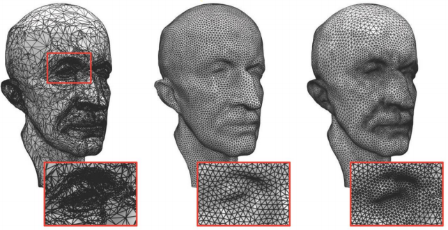
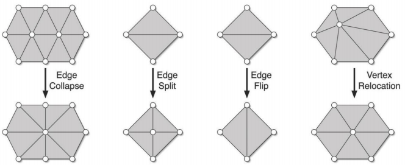
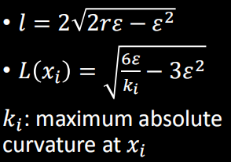
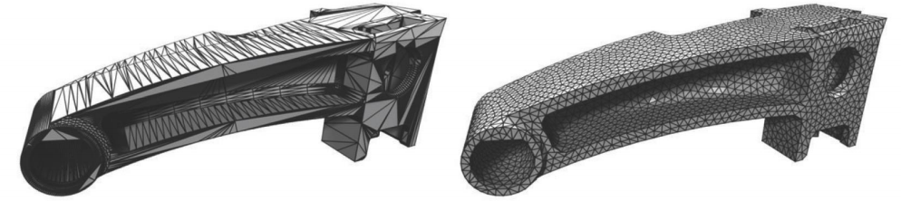
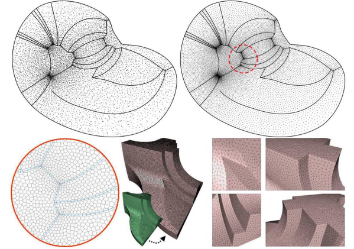
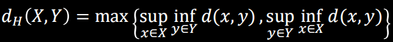
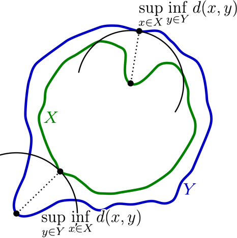
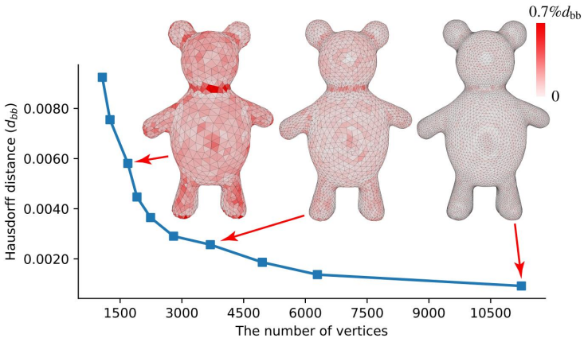
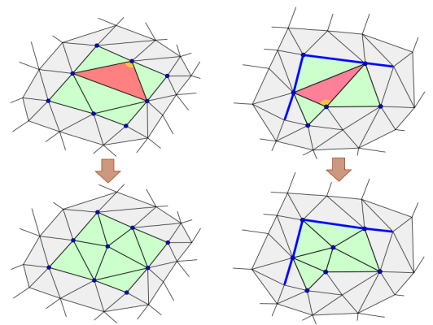
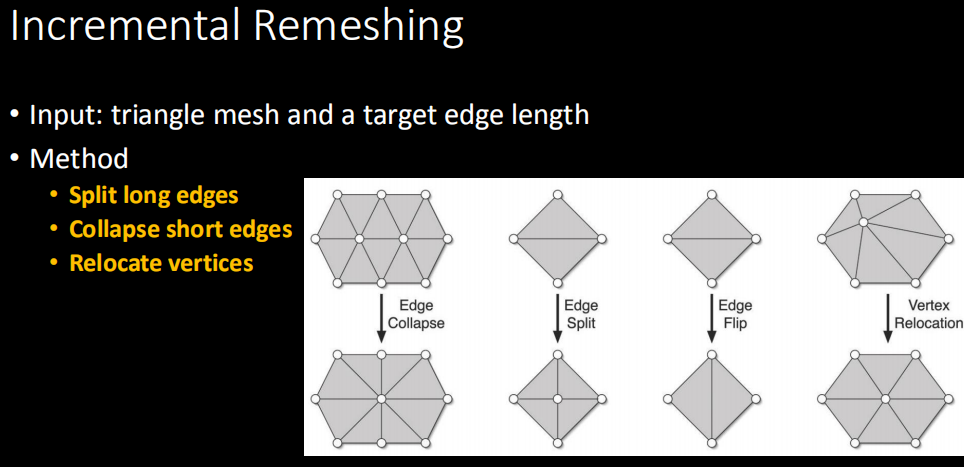

# 14 Remeshing 网格重划分

- [14 Remeshing 网格重划分](#14-remeshing-网格重划分)
  - [基本概念](#基本概念)
  - [增量重划分](#增量重划分)
  - [基于参数化的重划分方法](#基于参数化的重划分方法)
  - [重划分质量评估](#重划分质量评估)
  - [基于误差的重划分](#基于误差的重划分)
  - [基于角度的重划分](#基于角度的重划分)
  - [不知为何课程没有讲完这个ppt](#不知为何课程没有讲完这个ppt)
  - [作业](#作业)
  - [作业笔记](#作业笔记)

## 基本概念

Remeshing, 也就是网格重划分, 目的是将一个原本分割得很乱的网格在保持整体细节尽量不丢失的情况下转为比较规则的网格, 目的是便于储存和参数化, 降低表面复杂度, 进行压缩, 优化几何特性, 提高网格质量等.

重划分主要分为两个大类: 各向同性方法和各向异性方法. 各向同性方法对全局都按照类似的划分规则进行, 例如下面中间图让全局的三角形都是大小相同的等边三角形, 各向异性方法则根据网格自身的一些特性例如梯度和曲率等几何信息使用不同的划分方法, 例如下面右图在曲率大的区域使用了更小的三角形以更好地保存网格形状.

  

大多数重划分算法有下面的几点追求:

- 在细节丰富的区域用更多的顶点和更小的网格来表现
- 尽量保持网格规则, 减少奇异点的存在. 对三角形网格来说, 度不为6的顶点是奇异点, 对四边形网格来说, 度不为4的顶点是奇异点
- 网格排布符合原网格曲率方向
- 网格对齐形状细节特征, 保持高频特征不丢失, 划分后网格锐利的边界仍然保持. 
- 不要产生例如破洞的拓扑问题

## 增量重划分

这是文章A Remeshing Approach to Multiresolution Modeling的思路, 是一种很简单的重划分方法, 目标是将网格重新划分为大致由规则三角形组成的形式, 每个三角形都尽量符合指定的边长. 核心操作如下:

1. 遍历网格所有边, 当边的长度长于$\frac{4}{3}*$目标边长时, 这个边被认为过长, 选取这个边的中点进行分割, 并连接顶点周围的边
2. 再遍历网格所有边, 当边的长度短于$\frac{4}{5}*$目标边长时, 这个边被认为过短, 将这条边两端的顶点溃缩为一个, 顶点放在在中间位置, 并调整周围的边
3. 若溃缩后的边过长, 则撤销溃缩操作
4. 然后计算网格每个四边形中各个顶点的度与6的绝对值差的和, 尝试判断能否交换四边形中的边使得这个差值变小, 如果可以则交换
5. 对改变后的网格用拉普拉斯算子计算顶点的平滑位置, 作为三维上的顶点新位置
6. 用AABB树的思路将平滑后的新顶点投影到变换前的源表面上最近点的切平面上, 这样能够让重划分后的表面与原始表面形状尽量相同, 公式: $p'=q+nn^t(p-q)$
7. 重复以上步骤10次得到较稳定的重划分网格, 各种操作的示意图如下:

  

除了这种基础的重划分算法, 还有根据表面曲率自适应改变目标边长的算法:

  

在重划分中, 还要保证高频特征不要丢失, 具体来说:

- 有两条及以上的高频的边界线汇聚的点不应该进行任何操作
- 边界线上的点的操作必须保持在边界线上
- 分割边界线上的边会产生两个边界线且点也在线上
- 边界线的点不应该发生交换
- 平滑操作应尽量保留这些特征

如果遵守了这些需求就能得到下图的重划分效果:

  

## 基于参数化的重划分方法

直接在三维进行的重划分由于最近邻点搜索算法会不太稳定. 基于参数化的方法首先将网格参数化到二维平面上, 然后重新排布二维平面上的这些顶点, 排布好后再将顶点位置用重心坐标反投影回去.

这类方法由于在二维上处理所以能够与很多算法对接, 但是其受到参数化算法带来的失真扭曲问题和模型切割圈的选择问题的影响, 且反投影步骤也有可能带来误差.

  

## 重划分质量评估

评估重划分的效果主要对比划分前后的: 点的位置, 法线, 曲率等. 对于点的位置, 常用的度量方法是豪斯多夫距离(Hausdorff distance):

1. 对于划分前后的网格A和B
2. 提取网格的所有顶点, 对A上的每个顶点, 计算与其最近的B上的一个顶点的距离, 返回整个网格上最大的这个距离
3. 相类似的, 对于B上的每个顶点也计算离A最近的距离, 取最大值
4. 比较返回这两个距离中较大的那一个作为豪斯多夫距离, 也即是:
5.   
6. 这衡量了两个点集的差异程度, 示意图如下:
7.   

豪斯多夫距离在实际应用中计算起来比较困难, 常常采用采样的方式降低复杂度, 在计算距离的时候不需要对网格上所有点进行计算, 而是在当前网格上采样一定的点进行计算, 但是要注意每个采样点仍然需要与另一表面所有点进行距离计算.

## 基于误差的重划分

还有一系列方法针对这些质量评估标准进行优化. 有方法将豪斯多夫距离作为约束, 对可能使当前豪斯多夫距离超过某一值的操作撤销. 另一类方法不做这么严厉的要求, 而是先放任进行重划分, 然后再在划分好的表面上插值增加新的点减少对应的误差, 可以证明网格顶点越多, 豪斯多夫距离就会越小, 效果如下:

  

## 基于角度的重划分

这系列方法对拥有大角度角的三角形进行分割, 然后再进行边交换使得表面三角形角度尽量均衡, 示意图如下:

  

## 不知为何课程没有讲完这个ppt

## 作业

  

## 作业笔记

- 需要自己研究一下如何利用CGAL库完成最近邻映射