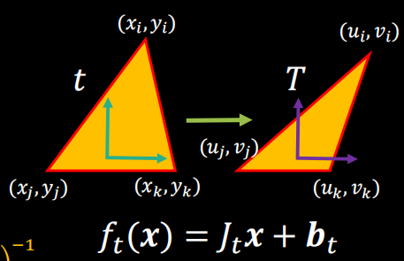
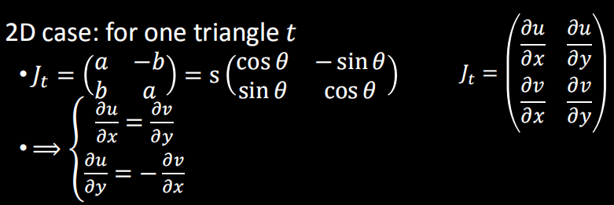
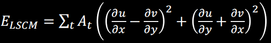
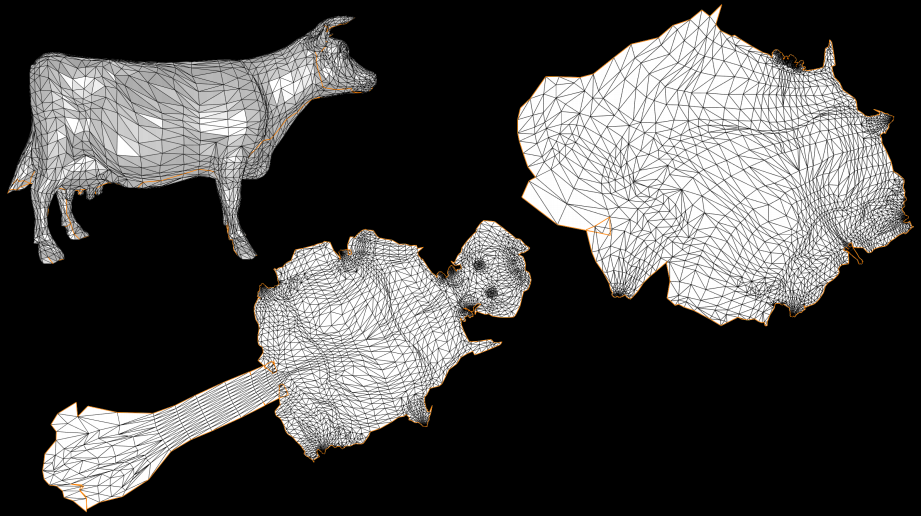
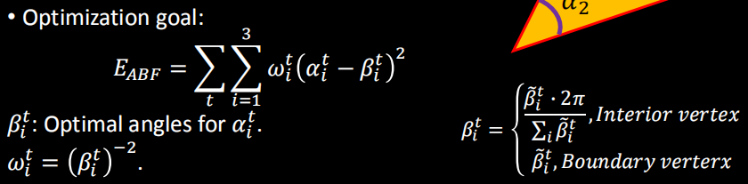
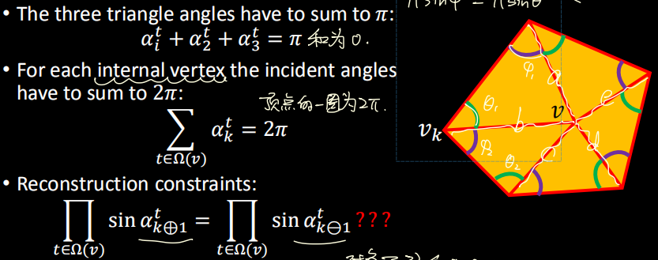
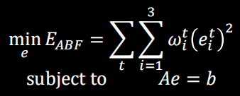
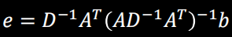

# 4 Parameterization 参数化

- [4 Parameterization 参数化](#4-parameterization-参数化)
  - [定义](#定义)
  - [约束](#约束)
  - [Tutte's embedding](#tuttes-embedding)
  - [保角映射](#保角映射)
  - [基于角度的铺平(ABF)](#基于角度的铺平abf)
  - [全等映射(As-rigid-as-possible method; ARAP)](#全等映射as-rigid-as-possible-method-arap)

## 定义

是一个从三维到二维的映射(函数), 尽量是双射(一对一映射). 参数化Parameterization常常与展开unfolding, 铺平flattening是同义词.

## 约束

参数化可以尽量满足的主要约束(从上往下逐渐放松):

- 双射(映射前后的点需要一对一相互对应, 且映射前后区块不应发生自交)
- 无反向(参数化前后映射的三角形的顶点顺序不应改变)
- 局部单射(每个顶点邻域的映射不会导致三角形出现重叠, 直观的判断方式就是参数化到二维平面后顶点周围三角形所连接的角的角度和不超过$2\pi$)
- 低变形(参数化前后三角形形态和分布不应发生太多的变形)

## Tutte's embedding

是一种广泛使用的参数化方法或者称为理论: 对于一个圆盘同胚(也就是不封闭的开网格, 亏格为0)的表面, 如果参数化形成的边缘顶点全部按照顺序落在一个凸多边形的二维表面边缘上, 并且内部顶点都是顶点邻域的凸组合(权重都是正的线性组合), 那么得到的这个表面会形成一个有效的参数化, 也就是双射的没有自交的参数表面.

对这个理论的一种实现称为重心映射, 首先按照顺序和边缘周长平分地将顶点边缘参数化到人为设定好的多边形上(例如圆形), 然后将所有内部顶点写为凸组合形式求解线性方程组得到参数化顶点的坐标.

这个原理的好处是其生成的映射满足双射性, 因此常常被用来生成其他参数化方法的初始状态. 但是这种简单的参数化有很明显的缺点, 就是并没有考虑三角形的变形问题, 其所生成的参数表面在整体和局部三角形上都变形严重, 不适合直接使用.

## 保角映射

保角映射, 也称为共形映射或相似映射, 其追求在参数化前后三角形的各个内角尽量不要改变. 基本的思路是三角形的参数化如下图可理解为对顶点的变换, 这个变换可以用雅各比矩阵J_t和平移b_t来表示, 同时这个雅各比矩阵也可理解为仿射变换矩阵. 我们希望三角形保角, 也就是这个三角形变换只包含缩放和旋转.

  

因此将仅有旋转和缩放的仿射变换矩阵和雅各比矩阵结合在一起, 可以推出下面我们所需的微分关系, 这也就是柯西-黎曼方程.

  

然后将这个等式关系写为顶点的线性约束形式, 可以转为下面的能量函数, 求解这个线性表达式就可以得到保角的参数化展开表面.

  

求解这个方程组时有一点需要注意, 这个能量函数是没有唯一解的, 因此为了消除平移和旋转这两个导致解不唯一的因素, 且消除全为0的平凡解, 我们需要将表面上至少两个点进行固定然后再求解, 常用的方法是选择模型一个三角形的三个顶点进行固定. 方程组求解前通常通过Tutte's embedding方法得到二维上的双射参数化形式, 然后再用能量函数优化二维上的这些点.

这种方法虽然保角, 但是不同的固定点的选择会导致最终得到的参数化结果大有不同, 如下图两个参数化结果就是固定点选择不同的结果.

  

## 基于角度的铺平(ABF)

前面的保角映射基于微分能量函数进行优化求解不太直观, 同样是保角映射的思路, 一种更直观的求解思路是直接约束三角形映射前后内角的角度, 下面的能量函数约束了变形前后三角形t的各个角的角度. $\alpha$是映射后的角度, $\beta$是映射前的角度. 这里有一个问题, 由于映射前的表面是三维的, 前面计算高斯曲率的时候已经知道三维空间中绕点一周的角度和并不一定是$2\pi$, 因此参数化前后三角形绝对角度一定是有变化的. 为了处理这个必然产生的角度差, 这里的$\beta$角改为比例形式, 保持比例的不变就相当于保角了.

  

但是上图的能量很难优化, 因为保持每个三角形的角度并不能保证这些三角形可合并起来后可正常连接, 因此利用表面上的三角形都共享着边的特性, 用sin值的连乘来替代对三角形角度的约束, 这样就可以直接调整顶点来优化.

  

即使这样, 这个优化约束仍然是非线性问题, 求解起来比较麻烦. 如果将用来判断的这些角度看成相对角度$\alpha$, 认为参数化后的角度$\alpha$会与参数化前的角度$\beta$很接近, 写为形式$\alpha^{t}_{i}=\beta^{t}_{i}+e^{t}_{i}$. 这样我们就可以通过将sin连乘通过取log转为连加, 然后再对log进行泰勒展开将$e^{t}_{i}$提取到外面, 这样就将非线性问题转为了线性问题(LABF), 只要让参数化前后得到的等式的$e^{t}_{i}$尽量小即可.

这样能量函数就可以改写为下面的形式:

  

用拉格朗日乘子法得到等式的解e, 这个e就是参数化后的顶点应该的位置

  

求解这个

## 全等映射(As-rigid-as-possible method; ARAP)
