# 5 Deformation 变形

- [5 Deformation 变形](#5-deformation-变形)
  - [基本概念](#基本概念)
  - [变换传播法](#变换传播法)
  - [多尺度变形](#多尺度变形)
  - [微分坐标](#微分坐标)
    - [基于梯度的方法](#基于梯度的方法)
    - [基于拉普拉斯的方法](#基于拉普拉斯的方法)
    - [梯度扩散法](#梯度扩散法)
    - [同步优化法](#同步优化法)
  - [变形的迁移](#变形的迁移)
  - [尽量刚性(ARAP)的表面变形](#尽量刚性arap的表面变形)
  - [自由变形](#自由变形)
  - [体积变形](#体积变形)
  - [作业](#作业)
  - [作业笔记](#作业笔记)

## 基本概念

对曲面的变形操作Deformation是一种主观性比较强的操作, 我们通过自己的分析给表面顶点施加的位移操作称为变形. 也就是以用户指定的值或者算法自己得出的位移值d来改变顶点.

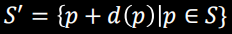  

需要变形的目标表面在算法中被分为三个区域: 固定区Fixed, 也就是下图的F; 操作区Handle, 也即是H; 变形区R. 其中H和F的效果接近, 只是H有用户指定的位移d, F的d=0.

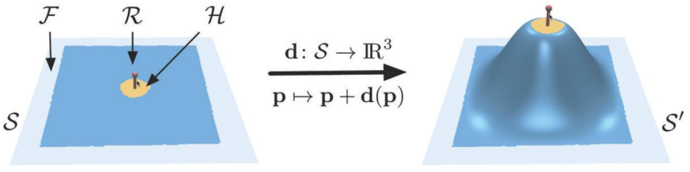  

从大方面来说, 变形算法分为基于表面的变形和基于空间的变形两种, 其区别是目标操控的点, 基于表面的算法操作表面顶点, 基于空间的方法操作会影响表面的空间中的控制点.

## 变换传播法

变换传播法就是利用距离函数计算变形区内的点与控制区的距离, 利用得到的一维距离对位移值d进行插值. 一般是计算顶点到F区域顶点到H区的距离, 用比例来插值, 下图中的红黑线就是等距线. 

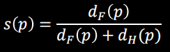  

距离函数有很多种计算方法在此不提, 插值除了使用简单的线性插值外, 还能使用例如谐波域插值(插值令距离变化尽量梯度为0而使表面平滑)等方法.

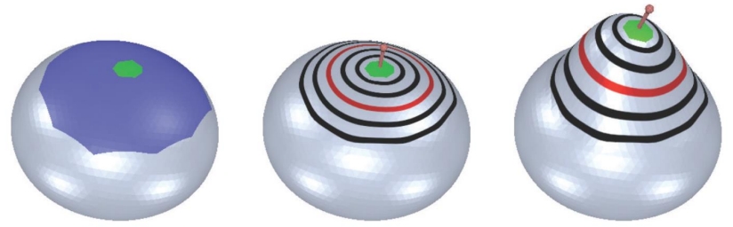  

这种方法的优点是简单且高效, 但是当控制区只是一条线时可能会导致比较反直觉的结果, 被控制区包围的区域尽量平滑地发生了下图中间的变形, 这是因为距离函数在内部

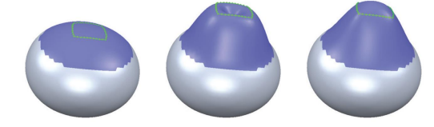  

## 多尺度变形

核心思想是将目标表面分为多个尺度的形状, 例如分为细节部分和形状部分两个尺度, 然后对形状部分进行变形, 变形后将细节部分添加上去, 这是最常用的一种能够保持表面细节的变形方法.

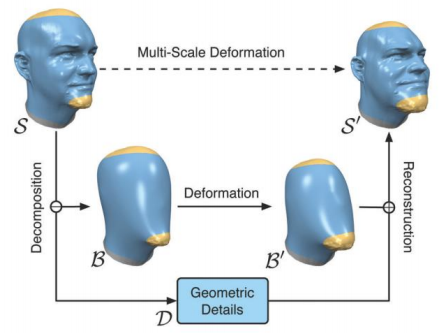  

分离不同尺度的形状有多种方法, 一般来说形状部分都是通过对表面进行平滑得到, 而高频细节部分一种常用的提取方法是将细节表示在一个局部坐标系中, 这个坐标系以低频法线和对应的切平面构成. 还有一种提取方法是使用前面介绍过的谱分解方法提取出低频和高频.

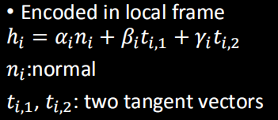  

## 微分坐标

微分坐标系列方法在04年左右发生了爆发式增长, 其核心思想是不再直接操作顶点的坐标, 而是通过改变表面的微分特征然后利用优化方法从这些特征恢复得到表面顶点. 最重要的两个类型是基于梯度的方法和基于拉普拉斯的方法.

### 基于梯度的方法

基于梯度的方法首先以和ARAP参数化类似的方法将三角面片分离, 然后我们知道求梯度的操作会得到一个雅各比矩阵, 通过某种仿射变换矩阵M可以操作这个雅各比矩阵, 作用在面片上就完成了对面片的变形, 最后用优化方法将表面顶点重新连接起来. 这种方法的思路来自于当时图像领域红红火火的泊松融合方法.

这里整体思路都和前面参数化的铺平接近, 通过使用最小二乘法之类的优化方法最小化下面的能量函数, 这个能量函数最小化了融合后的顶点表面梯度和正确梯度之间的差异, 这样也就稳定了面片的变换, L2范数的使用就最小化了两个值的差异. 这种算法的一种应用是之前记录的[SfG重建](...)

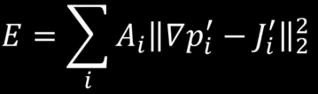  

### 基于拉普拉斯的方法

拉普拉斯方法思路类似, 只是这次操作的是拉普拉斯算子得到的拉普拉斯坐标(不再是矩阵而是向量), 然后用一定算法操作这个拉普拉斯坐标. 这里计算拉普拉斯坐标所使用的算子可以有多种形式. 计算的方法同样是优化表面使得拉普拉斯算子的值尽量接近于理想情况下的拉普拉斯值. 拉普拉斯变形的论文之前有过笔记[Laplacian Mesh Editing](...), 拉普拉斯变形的特点是能够在变形中保持表面细节的相对稳定. 在计算的时候要注意这里的拉普拉斯算子内部的参数都是变形前的参数.

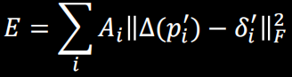  

### 梯度扩散法

当求出了梯度矩阵后, 一种常用的插值方法是对得到的雅各比矩阵进行SVD分解, 得到的三个矩阵进行下面的组合可以分离出旋转和缩放两个分变换. 然后我们通过将旋转矩阵转为四元数形式然后就可以用类似变换传播法的方法对这两个矩阵的值进行线性插值. 

这种方法优化的只有目标的顶点, 这个用来旋转的雅各比矩阵在一开始计算完成后就不会再变化. 这种方法的缺点是其对面片发生的移动不敏感(没有与移动有关的参数).

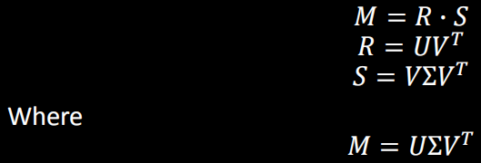  

### 同步优化法

梯度扩散法还有一个缺点就是仅仅使用线性插值的方法对微分坐标进行变换太过简单, 在复杂的表面变换下作用在邻域上的拉普拉斯的坐标的改变完全不是线性的, *Laplacian Mesh Editing*中使用了更为复杂的优化方法来改进. 分两阶段, 一边优化着表面的顶点, 另一边优化着计算拉普拉斯坐标的变换矩阵. 这种方法将优化能量函数转为下面的形式, 也就是在目标优化坐标上增加了一个额外的M矩阵, 我们不再是在计算前先计算出所需的所有坐标, 而是从初始坐标开始, 在计算中动态调整目标坐标.

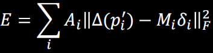  

那么目标坐标的改变可以用仿射变换表示出来, 但是完整的仿射变换太过复杂, 为了防止过于复杂的矩阵导致非线性优化很难进行, 这个旋转矩阵被简化为了下面这个由三个向量组成的反对称矩阵, 这个矩阵实际上是完整变换的一阶近似. 这样我们就可以从变换的坐标中计算出比较符合实际的拉普拉斯坐标, 通过让顶点的更新与目标坐标的更新在迭代中互相优化, 我们得到了对变换更加稳定且能更好地在迭代中保持细节的变形.

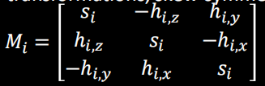  

但是这里对拉普拉斯坐标的变换近似有个比较明显的劣势, 由于所采用的是一阶近似, 所以这种方法仍不能很好地处理发生的大角度旋转错切等情况.

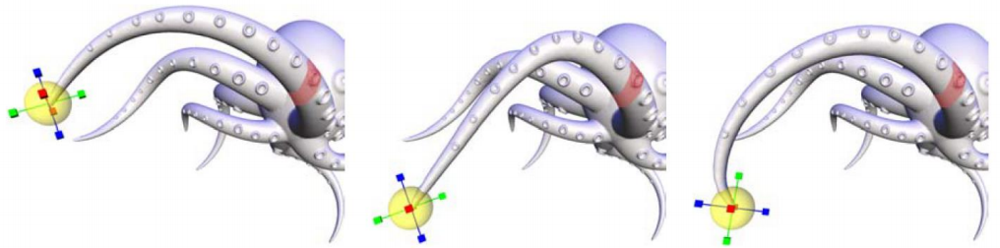  

## 变形的迁移

变形的迁移是变形算法的一种应用, 目标是将应用在一个表面上的变形转移到另一个表面上. 这种应用首先需要假定两个表面的面片已经是一一对应的关系, 然后问题就是优化让应用在A表面的变换如下式尽可能相同地应用到B表面上. 这里有一个比较特殊的问题就是我们没有办法通过变换前后的两个三角形唯一确定一个仿射变换, 因为仿射变换有有12个参数, 我们至少需要一个四面体才能确定, 因此我们需要用比较合理的方法对两个表面的三角面片计算出可以相互对应的四面体.

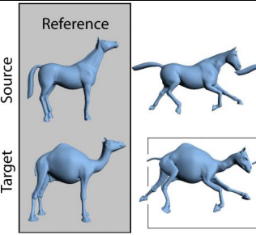  

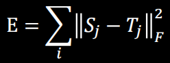  

## 尽量刚性(ARAP)的表面变形

这个方法和前面参数化的ARAP方法目标是一样的, 也是希望变换前后表面三角形是尽量刚性也就是尽量是全等的. 下面的能量函数就是核心, 这个式子中尽量保持着one-ring域中变形前后核心到邻接顶点之间的边向量尽量只发生了一个旋转变换R. 具体的计算方法仍然是分为两大阶段, 局部变换中优化旋转R, 全局变换优化点的位置.

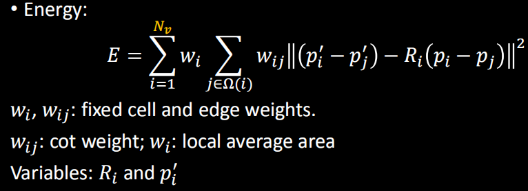  

在局部阶段, 这个能量函数可以经过一系列的推导变为最大化各个邻域的下面的矩阵的迹:

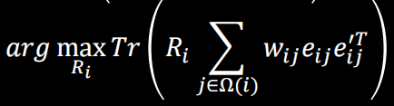  

而如果我们将求和写为矩阵S, 然后可以对其SVD分解: 

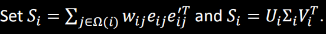  

根据数学特性, 这里仅当RS得到的矩阵是对称正定矩阵时, 迹最大. 因此我们可以得到旋转R, 可以直接求解出局部的旋转矩阵:

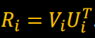  

全局阶段的优化则和之前的思路一直, 用最小二乘法优化顶点来最小化能量即可. 全局阶段中我们通常不断用之前迭代得到的顶点值来作为初始值参考, 这一点和传统的微分变形算法一直使用变形前的值参考不同要注意.

## 自由变形

自由变形和下面的体积变形就属于基于空间的变形方法. 这类方法计算起来比较快, 因为其不直接改变表面的顶点, 而是改变框住了顶点的笼框的控制点. 笼框的思路就和[样条曲面](../../专项笔记/样条曲线曲面/README.md)相同, 区别是笼框所采用的是三维的样条曲面, 后自由变形通过改变下面的控制点c来调整依赖于笼框表示的曲面的状态.

  

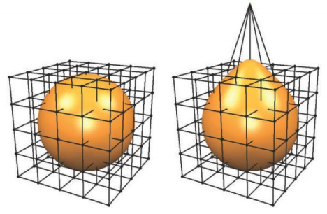  

## 体积变形

体积变形与自由变形实际上是一样的, 只是体积变形中笼框不再受到坐标轴的限制. 由于笼框的自由化, 在体积变形中所采用的坐标自然也发生了变换, 不再是上面的uvw形式, 这里采用的坐标是下一节介绍的[重心坐标](...)

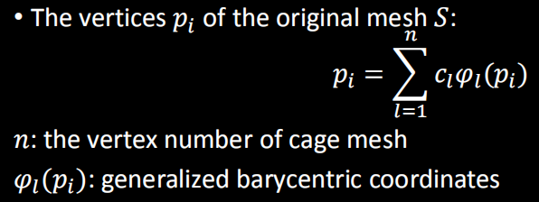  

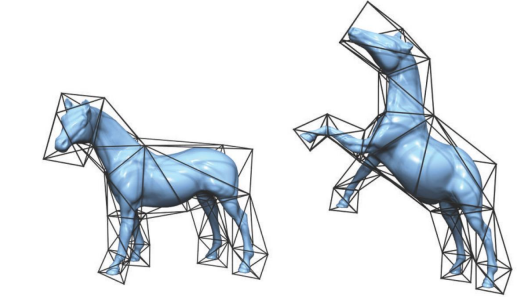  

## 作业

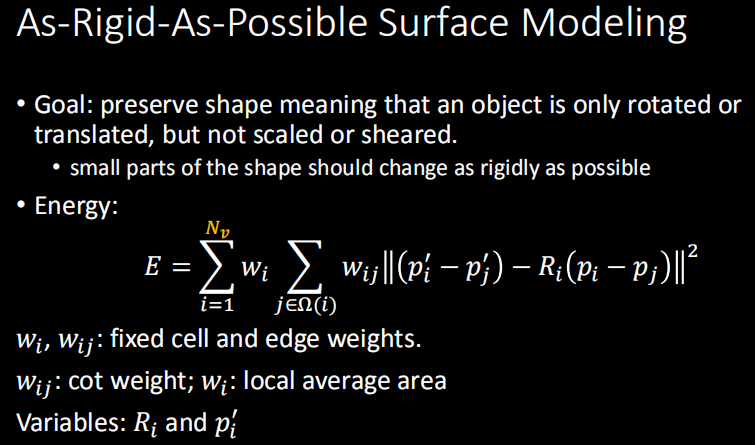  

## 作业笔记

- 不断用之前迭代得到的顶点值来作为参数参考
- 需要自己在框架中加入简单的交互, 选择fixed区和可用鼠标拖动的handle