# 5.5 Barycentric Coordinates 重心坐标

- [5.5 Barycentric Coordinates 重心坐标](#55-barycentric-coordinates-重心坐标)
  - [基本概念](#基本概念)
  - [广义重心坐标(GBC)](#广义重心坐标gbc)
  - [双线性插值](#双线性插值)
  - [凸四边形重心坐标](#凸四边形重心坐标)
  - [均值坐标(MVC)](#均值坐标mvc)
  - [调和坐标](#调和坐标)
  - [基于骨骼的变形](#基于骨骼的变形)
  - [有界双调和加权变形](#有界双调和加权变形)
  - [作业](#作业)
  - [作业笔记](#作业笔记)

## 基本概念

这节是前面三角形重心坐标的扩展, 介绍了可以应用在多边形上一些其它坐标系, 这些坐标系各有各的特色, 可以用来如重心坐标来给函数插值. 视频开头的小测: 三角形重心坐标面积求法推导大致思路:

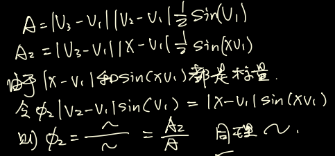  

## 广义重心坐标(GBC)

用一组基函数$\phi_i$的和来表示一个系统内的点是坐标系, i是基函数在系统中的序号, x是需要返回坐标的点, 本身处于绝对坐标系统中. 而对于所有满足下面条件的坐标系统我们都可称为广义重心坐标, 不单单可以应用在三角形上, 也可以扩展到任意凸多边形上.

1. $\phi_i(x)>=0$, 基函数非负性
2. $\sum^n_{i=1}\phi_i(x)=1$, 凸性, 与第一点相结合称为凸组合性
3. $\sum^n_{i=1}\phi_i(x)v_i=x$, 重现性, 保证坐标系的改变不会影响目标点的值, 尽管看起来是非常重要的性质但实际上违反这个性质也能得到一些特别的效果
4. $\phi_i(v_j)=\delta_{ij}$, 拉格朗日性, 也就是顶点的作用效果从顶点值自身开始不断衰减
5. $\phi_i((1-\mu)v_j+\mu v_{j+1})=(1-\mu)\phi_i(v_j)+\mu\phi_i(v_{j+1}),\quad \mu\in [0,1]$, 分片线性性, 也就是边界上的函数值是线性插值形式的
6. 插值性, 也就是可以应用在函数上进行多层套接
7. 线性精确, 若目标函数是线性的, 那么插值得到的结果就是精确的

这一系列条件比较严苛, 很多坐标系选择只满足其中的一些特性.

## 双线性插值

双线性插值常常在矩形中插值, 本质就是两次的线性插值. 先在两个对边中进行插值, 然后得到的点连成线再插值到目标点上, 和样条插值类似. 

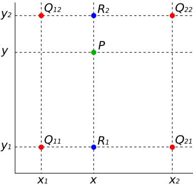  

双线性插值可以用类似三角形重心插值的面积法来求解, 公式如下, 注意到公式实际上就是将四个顶点的值乘上各自对角的子四边形面积与整个四边形面积之比求和得到:

  

双线性插值有很好的数学性质, 当四边形是1*1单位正方形的时候, 双线性插值的公式变为下面的形式, 这种形式下的这套坐标属于重心坐标:

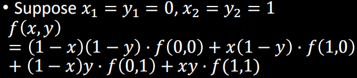  

## 凸四边形重心坐标

上面的正方形重心坐标可以扩展到任意凸四边形上, 公式变为下式, 其中的系数就是对应的基函数:

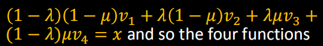  

其中的基函数由下面比较复杂的面积法来求得.

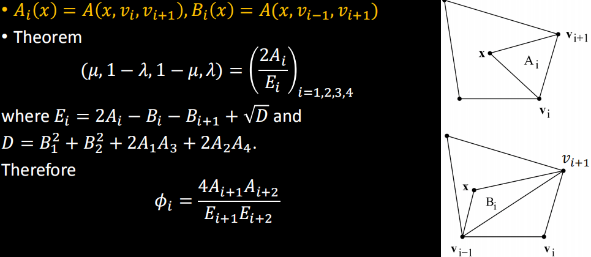  

其中的$\mu$和$\lambda$是重心坐标, 直接坐标方法ppt上有详细推导, 如下:

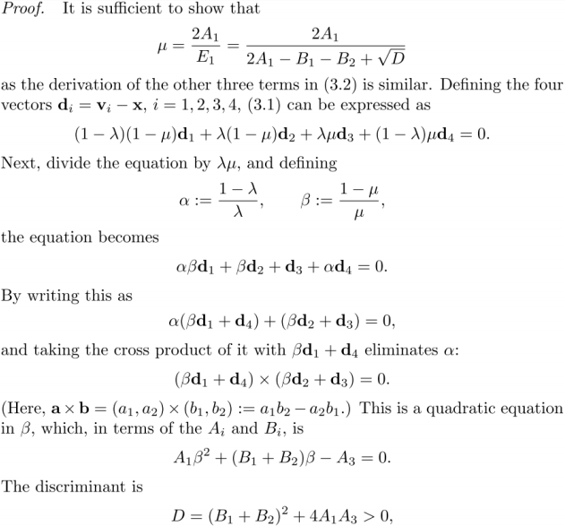  

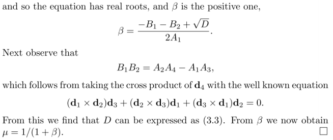  

## 均值坐标(MVC)

均值坐标是文章Mean Value Coordinates提出的. 如果把坐标系的基函数看作权重, 那么我们可以将坐标系的插值看为特殊的插值函数, 那么我们想要建立的坐标系对函数的插值能够使得插值结果拥有更好的性质. 调和函数有很好的数学性质, 例如它无限光滑, 可以无限求导, 且调和函数的函数值等于其球面上的所有函数值的均值. 因此我们希望自己的插值坐标系可以接近调和函数.

均值坐标就建立了一个能够逼近调和函数性质的坐标系统, 其基函数由下面式子给出, 也就是顶点对着的边的两个邻角的一半各自求切然后相加, 再除以这条边的模长:

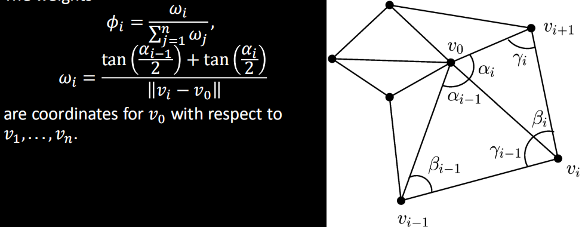  

之所以称为均值坐标是因为这种坐标能够近似达到调和函数的均值性质. 经过坐标插值后, 以二维为例, 插值点的值等于以其为中心的圆环上的函数值的平均, 也就是下面的式子. 尽管均值坐标得到的函数并不是真正的调和函数, 但是其可以比较方便地得到对调和函数的较好逼近, 因此非常流行.

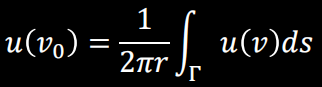  

均值坐标存在两个主要问题: 没法保证所有权值都是正的, 因此那些权值为负的区域变形时会缩小, 而且缺少内部局部性, 因此对一个坐标系顶点的修改可能影响很大的区域.

## 调和坐标

为了改善均值坐标的问题, 调和坐标Harmonic Coordinates决定更进一步地去逼近调和函数, 方法是让权值的计算变为求解令坐标系符合调和函数约束的方程组, 也就是让坐标系满足拉普拉斯方程:

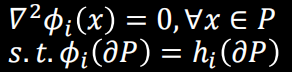  

这种方法求解出来的坐标能够保证权值非负且有局部性, 但是缺点是方程组的求解比较困难且只能得到数值解, 数值解难以直接应用到基函数上. 常用的优化是改用规则分割的晶格来逼近笼框减少计算复杂度, 且用迭代法替代方程组的数值解法, 且为了加速收敛对坐标的计算从低分辨率网格开始逐步精细化逼近. 参考教材的A-3和A-4有对这些优化的基础介绍.

均值坐标和调和坐标的变形效果对比如下, 可以看到均值坐标发生了权值为负引起的变形缩小问题:

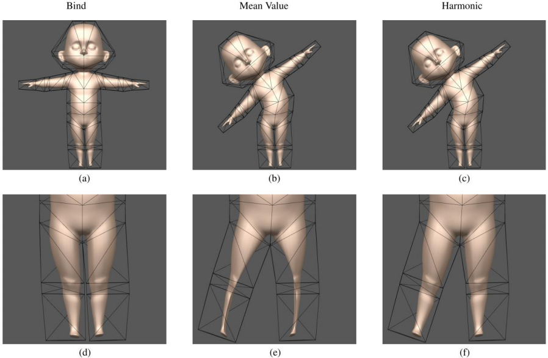  

## 基于骨骼的变形

变形有三种主要的思路: 基于控制点扩散变形, 基于笼框的空间变形和基于骨骼的关联性变形. 骨骼变形的核心思想就是对每节骨骼有对顶点的权重, 然后施加在骨骼上的变换会被权重加权后应用到顶点上. 骨骼的优点是可以比较好地操作有固定形状的对象, 但是缺点是无法处理柔软对象.

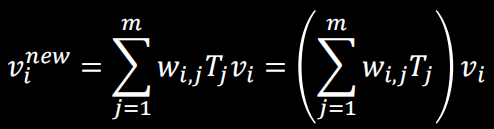  

相类似的, 对控制点的操作很方便扔来控制, 但是变形情况很难掌控, 笼框变形则可以方便地改变一个区域的形状, 但是却无法精细操作.

## 有界双调和加权变形

为了优化这三大类变形的上述缺点, 文章Bounded biharmonic weights for Real-Time Deformation提出的权重通过最小化平均的的拉普拉斯权重, 能应用在这三大类变形上得到更加平滑且局部性更好的变形效果.

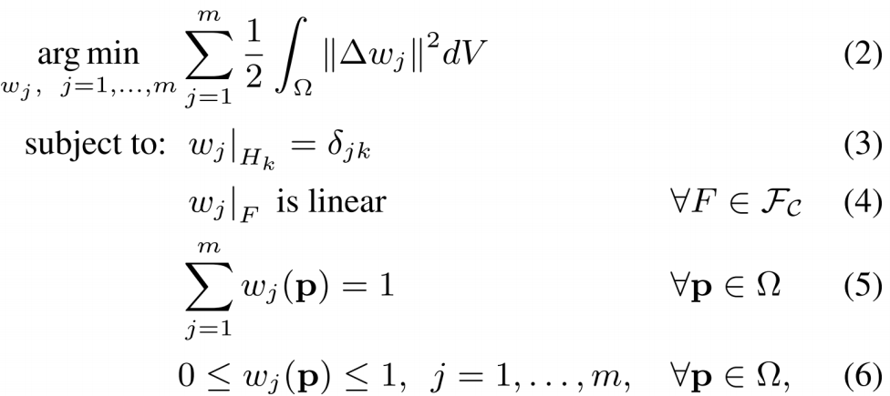  

## 作业

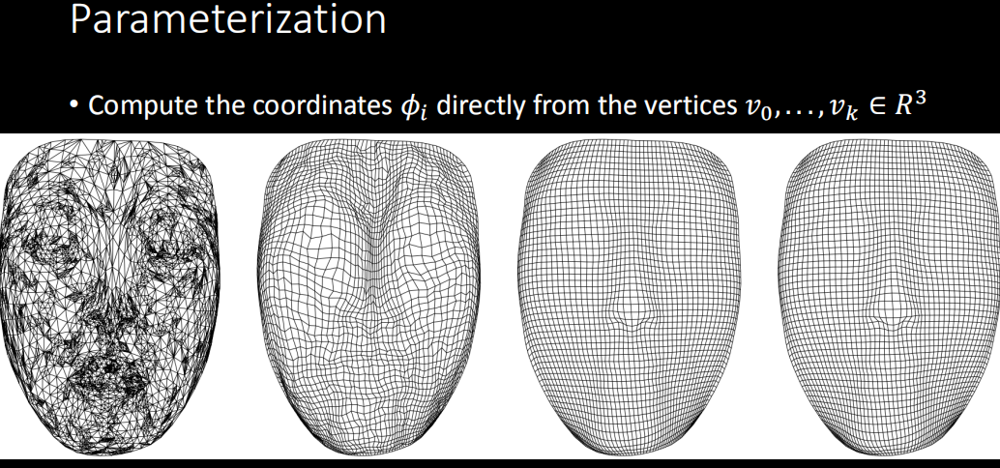  

## 作业笔记

- 简单说就是将计算出来的均值权重应用到前面的参数化方法中就可以