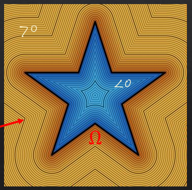
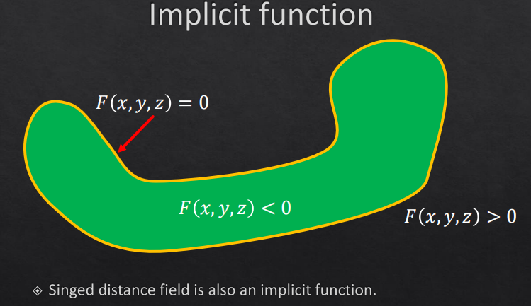
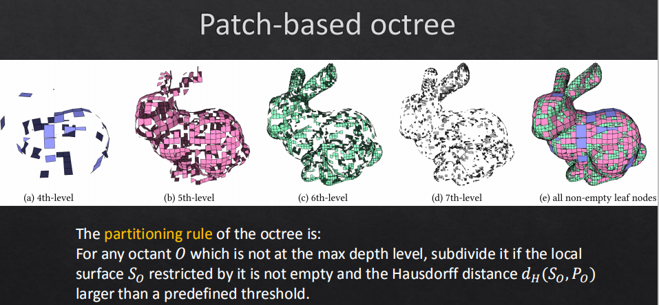
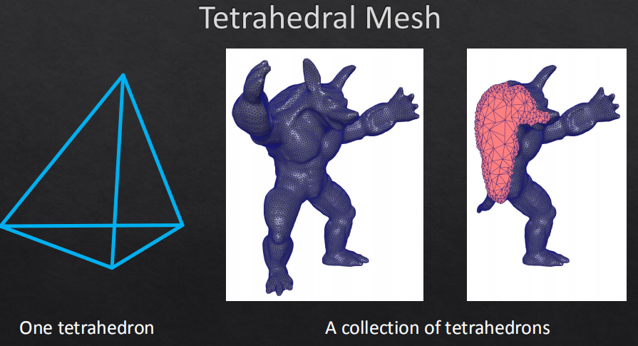
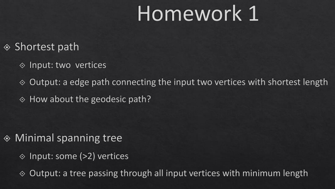

# P1 Representations 表示

- [P1 Representations 表示](#p1-representations-表示)
  - [点云](#点云)
  - [符号距离场(SDF)](#符号距离场sdf)
  - [隐式方程](#隐式方程)
  - [栅格](#栅格)
  - [网格](#网格)
  - [作业](#作业)

## 点云

扫描得到, 难以处理, 常用于逆向工程

## 符号距离场(SDF)

  

有将距离限制在(-1,1)的截断符号距离场(TSDF)

## 隐式方程

和SDF思路相似

  

## 栅格

主要是体素和八叉树, 体素是从点云而来的, 优点是排布有规律, 方便计算, 缺点是占用空间太大, 八叉树比较好用

还有当层级八叉树分级到一定程度的时候改用面片来进行逼近的改进方法, O-CNN就运行在上面

  

## 网格

由几何(点的位置)和拓扑(线面邻接关系)组成, 主要是三角网格和四边形网格, 注意四边形网格不一定共面

还有体网格, 可以保存模型内部结构

  

半边, 流形, 亏格在虎书都有记录

## 作业

  
